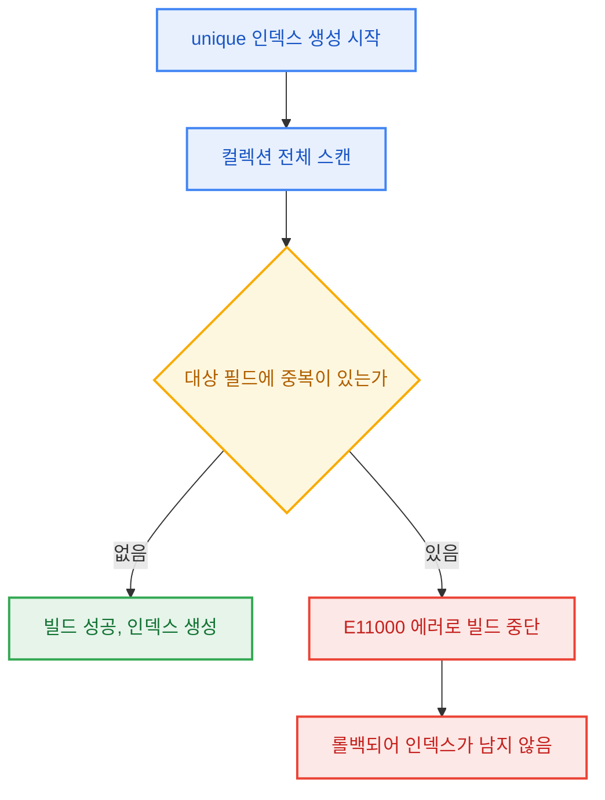
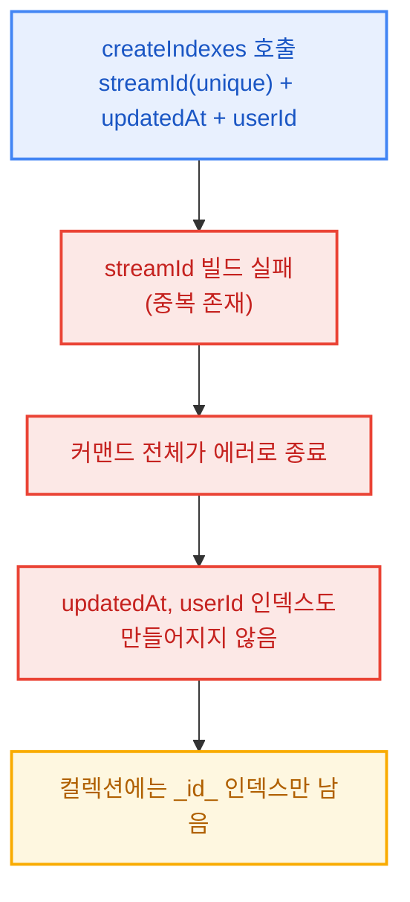

---

## 한 줄 요약

&nbsp; 이미 중복 데이터가 쌓인 필드에는 unique 인덱스를 만들 수 없다. 빌드는 `E11000`으로 실패하고 인덱스는 남지 않는다. 여러 인덱스를 `createIndexes`로 한 번에 만들면 unique 하나의 실패 때문에 뒤에 있던 성능 인덱스까지 함께 누락될 수 있다. 복구하려면 중복을 먼저 스캔해 정리한 뒤에 인덱스를 생성해야 한다. 이 동작은 MySQL(InnoDB)도 같다. unique 인덱스가 곧 유일성 제약의 구현체라서, 완전하지 않은 인덱스를 남길 수 없기 때문이다.

## 1. 들어가며

&nbsp; 어느 날 특정 컬렉션에서만 같은 논리적 키(예: `streamId`)를 가진 문서가 두 개씩 존재하는 현상을 발견했다. 코드는 분명 그 키에 `unique` 인덱스를 걸도록 되어 있었는데, 정작 그 컬렉션에는 unique 인덱스가 없었다. `_id_` 기본 인덱스 하나만 덩그러니 있었다.

&nbsp; 원인을 파고들다 보니 결국 하나의 사실로 수렴했다. **"이미 중복이 있는 필드에는 unique 인덱스를 만들 수 없다."** 당연해 보이지만, 이 단순한 규칙이 애플리케이션의 인덱스 자동 생성 로직과 맞물리면서 "인덱스가 영영 안 생기는" 악순환을 만들고 있었다. 이 글에서는 그 규칙을 MongoDB 관점에서 정리한다.

## 2. unique 인덱스는 "이미 유일한 데이터"에만 걸린다

&nbsp; MongoDB에서 unique 인덱스는 생성 시점에 컬렉션 전체를 스캔하며 빌드한다. 이때 인덱스 대상 필드에 **중복 값이 하나라도 있으면 빌드가 실패한다.**

```javascript
// 컬렉션에 streamId가 같은 문서가 2개 이상 존재하는 상태
db.orders.createIndex({ streamId: 1 }, { unique: true })
```

```
E11000 duplicate key error collection: mydb.orders index: streamId_1 dup key: { streamId: "abc-123" }
```

&nbsp; 이때 **인덱스는 부분적으로라도 만들어지지 않는다.** 빌드가 중단되고 롤백되어, 실행 후에도 컬렉션에는 그 인덱스가 존재하지 않는다. foreground/background 빌드 방식과 무관하게 동일하다.



&nbsp; 반대로 **non-unique 인덱스는 중복이 있어도 아무 문제 없이 생성된다.** 유일성 제약이 없으니 같은 값이 여러 문서에 있어도 그냥 색인할 뿐이다.

```javascript
// 중복이 있어도 정상 생성
db.orders.createIndex({ streamId: 1 })
```

## 3. 여러 인덱스를 한 번에 만들면 생기는 동반 누락

&nbsp; 인덱스는 여러 개를 한 번에 생성할 수도 있다. 드라이버에 따라 `createIndexes`에 배열로 넘긴다.

```javascript
db.orders.createIndexes([
  { key: { streamId: 1 }, name: "streamId_1", unique: true },  // ← 중복 때문에 실패
  { key: { updatedAt: 1 }, name: "updatedAt_1" },              // 성능용
  { key: { userId: 1 },    name: "userId_1" },                 // 성능용
])
```

&nbsp; 이 경우 **unique 인덱스 하나가 실패하면 커맨드 전체가 에러로 끝난다.** 특히 실패한 unique 인덱스가 배열의 앞쪽에 있으면, 그 뒤에 있던 성능 인덱스(`updatedAt`, `userId`)까지 **함께 만들어지지 않는다.** 실제로 필자가 겪은 컬렉션도 `_id_`만 남아 있었는데, unique 인덱스가 배열 첫 번째라 거기서 막혀 나머지 성능 인덱스도 전부 누락된 것이었다.



&nbsp; 그래서 **실패 가능성이 있는 unique 인덱스와, 실패해선 안 되는 성능 인덱스는 생성 호출을 분리하는 편이 안전하다.** 분리해 두면 unique 빌드가 실패해도 나머지 인덱스는 그대로 만들어진다.

## 4. 이미 인덱스가 있는 key에 옵션만 바꿔 다시 걸면

&nbsp; "이미 non-unique 인덱스가 있는 필드를 unique로 바꾸고 싶다"는 경우도 있다. 같은 key에 옵션만 다르게 해서 다시 `createIndex`를 호출하면 그냥 덮어써지지 않는다.

- 같은 이름(`name`)으로 다른 옵션을 주면 `IndexOptionsConflict`
- 같은 key에 다른 스펙을 주면 `IndexKeySpecsConflict`

&nbsp; 즉 옵션을 바꾸려면 **기존 인덱스를 `dropIndex`로 지우고 새로 만들어야 한다.** 그리고 unique로 바꾸는 순간, 앞서 말한 "중복 있으면 실패" 규칙이 다시 적용된다.

## 5. 그래서 어떻게 복구하는가

&nbsp; 결국 unique 인덱스를 걸려면 **먼저 중복을 없애야 한다.** 순서는 다음과 같다.

1. **중복 스캔**: 어떤 key가 몇 벌씩 중복되어 있는지 집계로 확인한다.

    ```javascript
    db.orders.aggregate([
      { $group: { _id: "$streamId", cnt: { $sum: 1 }, ids: { $push: "$_id" } } },
      { $match: { cnt: { $gt: 1 } } },
    ])
    ```

2. **중복 정리**: 어느 문서를 남기고 어느 문서를 지울지 규칙을 정한다. (예: 실데이터가 있는 문서를 남기고 빈 문서를 삭제)

3. **unique 인덱스 생성**: 중복이 0이 된 뒤에야 빌드가 성공한다.

    ```javascript
    db.orders.createIndex({ streamId: 1 }, { unique: true })
    ```

&nbsp; 참고로 과거 버전의 `dropDups` 옵션(중복을 자동 삭제하며 인덱스 생성)은 **어떤 문서가 지워질지 예측할 수 없어** MongoDB 3.0에서 제거되었다. 지금은 무조건 사람이 정한 규칙으로 먼저 정리해야 한다.

&nbsp; 만약 "특정 조건의 문서에 대해서만 유일성을 보장하고 싶다"면 **partial index**가 대안이 될 수 있다. 유일성을 강제할 문서 집합만 인덱스 대상으로 좁히는 방식이다.

```javascript
db.orders.createIndex(
  { streamId: 1 },
  { unique: true, partialFilterExpression: { deleted: false } }
)
```

## 6. MySQL에서는 어떻게 동작할까

&nbsp; 결론부터 말하면 **핵심 동작은 MySQL(InnoDB)도 같다.** 중복이 있는 컬럼에 unique 인덱스를 걸면 에러와 함께 실패하고, 인덱스는 남지 않는다.

```sql
ALTER TABLE orders ADD UNIQUE INDEX uk_stream_id (stream_id);
```

```
ERROR 1062 (23000): Duplicate entry 'abc-123' for key 'orders.uk_stream_id'
```

&nbsp; 동반 누락도 같은 방식으로 재현된다. 한 `ALTER TABLE` 문에 여러 인덱스를 함께 추가하면, unique 하나가 실패할 때 문장 전체가 실패해 나머지 인덱스도 만들어지지 않는다. MySQL 8.0부터는 DDL 자체가 원자적(atomic DDL)이라 "절반만 성공"한 상태가 아예 남을 수 없다.

```sql
ALTER TABLE orders
  ADD UNIQUE INDEX uk_stream_id (stream_id),  -- 중복 때문에 실패
  ADD INDEX ix_updated_at (updated_at),       -- 함께 롤백된다
  ADD INDEX ix_user_id (user_id);
```

&nbsp; MySQL에도 중복 행을 자동 삭제하면서 unique 인덱스를 만드는 `ALTER IGNORE TABLE`이 있었는데, **어떤 행이 지워질지 통제할 수 없다는 이유로 5.7.4에서 제거되었다.** MongoDB가 `dropDups`를 3.0에서 제거한 것과 같은 결론이다. 두 DB가 각자 "중복 정리는 엔진이 결정할 일이 아니다"라는 판단에 도달한 셈이다.

&nbsp; 다만 몇 가지는 다르게 동작한다.

- **NULL 처리**: MySQL(InnoDB)의 unique 인덱스는 **NULL을 여러 개 허용**한다. NULL끼리는 서로 다른 값으로 취급하기 때문이다. 반면 MongoDB는 필드가 아예 없는 문서도 null로 색인하므로, **필드 없는 문서가 두 개만 있어도 duplicate key로 실패**한다. MongoDB에서 이를 피하려면 sparse 또는 partial index가 필요하다.
- **원자적 교체**: MongoDB에서 non-unique를 unique로 바꾸려면 `dropIndex`와 `createIndex`를 따로 호출해야 해서 그 사이에 인덱스가 없는 구간이 생긴다. MySQL은 `ALTER TABLE orders DROP INDEX ..., ADD UNIQUE INDEX ...`처럼 **한 문장 안에서 교체**할 수 있다.
- **partial index**: MongoDB의 `partialFilterExpression` 같은 조건부 유일성이 MySQL에는 없다. PostgreSQL의 partial unique index가 이에 해당하고, MySQL에서는 "조건을 만족할 때만 값을 갖고 아니면 NULL이 되는" generated column에 unique 인덱스를 거는 식으로 우회한다.

## 7. 왜 둘 다 이렇게 처리할까

&nbsp; 두 DB가 같은 선택을 한 이유는 unique 인덱스가 동작하는 구조에 있다.

&nbsp; 첫째, **유일성 제약은 unique 인덱스 그 자체로 구현된다.** 쓰기 시점의 유일성 검사는 B-tree에 키를 삽입하면서 같은 키가 이미 있는지 확인하는 것이 전부다. 정렬된 자료구조 덕에 이 확인이 문서 수와 무관하게 값싸게 끝난다. 뒤집어 말하면 **인덱스가 없으면 제약을 강제할 방법도 없다.** 그래서 "일단 인덱스를 만들고 중복은 나중에 해결"이라는 중간 상태를 허용할 수 없다. 인덱스가 존재하는 순간부터 그 인덱스는 유일성을 보증해야 한다.

&nbsp; 둘째, **빌드 과정 자체가 중복을 드러낸다.** 두 엔진 모두 인덱스를 만들 때 키를 전부 뽑아 정렬한 뒤 한꺼번에 적재한다(InnoDB의 sorted index build, MongoDB WiredTiger의 external sort 기반 빌드). 정렬하면 같은 값이 인접하게 놓이므로, 적재 단계에서 이웃 키만 비교해도 중복이 걸러진다. 중복 검사가 빌드에 딸려오는 구조라 "검사만 생략하고 빠르게 만들기" 같은 절충은 성립하지 않는다.

&nbsp; 셋째, **불완전한 인덱스는 쿼리 결과를 틀리게 만든다.** 옵티마이저가 인덱스를 태우는 순간, 그 인덱스가 해당 필드의 모든 문서(행)를 커버한다고 전제한다. 일부만 색인된 인덱스로 조회하면 존재하는 데이터가 결과에서 빠진다. 인덱스 빌드가 all-or-nothing인 이유는 unique 여부와 무관하게 이 전제를 지키기 위해서고, unique 인덱스에는 "기존 데이터가 제약을 이미 만족해야 한다"는 조건이 하나 더 얹힌다.

&nbsp; 자동 중복 제거 옵션(`dropDups`, `ALTER IGNORE`)이 양쪽에서 모두 사라진 이유도 여기에 있다. 어떤 문서를 남길지는 데이터의 의미, 즉 어느 쪽이 실데이터이고 어느 쪽이 최신인지에 달린 문제라서, 스토리지 엔진이 기계적으로 결정하면 누군가의 데이터가 예고 없이 사라진다.

## 8. 정리

- unique 인덱스는 **생성 시점에 중복이 없어야** 만들어진다. 중복이 있으면 `E11000`으로 빌드가 실패하고, 인덱스는 남지 않는다.
- `createIndexes`로 여러 개를 한 번에 만들 때 **unique 하나가 실패하면 나머지(성능 인덱스 포함)도 동반 누락**될 수 있다. 생성 호출을 분리하자.
- non-unique 인덱스는 중복과 무관하게 생성된다.
- 옵션(unique 여부)을 바꾸려면 drop 후 재생성해야 하며, 그 순간 다시 "중복 없어야 함" 규칙이 적용된다.
- 복구는 **중복 스캔 → 정리 → 인덱스 생성** 순서. 부분 유일성이 필요하면 partial index를 검토한다.
- **MySQL(InnoDB)도 동일하다.** `ERROR 1062`로 실패하고, 한 `ALTER` 문 안의 인덱스는 함께 롤백되며, 자동 중복 삭제 옵션이 제거된 역사까지 같다. 차이는 NULL 처리(MySQL은 NULL 중복 허용), 한 문장 인덱스 교체(MySQL 가능), partial index(MySQL 없음) 정도다.
- 공통 원리: **unique 인덱스가 곧 제약의 구현체**이므로, 완전하지 않거나 유일성이 깨진 인덱스는 존재 자체가 허용되지 않는다.
