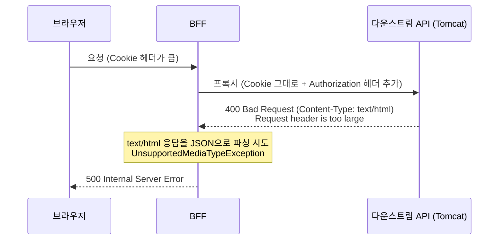

---

## 한 줄 요약

&nbsp; 클라이언트(브라우저)에 쌓인 쿠키(분석 도구 + 최근 도입한 인증 쿠키)가 부모 도메인 스코프라 API 요청에도 실리면서, 요청 헤더가 다운스트림 Tomcat의 기본 한도 8KB를 넘겼다. 다운스트림은 이때 JSON이 아니라 HTML 에러 페이지로 400을 돌려줬고, 그 응답을 JSON으로 파싱하려던 BFF가 예외를 던지며 500으로 바꿔 내보냈다. 해결은 다운스트림이 읽지도 않는 쿠키를 프록시가 실어 나르지 않게 하는 것이었다.

## 1. 배경: 인증 토큰을 localStorage에서 쿠키로 옮겼다

&nbsp; 운영계에서 우리 웹 서비스가 가끔 500을 냈다. 예약 화면처럼 API를 여러 개 부르는 곳에서 특히 잦았는데, 재현이 일정하지 않았다. 같은 계정으로 같은 화면을 열어도 필자의 노트북에선 멀쩡한데 동료 노트북에선 터졌다. 누구는 되고 누구는 안 되고, 그마저도 늘 그런 게 아니라 실마리를 잡기 어려웠다.

&nbsp; 이야기는 얼마 전의 변경 하나에서 시작한다. 인증 토큰(JWT)을 브라우저 `localStorage`에 두던 방식을 **쿠키로 옮겼다.**

&nbsp; 이유는 세션 공유였다. 신규 제품을 붙이면서 여러 서브도메인이 같은 로그인 상태를 써야 했는데, `localStorage`는 오리진마다 격리돼 있어 `app.example.com`이 가진 토큰을 다른 앱이 꺼내 쓸 수 없다. 반면 쿠키는 도메인을 부모(`.example.com`)로 잡아두면 그 아래 서브도메인이 함께 읽는다. 그래서 인증을 부모 도메인 쿠키 기반으로 바꿨다.

&nbsp; 이 변경으로 **토큰이 요청에 실리는 방식이 달라졌다.** `localStorage`에 있을 땐 앱이 필요할 때 값을 꺼내 `Authorization` 헤더에 직접 넣었고, 넣지 않으면 붙지 않았다. 쿠키는 다르다. 도메인과 경로만 맞으면 브라우저가 알아서 모든 요청에 실어 보낸다. 부모 도메인으로 발급했으니 이제 JWT는 `app.*`이든 `api.*`이든 가리지 않고 매 요청의 `Cookie` 헤더에 붙는다.

```http
Set-Cookie: authToken=<jwt>; Domain=.example.com; Path=/; HttpOnly; Secure; SameSite=Lax
```

&nbsp; 이 전환은 한 번에 끝난 게 아니라 서버부터 순서대로 나갔다. 서버 쪽 변경(인증 쿠키 발급, 프록시에서 쿠키를 헤더로 변환)은 기존 헤더 인증 경로를 그대로 둔 채 가산적으로 먼저 배포됐고, 그것만으로는 브라우저에 쿠키가 심기지 않아 겉으로는 아무 일도 없었다. 브라우저가 인증 쿠키를 갖고 요청마다 싣기 시작한 건 클라이언트 배포 이후였다. 장애의 방아쇠는 서버 작업이 아니라 그 뒤에 나간 클라이언트 배포였던 셈이다.

&nbsp; 참고로 이 전환에서 서버 작업을 맡은 게 필자였다. 트리거가 된 클라이언트 배포는 다른 작업이었지만, 어쨌든 같은 전환의 일부였다.

## 2. 쿠키는 어떻게 모든 서브도메인으로 퍼질까?

&nbsp; 원인을 이해하려면 쿠키가 어느 요청에 실리는지를 먼저 정리해야 한다. 핵심은 쿠키의 `Domain` 속성이다.

&nbsp; 쿠키를 발급할 때 `Domain`을 지정하면, 그 도메인과 **모든 하위 서브도메인**에 쿠키가 전송된다. `Domain=.example.com`으로 발급한 쿠키는 `example.com`뿐 아니라 `app.example.com`, `api.example.com` 어디로 가는 요청에도 붙는다. 반대로 `Domain`을 지정하지 않으면 발급한 그 호스트에서만 쓰인다.

&nbsp; 여기서 도메인의 경계가 되는 단위가 **등록 가능 도메인(eTLD+1)**이다. `example.com`이 하나의 단위이고, 쿠키는 이 단위 안에서 공유된다. `Domain=.example.com`으로 잡으면 `example.com` 아래 모든 서브도메인이 같은 쿠키를 공유하는 것이다. 반대로 `example.com`과 `example.dev`는 등록 가능 도메인 자체가 다르므로, 한쪽에 심은 쿠키는 다른 쪽으로 넘어가지 않는다. 이 두 가지 성질이 뒤에서 각각 원인과 재현 여부를 가른다.

&nbsp; 정리하면, 부모 도메인으로 스코프를 잡은 쿠키는 API 서버(`api.example.com`)로 가는 요청에도 자동으로 실린다. §1에서 옮긴 인증 쿠키가 정확히 여기 해당한다.

## 3. 다운스트림의 400이 500으로 바뀐 과정

&nbsp; 트레이스를 열어 스팬을 하나씩 따라가니 500의 실체가 드러났다.



&nbsp; 다운스트림 API(Tomcat)가 요청 헤더가 너무 크다며 400을 냈다. 문제는 그 400의 본문이 JSON이 아니라 서버가 만든 HTML 에러 페이지였다는 점이다. BFF의 프록시 에러 핸들러는 다운스트림 응답을 JSON으로 읽도록 돼 있었고, `text/html` 본문을 객체로 파싱하려다 예외를 던졌다.

```text
org.springframework.web.reactive.function.UnsupportedMediaTypeException:
Content type 'text/html;charset=utf-8' not supported for bodyType=java.lang.Object
```

&nbsp; 이 예외가 전역 예외 핸들러까지 올라가 500으로 바뀐 채 브라우저로 나갔다. 브라우저가 받은 건 500이지만, 실제 시작은 다운스트림이 준 400이었다. **상태 코드는 프록시를 한 번 거치는 사이에 갈아끼워질 수 있다.**

## 4. 헤더는 왜 8KB를 넘었을까?

### 4-1. 이미 쌓여 있던 분석 쿠키

&nbsp; 우리 웹 서비스에는 분석 도구가 여럿 붙어 있다. Google Analytics(`_ga`), Amplitude(`AMP_*`), Channel Talk(`ch-*`), Datadog RUM(`_dd_s`) 같은 것들이다. 이들이 심는 쿠키는 대부분 부모 도메인 스코프라, 2절에서 본 것처럼 `api.example.com`으로 가는 요청에도 매번 실린다.

&nbsp; 여기에 §1에서 옮긴 인증 쿠키가 더해졌다. JWT는 길이가 짧지 않다. 원래도 분석 쿠키가 차지하던 `Cookie` 헤더에 JWT까지 상시 실리면서 헤더 크기가 크게 늘었다.

### 4-2. BFF가 그 쿠키를 다운스트림까지 그대로 넘겼다

&nbsp; BFF는 요청을 다운스트림으로 프록시할 때 원본 요청 헤더를 그대로 복사했고, 거기엔 `Cookie` 헤더가 통째로 들어 있었다. 여기에 더해 인증 쿠키를 읽어 `Authorization: Bearer` 헤더로도 붙였다. 그래서 다운스트림으로 나가는 요청에는 브라우저가 보낸 쿠키가 전부 그대로 실렸고, 인증 토큰은 `Cookie` 헤더와 `Authorization` 헤더 양쪽에 담겼다.

&nbsp; 확인해 보니 **다운스트림은 쿠키를 읽지 않았다.** 인증은 `Authorization` 헤더로만 처리하고 있었다. 다운스트림이 참조하지도 않는 쿠키를 프록시가 그대로 전달하면서 헤더 크기만 늘린 셈이다.

### 4-3. 요청 헤더 한도가 가장 작은 계층에서 막혔다

&nbsp; 요청은 게이트웨이도 BFF도 통과했다. 다운스트림 Tomcat에서 걸렸다. Tomcat의 요청 헤더 크기 기본 한도는 8KB인데, 브라우저가 보낸 큰 `Cookie` 헤더가 그대로 전달되면서 이 한도를 넘었다. 요청 헤더 한도는 프록시 계층마다 다르게 잡혀 있었고, 프록시가 요청 크기를 얼마나 늘리느냐에 따라 **상위 계층은 통과하고 한도가 가장 작은 하위 계층에서 막히는** 상황이 생긴다.

## 5. 개발계에선 왜 재현이 안 됐을까?

&nbsp; 개발계에선 아무리 눌러도 재현되지 않아 한참 헤맸다. 원인은 도메인에 있었다.

&nbsp; 개발계 주소를 얼마 전 `*.dev.example.com`에서 `*.example.dev`로 옮겼다. 앞쪽은 등록 가능 도메인이 `example.com`이고, 뒤쪽은 `example.dev`다. 2절에서 정리했듯 쿠키는 등록 가능 도메인 단위로 공유되므로, 예전 `example.com`에 쌓여 있던 쿠키는 새 `example.dev` 요청에 실리지 않는다. 도메인을 갈아탄 뒤로 개발계는 쿠키가 거의 없는 상태에서 다시 시작한 것과 같았다. 헤더가 작으니 8KB 근처에도 가지 못했다. 반면 운영계는 도메인을 오래 유지해 온 만큼 쿠키가 계속 쌓여 있었다.

## 6. 왜 특정 PC에서만 터졌을까?

&nbsp; 쿠키는 오래 쓸수록 쌓인다. 예를 들어 GA의 식별 쿠키는 수명이 길어 오래 남는다. 그래서 그 도메인을 오래 써 온 브라우저일수록 쿠키가 많다. 여기에 §1의 인증 쿠키까지 더해지면서, 오래 쓴 PC는 헤더가 8KB를 넘고 최근 지급받아 프로필이 깨끗한 PC는 넘지 않았다. 필자의 노트북이 멀쩡했던 것도 받은 지 얼마 되지 않아 쌓인 쿠키가 적어서였다.

&nbsp; 조금씩 커지는 값이 고정된 한도를 넘는 순간, 증상은 이렇게 사람마다 다르게, 그리고 어느 날부터 나타난다. "일부 사용자에게만, 항상은 아니게"라는 패턴이 여기서 나왔다.

## 7. 해결

&nbsp; BFF가 다운스트림으로 쿠키를 넘기던 부분을 걷어냈다. 원본 요청 헤더를 복사할 때 `Cookie` 헤더를 제외하도록 했다. 다운스트림이 쿠키를 읽지 않으므로 이 변경으로 깨지는 동작은 없었다.

&nbsp; 방어 코드도 함께 넣었다. 다운스트림 에러 응답이 JSON이 아닐 수 있으니, 프록시가 본문을 무조건 JSON으로 파싱하지 말고 `Content-Type`을 먼저 확인하도록 했다. 파싱에 실패하더라도 다운스트림이 준 원래 상태 코드를 그대로 전파하면, 적어도 400이 500으로 둔갑하지는 않는다.

## 8. 재현하며 확인한 것

&nbsp; 원인을 확증하려고 브라우저에 쿠키를 크게 넣어 재현을 시도했다. 처음엔 한 번에 크게 넣었더니 다운스트림에 닿기도 전에 프론트 도메인 요청 단계에서 먼저 막혔다. 필자가 노린 다운스트림 8KB 초과와는 다른 실패였다. 쿠키 양을 줄여 임계 근처로 맞추자 그제야 원하던 경로가 재현됐다. 재현도 세기를 맞춰야 원하는 지점을 때릴 수 있었다.

## 9. 마무리

&nbsp; 이번 일에서 몇 가지가 남았다. 다운스트림 에러 응답을 JSON이라고 단정하지 않고 `Content-Type`을 확인해 파싱한다는 것, 다운스트림이 읽지도 않는 헤더나 쿠키는 프록시에서 넘기지 않는다는 것. 그리고 쿠키를 부모 도메인 스코프로 둘 때는 그 쿠키가 어느 서브도메인 요청까지 실리는지 함께 본다는 것이다. "어느 날부터 일부 사용자만" 같은 증상을 만나면, 시간이 지나며 조금씩 커지는 값이 어딘가의 고정 한도를 넘는 경우를 먼저 떠올리게 됐다.

&nbsp; **한 줄로 요약하면, 클라이언트에 쌓여 온 쿠키가 부모 도메인 스코프 탓에 API 요청까지 실렸고, 다운스트림이 읽지도 않는 그 쿠키를 프록시가 그대로 전달하면서 요청 헤더가 8KB를 넘어선 것이다.** 인증을 쿠키로 옮긴 변경이 그 트리거였다.
