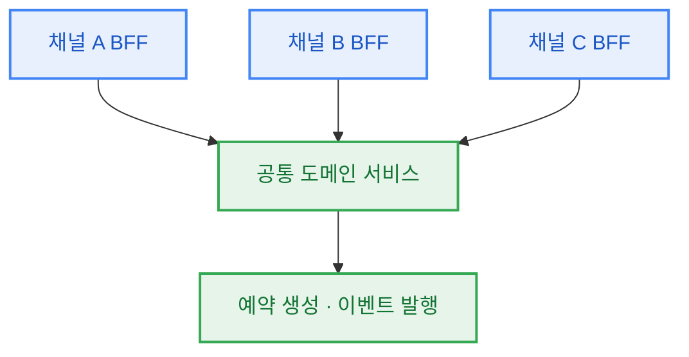
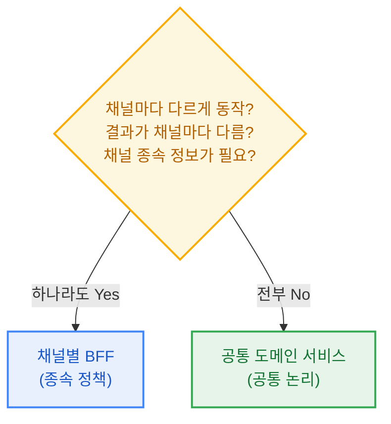
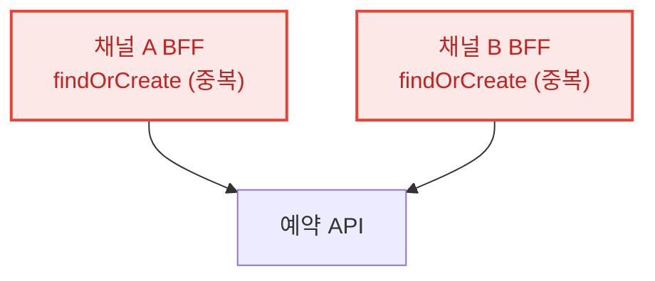

---

## 1. 배경

필자가 다루는 서비스는 진입 채널이 여럿이다. 외부 연동용 게이트웨이, 자체 웹, 파트너 앱이 각자의 BFF(Backend For Frontend)를 통해 들어오고, 그 뒤에 공통 도메인 서비스가 있다.

어느 날 외부 연동 채널 쪽에서 "정원이 찬 시간대에는 예약을 막아달라"는 요구가 들어왔다. 요청이 그 채널의 BFF로 들어왔으니, 처음엔 자연스럽게 그 BFF에 검증 코드를 넣으려 했다.

그런데 코드를 쓰기 직전에 걸리는 게 있었다.

> 이 검증은 이 채널에만 필요한 걸까, 아니면 결국 모든 채널이 지켜야 할 규칙일까?

이 질문의 답에 따라 코드를 둘 위치가 완전히 갈렸다. 채널에만 해당하면 그 BFF에 두는 게 맞고, 모든 채널에 적용될 논리라면 BFF가 아니라 공통 도메인 서비스에 응집시켜야 했다. 이 글에서는 그 판단을 어떤 흐름으로 내렸는지 정리하고자 한다.

> 도메인은 각색했지만, 판단의 흐름은 실제 설계 논의에서 그대로 가져왔다.

## 2. 판단 기준

구조를 그림으로 보면 결정해야 할 지점이 분명해진다. 새 로직을 **채널별 BFF**에 둘 것인가, 아니면 모든 채널이 지나는 **공통 도메인 서비스**에 둘 것인가.



기준을 한 문장으로 정리하면 이렇다.

> 이 정책이 이 채널에만 해당하는가?
> Yes면 채널별 BFF에, No면 공통 도메인 서비스에 둔다.

그렇다면 "이 채널에만 해당하는가"를 어떻게 판정할까. 필자는 세 가지를 자문했다.

1. 이 로직이 **채널마다 다르게** 동작해야 하는가?
2. 이 로직의 **결과가 채널마다 달라야** 하는가?
3. 실행 전에 **그 채널에 종속된 정보**(연동사 종류, 유입 경로 등)가 반드시 필요한가?

하나라도 Yes면 채널 종속 정책이므로 BFF에 둔다. 전부 No면 채널과 무관한 공통 논리이므로 도메인 서비스로 내린다.



## 3. 채널 종속 정책

처음의 정원 초과 처리 요구로 돌아가 이 자문을 대입했다.

외부 연동 채널은 연동사마다 정책이 다르다. 어떤 연동사는 정원이 차도 대기 예약으로 받고, 어떤 곳은 즉시 막는다. 즉 **채널(연동사)마다 다르게 동작해야 한다**(1번 Yes). 검증에 쓰는 "연동사별 정원 초과 정책"은 그 채널 설정에서만 나오는 **채널 종속 정보**다(3번 Yes).

자문 셋 중 둘이 Yes였으니 채널 종속 정책으로 판단했다. 그 BFF에 두는 게 맞았다.

```kotlin
// 채널 종속: 외부 연동 채널에만 해당하는 정책 → 이 BFF에 둔다
class OpenApiReservationController(
    private val capacityPolicy: PartnerCapacityPolicy,
    private val reservationClient: ReservationClient,
) {
    fun reserve(req: OpenApiReserveRequest) {
        // 연동사별 정원 초과 정책 검증 (이 채널에만 존재하는 규칙)
        capacityPolicy.validate(req.partnerId, req.dateTime)

        // 공통 도메인은 그대로 호출
        reservationClient.create(req.toCommand(channel = OPEN_API))
    }
}
```

유입 경로(funnel) 확정도 같은 결로 판단했다. 외부 연동 클라이언트에게 유입 경로 코드를 직접 지정하게 하지 않고, BFF가 채널을 근거로 서버에서 유도했다. "어느 채널로 들어왔는가"라는 채널 종속 정보가 필요한 일이라, 클라이언트가 아니라 채널 쪽에 책임을 뒀다.

## 4. 공통 논리

반대 사례도 있었다. 예약 시 방문자를 찾고, 없으면 새로 만드는 로직이다. 처음 이 로직이 특정 채널 BFF에 들어와 있었는데, 자문을 대입해보니 답이 반대로 나왔다.

- 방문자를 찾거나 만드는 방식이 채널마다 다른가? **아니다.** 어느 채널이든 "연락처로 찾고 없으면 만든다"가 같다.
- 결과가 채널마다 달라야 하는가? **아니다.** 같은 사람이면 방문자도 같다.
- 채널 종속 정보가 필요한가? **아니다.** 연락처와 이름만 있으면 된다.

셋 다 No였다. 이건 채널과 무관한 공통 논리였고, BFF에 있을 이유가 없었다. 도메인 서비스로 내리고, BFF는 채널 컨텍스트(channel, funnel 같은)만 주입해 넘기게 했다.

```kotlin
// BFF는 채널 컨텍스트만 주입하고 전달
class OpenApiReservationController(
    private val reservationClient: ReservationClient,
) {
    fun reserve(req: OpenApiReserveRequest) =
        reservationClient.create(req.toCommand(channel = OPEN_API))
}

// 공통 논리는 도메인 서비스 한 곳에 응집
class CreateReservationExecutor(
    private val visitorReader: VisitorReader,
) {
    fun execute(command: CreateReservation): ReservationCreated {
        // 어느 채널로 들어왔든 동일한 방문자 처리
        val visitorId = visitorReader.findOrCreate(command.phoneNumber, command.name)
        // 가능 여부 검증 · 이벤트 발행 ...
    }
}
```

이렇게 내려두면 방문자 처리 규칙이 바뀌어도 도메인 서비스 한 곳만 고치면 모든 채널이 함께 정상화된다.

## 5. 잘못 배치했을 때의 문제

두 방향 다, 판단을 틀리면 문제가 생긴다.

**공통 논리를 채널에 둔 경우.** 방문자 처리를 BFF에 두면, 채널이 늘어날 때마다 같은 코드를 복붙하게 된다. 채널 A BFF와 채널 B BFF가 똑같은 `findOrCreate`를 각자 가지고 있는 상태다. 규칙이 바뀌면 모든 BFF를 일일이 고쳐야 하고, 한 곳을 빠뜨리면 그 채널만 다르게 동작한다.



그래서 **여러 BFF에 같은 코드가 쌓이기 시작하면** 공통 도메인으로 옮기는 걸 검토해야 한다.

**채널 종속 정책을 공통에 둔 경우.** 반대도 위험하다. 특정 채널에만 필요한 정책을 성급하게 공통 도메인에 넣으면, 다른 채널에도 원하지 않는 제약이 적용된다. 게다가 나중에 "이 채널만 예외"가 생기면 공통 코드 안에 채널 분기(`if (channel == ...)`)가 늘어나기 시작한다. 이건 공통 논리가 아니라 채널 종속 정책이다. 공통에 잘못 놓았을 뿐이다.

특히 **기존 공통 API에 없던 제약을 추가하면** 그 API를 쓰는 모든 채널이 영향을 받는다. 한 채널의 요구로 공통 규칙을 바꾸기 전에, 정말 모든 채널이 그걸 원하는지 확인해야 한다. 아니라면 그건 공통이 아니라 채널 종속 정책이다.

## 6. 결론

새 로직을 어디에 둘지는 그 요청이 **어느 채널로 들어왔는지**로 정할 문제가 아니었다. 필자가 생각하는 판단 기준을 아래와 같이 정리해보았다.

- **채널마다 다르게 동작하거나, 결과가 다르거나, 채널 종속 정보가 필요하면** 채널별 BFF에 둔다.
- **셋 다 아니면** 채널과 무관한 공통 논리이므로 도메인 서비스에 응집시킨다.
- **여러 BFF에 같은 코드가 쌓이면** 공통으로 옮길 근거, 반대로 **공통 코드에 채널 분기가 늘어나면** 잘못 놓았다는 근거다.

공통 논리를 한 곳에 모으는 건 결국 DRY(Don't Repeat Yourself)와 맞닿아 있다. 같은 지식이 여러 BFF에 중복되면 한 곳만 고치고 다른 곳을 빠뜨리는 사고가 난다. 다만 DRY를 "코드가 닮았으면 무조건 합쳐라"로 오해하면, 채널마다 달라야 할 정책까지 공통에 넣어 잘못된 추상을 만든다. Sandi Metz는 "중복이 잘못된 추상보다 싸다"고 했다. 그래서 기준은 코드가 얼마나 닮았느냐가 아니라, 그 논리가 채널에 종속되느냐였다.

요청이 특정 채널로 들어왔다고 해서 그 로직이 그 채널의 것은 아니다. 위치를 정하려면 "이 정책이 이 채널에만 해당하는가"부터 물어야 했다.

## 참고자료

- [The Wrong Abstraction (Sandi Metz)](https://sandimetz.com/blog/2016/1/20/the-wrong-abstraction): 성급하게 중복을 없애다 잘못된 추상을 만드는 과정을 다룬 글. "중복이 잘못된 추상보다 훨씬 싸다."
- [Don't Repeat Yourself (The Pragmatic Programmer)](https://pragprog.com/tips/): DRY는 "지식의 중복"을 없애라는 원칙이지, 우연히 닮은 코드를 무조건 합치라는 뜻이 아니다.

