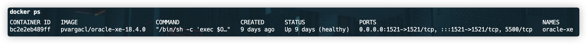
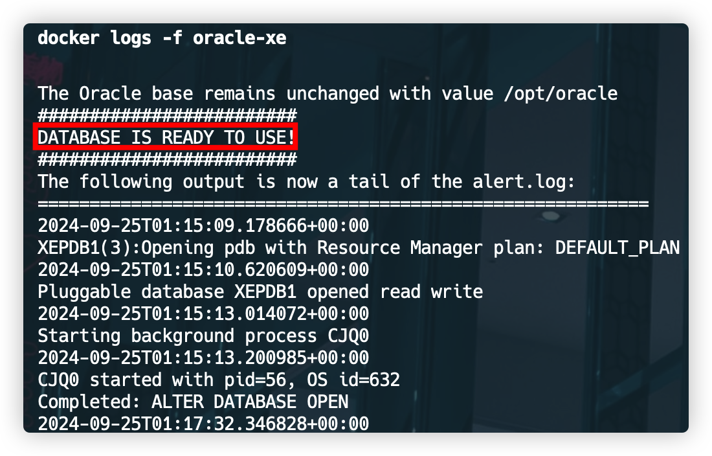

---

## 필자의 개발 환경

- 칩 : Apple M2 Pro
- MacOS : Sonoma 14.5(23F79)
- Docker Version : 24.0.2

필자는 Docker를 활용하여 Oracle 데이터베이스를 가동하기로 하였다.

## 설치 과정

M2 칩을 사용하는 Mac에서는 Oracle Database 설치를 공식적으로 지원하지 않는다. 하지만 Colima와 Docker를 통해 설치할 수 있다.

### 1. Homebrew 설치

이미 Homebrew가 설치되어 있다면 이 단계를 건너뛰어도 된다.

```bash
/bin/bash -c "$(curl -fsSL https://raw.githubusercontent.com/Homebrew/install/HEAD/install.sh)"
```

### 2. Docker 설치

Homebrew를 사용하여 Docker를 설치한다.

```bash
brew install --cask docker
```

설치 후 Docker 애플리케이션을 실행하여 초기 설정을 완료한다.

### 3. Colima 설치

```bash
brew install colima
```

### 4. Colima 실행 및 Docker로 Oracle DB 설치

### 4-1. Colima 시작

```bash
colima start --memory 4 --arch x86_64
```

#### 4-2. Docker로 Oracle 이미지 받기

```bash
docker pull pvargacl/oracle-xe-18.4.0
```

#### 4-3. Oracle DB 컨테이너 실행

```bash
docker run --name oracle-xe -e ORACLE_PASSWORD=YourSecurePassword -p 1521:1521 -d pvargacl/oracle-xe-18.4.0
```

#### 4-4. Docker 상태 확인

```bash
docker ps
```



실행 결과에 `deepdiver/docker-oracle-xe-11g` 이미지가 보이면 성공이다.

#### 4-5. 데이터베이스 초기화 과정 모니터링

다음 명령어로 데이터베이스 초기화 과정을 모니터링할 수 있다.

```bash
docker logs -f oracle-xe
```



&nbsp; "DATABASE IS READY TO USE!" 메시지가 나타날 때까지 기다린다. 이 과정은 약 5분 정도 소요될 수 있다.

## 주의사항

- 이 방법은 M2 칩 Mac에서 Oracle DB를 사용하기 위한 대안적인 방법이다.
- Colima를 사용하여 x86_64 아키텍처 에뮬레이션을 통해 Oracle DB를 실행한다.
- 성능이나 호환성 면에서 제한이 있을 수 있다.

&nbsp; 이 방법을 통해 M2 칩 Mac에서도 Oracle DB를 사용할 수 있다. 개발 및 학습 목적으로는 충분히 활용 가능할 것이다.
