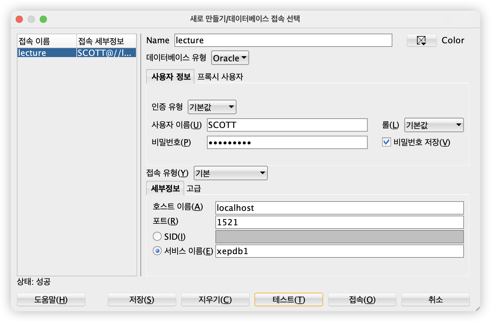

---

## 필자의 개발 환경

- 칩 : Apple M2 Pro
- MacOS : Sonoma 14.5(23F79)
- Docker Version : 24.0.2

필자는 Docker를 활용하여 Oracle 데이터베이스를 가동하기로 하였다.

## 설치 과정

### 1. Oracle 데이터베이스 Docker 이미지 다운로드

```sh
docker pull pvargacl/oracle-xe-18.4.0
```

### 2. Oracle 데이터베이스 컨테이너 생성 및 실행

```sh
docker run --name oracle-xe -e ORACLE_PASSWORD=YourSecurePassword -p 1521:1521 -d pvargacl/oracle-xe-18.4.0
```

- `--name oracle-xe`: 컨테이너 이름을 'oracle-xe'로 지정
- `-e ORACLE_PASSWORD=YourSecurePassword`: 데이터베이스 관리자 비밀번호 설정
- `-p 1521:1521`: 호스트의 1521 포트를 컨테이너의 1521 포트에 매핑
- `-d`: 백그라운드에서 컨테이너를 실행

### 3. 컨테이너 상태 확인

```sh
docker ps
```


&nbsp; 컨테이너가 실행 중인지 확인한다.

### 4. 데이터베이스 초기화 과정 모니터링

```sh
docker logs -f oracle-xe
```


&nbsp; "DATABASE IS READY TO USE!" 메시지가 나타날 때까지 대기한다. 필자의 경험 상 해당 과정은 5분 정도 시간이 필요하였다.

### 5. SQL Developer 설정


