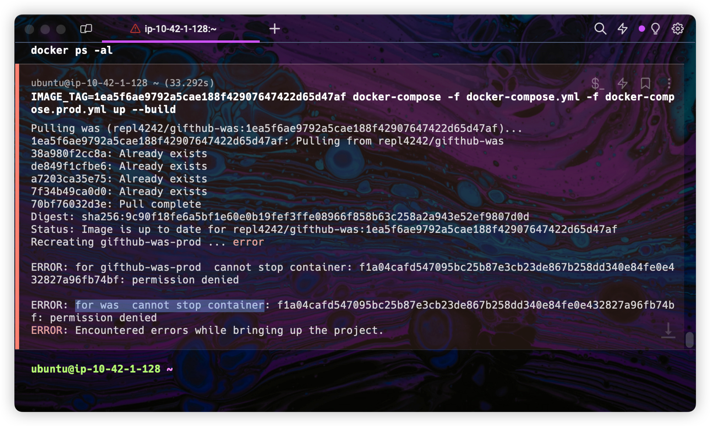

---



&nbsp; Ubuntu 서버에 Docker 및 docker-compose를 통해 Spring 컨테이너를 실행하고 있었는데 위와 같은 오류가 발생했다.<br>
&nbsp; 사실 이전까지는 오류가 발생하지 않다가 모종의 이유로 서버를 재부팅한 이후로 발생한 이슈였다.<br><br>

&nbsp; 이러한 이슈가 발생한 이유는 Linux의 `AppArmor` 때문이라고 한다. AppArmor는 시스템 내에서 어플리케이션의 보안을 강화하기 위해 사용되는 Mandatory Access Control(MAC) 프레임워크 중 하나인데, **앱이 어떤 리소스에 접근할 수 있는지 제한하고 시스템의 보안을 강화하는 역할**을 한다.<br>
&nbsp; 아마 리눅스가 재부팅되면서 AppAmor의 프로파일이 잘못 된 것 같다.<br><br>
&nbsp; 해결 방법은 다음과 같다.

```bash
sudo aa-remove-unknown
```

&nbsp; 이 명령은 AppArmor 프로파일 관리를 위한 명령어인데, `unknown`(식별되지 않은) 상태에 있는 프로파일을 정리하는 명령어이다.

--

## Refrence

- [https://stackoverflow.com/questions/31365827/cannot-stop-or-restart-a-docker-container](https://stackoverflow.com/questions/31365827/cannot-stop-or-restart-a-docker-container)
