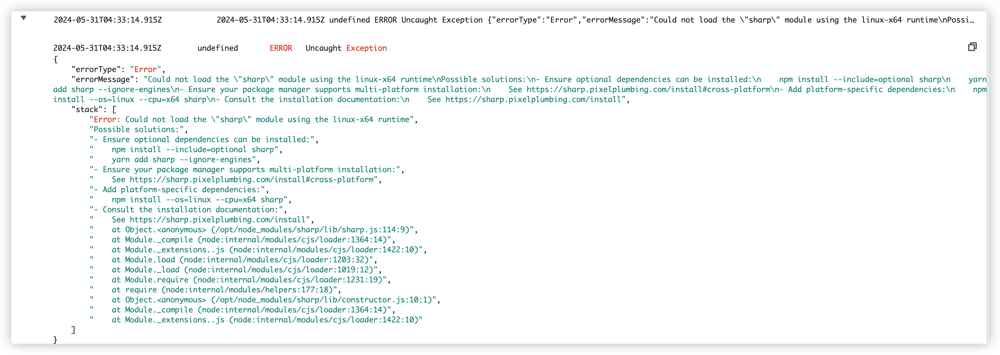
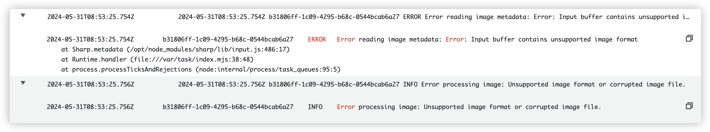
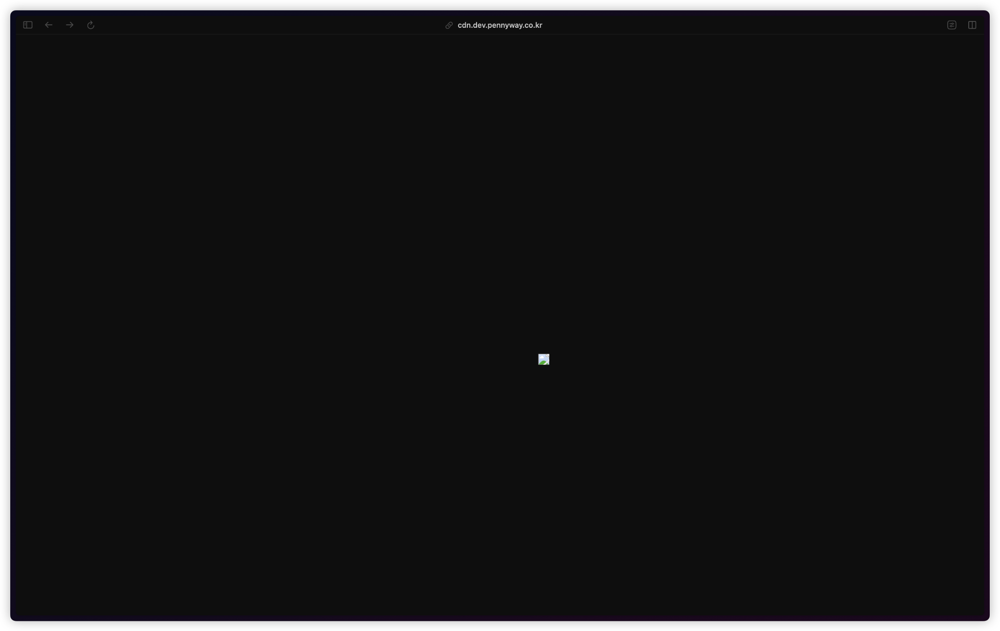
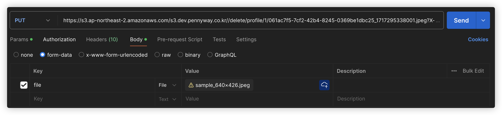
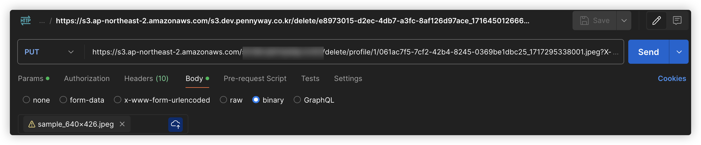

---

## AWS Lambda

### 소개

&nbsp; Amazon Web Services에서 제공하는 **서버리스 컴퓨팅 서비스**이다. 서버리스 컴퓨팅이란, 서버 인프라를 직접 관리하지 않고도 코드를 실행할 수 있는 환경을 제공하는 컴퓨팅 모델을 의미한다. AWS Lambda는 이러한 서버리스 컴퓨팅 모델을 통해 개발자가 별도의 서버 관리 없이 코드를 작성 및 배포, 실행할 수 있도록 한다.

### 특징

#### 1. **서버리스 컴퓨팅**

- 개발자가 서버의 관리를 하는데에 있어, 별도의 수고를 하지 않아도 된다. 서버의 프로비저닝, 패치, 유지 관릳 등을 AWS에서 자동으로 처리해준다.
- 자동 트래픽의 변화에 맞춰 자동으로 확장 또는 축소된다. 이벤트 기반으로 실행되므로, 요청 수에 맞춰 실행 환경을 자동으로 조절한다.

#### 2. **이벤트 기반 실행**

- S3 버킷, DynamoDB 테이블, Kinesis 스트림, API Gateway, CloudWatch Events 등 다양한 AWS 서비스와 통합되어, 이러한 이벤트를 기반으로 함수를 트리거할 수 있다.
- 이벤트 발생 시 즉시 코드를 실행함으로써, 실시간 데이터 처리 및 응답을 할 수 있다.

#### 3. **비용 효율성**

- 코드를 실행한 만큼(요청 수와 실행 시간에 비례)만 요금을 지불한다.
- 코드가 실행되지 않는 동안에는 비용이 발생하지 않는다.

#### 4. **다양한 런타임 지원**

- Node.js, Python, Java, Go, Ruby 등 여러 프로그래밍 언어를 지원한다.
- 맞춤형 런타임을 통해 그 외의 언어도 지원할 수 있다.

#### 5. 통합 및 관리

- IAM 역할 및 정책 설정을 통해 AWS의 다른 리소스에도 접근할 수 있다.
- AWS CloudWatch를 통해 Lambda 함수의 실행 로그와 메트릭을 모니터링 할 수 있다.

### 사용 사례

- 데이터 처리 : S3 이미지 리사이징, 동영상 트랜스코딩, 로그 파일 분석 등
- 실시간 스트리밍 데이터 처리 : Kinesis 또는 DynamoDB 스트림을 사용하여 실시간 데이터 스트림 처리
- 서버리스 웹 애플리케이션 : API Gateway와 연동하여 서버리스 RESTful API 구축
- 자동화 : CloudWatch Events와 통합하여 정기적인 작업 자동화, 백업, 상태 점검 등 수행
- IoT : IoT 기기에서 발생하는 이벤트를 처리하고, 데이터 분석 혹은 저장 수행

### 함수 구조

```javascript
// Node.js 예제
exports.handler = async (event) => {
  console.log("Event: ", event);
  return {
    statusCode: 200,
    body: JSON.stringify("Hello from Lambda!"),
  };
};
```

&nbsp; AWS Lambda에서 Node.js 런타임으로 실행되는 간단한 예제이다. 이벤트를 받아 로그에 출력하고, "Hello from Lambda!" 메시지를 반환하도록 구현하였다.

### 장점

- `빠른 개발 및 배포`: 서버 관리 부담이 없어 애플리케이션 개발에 집중할 수 있다.
- `유연성`: 다양한 AWS 서비스와 통합되어 여러 사용 사례에 적용 가능하다.
- `확장성`: 트래픽 변화에 따라 자동으로 확장/축소되어 높은 확장성을 제공한다.
- `비용 효율성`: 사용한 만큼만 비용을 지불하여 경제적일 수 있다.

## Lambda 적용기

### 구축 사유

&nbsp; S3에 이미지가 저장되었을 때 해당 이미지를 리사이징하여 저장하도록 하기 위해 AWS Lambda를 사용하게 되었다.

### 개발 환경

- 런타임 : Node.js 18.x
- 필요 라이브러리 : `aws-sdk`, `sharp`
- API 테스트 : Postman

### 발생했던 이슈

#### 1. sharp 패키지 import 에러



```json
2024-05-31T04:31:55.159Z	undefined	ERROR	Unhandled Promise Rejection
{
    "errorType": "Runtime.UnhandledPromiseRejection",
    "errorMessage": "Error: Could not load the \"sharp\" module using the linux-x64 runtime\nPossible solutions:\n- Ensure optional dependencies can be installed:\n    npm install --include=optional sharp\n    yarn add sharp --ignore-engines\n- Ensure your package manager supports multi-platform installation:\n    See https://sharp.pixelplumbing.com/install#cross-platform\n- Add platform-specific dependencies:\n    npm install --os=linux --cpu=x64 sharp\n- Consult the installation documentation:\n    See https://sharp.pixelplumbing.com/install",
    "reason": {
        "errorType": "Error",
        "errorMessage": "Could not load the \"sharp\" module using the linux-x64 runtime\nPossible solutions:\n- Ensure optional dependencies can be installed:\n    npm install --include=optional sharp\n    yarn add sharp --ignore-engines\n- Ensure your package manager supports multi-platform installation:\n    See https://sharp.pixelplumbing.com/install#cross-platform\n- Add platform-specific dependencies:\n    npm install --os=linux --cpu=x64 sharp\n- Consult the installation documentation:\n    See https://sharp.pixelplumbing.com/install",
        "stack": [
            "Error: Could not load the \"sharp\" module using the linux-x64 runtime",
            "Possible solutions:",
            "- Ensure optional dependencies can be installed:",
            "    npm install --include=optional sharp",
            "    yarn add sharp --ignore-engines",
            "- Ensure your package manager supports multi-platform installation:",
            "    See https://sharp.pixelplumbing.com/install#cross-platform",
            "- Add platform-specific dependencies:",
            "    npm install --os=linux --cpu=x64 sharp",
            "- Consult the installation documentation:",
            "    See https://sharp.pixelplumbing.com/install",
            "    at Object.<anonymous> (/opt/node_modules/sharp/lib/sharp.js:114:9)",
            "    at Module._compile (node:internal/modules/cjs/loader:1364:14)",
            "    at Module._extensions..js (node:internal/modules/cjs/loader:1422:10)",
            "    at Module.load (node:internal/modules/cjs/loader:1203:32)",
            "    at Module._load (node:internal/modules/cjs/loader:1019:12)",
            "    at Module.require (node:internal/modules/cjs/loader:1231:19)",
            "    at require (node:internal/modules/helpers:177:18)",
            "    at Object.<anonymous> (/opt/node_modules/sharp/lib/constructor.js:10:1)",
            "    at Module._compile (node:internal/modules/cjs/loader:1364:14)",
            "    at Module._extensions..js (node:internal/modules/cjs/loader:1422:10)"
        ]
    },
    "promise": {},
    "stack": [
        "Runtime.UnhandledPromiseRejection: Error: Could not load the \"sharp\" module using the linux-x64 runtime",
        "Possible solutions:",
        "- Ensure optional dependencies can be installed:",
        "    npm install --include=optional sharp",
        "    yarn add sharp --ignore-engines",
        "- Ensure your package manager supports multi-platform installation:",
        "    See https://sharp.pixelplumbing.com/install#cross-platform",
        "- Add platform-specific dependencies:",
        "    npm install --os=linux --cpu=x64 sharp",
        "- Consult the installation documentation:",
        "    See https://sharp.pixelplumbing.com/install",
        "    at process.<anonymous> (file:///var/runtime/index.mjs:1276:17)",
        "    at process.emit (node:events:517:28)",
        "    at process.emit (node:domain:489:12)",
        "    at emit (node:internal/process/promises:149:20)",
        "    at processPromiseRejections (node:internal/process/promises:283:27)",
        "    at process.processTicksAndRejections (node:internal/process/task_queues:96:32)"
    ]
}
```

&nbsp; `sharp`는 JS 진영에서 가장 많이(혹은 유일하게) 사용하는 이미지 리사이징 라이브러리이다. 해당 라이브러리를 import하여 Lambda에서 사용하고자 하였으나 에러가 발생하였다. 이유는 Lambda의 런타임 환경 (linux-x64)과 호환되지 않기 때문이다. 필자는 아래 명령어를 통해 패키지를 설치하여 해당 이슈를 해결하였다.

```bash
# 기존 방식 - MAC에서 sharp를 사용하기 위해 사용
npm install sharp
# 해결 방안 - AWS Lambda에서 sharp를 사용하기 위해 사용
npm install --os=linux --cpu=x64 sharp
```

#### 2. 이미지 파일 깨짐 이슈

- **상황**



&nbsp; 이미지 압축을 하는 과정에서 에러가 발생하여 압축이 진행되지 않고 있었다.

- **원인**



&nbsp; 이미지 저장 시 깨지는 것을 확인하였고 이를 토대로, 올바르지 않게 저장되고 있다는 사실을 확인할 수 있었다.

- **해결 방법**

  - **이전**

    

  - **수정**

    

&nbsp; 현재 `Postman`을 통해 Presigned-URL을 호출하여 Lambda에서 이미지 리사이징 로직 검증 테스트를 진행하고 있었는데, `이전` 방법으로 이미지를 요청할 경우 이미지가 깨지는 것을 확인하였다. `수정` 방법으로 요청을 보내니 정상적으로 이미지가 저장되는 것을 확인할 수 있었고, 이를 토대로 Lambda에서 sharp 모듈을 통한 이미지 리사이징이 정상적으로 이루어지는 것을 확인할 수 있었다.

- **오류가 발생했던 이유**

  &nbsp; `이전` 방식으로는 form-data 형식으로 파일을 업로드하였다. 이 방법은 일반적인 파일 업로드에는 적합하지만 presigned URL을 통한 S3 업로드에는 적합하지 않다. S3에 파일을 업로드할 때는 binary 형식을 통해 파일 자체를 raw 데이터(순수 파일의 내용만)로 업로드해야 합니다.

### Terraform AWS Lambda 구축

...(작성 중)
