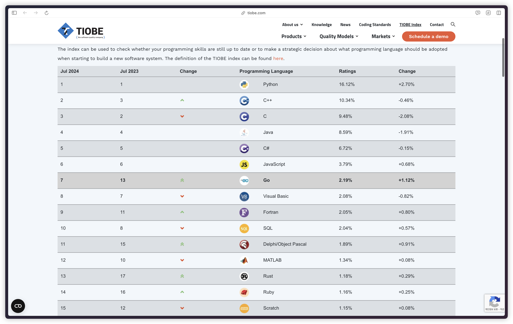
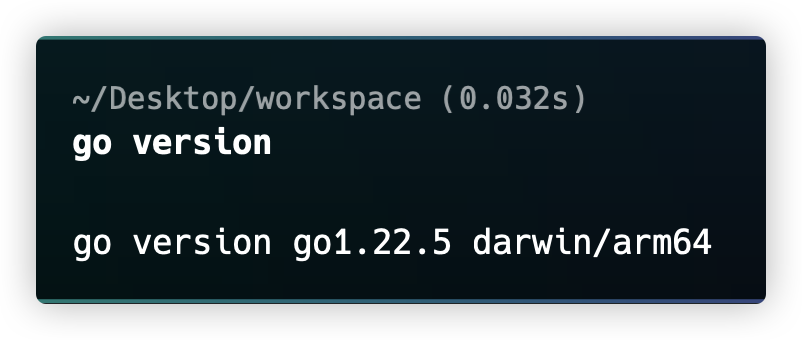

---

## Background

&nbsp; 필자는 작년 SW마에스트로 활동을 하면서 처음으로 Terraform을 접하게 되었다. Terraform이란 클라우드 인프라 관리 도구로 이는 Go 언어로 작성되어 있어, 늘 흥미를 가지고 있던 언어 중 하나였다. 관심만 가지고 있다가 최근에 졸업 작품을 진행하면서 Go 언어에 대한 관심이 더욱 깊어졌고, 그 활용 범위가 클라우드 인프라 관리뿐만 아니라 마이크로서비스, 네트워크 프로그래밍, DevOps 도구 개발 등 다양한 분야로 확장되어 있음을 알게 되었다. 이에 Go 언어의 기초부터 실제 활용까지 체계적으로 학습하고 공유하고자 본 포스트를 작성하게 되었다.

---

## Instroduce

&nbsp; Go 언어는 현대적이고 효율적인 프로그래밍 언어로, 웹 서비스와 네트워크 프로그래밍 분야에서 특히 강점을 보인다. 간결한 문법과 강력한 기능을 통해 개발자들에게 생산성 높은 개발 환경을 제공하며, 구글의 인프라 시스템부터 Docker, Kubernetes 같은 컨테이너 기술까지 다양한 분야에서 활용되고 있다.

### History

&nbsp; Go는 2007년 구글의 프로그래머들이 개발을 시작했다. 2009년에 첫 공개 버전이 출시되었고 ,2012년에 1.0 버전이 릴리즈되엇다. 현재 Go는 Tiobe 인덱스에서 7위를 차지할 정도로 인기있는 언어로 성장했다.



### Features

- 간결한 문법
- 빠른 컴파일 속도
- 가비지 컬렉션
- 병행성(Concurrency) 지원
- 정적 타입 시스템

&nbsp; Go는 이러한 특징들을 바탕으로 현대적인 소프트웨어 개발에 적합한 언어로 자리잡고 있으며, 계속해서 성장하고 있다.

## Development Environment Setup

&nbsp; 필자는 `Homebrew` 사용하며 설치하였으며, 필자의 개발 환경은 다음과 같다.

- Apple M2 Pro
- macOS Sonoma 14.5

### Go Install

```sh
brew install go   # Homebrew로 Go 설치
go version        # 설치 여부 및 버전 확인
```

### Enviroment Variables

```sh
echo 'export GOPATH=$HOME/go' >> ~/.zshrc
echo 'export PATH=$PATH:/usr/local/opt/go/libexec/bin:$GOPATH/bin' >> ~/.zshrc
source ~/.zshrc
```

### Result



## Example Code

### Hello World

```go
// hello-world.go
package main

import "fmt"

func main() {
    fmt.Println("Hello, World!")
}
```

&nbsp; 실행은 `go run hello-world.go`를 터미널에 입력하면 실행할 수 있다.

### Variable & Constant

```go
var name string = "Jinwoo"
age := 25 // 타입 추론
const PI = 3.14
```

### Data Type

```go
var i int = 42  // 정수
var f float64 = 3.14  // 실수
var b bool = true // bool
var s string = "Hello, Go!" // string
```

### If statement

```go
if x > 0 {
    fmt.Println("양수")
} else if x < 0 {
    fmt.Println("음수")
} else {
    fmt.Println("0")
}
```

### For loop

```go
for i := 0; i < 5; i++ {
  fmt.Println(i)
}
```

### Switch statement

```go
switch day {
  case "월":
    fmt.Println("월요일")
  case "화":
    fmt.Println("화요일")
  default:
    fmt.Println("다른 요일")
}
```

---

## Summary

&nbsp; 이상으로 Go 언어의 소개, 개발 환경 설정 및 기본 문법에 대해 간단하게 살펴보았다. 아직은 Java나 JS/TS, Python 등의 언어에 비해 익숙하지 않지만, 아주 특별한 문법은 아니기 때문에 yaml 같은 특수한 문법에 비해서는 차이가 크지 않기 때문에, 적응만 한다면 어렵지 않게 사용할 수 있을 것으로 보인다.
