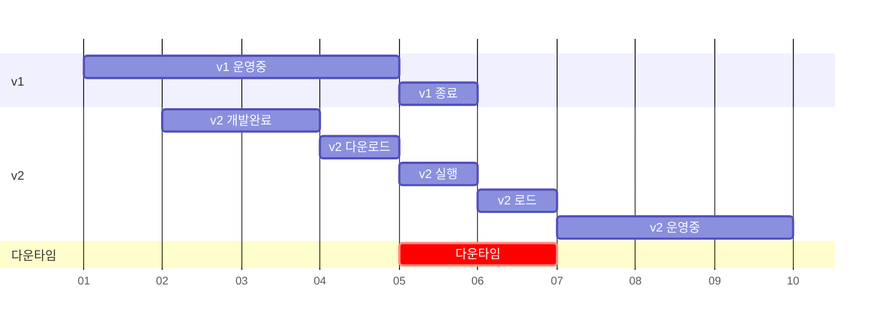
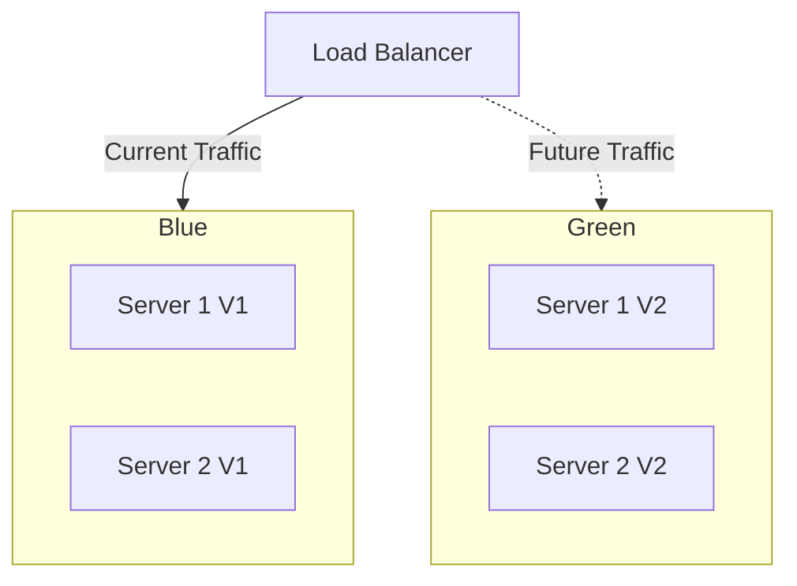
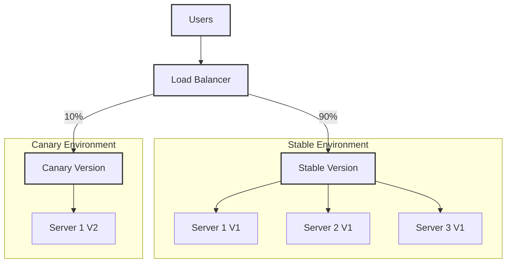
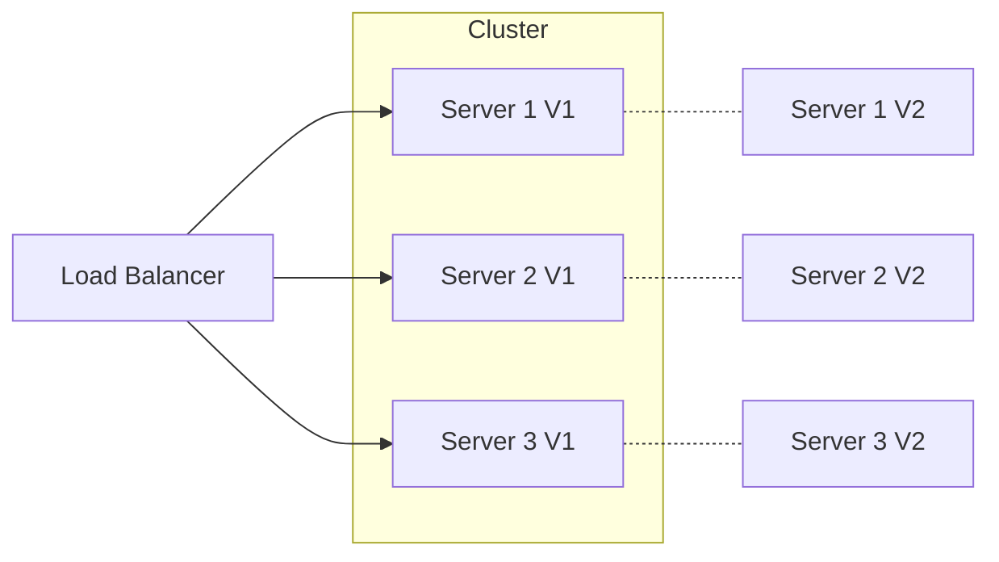
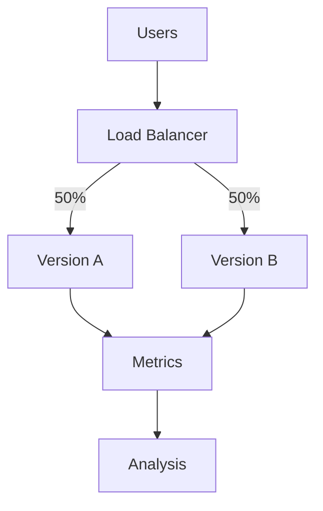
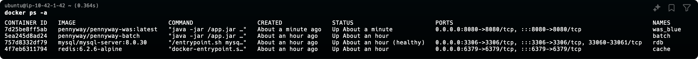
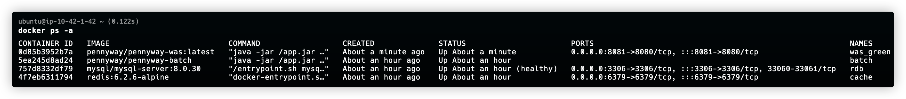
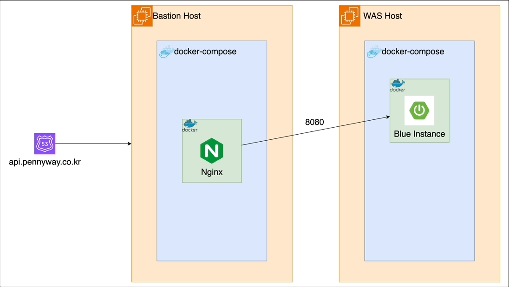

---

## 무중단 배포란?

&nbsp; 무중단 배포(zero-downtime deployment)가 서비스의 가용성을 유지하면서 새로운 버전의 애플리케이션을 배포하는 기술이다. 이는 사용자 경험을 저해하지 않으면서 지속적인 서비스 개선과 유지보수를 가능하게 한다.

### 기존 배포 방식



&nbsp; 위 간트 차트를 통해 기존 배포 방식의 문제점을 살펴보자.

1. 서비스 중단: v1에서 v2로 전환하는 과정에서 '2'라는 다운타임이 발생한다. 이는 사용자들이 서비스를 이용할 수 없는 기간을 의미한다.
2. 긴 전환 시간: 새 버전(v2)의 실행부터 완전히 운영되기까지 3이라는 시간이 소요된다. 이는 배포 프로세스가 복잡하고 시간이 많이 걸림을 나타낸다.
3. 리스크: 다운타임 동안 문제가 발생하면 서비스 재개가 더 지연될 수 있다. 이는 비즈니스에 심각한 영향을 미칠 수 있다.
4. 유연성 부족: 이러한 방식으로는 빈번한 업데이트나 긴급 패치 적용이 어렵다.

### 무중단 배포의 주요 이점

&nbsp; 무중단 배포를 통해 얻을 수 있는 이점은 다음과 같다.

- 서비스 연속성 보장: 업데이트 중에도 서비스 이용 가능
- 리스크 감소: 문제 발생 시 신속한 롤백 가능
- 사용자 경험 향상: 서비스 중단으로 인한 불편 최소화
- 비즈니스 연속성 유지: 24/7 서비스 가용성으로 매출 손실 방지
- 빈번한 업데이트 가능: 더 작은 단위의 변경사항을 자주 배포 가능
- 신속한 버그 수정: 중요한 이슈 발생 시 빠른 대응 가능

&nbsp; 이러한 문제점들은 사용자 입장에서는 받아들이기 어려운 단점이다. 따라서 이를 해결하기 위해 무중단 배포를 통해 다운타임을 없애고, 배포 과정의 리스크를 줄이며, 더 빠르고 유연한 서비스 업데이트를 하고자 하였다.

### 무중단 배포 전략 종류

### 1. Blue-Green 배포



&nbsp; Blue-Green 배포는 무중단 배포 전략의 한 종류로, 두 개의 동일한 프로덕션 환경을 운영하며 순간적으로 트래픽을 전환하는 방식이다. 이 두 환경은 관례적으로 'Blue'와 'Green'으로 불린다. 이 방법의 주요 특징은 다음과 같다.

- 두 개의 동일한 프로덕션 환경을 준비한다 (Blue와 Green).
- 한 환경은 현재 버전을 실행 중이고, 다른 환경은 대기 상태이다.
- 새 버전을 배포할 때, 대기 환경에 새 버전을 설치하고 테스트한다.
- 테스트가 완료되면, 트래픽을 새 환경으로 전환한다.
- 이전 환경은 롤백을 위해 잠시 대기 상태로 유지된다

### 2. Canary 배포



&nbsp; Canary 배포란 새 버전을 일부 사용자에게만 점진적으로 노출시키는 방식이다. 이 방법의 주요 특징은 다음과 같다.

- 새 버전을 소수의 사용자 또는 서버에 먼저 배포
- 문제 발생 시 영향을 받는 사용자 수가 적음
- 실제 사용 환경에서 새 버전을 테스트할 수 있음
- 점진적으로 새 버전의 트래픽 비율을 늘려감

### 3. Rolling 업데이트



&nbsp; Rolling 업데이트를 서버 그룹을 순차적으로 업데이트하는 방식이다. 주요 특징은 다음과 같다.

- 서버를 작은 배치로 나누어 순차적으로 업데이트
- 전체 시스템의 가용성을 유지하면서 점진적으로 새 버전 배포
- 리소스 사용이 효율적임
- 롤백이 Blue-Green보다는 복잡할 수 있음

### 4. A/B 테스팅



&nbsp; A/B 테스팅은 두 가지 버전을 동시에 운영하며 성능을 비교하는 방식이다. 주요 특징은 다음과 같다.

- 두 가지 버전을 동시에 실행하여 성능, 사용성 등을 비교
- 사용자 피드백을 바탕으로 더 나은 버전 선택 가능
- 새로운 기능의 효과를 실제 환경에서 측정 가능
- 복잡한 설정과 모니터링이 필요할 수 있음

## Blue-Green 배포 전략 도입

### 도입 배경

&nbsp; Blue-Green 배포 전략을 선택하는 주요 이유는 무중단 배포와 롤백의 용이성, 그리고 안정적인 테스트 환경 제공이다. 새로운 버전(Green)을 기존 버전(Blue)과 완전히 별도로 구축하여 즉시 전환할 수 있게 함으로써, 사용자 경험에 영향을 주지 않고 신속하게 업데이트할 수 있다. 만약 새 버전에서 문제가 발생하더라도 트래픽을 즉시 이전 버전으로 되돌릴 수 있어, 복잡한 롤백 절차 없이 빠르게 안정 상태로 복귀할 수 있다. 또한, 단순한 전환 메커니즘을 통해 배포 과정을 간소화하고 인적 오류의 가능성을 낮춤으로써 배포 프로세스의 복잡성을 크게 줄여준다. 이는 배포 과정의 안정성을 높이고 운영 팀의 스트레스를 줄이는 데 도움이 된다. 이러한 특징들로 인해 무중단 배포를 처음 도입하는 필자에게 있어서는 Blue-Green 배포가 가장 이해하기 쉽고 적용하기 용이한 방법이라고 생각되었다.<br>

&nbsp; 또한, 필요 시 실제 운영 환경과 동일한 Green 환경에서 철저한 테스트를 수행할 수 있게 할 수 있다. 이를 통해 프로덕션 환경에서 발생할 수 있는 문제들을 사전에 발견하고 해결할 수 있다. Blue와 Green 환경은 동일하기 때문에 환경 차이로 인한 예기치 못한 오류 발생 가능성을 줄이고자 하였다.<br>

&nbsp; 신규 기능 도입 측면에서도 Blue-Green 배포는 큰 장점을 제공한다. 새로운 Green 환경에 최신 업데이트를 적용한 후 전환함으로써, 이전 버전에 노출되는 시간을 최소화할 수 있다. 이는 기능 도입 뿐만 아니라, 지속적으로 변화하는 보안 위협에 대응하는 데에도 매우 효과적인 방법이다.<br>

&nbsp; 이러한 이유들로 인해 Blue-Green 배포 방식은 특히 고가용성과 안정성이 중요한 시스템에서 널리 채택되고 있다. 다만, 이 방식을 적용하기 위해서는 추가적인 리소스가 필요하고 초기 설정에 더 많은 작업이 요구될 수 있다는 점을 고려해야 한다. 그럼에도 불구하고, 제공되는 이점들이 이러한 초기 투자를 충분히 상쇄할 수 있기 때문에 많은 조직에서 Blue-Green 배포를 선호하고 있다.

### 작업 사항

#### 1. docker-compose.yml 수정 (was)

&nbsp; 필자는 Blue-Green 배포를 지원하기 위해 docker-compose.yml 파일을 수정했다. was_blue와 was_green 서비스를 추가하여 두 버전의 애플리케이션을 동시에 운영할 수 있도록 구성했다.

```yaml
was_blue:
  container_name: was_blue
  image: pennyway/pennyway-was:${WAS_VERSION}
  ports:
    - "${WAS_BLUE_PORT:-8080}:8080"
  environment:
    - TZ=Asia/Seoul
  env_file:
    - .env
  depends_on:
    - rdb
    - cache

was_green:
  container_name: was_green
  image: pennyway/pennyway-was:${WAS_VERSION}
  ports:
    - "${WAS_GREEN_PORT:-8081}:8080"
  environment:
    - TZ=Asia/Seoul
  env_file:
    - .env
  depends_on:
    - rdb
    - cache
```

### 2. nginx.conf 수정 (bastion)

&nbsp; 필자는 nginx.conf 파일의 업스트림 서버 설정을 변경하여 was_blue와 was_green 서비스로 트래픽을 분산할 수 있게 수정했다.

```nginx
upstream backend {
  server xxx.xxx.xxx.xxx:8080;
  server xxx.xxx.xxx.xxx:8081;
}
```

#### 3. deploy.yml 수정

deploy.yml 파일을 수정하여 새로 작성한 deploy.sh 스크립트를 실행하도록 변경했습니다.

```yaml
- name: Deploy to EC2
  run: |
    chmod +x deploy.sh
    bash -x ./deploy.sh
```

#### 4. deploy.sh 작성

&nbsp; 필자는 Blue-Green 배포의 핵심 로직을 구현한 deploy.sh 스크립트를 새로 작성했다. 주요 기능은 다음과 같다.

```bash
#!/bin/bash

# 현재 실행 중인 서비스 확인
CURRENT_SERVICE=$(docker-compose ps --services --filter "status=running" | grep "was_")

# 새 서비스 결정
if [ "$CURRENT_SERVICE" = "was_blue" ]; then
  NEW_SERVICE="was_green"
  NEW_PORT="8081"
else
  NEW_SERVICE="was_blue"
  NEW_PORT="8080"
fi

echo "Current service: $CURRENT_SERVICE"
echo "New service: $NEW_SERVICE"
echo "New port: $NEW_PORT"

# 버전 설정
if [ -z "$VERSION" ]; then
  VERSION="latest"
fi
echo "Version: $VERSION"

# .env 파일 업데이트
sed -i "s/WAS_VERSION=.*/WAS_VERSION=$VERSION/" .env

# 새 서비스 시작
docker-compose up -d $NEW_SERVICE

echo "Waiting for service to start..."
sleep 30

# 헬스 체크
for i in {1..30}; do
  echo "Attempting health check ($i/30)..."
  echo "Checking port: $NEW_PORT"

  if nc -z localhost $NEW_PORT; then
    echo "Port $NEW_PORT is open. Proceeding with HTTP check."

    CURL_OUTPUT=$(curl -s -o /dev/null -w "%{http_code}" http://localhost:$NEW_PORT/v3/api-docs)

    if [ "$CURL_OUTPUT" -eq 200 ]; then
      echo "Health check passed. New version is healthy."

      # 이전 서비스 중지 및 제거
      if [ -n "$CURRENT_SERVICE" ] && [ "$CURRENT_SERVICE" != "$NEW_SERVICE" ]; then
        echo "Stopping and removing old service: $CURRENT_SERVICE"
        docker-compose stop $CURRENT_SERVICE
        docker-compose rm -f $CURRENT_SERVICE
      else
        echo "No old service to remove or new service is the same as current service."
      fi

      # 새 서비스가 실행 중인지 확인
      echo "Verifying new service is running..."
      RUNNING_SERVICE=$(docker-compose ps --services --filter "status=running" | grep "was_")
      if [ "$RUNNING_SERVICE" = "$NEW_SERVICE" ]; then
        echo "Deployment successful. New service $NEW_SERVICE is running."
        exit 0
      else
        echo "Error: New service $NEW_SERVICE is not running after deployment."
        exit 1
      fi
    else
      echo "Health check failed. HTTP status: $CURL_OUTPUT"
    fi
  else
    echo "Port $NEW_PORT is not open yet."
  fi

  echo "Checking container status and logs:"
  docker-compose ps $NEW_SERVICE
  docker-compose logs --tail=50 $NEW_SERVICE

  echo "Waiting 20 seconds before next attempt..."
  sleep 20
done

echo "Health check failed after 30 attempts. Rolling back..."
docker-compose stop $NEW_SERVICE
docker-compose rm -f $NEW_SERVICE
if [ -n "$CURRENT_SERVICE" ]; then
  echo "Ensuring old service is running: $CURRENT_SERVICE"
  docker-compose up -d $CURRENT_SERVICE
fi
echo "Rollback complete. Deployment failed."
exit 1
```

#### 5. 동작 확인

- Blue 배포

  

- Green 배포

  

## 도입 결과 및 기대 효과



&nbsp; 현재 프로젝트의 인프라 아키텍처 및 배포 환경에서 Blue-Green 배포 전략을 도입한 후 이미지이다. 위 그림과 같이 Blue-Green 배포 전략을 도입하여 기대하고 있는 효과는 다음과 같다.

1. **서비스 연속성을 보장**한다. Bastion Host와 WAS Host 구조를 통해 Blue Instance를 유지하면서 새 버전을 배포할 수 있어, 사용자 경험 중단 없이 업데이트가 가능하다.
2. **리스크를 효과적으로 관리**한다. Nginx를 통한 트래픽 제어로 새 버전으로 점진적 전환이 가능하며, 문제 발생 시 빠른 롤백을 수행할 수 있다.
3. **실제 환경에서 성능을 검증**한다. 실제 운영 환경에서 새 버전을 테스트할 수 있어 배포 전 성능과 안정성을 확인할 수 있다.
4. **탄력적인 운영이 가능**하다. Docker와 docker-compose를 활용한 구조로 환경 확장과 관리가 용이하다.

### 관련 Pull-Request

- [Blue-Green 배포를 위한 deploy script 수정 #154](https://github.com/CollaBu/pennyway-was/pull/154)

---

## References

- [무중단 배포 아키텍처와 배포 전략 (Rolling, Blue/Green, Canary)](https://hudi.blog/zero-downtime-deployment/)
- [무중단 배포 적용하기 (SpringBoot, Docker, Nginx, GithubAction)](https://dgjinsu.tistory.com/28)
