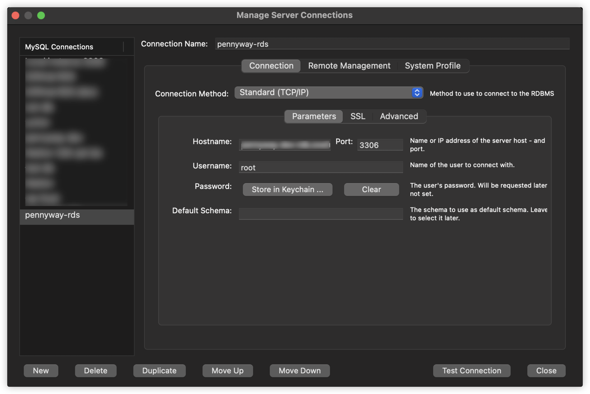
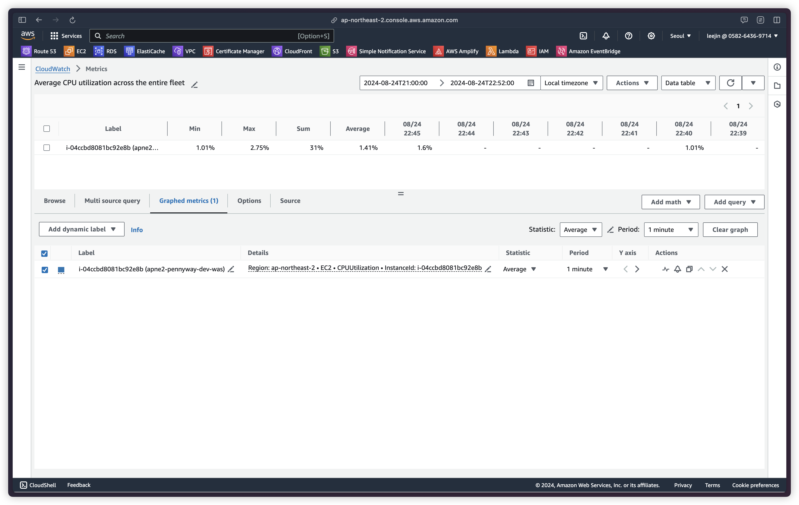

---

## Docker 컨테이너 MySQL 운영 중 AWS RDS로 전환을 결정한 이유

### 1. 데이터베이스의 안정성 문제

&nbsp; Docker 컨테이너의 특성상 호스트 시스템(AWS EC2)의 문제나 컨테이너 재시작 시 데이터 손실 가능성이 있었고, 이는 서비스 운영 측면에서 적절하지 않다는 생각을 하게 되었다.

### 2. 데이터베이스 관리의 복잡성이 증가

&nbsp; 백업, 복구, 스케일링 등의 작업을 수동으로 관리해야 했고, 이는 개발 팀의 시간과 리소스 소모에 대한 우려를 가지게 되었다.

### 3. 추후 서비스의 성장에 따른 확장성 고려

&nbsp; Docker 컨테이너 기반의 데이터베이스는 수평적 확장에 제한(데이터 정합성 측면)이 있어, 향후 급격한 트래픽 증가에 대응하기 어려울 것으로 판단하였다<br><br>

&nbsp; 이러한 문제들을 해결하고 서비스의 안정적인 성장을 지원하기 위해, 우리는 AWS RDS(Relational Database Service)로의 전환을 결정했다. RDS는 관리형 데이터베이스 서비스로, 높은 가용성, 자동화된 백업 및 복구, 쉬운 스케일링 등을 제공하는 서비스이다.<br>

&nbsp; 이 글에서는 Docker 기반 MySQL에서 AWS RDS로의 전환 과정, 구축 방법, 그리고 이 전환이 우리 서비스에 미친 영향에 대해 상세히 다루고자 한다. 이를 통해 비슷한 상황에 처한 다른 개발팀들에게 유용한 인사이트를 제공하고 싶다.

## RDS 구축 과정

&nbsp; AWS RDS(Relational Database Service)를 구축하는 과정은 크게 세 가지 주요 단계로 나눌 수 있다. 필자는 테라폼을 이용한 RDS 모듈 정의, 서브넷 그룹 설정, 그리고 보안 그룹 설정으로 구분하고자 한다.

### RDS 인스턴스 선언

```go
resource "aws_db_instance" "rds_instance" {
  identifier        = "${var.terraform_name}-${var.env}-rds"
  engine            = "mysql"
  engine_version    = "8.0"
  instance_class    = "db.t3.micro"
  allocated_storage = 20

  db_name  = "pennyway"
  username = var.db_username
  password = var.db_password

  multi_az               = false
  db_subnet_group_name   = aws_db_subnet_group.rds_subnet_group.name
  vpc_security_group_ids = [aws_security_group.rds_sg.id]

  backup_retention_period = 7
  skip_final_snapshot     = true

  tags = {
    Name = "${var.terraform_name}-${var.env}-rds"
  }
}
```

- 데이터베이스 엔진: MySQL
- 인스턴스 클래스: db.t3.micro (freetier)
- 스토리지: 20GB
- 다중 AZ 배포: 비활성화
- 백업 보존 기간: 7일

### 서브넷 그룹 설정

```go
resource "aws_db_subnet_group" "rds_subnet_group" {
  name       = "${var.terraform_name}-${var.env}-rds-subnet-group"
  subnet_ids = var.subnet_ids

  tags = {
    Name = "${var.terraform_name}-${var.env}-rds-subnet-group"
  }
}
```

&nbsp; RDS 인스턴스를 생성할 때 최소 두 개 이상의 서브넷을 설정해야 한다. 이는 RDS의 고가용성과 장애 복구 기능을 지원하기 위함으로, 필자는 aws_db_subnet_group 리소스를 사용하여 RDS 서브넷 그룹을 정의했다.

### 보안 그룹 설정

```go
resource "aws_security_group" "rds_sg" {
  name        = "${var.terraform_name}-${var.env}-rds-sg"
  description = "Security group for RDS"
  vpc_id      = var.vpc_id

  ingress {
    from_port   = 3306
    to_port     = 3306
    protocol    = "tcp"
    cidr_blocks = ["0.0.0.0/0"]
  }

  egress {
    from_port   = 0
    to_port     = 0
    protocol    = "-1"
    cidr_blocks = ["0.0.0.0/0"]
  }

  tags = {
    Name = "${var.terraform_name}-${var.env}-rds-sg"
  }
}
```

&nbsp; RDS 인스턴스의 보안을 위해 적절한 보안 그룹 설정(포트 등)이 필수적입니다. PR에서는 RDS 인스턴스에 대한 접근을 제어하기 위한 보안 그룹을 정의했다.

## Docker MySQL에서 RDS로의 데이터 마이그레이션

&nbsp; 기존 Docker 컨테이너에서 운영하던 MySQL 데이터베이스의 내용을 새로 구축한 AWS RDS로 마이그레이션하는 과정은 다음과 같이 진행되었다.

### 1. 기존 데이터베이스 스키마 및 데이터 백업

&nbsp; 먼저, 기존 Docker MySQL 컨테이너에서 데이터베이스의 스키마와 데이터를 백업했다. 이를 위해 MySQL의 덤프 기능을 사용했다.

```bash
docker exec -it [컨테이너_이름] mysqldump -u [사용자명] -p [데이터베이스명] > backup.sql
```

### 2. 백업 파일 검토 및 수정

&nbsp; 백업된 SQL 파일을 검토하여 RDS 환경에 맞지 않는 설정이 있는지 확인했다. 예를 들어, 문자 인코딩이나 엔진 설정 등이 RDS와 맞지 않는 경우 이를 수정했다.

### 3. RDS 인스턴스에 데이터 복원

&nbsp; 검토 및 수정이 완료된 백업 파일을 사용하여 RDS 인스턴스에 데이터를 복원했다. 이 과정은 MySQL 클라이언트를 사용하여 진행했다.

```bash
mysql -h [RDS_엔드포인트] -u [사용자명] -p [데이터베이스명] < backup.sql
```

### 4. 데이터 정합성 검증

&nbsp; 마이그레이션이 완료된 후, 기존 Docker MySQL과 새로운 RDS 인스턴스의 데이터를 비교하여 모든 데이터가 정확히 이전되었는지 확인했다. 이 과정에서 테이블의 레코드 수, 주요 데이터의 샘플링 검사 등을 수행했다.

### 5. 애플리케이션 연결 설정 변경

&nbsp; 데이터 마이그레이션이 성공적으로 완료된 후, 애플리케이션의 데이터베이스 연결 설정을 Docker MySQL에서 RDS로 변경했다. 이는 주로 환경 변수나 설정 파일의 수정을 통해 이루어졌다.

## RDS와 애플리케이션 연결

&nbsp; RDS 구축 후, 애플리케이션과 RDS를 연결하기 위해 다음과 같은 설정 변경을 수행했다:

### 1. 환경 변수 설정 (.env 파일 수정)

&nbsp; 애플리케이션의 .env 파일을 수정하여 RDS 연결 정보를 업데이트했다. 주요 변경 사항은 다음과 같다:

```plaintext
DB_HOST=<RDS_엔드포인트>
DB_PORT=3306
DB_NAME=pennyway
DB_USERNAME=<RDS_사용자이름>
DB_PASSWORD=<RDS_비밀번호>
```

### 2. docker-compose.yml 파일 수정

&nbsp; 애플리케이션의 docker-compose.yml 파일에서 기존 MySQL 서비스 부분을 제거하고, 애플리케이션 서비스의 환경 변수 설정을 업데이트했다:

```yml
version: "3"
services:
  app:
    build: .
    ports:
      - "8080:8080"
    environment:
      - SPRING_DATASOURCE_URL=jdbc:mysql://${DB_HOST}:${DB_PORT}/${DB_NAME}
      - SPRING_DATASOURCE_USERNAME=${DB_USERNAME}
      - SPRING_DATASOURCE_PASSWORD=${DB_PASSWORD}
    volumes:
      - .:/app
    networks:
      - app-network

networks:
  app-network:
    driver: bridge
```

## RDS 접속 테스트

1. VPN on (필자는 VPN 구축을 통해 단일 접근 지점을 구현하였다. [관련 포스트](https://jinlee.kr/devops/2024-03-17-vpn/))
2. MYSQL Host를 RDS로 설정

   1. host : RDS Host 주소
   2. username : 설정한 username
   3. password : 설정한 password



## RDS 사용 시 주의사항

### Snapshot

&nbsp; RDS의 스냅샷 기능은 데이터베이스의 백업을 제공하는 유용한 도구이지만, 사용 시 다음과 같은 비용 관련 주의사항을 고려해야 한다:

1. **추가 비용 발생**:

   - RDS 스냅샷은 추가 비용이 발생한다. 이 비용은 스냅샷의 저장 용량에 따라 청구된다.
   - 스냅샷 데이터는 Amazon S3에 저장되며, 사용된 스토리지에 대해 GB당 요금이 부과된다.

2. **증분 백업**:

   - 최초 스냅샷 이후의 스냅샷은 증분 방식으로 저장된다. 즉, 변경된 데이터만 추가로 저장된다.
   - 그러나 장기간 보관 시 누적된 데이터로 인해 비용이 증가할 수 있다.

3. **보관 기간 설정**:

   - 비용 관리를 위해 스냅샷의 보관 기간을 적절히 설정하는 것이 중요하다.
   - 불필요하게 오래된 스냅샷은 삭제하여 비용을 절감할 수 있다.

4. **리전 간 복사 시 추가 비용**:

   - 스냅샷을 다른 AWS 리전으로 복사할 경우, 데이터 전송에 대한 추가 비용이 발생한다.

5. **자동 스냅샷 vs 수동 스냅샷**:
   - 자동 스냅샷은 RDS 인스턴스가 삭제될 때 함께 삭제되지만, 수동 스냅샷은 명시적으로 삭제하지 않는 한 계속 유지되어 비용이 발생한다.

&nbsp; 따라서 RDS 스냅샷 사용 시 비용 최적화를 위해 필요한 백업 주기와 보관 기간을 신중히 고려해야 하며, 정기적으로 불필요한 스냅샷을 정리하는 것이 좋다. 또한, AWS Cost Explorer나 Billing 대시보드를 통해 스냅샷 관련 비용을 주기적으로 모니터링하는 것이 권장된다.

## 전환 후 개선점 및 효과

### CPU Utilization

| 전                                                | 후                                                |
| ------------------------------------------------- | ------------------------------------------------- |
|  |  |

&nbsp; RDS 도입 전 2시간 CPU Utilization의 평균 2.2%이고, 도입 후 2시간 CPU Utilization은 1.41%이다. 약 0.8% 감소했는데, 이렇게 보는 것만으로는 RDS 도입의 정당성을 완전히 충족시키기 어려울 수 있다. 하지만 이는 CPU Utilization이 약 35.91% 감소했음을 나타내므로, 시스템 효율성 향상의 긍정적인 지표로 볼 수 있다.
