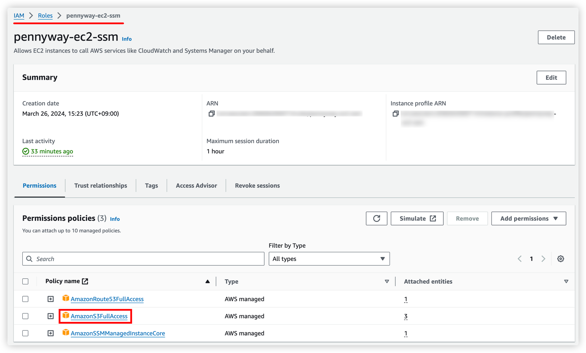
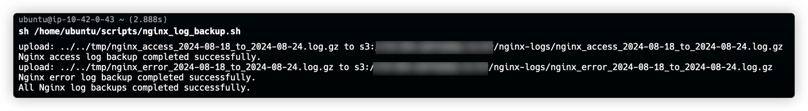
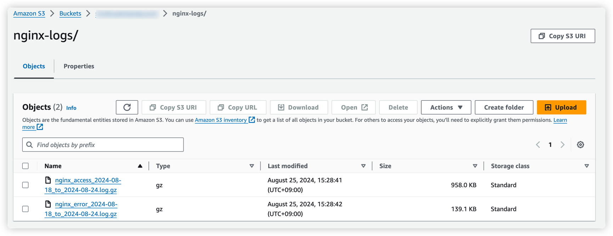

---

## 단일 진입점 설정 과정

- [Bastion Host - VPN 및 단일 진입점 설정](https://jinlee.kr/devops/2024-03-17-vpn/)
- [Bastion Host - Proxy 구축기](https://jinlee.kr/devops/2024-03-31-nginx-proxy/)

## Nginx log를 AWS S3에 저장하고자 하는 이유

&nbsp; 로그를 주기적으로 AWS S3에 저장하고자 하는 이유는 다음과 같다.<br>

&nbsp; 첫째, 장기적인 데이터 보존이 가능해진다. S3의 높은 내구성 덕분에 로그 데이터의 손실 위험을 최소화할 수 있다.<br>

&nbsp; 둘째, 로그 분석과 감사가 용이해진다. S3에 저장된 로그는 필요할 때 언제든 검색하고 분석할 수 있어, 보안 이슈 탐지나 시스템 성능 개선에 활용할 수 있다.<br>

&nbsp; 셋째, Bastion 호스트의 저장 공간을 효율적으로 관리할 수 있다. 주기적으로 로그를 S3로 이전함으로써 호스트의 디스크 공간 부족 문제를 예방할 수 있다.<br>

&nbsp; 마지막으로, 규정 준수 요구사항을 충족시킬 수 있다. 많은 보안 규정들이 로그의 장기 보존을 요구하는데, S3를 활용하면 이러한 요구사항을 쉽게 충족시킬 수 있다. 이러한 이유들로 인해 필자는 Bastion 호스트의 Nginx 로그를 주기적으로 AWS S3에 백업하는 방안을 고려하고 있다.

## 설정 과정

### 1. AWS EC2 IAM Role 설정



&nbsp; 해당 설정을 통해 EC2 인스턴스가 S3 버킷에 로그 파일을 업로드하는 등의 작업을 수행할 수 있게 해주는 권한을 부여하도록 한다.

### 2. AWS CLI 설치 (미설치의 경우)

```bash
sudo apt-get update
sudo apt-get install awscli
```

&nbsp; AWS CLI는 명령줄에서 AWS 서비스를 제어하고 관리할 수 있게 해주는 도구이다. S3에 로그를 업로드하기 위해 필요로 한다.

### 3. 스크립트 파일 생성

```bash
sudo vim /home/ubuntu/scripts/nginx_log_backup.sh
```

&nbsp; 로그 백업 작업을 수행할 쉘 스크립트 파일을 생성한다. 필자는 비교적 친숙한 vim 에디터를 사용하여 파일을 만들고 편집한다.

### 4. S3 저장 스크립트 작성 (/home/ubuntu/scripts/nginx_log_backup.sh)

```bash
#!/bin/bash

# 날짜 설정
START_DATE=$(date -d "7 days ago" +%Y-%m-%d)
END_DATE=$(date -d "yesterday" +%Y-%m-%d)

# S3 버킷 이름
S3_BUCKET="your-bucket-name"

# 로그 파일 경로
ACCESS_LOG="/home/ubuntu/logs/access.log"
ERROR_LOG="/home/ubuntu/logs/error.log"

# 백업 함수 정의
backup_log() {
    local log_file=$1
    local log_type=$2

    # 파일명 설정
    local filename="nginx_${log_type}_${START_DATE}_to_${END_DATE}.log"
    local tmp_file="/tmp/$filename"

    # 로그 파일 복사
    cat $log_file > $tmp_file

    # 파일 압축
    gzip $tmp_file

    # S3에 업로드
    aws s3 cp "${tmp_file}.gz" "s3://${S3_BUCKET}/nginx-logs/"

    # 압축 파일 삭제
    rm "${tmp_file}.gz"

    # 원본 로그 파일 비우기
    echo "" > $log_file

    echo "Nginx $log_type log backup completed successfully."
}

# access.log 백업
backup_log $ACCESS_LOG "access"

# error.log 백업
backup_log $ERROR_LOG "error"

echo "All Nginx log backups completed successfully."
```

&nbsp; 이 스크립트는 Nginx의 `access.log`와 `error.log`를 백업하고 S3에 업로드하는 작업을 수행한다. 각 로그 파일에 대해 지난 7일간의 로그를 압축하고, S3에 업로드한 후 원본 로그 파일을 비운다.

### 5. 스크립트 실행 권한 허용

```bash
sudo chmod +x /home/ubuntu/scripts/nginx_log_backup.sh
```

&nbsp; 생성한 쉘 스크립트에 실행 권한을 부여한다. 이를 통해 시스템이 스크립트를 실행할 수 있게 된다.

### 6. crontab 편집

```bash
crontab -e
```

&nbsp; crontab은 리눅스 시스템에서 주기적인 작업을 예약할 수 있게 해주는 도구이다. 이 명령어로 현재 사용자의 crontab 파일을 편집 모드로 연다.

### 7. cronjob 추가

```bash
# 매주 일요일 자정에 Nginx 로그 백업
0 0 * * 0 /home/ubuntu/scripts/nginx_log_backup.sh >> /home/ubuntu/logs/nginx_backup.log 2>&1
```

&nbsp; 이 cronjob은 매주 일요일 자정(0시 0분)에 로그 백업 스크립트를 실행하도록 설정하였다. 스크립트의 실행 결과(표준 출력과 오류 출력)는 /home/ubuntu/logs/nginx_backup.log 파일에 기록된다.

## 결과 : S3 로그 저장 확인



&nbsp; 만약 실패한다면 `sudo chmod 777 access.log`와 `sudo chmod 777 error.log` 명령어를 통해 각 로그 파일 접근을 허용해주어야 한다.



&nbsp; 성공 후 S3를 확인해보면 정상적으로 log 압축 파일(.gz)이 저장된 것을 확인할 수 있다.
