---

* this unordered seed list will be replaced by the toc
{:toc}

---

## 1. 도입부: 문제 상황

&nbsp; kuromoji 기반의 일본어 발음명 검색 기능을 구현하면서, 일본어 검색 API를 활용하는 서비스에서 메모리 사용량이 점진적으로 증가하는 현상을 관찰했다. 문제는 프로덕션 환경에서 바로 재현하고 분석하기 어렵다는 점이었다. 그래서 **로컬에서 프로덕션 메모리 설정을 최대한 맞추고**, Heap Dump를 통해 누수 후보를 찾는 실험을 진행했다.

### 1.1 후리가나(발음명) 맥락과 kuromoji 도입

&nbsp; 일본어는 표기(칸지/가나)와 읽기(발음)가 달라 검색 품질이 떨어지기 쉽다. 내원객명과 상품명 모두 “발음명(후리가나)” 기반 검색이 필요했고, 이를 위해 서버에서 텍스트를 형태소 분석해 읽기를 추출하는 흐름을 만들었다. 이 과정에서 **kuromoji**를 도입했고, 발음 결과를 `searchPhoneticName` 같은 검색 전용 필드에 저장한다.

&nbsp; [kuromoji](https://github.com/atilika/kuromoji)는 사전 데이터를 메모리에 로딩(약 150~200MB)하는 특성이 있다. 개발계에서는 이 영향으로 메모리 여유가 줄었고, `procedure-menu-api-v2`에서 **OOM이 주기적으로 발생**했다. 이후 **개발계 replica 수와 메모리 사이즈를 운영계와 동일하게 증설**했고, **`dd-profiling` 옵션으로 1주일간 관측**했다. 관측 결과만 보면 **OOM은 없을 것으로 예측**되었지만, 그래도 **힙 덤프를 떠서 원인을 명확히 확인**하기로 했다.

### 1.1.1 PhoneticConverter를 먼저 본 이유

&nbsp; 일본어 발음명 검색 기능을 붙인 이후 개발계에서 OOM이 발생했다. 이 기능의 핵심인 PhoneticConverter는 **Tokenizer를 static 단일 인스턴스로 유지**하며, kuromoji 사전 로딩이 상주 메모리를 크게 차지한다. 따라서 Retained Size 최상단에 위치할 가능성이 높은 지점이었고, 누수 여부를 확인할 때 가장 먼저 검토해야 할 대상이었다.

### 1.2 Datadog Profiling 관찰 요약

&nbsp; 개발계 Datadog Profiling 결과를 보면 **전형적인 memory leak 패턴은 관찰되지 않았다**는 결론을 얻었다. 아래는 그 근거를 요약한 것이다.

- **Allocated Memory**: 요청 처리 중 초당 할당되는 메모리량이 전반적으로 평탄하며, 특정 시점 스파이크는 있으나 누적 증가 패턴은 없음
- **Heap Usage**: GC에 따른 톱니 형태가 반복되고, GC 이후 바닥선이 상승하지 않음
- **Non-Heap Usage**: 일정 범위 내에서 안정적으로 유지되며 시간에 따른 증가 추세 없음

### 1.3 Datadog 스크린샷


&nbsp; **설명:** 개발계 Allocated Memory 추이를 확인한다. **확인 경로:** Datadog에서 서비스 `procedure-menu-api-v2`(dev) 선택 → Profiling 화면 → `Allocated Memory` 패널 확인.

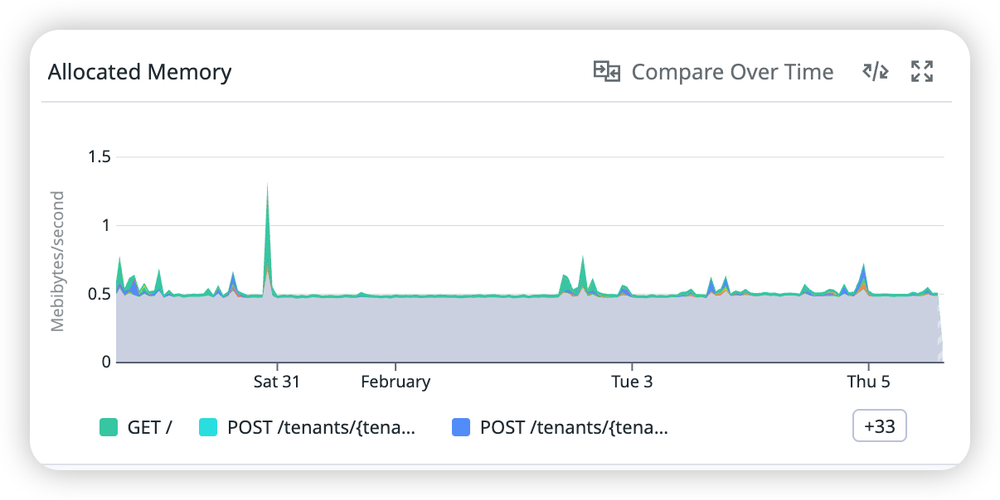

&nbsp; **설명:** 개발계에서 엔드포인트별 Allocated Memory 스파이크 패턴을 확인한다. **확인 경로:** Datadog Profiling 화면의 `Allocated Memory` 패널에서 엔드포인트별 범례/필터를 활성화하여 비교.


&nbsp; **설명:** 개발계 Heap Usage의 톱니 형태와 바닥선 안정성을 확인한다. **확인 경로:** Datadog Profiling 화면 → `Heap Usage` 패널 확인.

## 2. 배경: 왜 메모리 설정 동기화가 중요한가?

### 2.1 Kubernetes vs 로컬

&nbsp; 운영 환경에서는 메모리 제한이 1.5Gi로 설정되어 있고, JVM 힙 크기 또한 이에 맞게 제한된다. 반면 로컬에서는 기본 설정으로 실행되는 경우가 많아 메모리 압박 상황을 재현하기 어렵다. 따라서 로컬에서도 `-Xms`/`-Xmx` 값을 운영 환경과 유사하게 맞추는 것이 중요하다.

### 2.2 로컬 JVM 설정

&nbsp; IntelliJ Run Configuration에 아래 옵션을 설정했다.

```text
-Xms512m
-Xmx1536m
-XX:+HeapDumpOnOutOfMemoryError
-XX:HeapDumpPath=./heap-dumps/
-XX:+UseG1GC
-XX:MaxGCPauseMillis=200
```

## 3. 실험 설계: 재현 시나리오

### 3.1 시나리오 개요

1. Baseline (애플리케이션 시작 직후)
2. 일본어 검색 순차 200회
3. 혼합 문자 검색 순차 150회
4. 동시 요청 500회 (50개씩)
5. 극한 동시성 1500회 (100개씩)

### 3.2 부하 테스트 요약

- 검색 엔드포인트: `/search-product-options`, `/search-product-option-summaries`
- 일본어 검색어: `ボトックス`, `ヒアルロン酸` 등
- 부하 스크립트는 `curl` 반복 호출 방식으로 구성

## 4. Heap Dump 수집 및 초기 결과

### 4.1 Heap Dump 명령

```bash
jcmd <PID> GC.run
jcmd <PID> GC.heap_dump ./heap-dumps/filename.hprof
```

### 4.2 실행 결과 요약

| 시나리오 | 파일 크기 | 메모리 증가 | Old Gen | Full GC |
|---------|----------|------------|---------|---------|
| Baseline | 211MB | 0MB | - | 0 |
| 순차 200 | 230MB | +19MB | 80.43% | 2 |
| 순차 350 | 235MB | +24MB | 80.43% | 2 |
| 동시 500 | 231MB | +20MB | 80.29% | 0 |
| 동시 1500 | 237MB | +26MB | 81.89% | 3 |

### 4.3 관찰된 메모리 변화

- Full GC 후에도 Old Generation 사용률이 81% 수준에서 유지
- Baseline 대비 최대 26MB 증가
- 동시성이 높을수록 Full GC 빈도 증가

&nbsp; **해석:** 수치만 보면 “누수”처럼 보일 수 있으나, **VisualVM 기준으로 Retained 구조가 크게 변하지 않았고** kuromoji 사전 로딩이 상주하는 구조가 확인되었다. 따라서 이 단계에서는 **누수로 단정하기보다 힙 상한에 근접한 상태**로 보는 편이 안전하다.

## 5. VisualVM 분석 (스크린샷 포함)

&nbsp; 아래 스크린샷들은 VisualVM에서 확인한 결과를 정리한 것이다. 각 이미지 설명에 **어떤 경로로 확인했는지**를 함께 적어두었다.

### 5.1 Summary (Baseline)

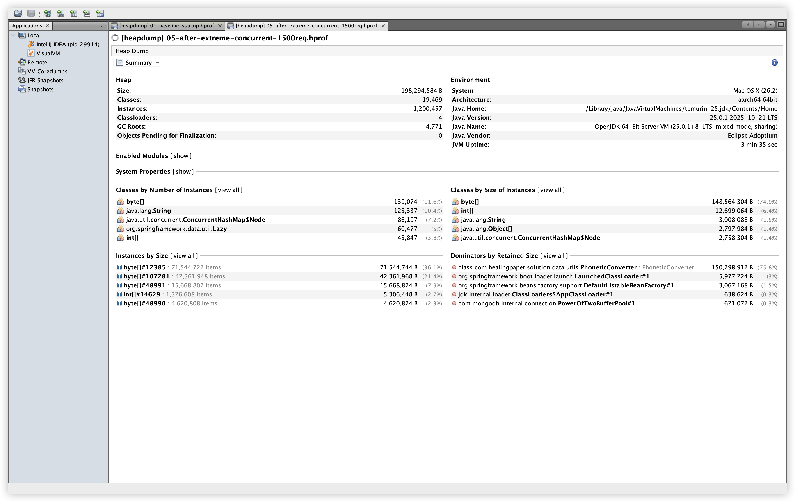

&nbsp; **설명:** Baseline의 Heap, Classes, Instances 값을 확인한다. **확인 경로:** VisualVM에서 `File → Load`로 `01-baseline-startup.hprof` 로드 후 `Summary` 탭에서 `Heap`/`Classes`/`Instances` 값을 확인.

### 5.2 Summary (Extreme Load)

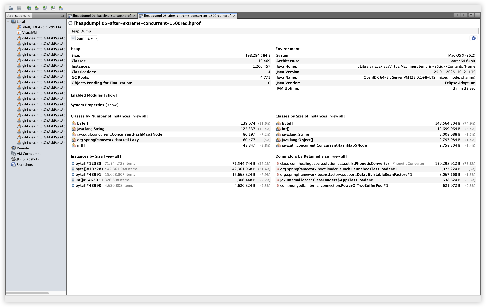

&nbsp; **설명:** Extreme load 이후의 전체 heap/클래스/인스턴스 변화를 확인한다. **확인 경로:** `File → Load` → `05-after-extreme-concurrent-1500req.hprof` → `Summary` 탭.

### 5.3 Summary 비교 (Baseline vs Extreme)

| 항목 | Baseline | Extreme |
|---|---|---|
| Heap Size | 183,169,144 B | 198,294,584 B |
| Classes | 16,063 | 19,469 |
| Instances | 823,845 | 1,200,457 |
| Classloaders | 4 | 7 |
| GC Roots | 4,358 | 4,771 |

&nbsp; **해석:** 요청 처리 후 힙 크기/클래스/인스턴스 수는 증가했지만, Dominator Tree 기준으로 **상위 Retained Size 구조는 거의 동일**했다. 증가 폭이 곧 누수로 직결되지는 않으므로, Dominator와 특정 클래스의 참조 체인을 함께 확인하는 흐름이 필요하다.

### 5.4 Classes: PhoneticConverter

| Baseline | Extreme |
|---|---|
| 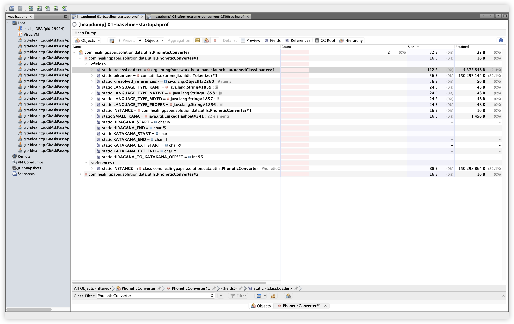 | 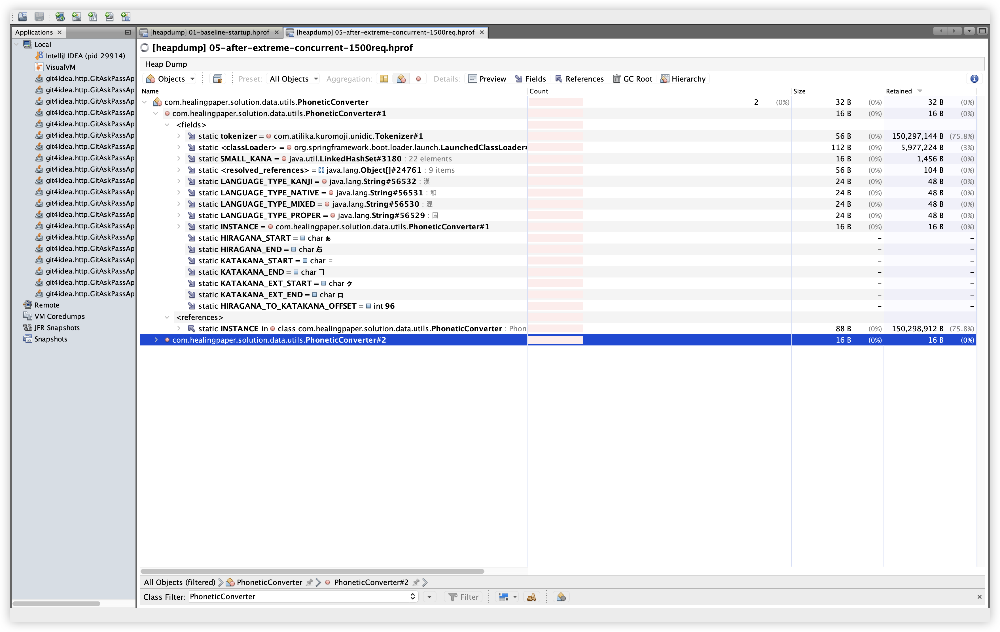 |

&nbsp; **설명:** `PhoneticConverter` 인스턴스 수와 Size를 확인한다. **확인 경로:** `Classes` 탭 → Filter에 `PhoneticConverter` 입력 → `Instances`, `Size` 컬럼 확인.  
&nbsp; **관찰:** Baseline/Extreme 모두 인스턴스 수는 2개로 동일하다. 인스턴스 증가 자체는 보이지 않지만, Dominator Tree에서 큰 Retained Size로 노출되는 이유는 **static 필드가 kuromoji 사전 구조를 참조**하고 있기 때문으로 보인다.

### 5.5 Classes: Kuromoji Tokenizer (UniDic)

| Baseline | Extreme |
|---|---|
| 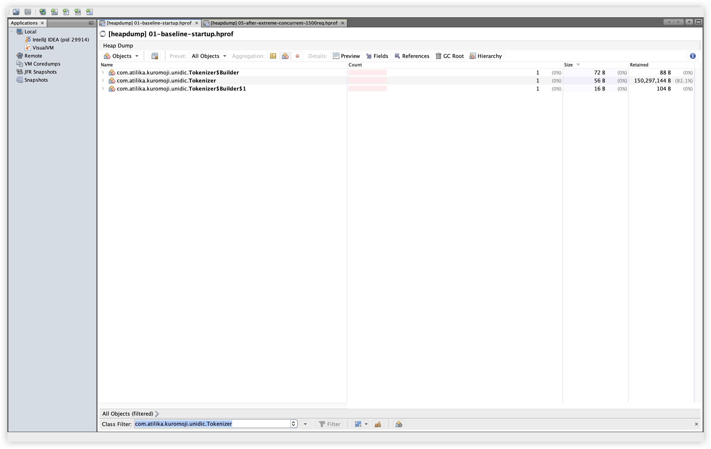 | 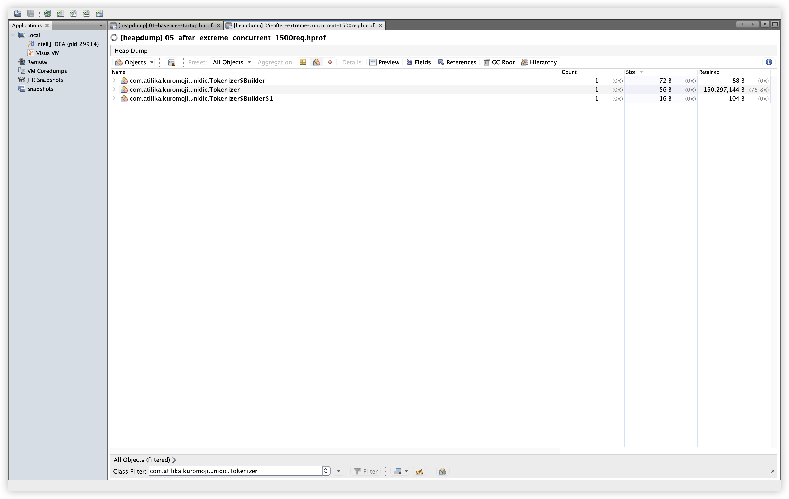 |

&nbsp; **설명:** `com.atilika.kuromoji.unidic.Tokenizer` 인스턴스와 Retained Size를 확인한다. **확인 경로:** `Classes` 탭 → Filter에 `com.atilika.kuromoji.unidic.Tokenizer` 입력.  
&nbsp; **관찰:** Baseline/Extreme 모두 인스턴스 수는 1개로 동일하고, Retained Size는 약 **150MB**로 유지된다. 이는 **사전 데이터가 1회 로딩되어 유지되는 정상 동작**으로 보인다.

### 5.6 Classes: Kuromoji TokenizerBase 계열

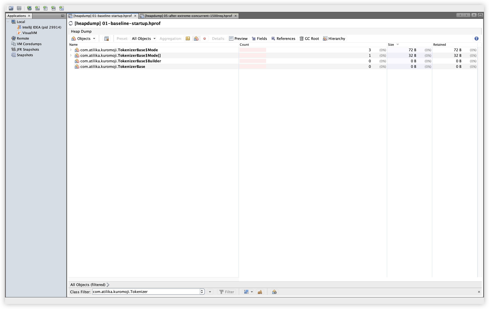

&nbsp; **설명:** TokenizerBase 계열 클래스들의 인스턴스 수를 확인한다. **확인 경로:** `Classes` 탭 → Filter에 `com.atilika.kuromoji.Tokenizer` 입력.  
&nbsp; **관찰:** Mode/Builder 등 보조 클래스의 인스턴스는 소량이며, 누수 징후는 보이지 않는다.

### 5.7 Dominator Tree (Top 10)

| Baseline | Extreme |
|---|---|
| 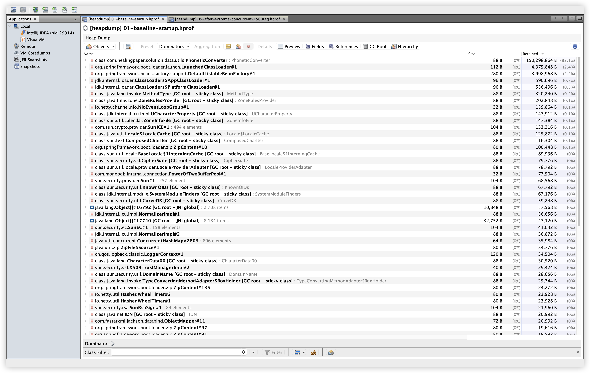 | 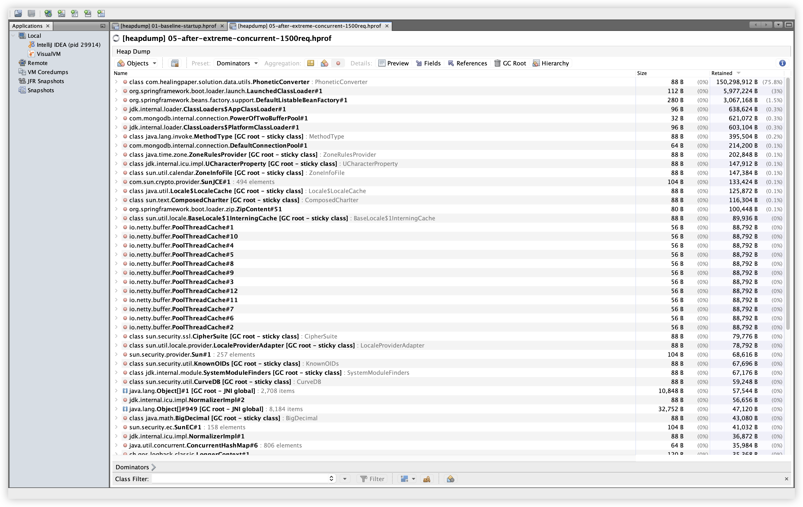 |

&nbsp; **설명:** Retained Size 기준 상위 10개 객체를 확인한다. **확인 경로:** `Summary` 탭에서 `Compute Retained Sizes` 클릭 → `Dominators` 탭 → Retained Size로 정렬.  
&nbsp; **관찰:** Baseline/Extreme 모두 `PhoneticConverter`가 약 **150MB** 수준으로 최상위에 위치한다. 이는 kuromoji 사전 로딩 구조가 그대로 유지되고 있음을 의미하며, **부하 이후에도 Retained Size가 크게 증가하지 않는 패턴**을 보여준다.

### 5.8 OQL: PhoneticConverter

| Baseline | Extreme |
|---|---|
| 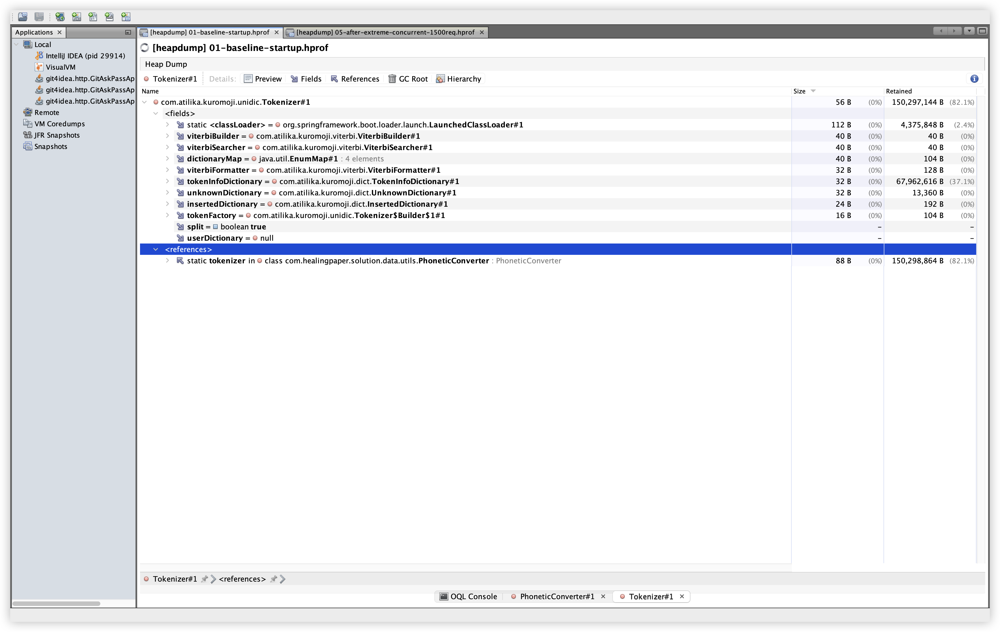 | 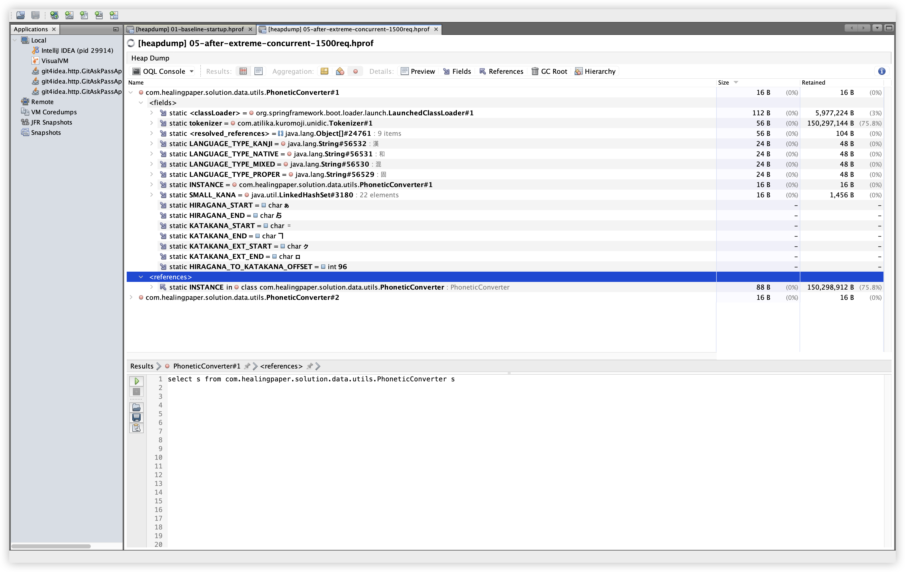 |

&nbsp; **설명:** `PhoneticConverter` 인스턴스를 OQL로 조회하고, fields/references를 확인한다. **확인 경로:** `OQL Console` 탭에서 아래 쿼리 실행.  
&nbsp; **관찰:** Baseline/Extreme 모두 `PhoneticConverter` 인스턴스는 2개이며, `static INSTANCE`와 `static tokenizer`가 보인다. 이는 **Tokenizer가 static 참조로 유지되는 구조**임을 보여준다.

```javascript
select s from com.healingpaper.solution.data.utils.PhoneticConverter s
```

### 5.9 OQL: Kuromoji Tokenizer

| Baseline | Extreme |
|---|---|
| 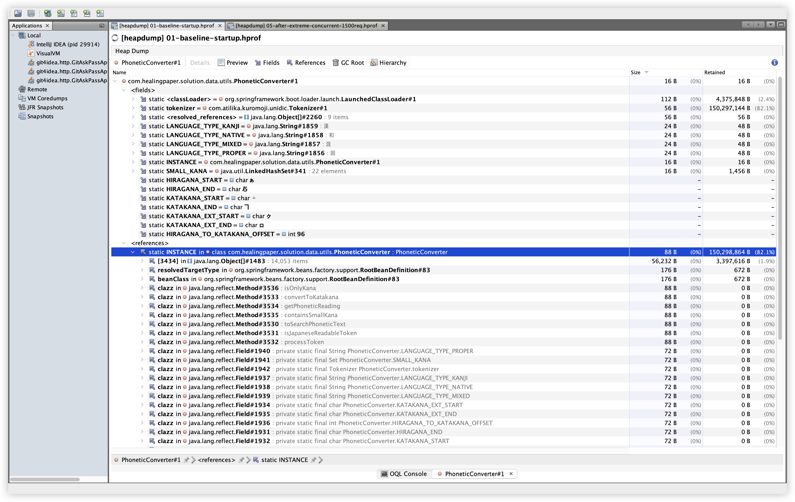 | 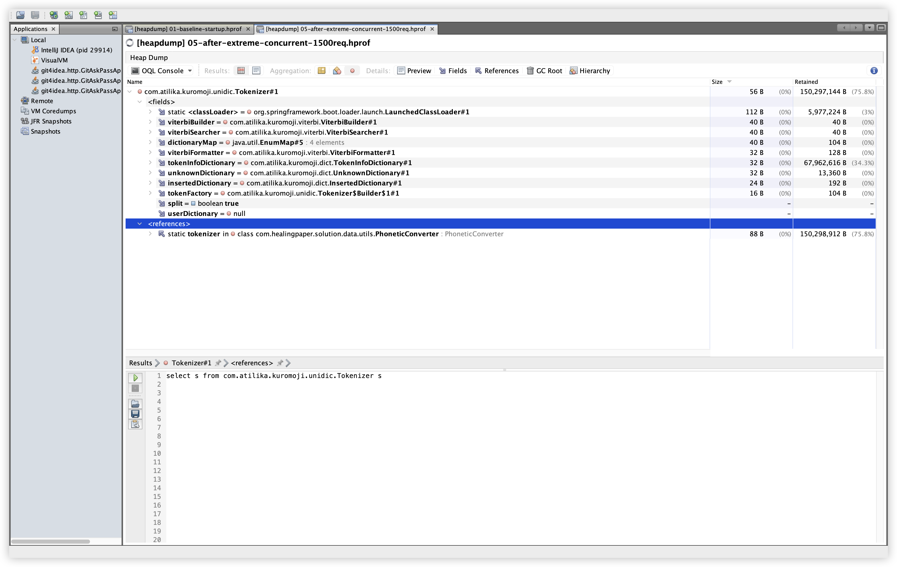 |

&nbsp; **설명:** `com.atilika.kuromoji.unidic.Tokenizer` 인스턴스를 OQL로 조회한다. **확인 경로:** `OQL Console` 탭에서 아래 쿼리 실행.  
&nbsp; **관찰:** Baseline/Extreme 모두 Tokenizer 인스턴스는 1개이며, **PhoneticConverter의 static tokenizer 참조**로 유지된다. 사전 로딩 구조가 안정적으로 유지되고 있음을 보여준다.

```javascript
select s from com.atilika.kuromoji.unidic.Tokenizer s
```

### 5.10 OQL: 긴 문자열 샘플

| Baseline | Extreme |
|---|---|
| 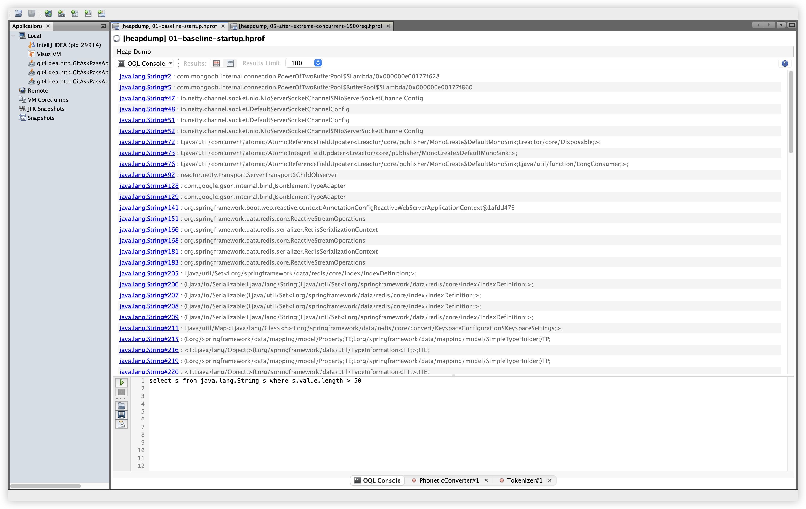 | 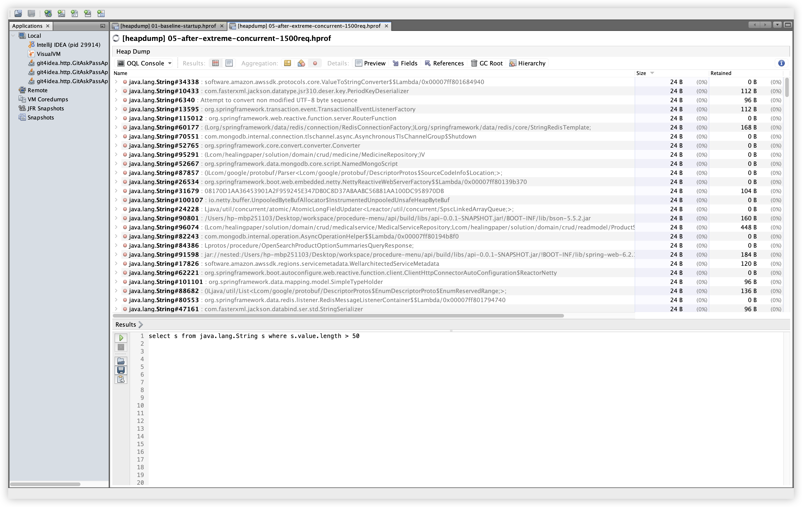 |

&nbsp; **설명:** 길이가 긴 문자열을 샘플링해 분포를 확인한다. **확인 경로:** `OQL Console` 탭에서 아래 쿼리 실행.  
&nbsp; **관찰:** 프레임워크/라이브러리 문자열이 주로 보이며, 이 쿼리만으로 누적 여부를 단정하기는 어렵다. 문자열 누적 여부는 인스턴스 수/Retained Size 비교와 함께 확인하는 것이 안전하다.

```javascript
select s from java.lang.String s where s.value.length > 50
```

### 5.11 GC Root 확인 결과

| Baseline | Extreme |
|---|---|
| 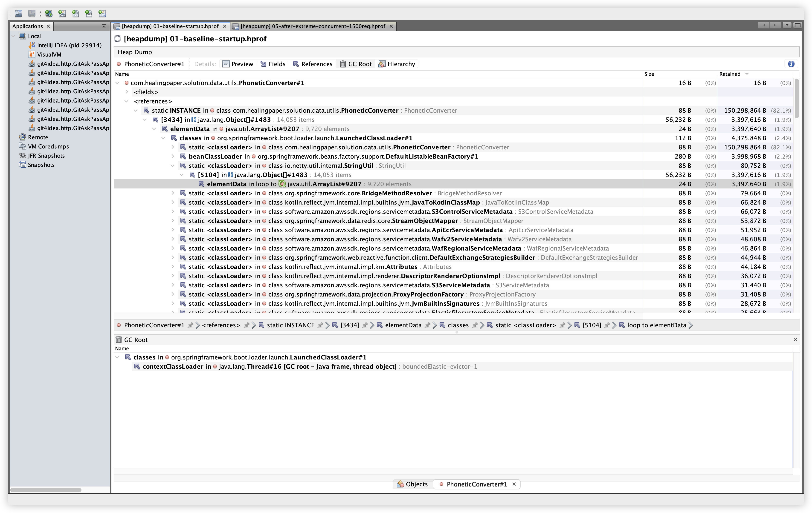 | 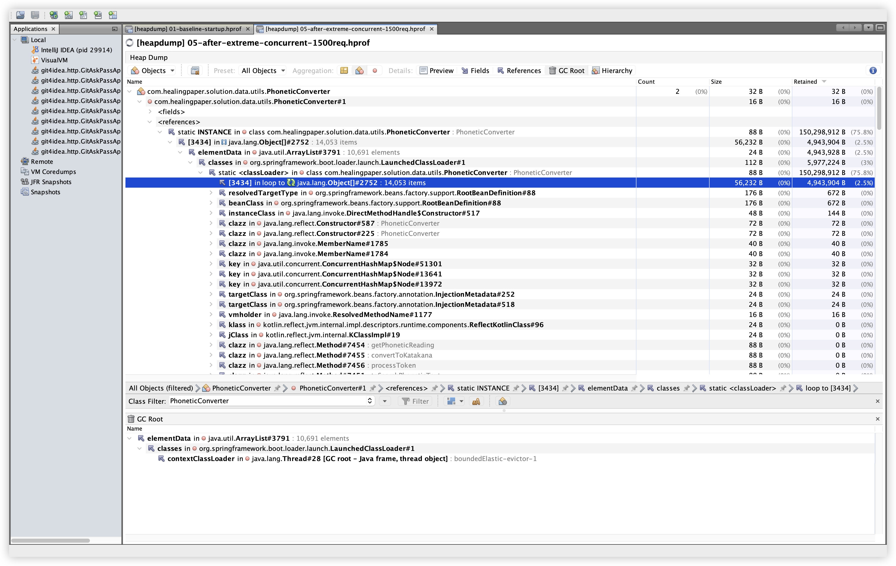 |

&nbsp; **설명:** `PhoneticConverter` 인스턴스의 GC Root 경로를 확인한다. **확인 경로:** `Classes` 탭 → `PhoneticConverter` 인스턴스 더블클릭 → `GC Root` 탭.  
&nbsp; **관찰:** Baseline/Extreme 모두 `static INSTANCE → classloader → thread frame` 경로로 GC Root에 연결되어 있었다. 스레드 번호만 달라질 뿐 구조는 동일하다. 이는 **정적 필드가 객체를 붙잡고 있는 구조**이며, kuromoji 사전 로딩이 상주하는 설계와 일치한다. 즉, GC Root 관점에서도 “비정상 누수” 정황은 낮다.

### 5.12 추가 비교: `byte[]`

| Baseline | Extreme |
|---|---|
|  | 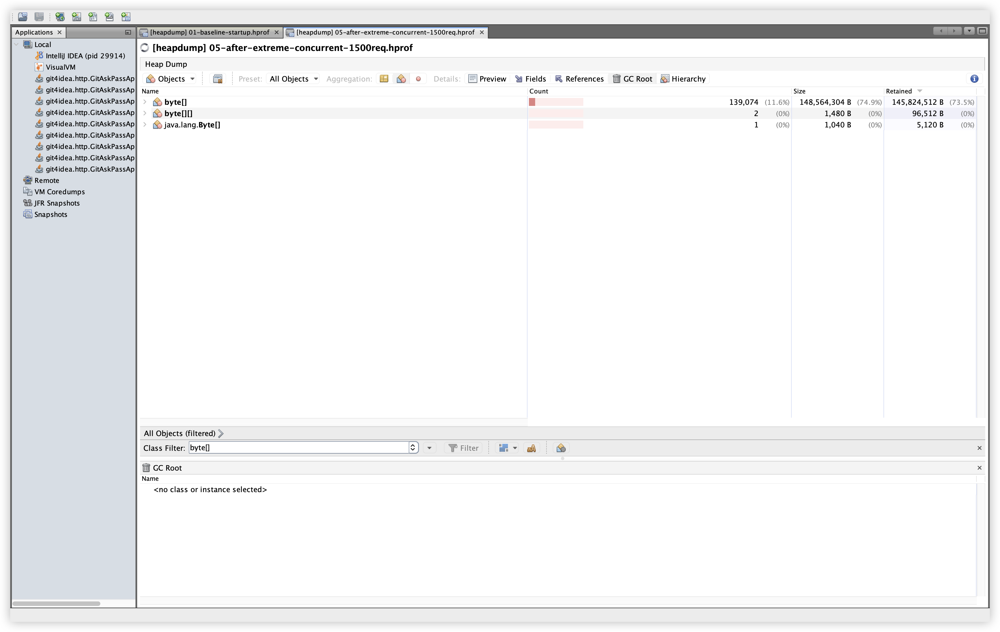 |

&nbsp; **관찰:** `byte[]`는 Baseline에서 `113,882개 / 146.6MB / 144.4MB Retained`, Extreme에서 `139,074개 / 148.6MB / 145.8MB Retained`로 증가했지만, **Retained 증가폭은 약 1.4MB 수준**이다. 큰 덩어리의 `byte[]`가 지속적으로 증가하는 패턴은 보이지 않는다.

### 5.13 추가 비교: `ConcurrentHashMap$Node`

| Baseline | Extreme |
|---|---|
| 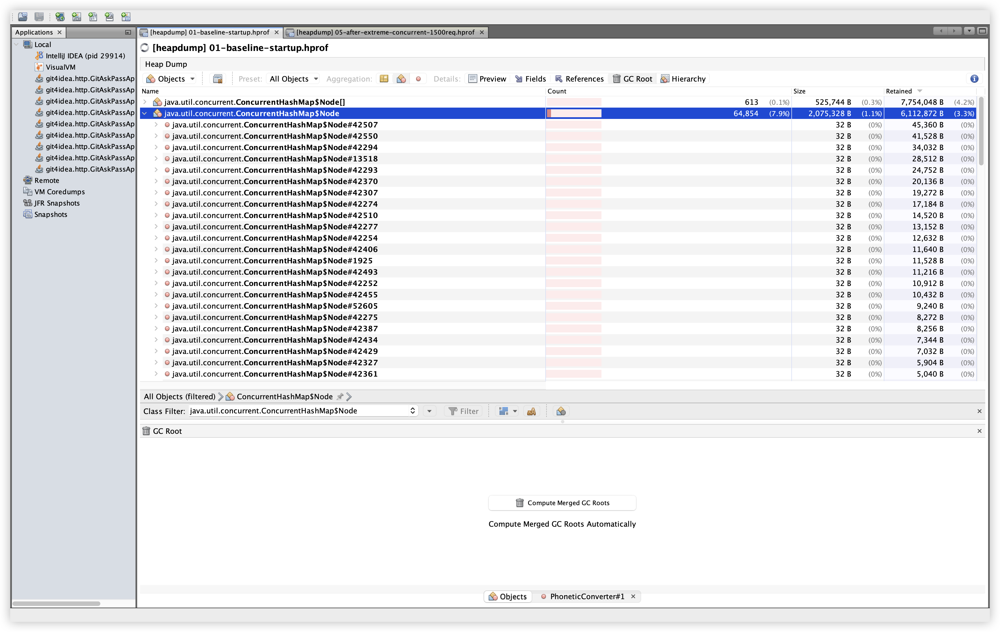 | 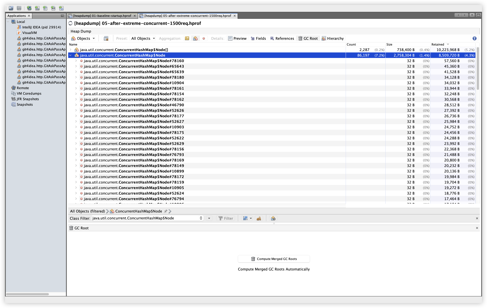 |

&nbsp; **관찰:** Baseline `64,854개 / 2.08MB / 6.11MB Retained` → Extreme `86,197개 / 2.76MB / 8.51MB Retained`. **약 +2.4MB 증가**로 확인되며, 부하에 따라 맵 엔트리가 늘어나는 정상적인 패턴으로 해석 가능하다.

### 5.14 추가 비교: `java.lang.String`

| Baseline | Extreme |
|---|---|
| 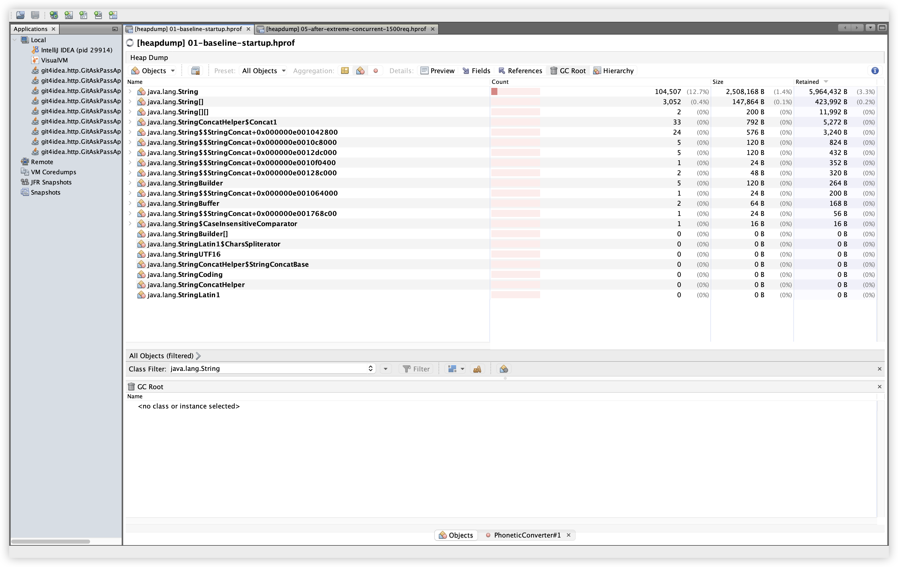 | 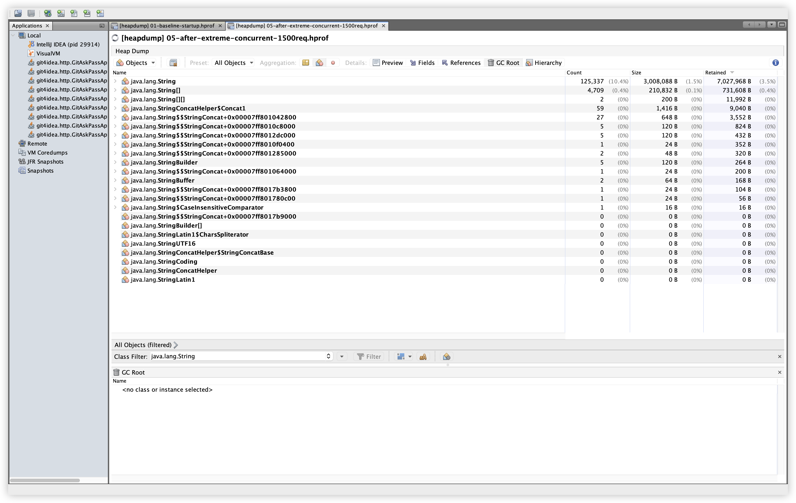 |

&nbsp; **관찰:** Baseline `104,507개 / 2.5MB / 5.96MB Retained` → Extreme `125,337개 / 3.0MB / 7.03MB Retained`. **약 +1.06MB 증가**이며, 단기 문자열 증가로 설명 가능한 수준이다.

### 5.15 추가 비교: `reactor.core.publisher.*`

| Baseline | Extreme |
|---|---|
| 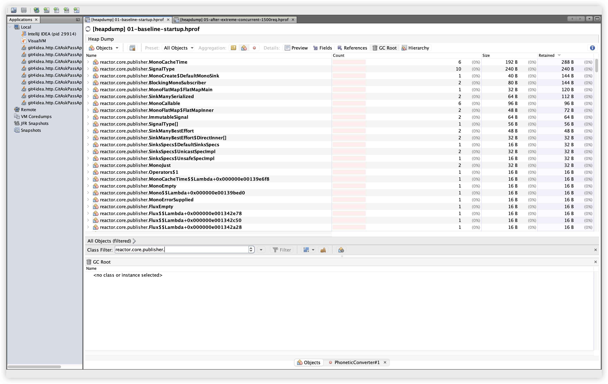 | 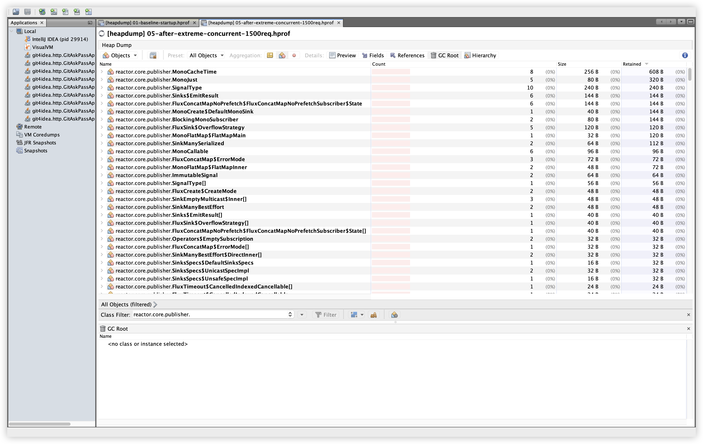 |

&nbsp; **관찰:** 개별 클래스의 인스턴스 수가 대부분 **한 자릿수~두 자릿수**이며, Retained도 매우 작다. **스트림 미종료로 보이는 대규모 누적 패턴은 확인되지 않는다.**

### 5.16 추가 비교: `com.mongodb.*`

| Baseline | Extreme |
|---|---|
| 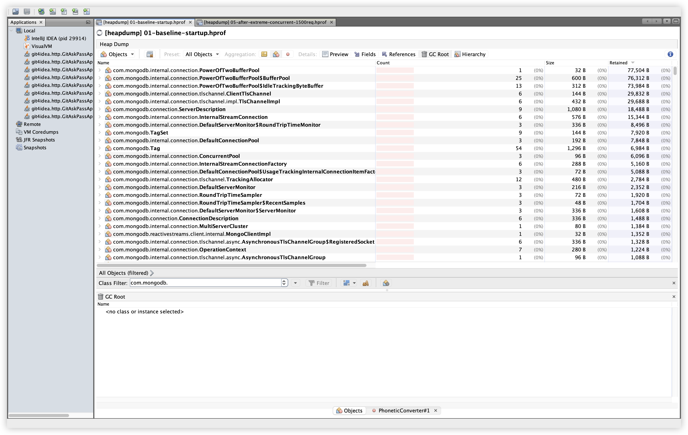 | 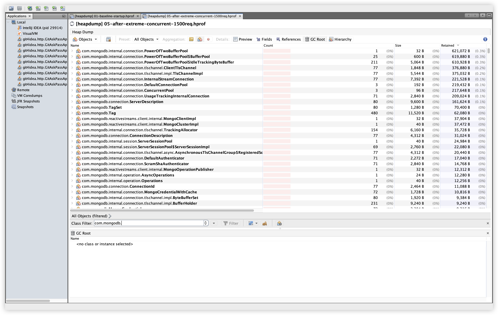 |

&nbsp; **관찰:** 연결/버퍼/모니터 계열 클래스가 보이지만, Retained가 **KB~수백 KB 수준**으로 유지된다. 부하 후 개수는 늘었지만 **메모리 상주로 이어지는 대형 객체는 보이지 않는다.**

## 6. 결론

- 이번 분석 범위(VisualVM/Dominators/OQL/GC Root/비교 클래스 기준)에서는 **Memory Leak이 아니다**는 결론에 도달했다.
- `PhoneticConverter`/`Tokenizer`는 **static 참조로 1회 로딩되어 유지되는 구조**
- 메모리 증가의 주요 원인은 **kuromoji 사전 로딩 + 부하 시 생성 객체 증가**로 해석 가능
- `byte[]`, `String`, `ConcurrentHashMap$Node`, `reactor.core.publisher.*`, `com.mongodb.*` 비교에서도 **Retained 증가 폭이 크지 않음**
- 로컬 환경에서 프로덕션 메모리 설정을 맞춘 것이 재현의 핵심이었다.
- Heap Dump와 VisualVM 조합은 **누수 여부를 빠르게 판별**하는 데 충분히 실용적이었다.
