---

## 1. 지원과 준비

### 1.1. 지원 동기

&nbsp; 네이버는 필자에게 여러 이유로 합류해보고 싶은 기업이었다. 가장 큰 이유는 네이버라는 기업이 가진 이미지와 가치였다. 

&nbsp; 예전에 친구와 나눈 워너비 기업에 대한 대화는 흥미로운 통찰을 주었다. 필자가 생각하는 우수한 IT 기업들이 친구에게는 그렇지 않았고, 반대로 친구가 선호하는 기업들 역시 필자의 지향점과는 달랐다. 

&nbsp; 필자는 자신을 설명하는 가장 효과적인 방법 중 하나가 본인이 속해있는 조직을 이야기하는 것이라 생각한다. 대한민국에서 네이버를 모르는 사람은 없을 것이며, 필자 역시 첫 계정을 네이버에서 만들었고, 검색, 뉴스, 웹툰, 쇼핑, 뮤직 등 다양한 서비스를 지속적으로 이용해왔다. 

&nbsp; 또한 2022년 '네이버 부스트캠프' 활동을 통해 네이버 개발자들과 교류했던 경험은 회사에 대한 긍정적인 인상을 심어주었다. 당시 마스터와 멘토진 중 일부가 현직 네이버 혹은 네이버 출신 개발자들이었다. 

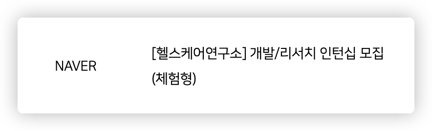

&nbsp; 2024년 초, 취업 준비를 위해 [Naver Careers](https://recruit.navercorp.com/)를 매일 같이 방문하던 중, 방학 기간 동안 진행되는 인턴십 모집 공고를 발견했다. 대구/경북에서 재학 중인 필자에게는 더 이상의 휴학 없이 대기업 인턴십을 경험할 수 있는 좋은 기회였다. 

&nbsp; 부스트캠프나 SW마에스트로 등의 활동에서 만난 인턴 경험자들을 보며 느꼈던 부러움을 떠올렸다. 학교 프로젝트도 의미 있지만, 기업의 프로젝트는 명확한 기획 의도와 실제 사용자가 있다는 점에서 차별화된다고 생각했다. 

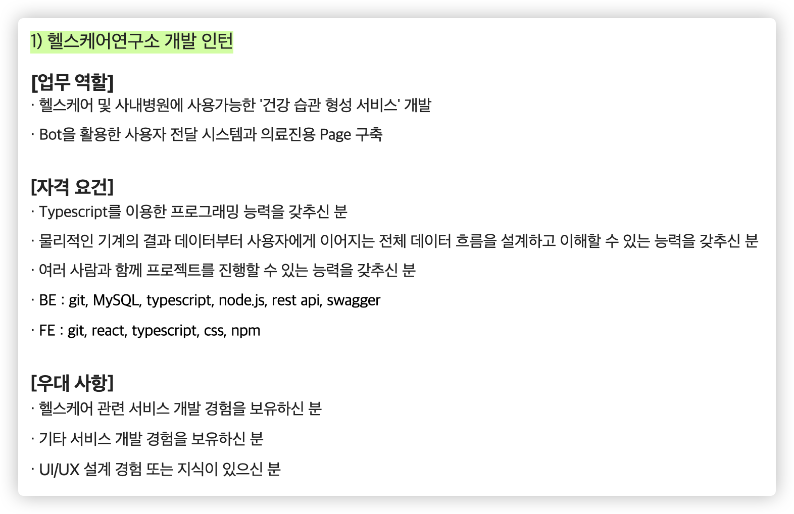

&nbsp; 채용 공고에서 요구하는 TypeScript를 활용한 웹 프론트엔드/백엔드 경험과 Git 활용 능력은 부스트캠프와 멋쟁이사자처럼 대표 활동을 통해 충분히 쌓아왔던 분야였다. 다른 기술 스택들도 익숙했기에, 필자와 핏하다고 판단하여 지원을 결심했다. 

### 1.2. 준비 과정

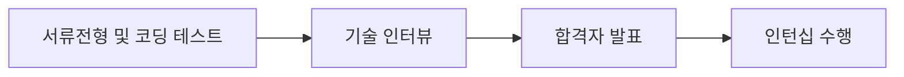

#### 1.2.1. 서류 전형

&nbsp; 필자는 항상 경험을 통한 배움과 회고를 중요시했다. 서류에서도 이전 활동들을 통해 배우고 느낀 점들을 강조했으며, 특히 '성장'에 대한 갈망을 진솔하게 표현했다. 부족한 점을 인정하면서도 이를 성장을 통해 개선하고자 하는 의지를 분명히 했다. 

#### 1.2.2. 코딩 테스트

&nbsp; 코딩 테스트는 독특하게 'codility'라는 플랫폼을 사용한다. 올해 초에 네이버 공채에 지원했을 때는 '프로그래머스'를 사용했던 것으로 기억하는데 'codility'의 경우에는 비교적 생소한 플랫폼이었기 때문에 플랫폼에 대한 정보 파악이나 사전 테스트를 정말 꼼꼼하게 했다. 

&nbsp; 또한 재미있었던 부분이, 인턴십 수행 기간 동안 주로 사용하는 언어가 'TypeScript'이다 보니 코딩 테스트 언어도 'TypeScript'로 제한되어 있었다. 필자는 일반적으로 Python이나 Java로 코딩 테스트를 응시했었고, TypeScript 역시 웜업이 필요했기 때문에 이에 대한 사전 준비가 필요했다. 

#### 1.2.3. 기술 인터뷰

&nbsp; 개발자로서의 성장 과정과 프로젝트에서의 의사결정들을 잘 정리해두는 것이 중요했다. 모든 프로젝트를 주도할 수는 없지만, 각 결정의 배경과 이유를 이해하고 있어야 했다. 이는 면접에서 자주 다뤄지는 주제일 뿐만 아니라, 더 나은 개발자가 되기 위해서도 필수적이라고 생각한다. 

### 1.3. 합격

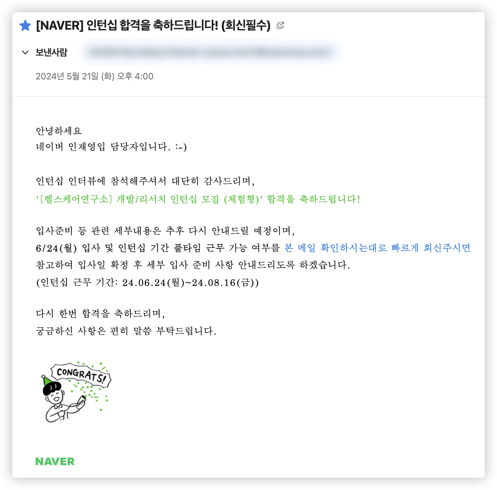

&nbsp; 기술 인터뷰 후 필자 스스로의 답변에 아쉬움이 있어 다소 불안했으나, 최종 합격 통보를 받았다. 비록 인턴십이지만 첫 회사가 '네이버'라는 사실은 합격 발표 이후 종강 전까지 필자에게 큰 설렘을 안겨주었다. 

---

## 2. 인턴 생활

&nbsp; 1학기 기말고사가 끝난 다음 주 월요일에 바로 첫 출근을 하게 되었다. 

### 2.1. 근무 환경

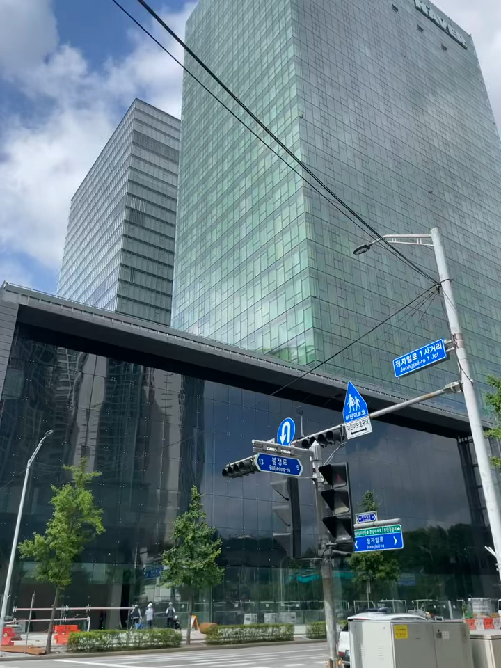

&nbsp; 필자는 네이버 1784(제2사옥)에서 일했다. 사실 네이버 조직 구조를 제대로 이해하지 못했기 때문에 '헬스케어연구소가 별도 건물에 있지 않을까?' 라고 걱정했는데, 다행히 네이버의 핵심 시설인 제2사옥에서 근무할 수 있었다. 

&nbsp; 첫 출근 당시에는 건물에 압도되는 기분을 느꼈다. 건물도 굉장히 세련되었고, 직원들 모두가 동경의 대상으로 느껴졌다. 사수님의 도움으로 노트북을 받고 사무실에서 내 자리를 세팅하며 네이버의 일원이 된다는 설렘을 느꼈다. 

#### 2.1.1. 사내 시설 및 복지

&nbsp; 사내에는 우리 부서와 긴밀하게 협력하는 **Naver Care**(사내 병원)를 비롯해 편의점, 은행, 브랜드 스토어, 카페 등 다양한 편의시설이 있다. 개발자가 업무에만 집중할 수 있도록 세세한 부분까지 배려한 환경이 인상적이었다. 

#### 2.1.2. 식사

|                                                                     |                                                                     |                                                                     |
| ------------------------------------------------------------------- | ------------------------------------------------------------------- | ------------------------------------------------------------------- |
| 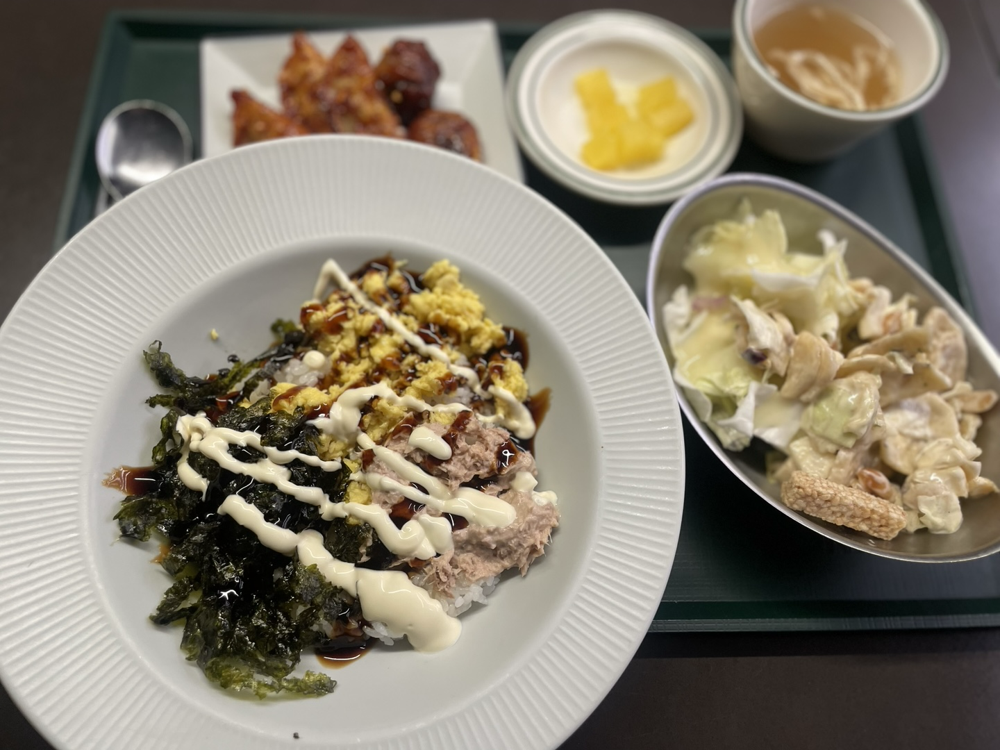  | 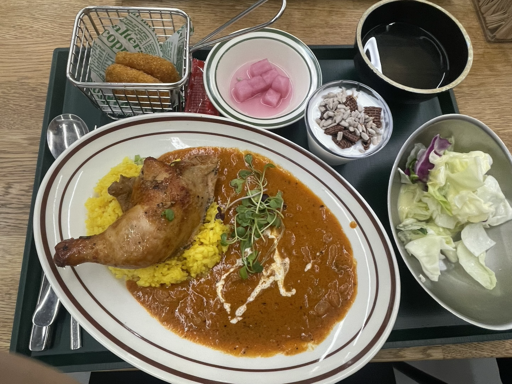  | 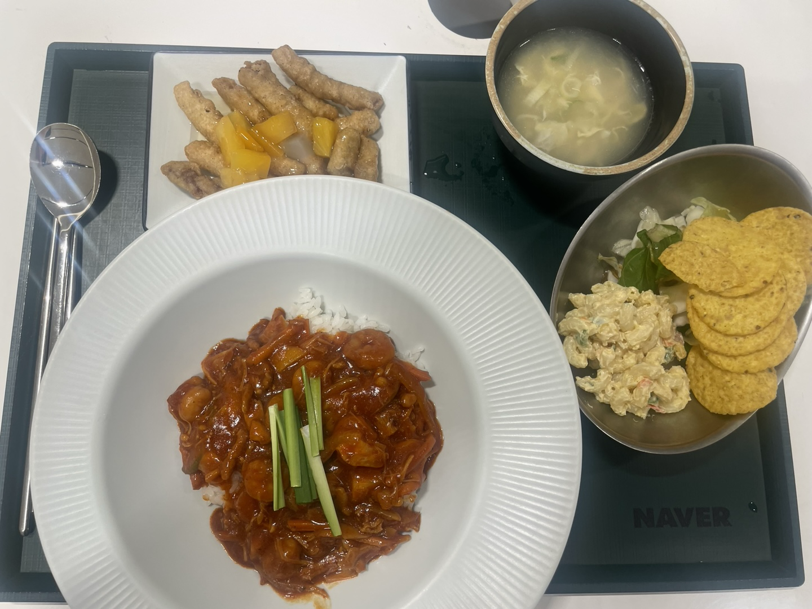  |
| 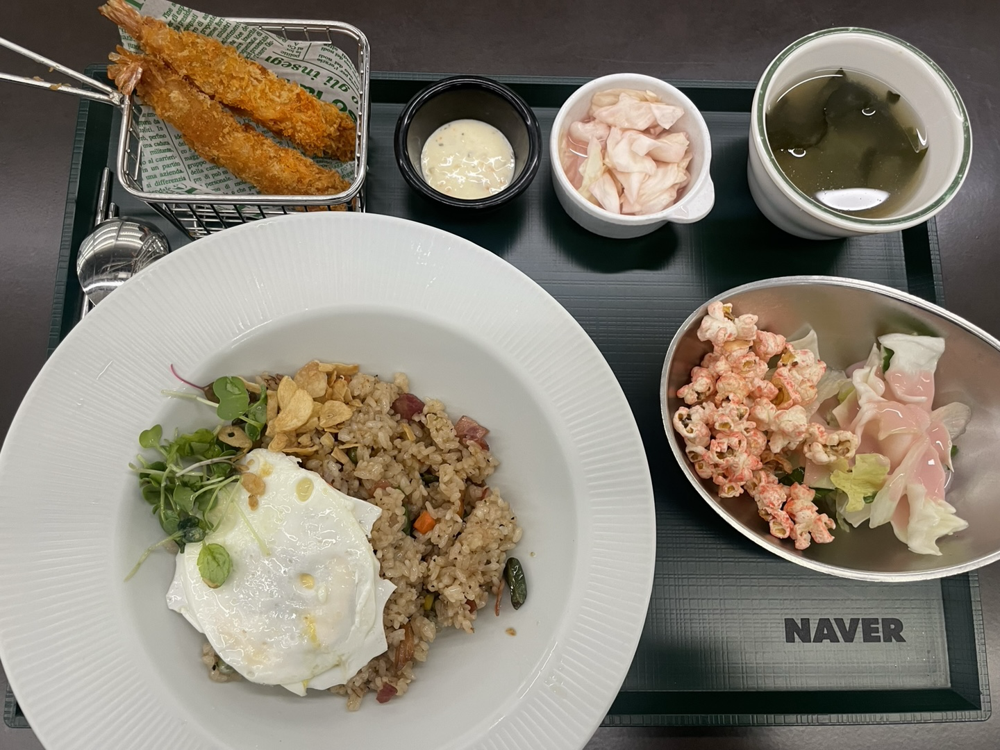  | 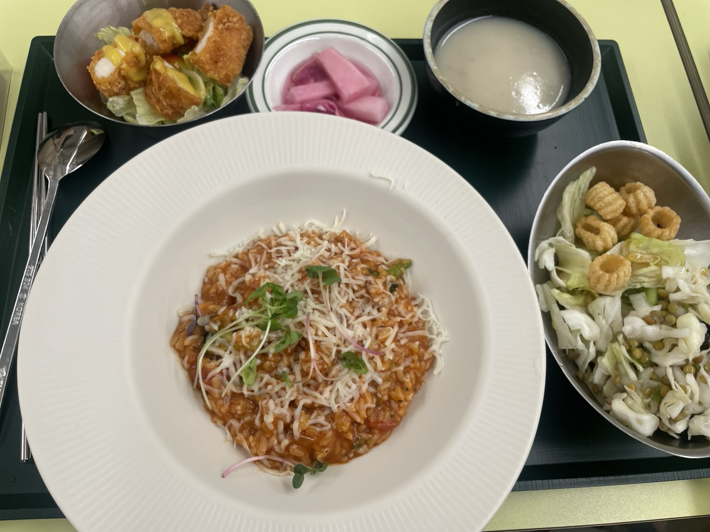 | 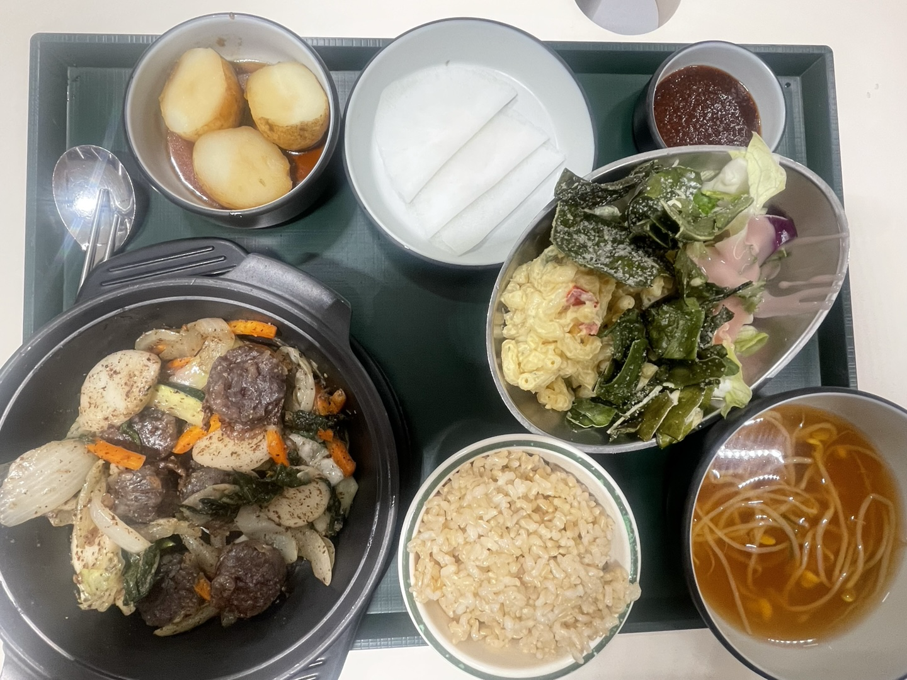 |
| 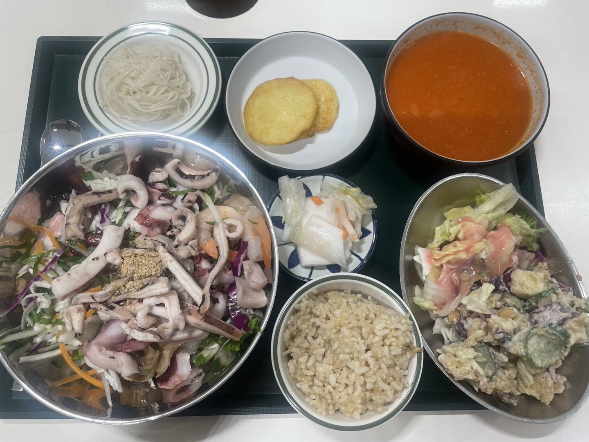 | 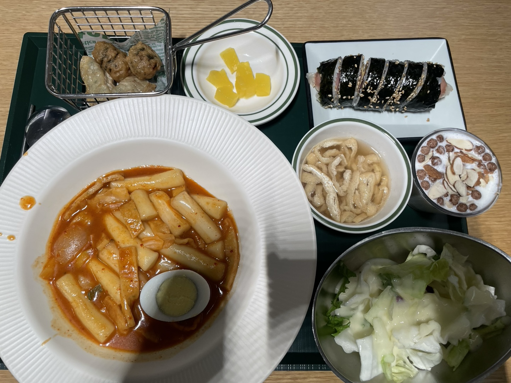 | 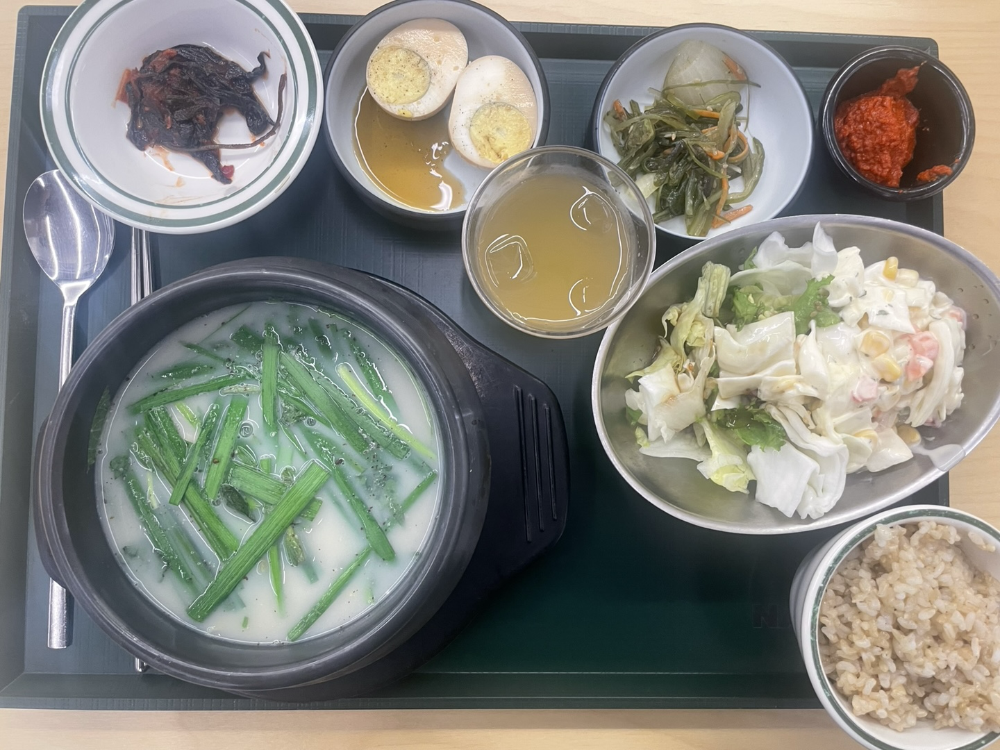 |

&nbsp; 정말 정말 맛있다. 식당과 푸드코트에서 다양한 메뉴를 선택할 수 있어 식사 걱정은 전혀 없었다. 

&nbsp; 재료의 퀄리티가 특히 인상적이었다. 신선한 재료로 만든 샐러드는 사수님도 '이런 퀄리티의 샐러드를 원하는 만큼 먹을 수 있는 곳이 흔치 않다'고 하실 정도였고, 육식주의자인 필자도 매우 만족스러웠다. 

&nbsp; 식사 후에는 항상 팀원들과 카페에서 커피를 마시며 대화하는 시간을 가졌다. 이 시간은 단순한 휴식을 넘어 네이버 직원분들과 편하게 소통하고 궁금한 점을 물어볼 수 있는 소중한 기회였다. '이 분들도 나와 같은 사람이구나'라는 생각을 하게 되었고, 인생 선배로서 커리어와 가치관에 대해 많은 조언을 받을 수 있었다. 

### 2.2. 업무 환경

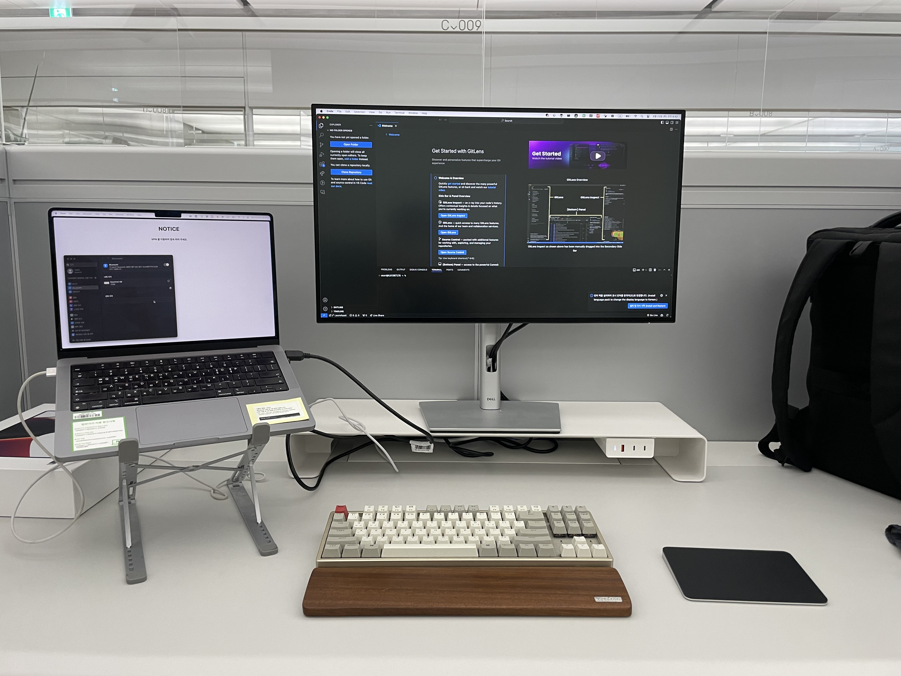

#### 2.2.1. 개발 문화

&nbsp; 내 주요 업무는 새로운 서비스 개발보다는 기존 인턴들의 코드를 유지보수하고 새로운 요구사항을 반영하는 것이었다. 이를 위해 가장 중요한 것은 전체 시스템을 이해하는 것이었고, 온보딩 과정에서 소스 코드 구조를 꼼꼼히 기록하고 이해하는데 집중했다. 

&nbsp; 헬스케어라는 생소한 도메인은 직접적인 학습보다 애플리케이션의 상호작용을 이해하는 과정에서 자연스럽게 익혔다. 기획자와 사수님은 스크럼 방식의 애자일 프로세스를 도입해 우리가 빠르게 적응할 수 있도록 도와주셨다. 

#### 2.2.2. 기술 스택

&nbsp; 풀스택 개발 인턴으로 채용된 것은 짧은 기간 동안 다양한 태스크를 해결해야 하는 업무 특성 때문이었다. 네이버 부스트캠프에서 쌓은 풀스택 경험이 큰 도움이 되었다. 

&nbsp; 개발자는 궁극적으로 `PS(Problem Solver)`라고 생각한다. 특정 기술에 종속되기보다는 상황에 맞는 최적의 도구를 선택할 수 있는 유연성이 중요하다는 것을 이번 기회를 통해 다시 한 번 확인할 수 있었다. 

#### 2.2.3. 협업 방식

&nbsp; 인턴십 기간이 비교적 짧다 보니, 사수님께서는 작은 태스크들을 통해 우리가 자연스럽게 온보딩할 수 있도록 설계해주셨다. 별도의 긴 온보딩 기간을 갖는 것이 이상적이겠지만, 한정된 시간 내에서 최선의 선택이었다고 생각한다. 

---

## 3. 마무리

### 3.1. 성장

&nbsp; 업무에 관한 이야기를 배제하다 보니 쓸 수 있는 내용이 한정적인 점 양해바랍니다. 

#### 3.1.1. 기술적 성장

##### (1) 전체적인 시스템 구조 이해력 증가

&nbsp; 필자는 주니어 개발자로서 다양한 환경에서 프로젝트와 개발 공부를 한 경험이 있다고 생각한다. 처음 개발을 시작할 때는 가르쳐주는 선생님도 없이 한 학년 선배들을 통해 개발을 공부했고, 네이버 부스트캠프에서는 로드맵이 있었지만 궁극적으로는 캠퍼 스스로가 자유도를 가지고 딥다이브하는 환경이었다. 이렇게 다양한 환경을 경험함으로써 필자에게 맞는 성장 방식을 찾을 수 있었고, 개발자로서의 가치관을 확립할 수 있었다. 

&nbsp; 이번 인턴은 이전과는 다르게 매우 특별했다. 이전에는 내가 기획부터 마무리까지 전부 참여했다면, 이번에는 이전 인턴들의 코드를 유지보수하고 새로운 요구사항을 반영하는 것이 주된 업무였다. 따라서 '전체적인 시스템 이해'가 가장 중요했고, 이 부분에서 큰 성장을 이룰 수 있었다. 

##### (2) 비즈니스 도메인 이해도 증가

&nbsp; 헬스케어 도메인은 대다수의 컴퓨터공학과 학생 입장에서 매우 생소하고 복잡한 분야다. 하지만 산업 특성상 일상과 밀접하게 관련되어 있고, 앞으로 성장할 수밖에 없는 분야라고 생각한다. 이러한 도메인을 경험할 수 있었던 것은 필자에게 큰 행운이었다. 

&nbsp; 반드시 헬스케어 관련 조직에 합류하겠다는 것이 아니라, 도메인 지식을 이해하고 이를 개발에 활용하면서 새로운 도메인에 대한 습득력과 경험을 얻을 수 있었던 좋은 기회였다. 

#### 3.1.2. 협업 역량

&nbsp; 생각보다 필자 주위에서 함께 취업을 준비하고 있는 개발자들이 놓치고 있는 부분이 GitHub 활용이라고 생각한다. Git으로 소스 코드를 관리하고, Issues로 작업을 설계하고 분리하며, Pull-Request로 코드 병합을 판단하고 팀원의 작업을 팔로우하는 것은 모두가 이해하고 있지만, 핵심은 이를 어떻게 효과적으로 활용하느냐이다.

&nbsp; Git은 소스 코드 형상 관리 소프트웨어이고, GitHub는 개발자 간 협업을 위한 플랫폼이다. GitHub를 잘 활용하려면 '어떻게 팀원 간 협업 효율을 최대화할 수 있을까'를 고민해야 한다. GitHub는 협업을 위한 많은 기능을 제공하지만, Pull-Request가 가장 핵심적인 기능이라고 생각한다.

&nbsp; 많은 조직에서 Pull-Request의 가장 큰 어려움은 '코드 리뷰'다. 필자 역시 여러 활동을 통해 다양한 사람들과 코드 리뷰를 진행했지만, 아직도 발전이 필요한 부분이라고 생각한다.

&nbsp; 프로젝트의 성격이나 상황에 따라 차이가 있지만, 코드 리뷰는 기본적으로 리뷰어의 시간이 필요한 작업이다. 최근 [Naver D2 - GitHub Actions를 이용한 코드 리뷰 문화 개선기](https://d2.naver.com/helloworld/8149881)를 읽고 든 영감을 얻은 부분은 리뷰를 참여하는데에 있어 어려움을 겪는 부분이 대다수 공통적이라는 것이다.

1. PR에 코드 변경 사항이 많아서
2. 코드/프로젝트에 대한 이해도가 부족해서

&nbsp; 위 포스트 뿐만 아니라 [뱅크샐러드 - 코드 리뷰 in 뱅크샐러드 개발 문화](https://blog.banksalad.com/tech/banksalad-code-review-culture/) 역시 내가 자주 복기하는 포스트이다. 필자같은 주니어 개발자 뿐만 아니라 현업에서 활동하고 있는 개발자 분들도 이에 대한 어려움을 겪고 있고, 이를 개선하고자 하는 노력을 하고 있다.

&nbsp; 필자 역시도 인턴십을 진행하면서 사수 분 & 인턴 동기 분과 코드 리뷰를 진행하며 '어떻게 하면 팀원에게 내 코드의 의도를 이해시킬 수 있을까?'와 '어떻게 하면 빠른 시간 내에 merge를 할 수 있을까?'라는 부분을 많이 고민하였다. 현재도 이러한 고민은 주기적으로 하고 있지만 인턴십을 하고, 뱅크샐러드의 글을 읽었을 때 들었던 생각은 다음과 같다.

1. PR 라인 수를 제한하기

   - 필자의 경우에는 현재 300줄 이하로 PR을 작성할 수 있도록 노력하고 있다. PR 크기가 작으면 작은 PR을 여러 개 올려야 하고, 이로 인해 작업이 지연될 수 있다고 생각하겠지만 코드 리뷰로 인해 지연되는 시간이 더 많다. 또한 반대 상황을 통해 코드 리뷰가 올바르게 이루어지지 않아 팀원 간 이해에 차이가 생길 경우 생기는 사이드 이펙트를 최소하하고자 한다.

2. PR 본문의 가독성을 향상시키기 위해 노력하기

   - 화려하고 긴 PR 본문은 때로는 존경심이 들게 만든다. 어려운 작업도 척척 수행하고, 작업의 깊이가 깊어보여 개발자의 높은 수준을 볼 수 있지만, 협업하는 팀원 입장에서 볼 때는 전부 다 꼼꼼히 읽어야 하는 긴 문서일 뿐이라고 생각한다. 물론 작성자 입장에서는 팀원들과 Context를 유지하기 위한 행위겠지만, 너무 많은 글은 Reviewer의 피로를 유발시킬 수 있다.

   - Reviewer 또한 함께 일하는 팀원이고 개발자이다. 각기 맡은 태스크가 있을 것이고, 코드 리뷰에 있어서 많은 시간을 할애하는 만큼, 본인이 맡은 태스크에 쓸 수 있는 시간은 줄어들게 되고 이는 궁극적으로 코드 리뷰를 기피하게 되는 상황이 발생할 수 있다. 사수 분이 자주 하시던 말씀이 '개발자는 코드로 말한다고 생각한다'라고 하셨다. 물론 이는 각자 생각하는 가치관에 있어서 차이가 있을 수 있겠지만 꼭 필요한 내용 이외에는 숨김이나 링크를 통해 해결하고, 핵심을 강조할 수 있다면 보다 코드 리뷰 본연의 활동에 집중함으로써 보다 활발한 코드 리뷰가 될 수 있을 것이라고 생각한다.

#### 3.1.3. 문서화

&nbsp; 이번 인턴십을 통해 '온보딩'의 중요성을 크게 깨달았다. 개발자뿐만 아니라 모든 새로운 조직 구성원이 조직에 융화되는 데는 시간이 필요하며, 이를 위해서는 체계적인 온보딩 프로세스가 필요하다. 

&nbsp; 물론 사수 분께서 많은 신경을 써주셔서 빠르게 조직에 융화할 수 있었고 많은 기여를 할 수 있었지만, 보다 장기적인 관점(나는 단기 인턴이였으니까)에서는 보다 구체적인 온보딩 프로세스가 있으면 좋았을 것이라고 생각한다.

&nbsp; 내가 인턴십을 통해 조직에 합류하게 된 이후로 가장 어려웠던 부분은 참고할 수 있는 문서가 한정되어 있다는 것이었다. 아무래도 상황 상 인턴 간 인수 인계가 어렵고, 개발 일정이 촉박하여 문서화를 하는 데에 시간이 부족했을 것이라고 어림짐작할 수 있지만, 어쨌든 새로 조직에 합류하게 된 입장에서는 아쉬운 부분일 수 밖에 없다.

&nbsp; 특히 백엔드 개발자 관점에서 해당 테이블과 컬럼이 어떤 역할을 하고, 상호 어떤 관계인지를 이해하는 것에 많은 시간을 할애하였고, 시행착오가 있었는데, 이를 조금이나마 해소하기 위해 나는 기존에 업데이트되고 있지 않던 ERD를 새로 업데이트하여, 팀원들이 이를 참고할 수 있고자 하였다.

### 3.2. 소감 및 회고

#### 3.2.1. 좋았던 점

&nbsp; 3개월간의 인턴 기간은 정말 꿈만 같았다. 평소 동경하던 기업에서 실제로 일하며 가치를 창출할 수 있었던 것은 큰 행운이었다. 주니어 개발자로서 현업 경험과 기존 서비스 유지보수 경험이 부족했는데, 이번 인턴십을 통해 그러한 갈증을 해소할 수 있어서 감사했다. 

&nbsp; 특히 점심 식사 후 커피 타임은 매우 소중한 시간이었다. 팀원들과 다양한 이야기를 나누며 많은 인사이트를 얻을 수 있었고, 인턴들도 동등한 구성원으로 대우해주시는 따뜻한 문화를 느낄 수 있었다. 먼저 커리어를 시작한 인생 선배 그리고 선배 개발자 입장에서 좋은 이야기를 많이 해주셨는데, 이를 통해 내가 가고자 하는 방향과 나는 어떠한 것을 가장 우선순위로 두고 있는지 한번 더 생각해보는 계기가 되었다. 

&nbsp; 궁극적으로 필자는 같이 일하는 팀원들(개발자, 비개발자를 아우르는)에게 있어 '함께 일하고 싶은 개발자'를 지향하고자 한다. 나름대로는 SW마에스트로 활동을 하면서 프로젝트 팀장도 하고, 현재 영남대학교 멋쟁이사자처럼 대표도 하며 리더의 역할을 이해하였다고 생각했다. 하지만 짧은 인턴 기간을 거치면서 아직 내가 부족한 부분이 많다고 느꼈다. 반대로 성장할 수 있는 부분이 많다는 의미도 될 수 있기 때문에 이러한 부분들을 개선하여, 리더-구성원 각 역할에 대해 이해하여 소프트웨어 뿐만 아니라 조직 측면에서도 더 나은 조직을 만드는 데 있어서 기여할 수 있는 개발자가 되고 싶다.

#### 3.2.2. 아쉬웠던 점

&nbsp; 회사와 업무, 팀원들과의 관계에서는 전혀 아쉬움이 없었다. 다만 주말마다 멋쟁이사자처럼 교육을 위해 대구를 왕복해야 했기에 서울 생활을 충분히 즐기지 못한 것이 아쉽다. 

&nbsp; 고시텔에서의 2개월은 다소 힘들었다. 좁은 생활 공간과 지인들을 초대할 수 없는 환경으로 인해 외로움을 느꼈다. 이 경험을 통해 주거 공간이 단순한 휴식 공간 이상의 의미를 가진다는 것을 깨달았고, 앞으로는 더 신중하게 주거 환경을 선택해야겠다고 생각했다. 

#### 3.2.3. 퇴사

&nbsp; 퇴사 전날, 팀원들에게 감사의 마음을 담은 개별 메시지를 준비했다. 시작만큼이나 마무리도 중요하다고 생각했기 때문에, 그동안 받은 도움과 배운 점들을 진심을 담아 전달하고자 했다. 필자에게 있어서는 정말 은인과도 같은 분들이었기 때문에 메시지를 쓰는 것은 어려운 일은 아니었다. 

&nbsp; 다들 바쁘실텐데도 답장을 길게 써주셔서 정말 감사했고, 많은 위안을 얻을 수 있었다. 특히 필자에게 있어서 소장님은 너무 높고 어려운 분이라, 감히 메시지를 보낼 생각조차 못했는데, 일개 인턴인 나에게 따로 메시지로 '매일 아침 누구보다도 일찍 나와서 가장 늦게까지 노력해주신 점 잘 알고 있습니다'라는 문구는 내 인턴 생활을 대변하는 문구로, 내 노력을 인정 받음과 동시에 '구성원들의 숨은 노력을 칭찬함으로써 존경심을 끌어낼 수 있구나'라는 생각을 하게 되었고, 리더의 자질이란 것은 이런 것이구나 라는 생각을 하게 되었다.

<strong><em>짧은 인턴십 기간이었지만 제 인생에 있어서 큰 경험이 되었고, 많은 교훈을 얻을 수 있었습니다. 소중한 기회를 주셔서 진심으로 감사드리고, 기회가 된다면 언젠가 다시 함께 일할 수 있는 기회가 있었으면 좋겠습니다.</em></strong>

### 3.3. 앞으로의 계획

#### 3.3.1. 배운 점을 활용할 방향

&nbsp; 이번 인턴 경험에서 배운 점들을 항상 되새기려 한다. 특히 효율적인 협업 방식과 조직 문화에 대해 많이 배웠기에, 앞으로의 프로젝트에서도 '효과적인 협업 방식'과 '팀 구성원들의 화합'을 중요하게 고려할 것이다. 

&nbsp; 이번 인턴십을 통해 정립하게 된 필자의 다음 커리어에서 중요하게 생각하는 세 가지 관점은 다음과 같다.

1. 업무의 본질과 가치
2. 조직과 서비스에 대한 기여도
3. 함께 일하는 동료들과의 관계

#### 3.3.2. 후배 인턴들을 위한 조언

&nbsp; 이러한 인턴 기회가 주어진다면 반드시 도전해보길 추천한다. 네이버라는 대규모 기업의 프로세스는 필자에게 있어서는 신선한 충격이었고, 많은 가치관 변화를 일으켰다. 필자와 같은 상황에 있는 취업 준비생들에게 있어서 정말 뜻깊은 경험이라고 생각하고, 보다 올바른 방향으로 성장하는데에 있어서 도움이 될 것이다.

---

&nbsp; 혹시 궁금한 점이 있다면 `jinlee1703@gmail.com`으로 메일주시면 답변 드리겠습니다 :)
