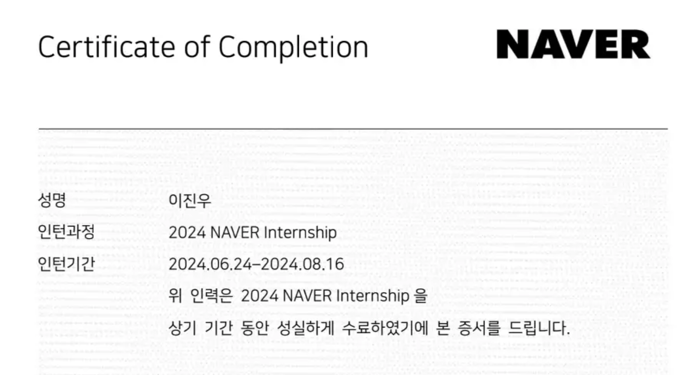
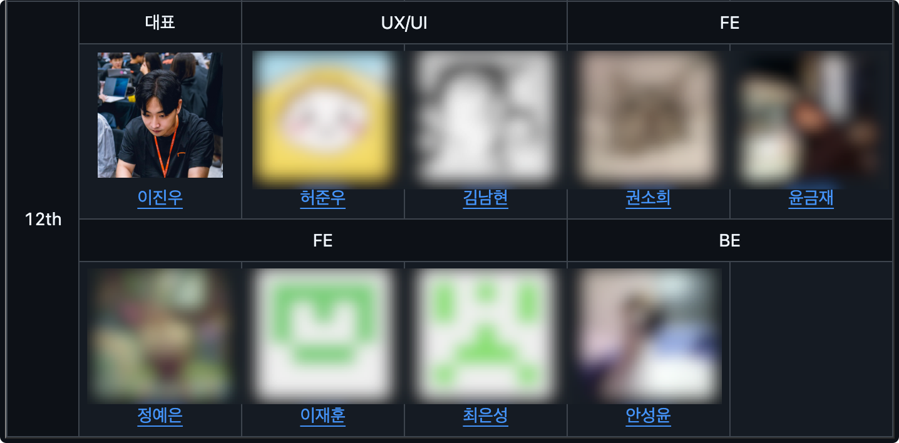
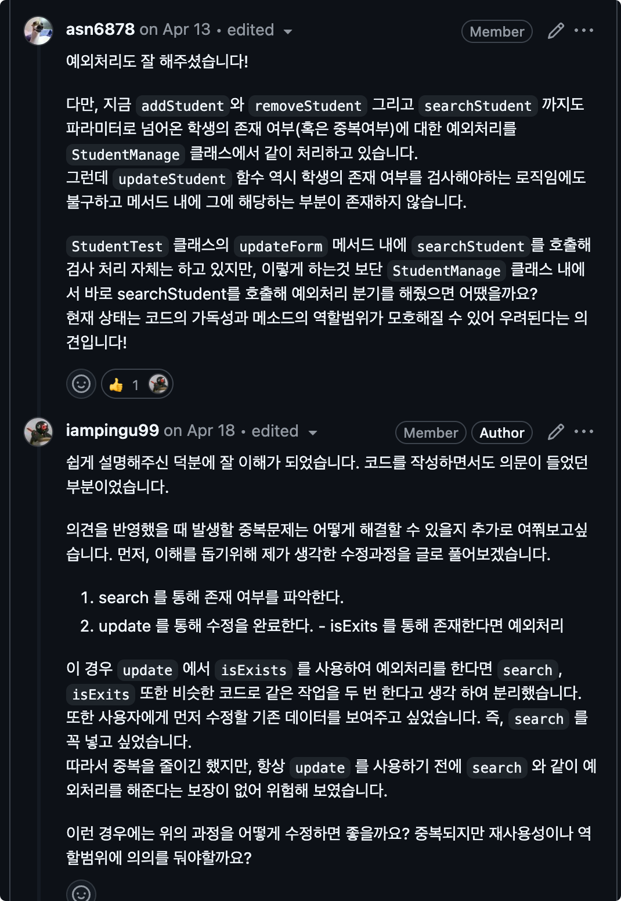
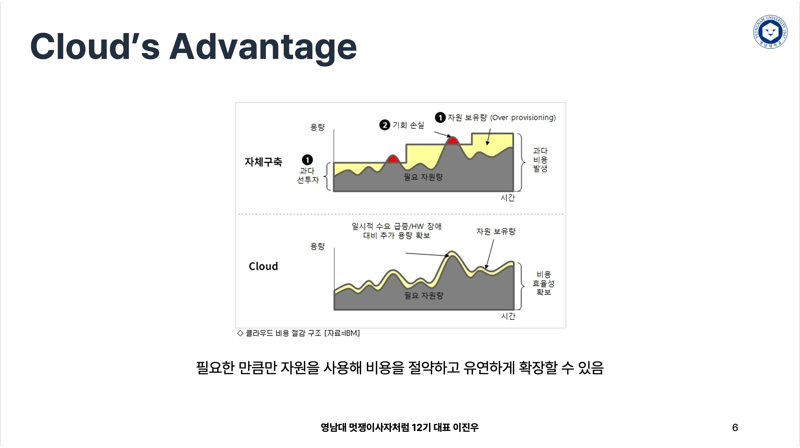

---

## 서론

&nbsp; 드디어 2025년이 되었다. 필자에게 있어서 2025년은 정말 손꼽아 기다린 해인데, 가장 큰 이유는 길고 길었던 대학교를 졸업한다는 점에 있어서 였다. 2023년과 더불어 2024년은 정말 정신없는 해였던 것 같은데, 회고를 위해 올해 경험했던 굵직한 사건들을 위주로 풀어보려고 한다.

- 네이버 헬스케어연구소 개발 인턴
- 멋쟁이사자처럼 대학 12기 영남대학교 대표
- 영남대학교 졸업

## 본론

### 네이버 헬스케어연구소 개발 인턴

&nbsp; [이전 포스트(네이버 헬스케어연구소 개발 인턴 회고)](https://jinlee.kr/essay/2024-11-22-naver-intern-retrospect/)에서 이미 많은 내용을 적었기 때문에 간략하게만 작성하려 한다. 

&nbsp; 2024년 6월부터 8월까지 8주간 네이버 헬스케어연구소에서 개발 인턴으로 근무하였다. 필자에게 네이버는 첫 계정을 만든 곳이자, 검색, 웹툰, 쇼핑 등 일상 속에서 늘 접하는 서비스를 제공하는 동경의 기업이었다. 2022년 부스트캠프를 통해 네이버 개발자들과 교류했던 경험도 있었기에, 방학 중 진행되는 인턴십은 더할 나위 없이 좋은 기회였다. 인턴 생활에서 가장 기억에 남는 것은 실제 서비스의 유지보수를 경험했다는 점이다. 이전까지는 주로 새로운 프로젝트를 처음부터 기획하고 개발했다면, 이번에는 기존 인턴들의 코드를 이해하고 유지보수하며 새로운 요구사항을 반영하는 작업을 했다. 이 과정에서 전체 시스템 구조를 이해하는 능력과 헬스케어라는 새로운 도메인에 대한 이해도를 높일 수 있었다. 

&nbsp; 또한 GitHub를 통한 협업 문화를 깊이 경험할 수 있었다. 특히 코드 리뷰 과정에서 'PR 라인 수를 300줄 이하로 제한하기'와 'PR 본문의 가독성을 높이기' 등 실질적인 협업 노하우를 배웠다. 점심 식사 후 팀원들과의 커피 타임은 단순한 휴식을 넘어 현직자들의 귀중한 조언을 들을 수 있는 소중한 시간이었다. 이번 인턴십을 통해 '함께 일하고 싶은 개발자'가 되기 위해 필요한 것들을 배울 수 있었다. 기술적 역량뿐만 아니라 조직 문화에 대한 이해, 효과적인 커뮤니케이션 방법 등 실무에서 정말 중요한 부분들을 경험할 수 있었던 값진 시간이었다.

### 멋쟁이사자처럼 대학 12기 영남대학교 대표

&nbsp; 작년의 백엔드 트랙 멘티(이하 아기사자) 활동에 이어서 올해는 필자가 영남대학교 전체 운영진 대표를 담당하였다. 운영진의 경우 필자를 포함한 총 9명으로 구성되었고, 아기사자의 경우에는 총 23명으로 구성되었다. 

&nbsp; 사실 작년 기수에 참여할 때부터 기회가 되면 운영진(그 중에서도 대표)을 해보고 싶었다. 필자의 경우에는 경북소프트웨어고에서 학생들을 대상으로 강의를 진행하기도 하였고, 부스트캠프와 SW마에스트로와 같은 다양한 활동들을 통해 여러 좋은 멘토님들을 만나면서 "나도 언젠가는 후배들에게 있어 좋은 귀감이 되고 싶다"라는 생각을 가지고 있었다. 또한 기존 동아리에서 이론 중심의 교육에서 벗어나 실제 서비스를 만들고 운영해보는 실무 중심의 활동을 도입하고 싶었다. 이러한 생각들은 현재도 변함이 없었기에 올해도 대구과학고등학교의 SW동행 프로젝트 멘토로써 활동하였다. 

&nbsp; 다행스럽게도 직전 기수 대표와 올해 운영진들께서 기회를 주셔서 12기 영남대학교 대표로서 활동할 수 있었는데, 운영진 활동을 함에 있어서 몇 가지의 목표가 있었다. 

&nbsp; 첫째로는 즐겁게 활동하자였다. 필자가 생각하는 가장 좋은 선순환은 재미를 통해 흥미를 느끼고, 이를 통해 자신을 발전시킬 수 있는 원동력을 얻는 것이라고 생각한다. '나 자신이 재미가 없는데 같이 하는 운영진과 아기사자가 어떻게 재미있게 활동할 수 있을까?' 항상 즐거웠다고 말할 순 없겠지만, 적어도 나를 보면서 귀감을 얻을 수 있길 바랬고, 이를 통해 '13기 운영진을 하고 싶어하는 사람이 많다면 잘 한 것이 아닌가'라는 생각을 하였다. 

&nbsp; 둘째로는 운영진과 아기사자 모두가 활동 전후에 있어서 뚜렷한 차이나 성과, 보람을 느낄 수 있도록 만들고자 하였다. 작년 11기에서는 대표님께서 모든 교육을 진행하셨는데, 12기에서는 '모든 운영진이 최소 한 번 이상의 교육을 진행하자'는 새로운 시도를 하였다. 이는 필자의 독단적인 결정에 가까웠지만, 운영진들이 보다 많은 보람을 느낄 수 있게 하기 위함이었다. 

&nbsp; 사실 운영진이 할 수 있는 활동은 교육 진행, 과제 피드백, 아이디어톤/해커톤 멘토링 정도로 제한적이다. 교육과 과제는 연계되는 경우가 많은데, 운영진이 교육을 하지 않으면 할 수 있는 활동이 아이디어톤/해커톤 멘토링 정도밖에 남지 않는다. 이렇게 되면 운영진-아기사자 간 커뮤니케이션 기회가 극히 적어져 효과적인 멘토링도 어려워진다. 반면 교육과 과제를 통해 평상시에도 서로 소통하게 된다면, 멘토링 시에도 더욱 수월한 진행이 가능할 것이라 판단하였다. 

&nbsp; 아기사자들을 위해서도 많은 고민이 있었다. 23명의 아기사자들은 각기 다른 배경과 관심사, 개발 역량을 가지고 있었기에 '어떻게 하면 모두를 만족시킬 수 있을까'를 깊이 고민했다. 그 결과 '학교에서 가르쳐주지 않는 실무적인 것들을 가르치자'라는 결론에 도달했다. 작년 말에 [인프런 이동욱 CTO님의 블로그 포스트](https://jojoldu.tistory.com/763)를 보던 중 "localhost을 벗어나야만 배우는 것들이 있다"라는 말씀에 영감을 받아, 단순한 기술 스택 교육이 아닌 '실제 서비스를 만들고 운영하는 법'을 가르치는데 중점을 두었다. 

&nbsp; 이를 위해 크게 두 가지 방향으로 교육을 진행했다.

1. **Git과 GitHub를 통한 협업 경험**: 필자도 외주 개발 경험이 있지만, 결국 개발자는 타인의 코드를 이해하고 협업할 줄 알아야 한다. 이를 위해 Git/GitHub 교육을 필수로 진행하고, 모든 과제를 Pull-Request로 제출하게 하여 코드 리뷰 문화를 만들었다.

   

2. **AWS를 통한 실제 서비스 운영 경험**: Localhost 환경을 벗어나 실제 서비스 환경에서 발생하는 다양한 이슈들을 직접 경험하고 해결하는 과정을 통해 실무적인 문제해결 능력을 기르도록 했다. 당시 네이버 헬스케어연구소 인턴과 병행하느라 힘들었지만, 이는 필수적인 과정이라 생각했다.

   

 

&nbsp; 셋째로는 수평적인 구조를 통해 서로가 많이 커뮤니케이션할 수 있도록 만들고자 하였다. 필자가 생각하는 운영진은 아기사자보다 개발을 잘하는 사람이 아니다. 먼저 동아리를 경험한 선배로써 조언을 해주고 이를 통해 함께 성장해나가는 것만으로도 아기사자들에게는 귀감을 줄 수 있을 것이라 생각했다. 

&nbsp; 모든 부분이 만족스러웠던 것은 아니다. 백엔드 트랙의 인력 부족으로 인해 필자가 상대적으로 백엔드 트랙에 신경을 많이 써주면서 기획/디자인과 프론트엔드 트랙에는 상대적으로 신경을 많이 못썼다고 생각하는데, 이 부분에 있어서 필자와 각 트랙의 아기사자 간에 친밀도를 쌓기 위한 시간이 좀 부족했던 것이 아닌가 라는 생각이 든다. 

&nbsp; 결국 어찌저찌 대표로써 임기가 마무리되었다. 개인적으로 개발 외적으로 정말 많은 고민을 할 수 있었고, 필자의 리더십과 소프트스킬을 늘려줌에 있어서 정말 많은 도움이 되었다고 생각한다. 정말 많은 시간을 할애한만큼, 끝이라고 하니 시원섭섭하지만 다음 13기에는 영남대학교 멋쟁이사자처럼이 분명 더 발전할 수 있을 것이라고 생각한다. 

> "한 해 동안 부족한 대표와 함께 운영진-아기사자로써 함께 활동해주셔서 감사합니다. 저 역시도 여러분들 덕분에 많은 보람을 느낄 수 있었던 활동이었습니다. 여러분들의 앞으로의 여정을 진심으로 응원하고, 앞으로도 좋은 인연으로 남았으면 좋겠습니다."

### 영남대학교 졸업

&nbsp; 필자가 개발을 처음 접한 것은 경북기계공업고등학교(마이스터고)에서였다. 정보기술 직종의 기능경기대회 준비반에서 3년간 프로그래밍을 공부하며, MS Office VBA를 활용한 프로그램 개발과 Java, MySQL을 활용한 GUI 프로그래밍을 통해 CRM, ERP와 같은 실무 프로그램들을 개발하였다. 이를 통해 대구지방기능경기대회 금메달, 전국기능경기대회 우수상(4위)이라는 성과를 거둘 수 있었다. 고등학교 졸업 즈음 취업과 진학의 갈림길에서 고민하던 중 진학을 선택하였고, 영남대학교 연계편입이 가능한 영남이공대학교에 입학하게 되었다. 이후 영남이공대학교에서 차석으로 졸업하여 영남대학교에 편입학할 수 있었다. 

&nbsp; 이렇게 긴 여정 끝에 입학한 영남대학교는 필자에게 특별한 의미가 있다. 오랜 학업 과정의 마지막이자, 새로운 시작점이 되어주었기 때문이다. 영남대학교에 진학한 이후 네이버 부스트캠프와 SW마에스트로와 같은 값진 경험들을 할 수 있었고, 이를 통해 소프트웨어 엔지니어로서의 방향성을 확립할 수 있었다. 또한 멋쟁이사자처럼 대학 12기 대표로서의 활동은 필자에게 리더십과 책임감을 배우는 소중한 경험이 되었다. 무엇보다 학교생활을 하면서 같은 꿈을 꾸는 학우들과 든든한 조언을 해주시는 교수님들과 같은 좋은 인연들을 만날 수 있었던 것이 가장 큰 자산이 되었다. 

## 결론

&nbsp; 2024년은 필자에게 있어 소프트웨어 엔지니어로서의 방향성을 더욱 굳건히 다질 수 있었던 해였다. 네이버 인턴십을 통해 실무 환경에서의 개발과 협업을 경험했고, 멋쟁이사자처럼 대표 활동을 통해 리더십과 교육자로서의 역량을 키웠으며, 마침내 오랜 학업 과정을 마무리할 수 있었다. 

&nbsp; 2025년부터는 본격적으로 소프트웨어 엔지니어로서의 새로운 여정을 시작하기 위한 준비를 하려 한다. 네이버 인턴과 멋쟁이사자처럼 활동을 통해 깨달은 '함께 일하고 싶은 개발자'라는 가치를 잊지 않고, 동료들과 소통하며 성장하는 개발자가 되고자 한다. 지금까지의 경험들을 발판으로, 사용자에게 실질적인 가치를 제공하는 서비스를 만들고, 팀원들과 함께 성장할 수 있는 소프트웨어 엔지니어로 한 걸음 더 나아가고자 한다. 이를 위해 기술적 역량 향상은 물론, 비즈니스 도메인에 대한 이해와 소프트 스킬 향상에도 끊임없이 노력할 것이다.
