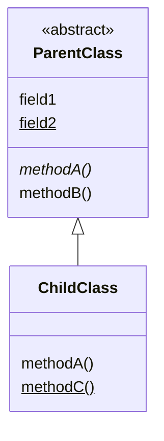
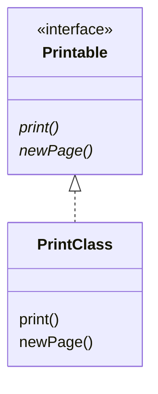
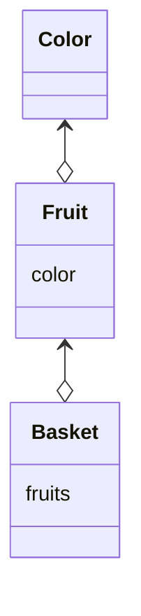
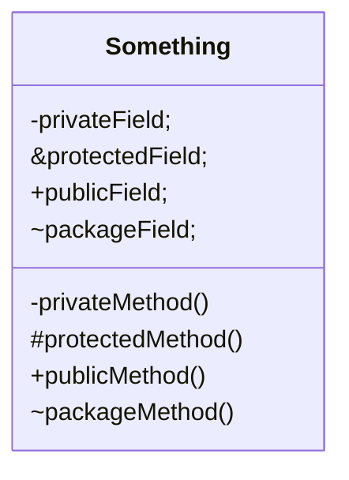
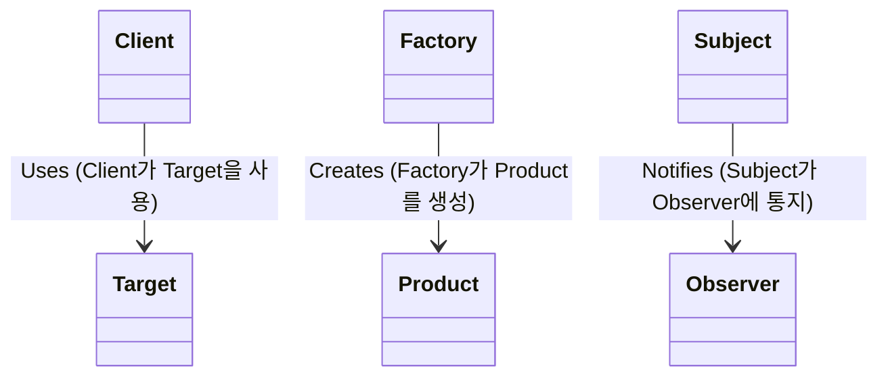

---

## 정의

&nbsp; 클래스 다이어그램(Class Diagram)은 UML의 다이어그램 중 한 종류로 클래스나 인스턴스, 인터페이스 등의 정적인 관계를 나타낸 것이다. 클래스, 인터페이스, 관계 속성, 메서드 등의 요소를 시각적으로 표현하여 시스템의 구조와 클래스 간의 관계를 이해할 수 있게 도와준다.

## 요소

### 클래스(Class)

&nbsp; 이름, 멤버, 메서드로 구성된 사각형으로 표시된다.

### 관계(Relationship)

&nbsp; 클래스들 사이의 연결을 나타내며, 연관성(association), 일반화(generallzation), 의존성(dependency), 집합(aggregation), 합성(composition) 등 여러 형태가 있다.

### 인터페이스(interface)

&nbsp; 클래스가 구현해야 하는 메서드의 집합을 나태며, 일반적으로 삼각형으로 표현된다.

## 예시

### 클래스 계층 관계 표현

```java
abstract class ParentClass {
  int field1;
  static char field2;
  abstract void methodA();
  double methodB() {
    // ...
  }
}

class ChildClass extends ParentClass {
  void methodA() {
    // ...
  }
  static void methodC() {
    // ...
  }
}
```



&nbsp; 위 Class Diagram은 `ParentClass`와 `ChildClass`라는 두 클래스의 관계를 나타내고 있다. Δ가 붙은 실선 화살표는 클래스의 계층 관계를 나타내는데, **하위 클래스에서 상위 클래스**를 향한다. 자바로 생각해보면 `extends` 화살표라고 볼 수 있다.<br><br>
&nbsp; ParentClass는 ChildClass의 상위 클래스이고, ChildClass는 ParentClass의 하위 클래스이다. 상위 클래스를 `기저 클래스` 혹은 `부모 클래스`, 하위 클래스를 `파생 클래스` 혹은 `자식 클래스`라고 부르기도 한다. 각각의 클래스는 직사각형으로 표현하고 직사각형 내부는 수평선으로 분할하여 각 칸에는 `클래스명`, `멤버 변수`, `메서드`를 작성하게 된다.<br><br>
&nbsp; abstract 클래스(추상 클래스)는 기울임꼴(하지만 필자의 블로그에서 사용하는 `mermaid-js`에서는 Class명의 Italic체를 허용하지 않으므로 `<<abstract>>`로 표현하도록 함)로 쓴다. 마찬가지로 abstract 메소드도 기울임꼴을 사용한다.<br><br>
&nbsp; static 필드와 메소드는 밑줄을 사용한다.<br><br>

### 인터페이스와 구현

```java
interface Printable {
  abstract void print();
  abstract void newPage();
}

class PrintClass implements Printable {
  void print() {
    // ...
  }
  void newPage() {
    // ...
  }
}
```



&nbsp; 위 그림은 `Printable`이라는 인터페이스가 있고, `PrintClass`라는 클래스가 `Printable` 인터페이스를 구현하는 모습을 나타내고 있다. Δ가 붙은 파선 화살표는 인터페이스와 구현 클래스의 관계를 나타내는데, **구현 클래스에서 인터페이스로** 향한다. 자바로 비유하면 `implements` 화살표라고 볼 수 있다.

### 집약(aggregation)

```java
class Color {
  // ...
}

class Fruit {
  Color color;
  // ...
}

class Basket {
  Fruit[] fruits;
  // ...
}
```



&nbsp; 이러한 **'갖고 있는'** 관계를 '집약'이라고 한다. 인스턴스를 갖고 있으면 개수에 관계없이 그 관계는 집약이다. 배열을 사용하던 ArrayList 클래스를 사용하든 인스턴스를갖고 있으면 그 관계는 집약이라고 할 수 있다.<br><br>
&nbsp; 마름모꼴 기호가 붙은 선은 집약을 나타낸다. 마름모꼴 모양의 접시 위에 물건이 높여 있다고 생각하면 이해가 쉬울 것이다.

### 접근 지정자(Access modifier)

```java
class Something {
  private int privateField;
  protected int protectedField;
  public int publicField;
  int packageField;
  
  private void privateMethod() {
  }
  protected void protectedMethod() {
  }
  public void publicMethod() {
  }
  void packageMethod() {
  }
}
```



&nbsp; 위 그림은 메소드와 필드의 접근 지정자를 나타낸다. ClassDiagram에서 접근 지정자를 표현하고 싶을 때는 메소드나 필드 이름 앞에 기호를 붙인다.<br>
&nbsp; +가 붙은 경우, public인 메소드와 필드를 의미한다. 어디서든 액세스할 수 있다.<br>
&nbsp; -가 붙은 경우, private 메소드와 필드를 의미한다. 클래스 외부에서 액세스할 수 없다.<br>
&nbsp; #가 붙은 경우, protected인 메소드와 필드를 의미한다. 액세스할 수 있는 것은 같은 클래스, 하위 클래스 및 같은 패키지 내의 클래스 뿐이다.<br>
&nbsp; ~가 붙은 경우, default 접근 지정자를 의미한다. 같은 패키지 내에서만 액세스할 수 있는 메소드나 필드를 의미한다.<br><br>

### 클래스의 관계



&nbsp; 클래스의 관계를 나타내기 위해 이름에 `▶`를 붙여 표기할 수 있다.

---

## Reference

- 유키 히로시, 2022, JAVA 언어로 배우는 디자인 패턴 입문: 쉽게 배우는 GoF의 23가지 디자인 패턴
