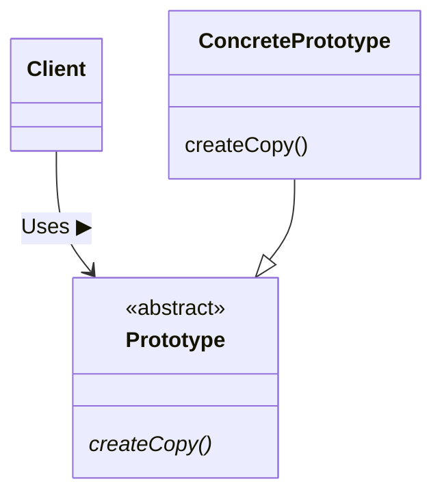

---

# Prototype?

&nbsp; **프로토타입(Prototype)**이라는 단어는 다양한 분야에서 사용되며 한글로는 보통 '원형'이라는 단어로 치환된다. 원형은 제품이나 디자인의 초기 버전 혹은 모형을 의미하는데, 추후 제품 개발이나 디자인 작업의 기반이 되는 모습을 갖고 있으며 기능이나 디자인의 특징을 시험하고 검증하는 데 사용된다.

# Prototype Pattern

&nbsp; **복사해서 인스턴스를 만든다.**

## 역할



### Prototype

&nbsp; 인스턴스를 복사하여 새로운 인스턴스를 만들기 위한 메소드를 결정한다.

### ConcretePrototype

&nbsp; 인스턴스를 복사하여 새로운 인스턴스를 만들기 위한 메소드를 구현한다.

### Client

&nbsp; 인스턴스를 복사하는 메소드를 이용해 새로운 인스턴스를 만든다.

## Example : 여러 문자열 스타일이 있고 이에 따라 객체를 생성하는 프로그램

### Class & Interface

|**패키지**|**이름**|**설명**|**역할**|
|---|---|---|---|
|framework|Product|추상 메소드 use와 createCopy가 선언되어 있는 인터페이스|ProtoType|
|framework|Manager|createCopy를 사용하여 인스턴스를 복제하는 클래스|Client|
|이름 없음|MessageBox|문자열을 테두리로 감싸서 표시하는 클래스<br>use와 createCopy를 구현|concretePrototype|
|이름 없음|UnderlinePen|문자열에 밑줄을 그어 표시하는 클래스<br>use와 createCopy를 구현|concretePrototype|
|이름 없음|Main|동작 테스트용 클래스| |

- framework 패키지
  - Product 인터페이스와 Manager 클래스는 인스턴스를 복제함
- Manager 클래스
  - createCopy를 호출하지만 구체적으로 어느 클래스의 인스턴스를 복제할지 관여하지 않음
  - Product 인터페이스를 구현한 클래스면 복제할 수 있음
- MessageBox, UnderlinePen 클래스
  - Product 인터페이스를 구현한 클래스
  - 클래스에 등록되는 인스턴스를 만들어서 Manager 클래스에 등록하고, 원할 때 복제할 수 있음

### Product Interface

```java
package prototype_pattern.framework;

// Product 인터페이스 : Prototype 역할, Cloneable 인터페이스 상속을 통해 복사 가능한 인터페이스임을 명시
public interface Product extends Cloneable {
	/**
	 * use 메소드 : 사용을 위한 메서드, 하위 클래스의 구현에 따라 다르게 작동
	 * @param s 사용할 문자열
	 */
	public abstract void use(String s);

	/**
	 * createCopy 메소드 : 인스턴스 복제를 위한 메서드
	 * @return 복사된 인스턴스
	 */
	public abstract Product createCopy();
}
```

### Manager Class

```java
package prototype_pattern.framework;

import java.util.HashMap;

// Manager 클래스 : Client 역할, 인스턴스 복사를 위한 클래스
public class Manager {
	// 복사할 인스턴스를 저장할 맵
	private HashMap showcase = new HashMap();

	/**
	 * register 메소드 : 복사할 인스턴스를 저장하는 메서드
	 * @param name 인스턴스의 이름
	 * @param proto 인스턴스
	 */
	public void register(String name, Product proto) {
		showcase.put(name, proto);    // 인스턴스 등록
	}

	/**
	 * create 메소드 : 저장된 인스턴스를 복사하여 반환하는 메서드
	 * @param protoname 복사할 인스턴스의 이름
	 * @return 복사된 인스턴스
	 */
	public Product create(String protoname) {
		Product p = (Product)showcase.get(protoname);    // 저장된 인스턴스를 가져옴
		return p.createCopy();    // 복사된 인스턴스를 반환
	}
}
```

### MessageBox Class

```java
package prototype_pattern;

import prototype_pattern.framework.Product;

// MessageBox 클래스 : concretePrototype 역할, Cloneable 인터페이스 상속을 통해 복사 가능한 인터페이스임을 명시
public class MessageBox implements Product {
	private char decochar;    // 문자열을 꾸미기 위한 문자

	/**
	 * 생성자
	 * @param decochar 문자열을 꾸미기 위한 문자
	 */
	public MessageBox(char decochar) {
		this.decochar = decochar;
	}

	/**
	 * use 메소드 : decochar를 이용하여 문자열을 꾸며서 출력하는 메서드, 여기서는 문자열의 상하좌우에 decochar를 출력하여 꾸미는 것으로 구현
	 * @param s decochar를 이용하여 꾸미고자 하는 문자열
	 */
	@Override
	public void use(String s) {
		int decolen = 1 + s.length() + 1;
		for (int i = 0; i < decolen; i++) {
			System.out.print(decochar);
		}
		System.out.println();
		System.out.println(decochar + s + decochar);
		for (int i = 0; i < decolen; i++) {
			System.out.print(decochar);
		}
		System.out.println();
	}

	/**
	 * createCopy 메소드 : 자기 자신을 복제하는 메서드
	 * @return 복사된 인스턴스
	 */
	@Override
	public Product createCopy() {
		Product p = null;

		// Cloneable 인터페이스를 구현한 클래스에서만 clone 메소드를 사용할 수 있으므로 예외처리를 해줘야 함
		try {
			p = (Product)clone();    // clone 메소드를 이용하여 복사, clone 메소드는 Cloneable 인터페이스를 구현한 클래스에서만 사용 가능
		} catch (CloneNotSupportedException e) {
			e.printStackTrace();
		}
		return p;
	}
}
```

### UnderlinePen Class

```java
package prototype_pattern;

import prototype_pattern.framework.Product;

// UnderlinePen 클래스 : concretePrototype 역할, Cloneable 인터페이스 상속을 통해 복사 가능한 인터페이스임을 명시
public class UnderlinePen implements Product {
	private char ulchar;    // 문자열을 꾸미기 위한 문자

	/**
	 * 생성자
	 * @param ulchar 문자열을 꾸미기 위한 문자
	 */
	public UnderlinePen(char ulchar) {
		this.ulchar = ulchar;
	}

	/**
	 * use 메소드 : ulchar를 이용하여 문자열을 꾸며서 출력하는 메서드, 여기서는 문자열의 하단에 ulchar를 출력하여 꾸미는 것으로 구현
	 * @param s 사용할 문자열
	 */
	@Override
	public void use(String s) {
		int ulen = s.length();
		System.out.println(s);
		for (int i = 0; i < ulen; i++) {
			System.out.print(ulchar);
		}
		System.out.println();
	}

	/**
	 * createCopy 메소드 : 자기 자신을 복제하는 메서드
	 * @return 복사된 인스턴스
	 */
	@Override
	public Product createCopy() {
		Product p = null;

		// Cloneable 인터페이스를 구현한 클래스에서만 clone 메소드를 사용할 수 있으므로 예외처리를 해줘야 함
		try {
			p = (Product)clone();    // clone 메소드를 이용하여 복사, clone 메소드는 Cloneable 인터페이스를 구현한 클래스에서만 사용 가능
		} catch (CloneNotSupportedException e) {
			e.printStackTrace();
		}
		return p;
	}
}
```

### Main Class

```java
package prototype_pattern;

import prototype_pattern.framework.Manager;
import prototype_pattern.framework.Product;

public class Main {
	public static void main(String[] args) {
		// 준비
		Manager manager = new Manager();
		UnderlinePen upen = new UnderlinePen('-');
		MessageBox mbox = new MessageBox('*');
		MessageBox sbox = new MessageBox('/');

		// 등록
		manager.register("strong message", upen);
		manager.register("warning box", mbox);
		manager.register("slash box", sbox);

		// 생성 및 사용
		Product p1 = manager.create("strong message");
		p1.use("Hello, world.");

		Product p2 = manager.create("warning box");
		p2.use("Hello, world.");

		Product p3 = manager.create("slash box");
		p3.use("Hello, world.");
	}
}
```

### Result


## 필요성

### 0. Java에서 인스턴스를 생성하는 방법

&nbsp; Something이라는 클래스가 있고, 이 클래스의 인스턴스를 만들기 위해서 자바에서는 `new`라는 키워드를 통해 클래스에 해당하는 인스턴스를 생성한다.

```java
new Something();
```

&nbsp; 위와 같이 `new` 키워드를 통해 인스턴스를 생성하기 위해서는 클래스 이름을 지정해야 한다. 이렇게 어렵지 않게 인스턴스를 만들 수 있는데 **"왜 Prototype 패턴을 사용하여 인스턴스를 만드는 걸까?"**라는 생각을 어렵지 않게 할 수 있을 것이다. 아래 3가지의 예로 이에 대한 해답을 구할 수 있다.

### 1. 많은 종류의 클래스를 사용할 경우

&nbsp; 많은 종류의 클래스를 사용한다는 것은 취급할 객체의 종류가 많아, **하나하나 다른 클래스로 만들면 소스 파일을 많이 작성해야 하는 경우**를 의미한다.<br>
&nbsp; 여기서 주의할 점은, 소스 코드에서 사용할 클래스 이름을 쓰는 것이 나쁘단 것이 아니다. 다만 **"소스 코드 안에 이용할 클래스 이름이 쓰여 있으면, 그 클래스와 분리해서 재사용할 수 없게 된다"** 는 점이다. 물론 소스코드를 수정해서 클래스 이름을 변경할 수 있다. 하지만 '부품으로서의 재사용' 측면에서 소스 코드를 수정하는 것은 적절하지 않다. java를 예시로 들면 `.class` 파일만 있어도 그 클래스를 재사용할 수 없고, `.java`라는 소스 파일을 통해 재사용 할 수 있다.<br>
&nbsp; 결론적으로 밀접하게 결합해야 하는 클래스 이름이 소스 안에서 사용되는 것은 문제가 없으나, 부품으로 독립시켜야 하는 클래스 이름이 소스 안에서 사용되는 것은 적절하지 않다는 것이다.

### 2. 클래스로부터 인스턴스 생성이 어러운 경우

&nbsp; **생성하고 싶은 인스턴스가 복잡한 과정을 거쳐 만들어지는 것**을 의미한다. 예를 들어 `그림판에서 사용자가 마우스로 그린 도형을 나타내는 인스턴스`가 있다면, 이에 대한 인스턴스를 생성하기 위한 매개 변수는 매우 많을 것이고, 이를 프로그래밍해서 만들기는 까다로울 것이다. 이렇게 번거롭게 생성된 인스턴스와 같은 것을 다시 만들고 싶을 겨우에는 지금 만든 인스턴스를 일단 저장해두고, 만들고 싶을 때 이 것을 복사하도록 한다.

### 3. 프레임워크와 생성하는 인스턴스를 분리하고 싶은 경우

&nbsp; **인스턴스를 생성하는 프레임워크를 특정 클래스에 의존하지 않게 하고 싶은 경우**이다. 이러한 경우에는 클래스 이름을 지정해서 인스턴스를 만드는 것이 아니라, 미리 '원형'이 될 인스턴스를 등록 해 두고, 등록된 인스턴스를 복사해서 인스턴스를 생성한다.

## Reference

- 유키 히로시, 2022, JAVA 언어로 배우는 디자인 패턴 입문: 쉽게 배우는 GoF의 23가지 디자인 패턴

## Repository

- [https://github.com/jinlee1703/design_pattern_study/tree/main/src/prototype_pattern](https://github.com/jinlee1703/design_pattern_study/tree/main/src/prototype_pattern)