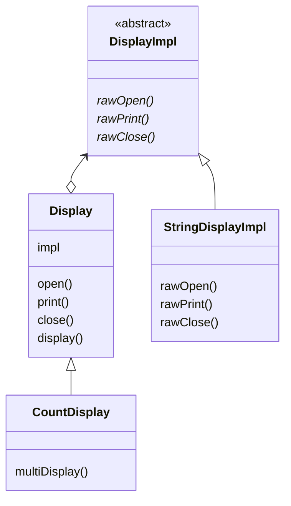
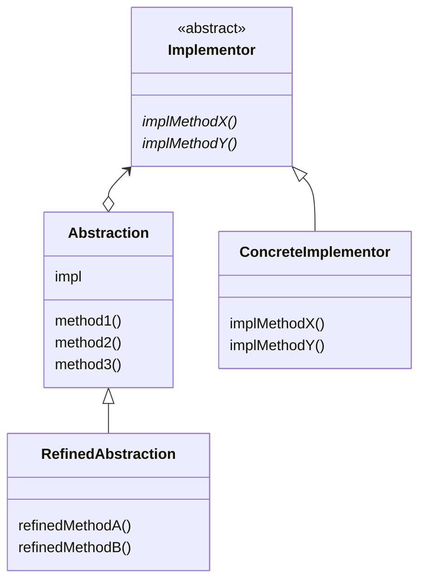

---

# Bridge Patten?

&nbsp; `bridge`란 '다리'라는 의미이다. 현실 세계에서 다리가 강 양쪽을 연결하는 역할을 하듯이, Bridge 패턴도 두 장소를 연결하는 역할을 한다. 여기서 장소는 클래스 계층을 의미하는데, `기능의 클래스 계층`과 `구현의 클래스 계층`이다.

# 클래스 계층의 두 가지 역할

&nbsp; 클래스 계층(클래스들의 상속 계층)은 클래스들 간의 상속 관계를 의미한다. 클래스 계층은 `기능의 클래스 계층`과 `구현의 클래스 계층`으로 나뉜다. 두 개의 클래스 계층을 설명하기 위해, 그래픽 도형을 다루는 예시를 준비해 보았다.

## 기능의 클래스 계층

- **상위클래스**: `DrawingAPI` (그리기 방식을 정의)
- **하위클래스**: `PenDrawingAPI`, `GraphicDrawingAPI` 등 (구체적인 그리기 방식을 구현)

&nbsp; 이 계층에서 `DrawingAPI` 클래스는 그래픽 도형을 어떻게 그릴지를 정의한다. 예를 들어, 도형을 선으로 그리거나 채우는 방식 등을 `DrawingAPI` 클래스에 정의할 수 있다. 이후 `PenDrawingAPI`, `GraphicDrawingAPI` 등의 하위클래스를 만들어 구체적인 그리기 방식을 구현한다. 각 하위클래스는 `DrawingAPI` 클래스에서 정의된 그리기 방식을 상속받아 사용하며, 구체적인 그리기 방식을 추가로 구현할 수 있다.<br><br>
&nbsp; 요약하자면, `상위클래스`는 기본적인 기능을 가지고 있고, `하위클래스`는 새로운 기능을 추가한다. 만약 `PenDrawingAPI` 클래스에 새로운 기능을 추가하여, `PenDrawingAPI` 클래스의 하위클래스로 `GraphicDrawingAPI` 클래스를 만들게 되면 아래와 같이 클래스의 계층이 한층 더 깊어진다.

```
DrawingAPI
  └──PenDrawingAPI
      └──GraphicDrawingAPI
```

## 구현의 클래스 계층

- **상위클래스**: `Shape` (Abstract 클래스,도형의 기본 특징 정의)
- **하위클래스**: `Circle`, `Rectangle`, `Triangle` 등 (Concrete 클래스, 각 도형의 특성을 추가로 정의)

&nbsp; 이 계층에서 `Shape` 클래스는 모든 도형이 가지는 공통된 특징을 정의한다. 예를 들면, 모든 도형은 위치를 가지며, 크기를 가질 수 있다. 이런 공통된 특성을 `Shape` 클래스에 정의하여 코드의 중복을 방지하고, 도형들 간에 공통된 인터페이스를 제공한다. 그리고 이러한 `Shape` 클래스를 상속받아 구체적인 도형 클래스(하위클래스)인 `Circle`, `Rectangle`, `Triangle` 등을 만들어낸다. 이 하위클래스들은 `Shape` 클래스에서 정의된 속성과 메서드를 상속받아 사용하며, 각 도형의 특성을 추가로 정의할 수 있다.<br><br>
&nbsp; 요약하자면, `상위클래스`는 추상 메서드로 인터페이스(API)를 규정하고, `하위클래스`는 구상 메서드로 그 인터페이스(API)를 구현한다. 만약 상위 클래스인 `Shape` 클래스의 추상 메서드를 구현한 하위 클래스들이 `Circle`, `Rectangle`, `Triangle`이 있다면 다음과 같이 클래스 계층이 만들어진다.

```
Shape
  ├──Circle
  ├──Rectangle
  └──Triangle
```

# 예제

&nbsp; Bridge 패턴을 사용한 예제 프로그램을 살펴보자. 여기서 만들 것은 `무언가를 표시하기` 위한 프로그램이다.

## 클래스 목록

|역할|이름|설명|
|---|---|---|
|기능의 클래스 계층|Display|'표시한다' 클래스|
|기능의 클래스 계층|CountDisplay|'지정 획수만큼 표시한다' 기능을 추가한 클래스|
|구현의 클래스 계층|DisplayImpl|'표시한다' 클래스|
|구현의 클래스 계층|StringDisplayImpl|'문자열을 사용해서 표시한다' 클래스|
||Main|동작 테스트용 클래스|

## 클래스 다이어그램



## Display 클래스

```java
package bridge_pattern;

// Display 클래스 : '기능의 클래스 계층' 최상위에 있는 클래스
public class Display {
	// impl 필드 : Display 클래스의 '구현'을 나타내는 인스턴스, **두 클래스 계층의 다리 역할을 함**
	private DisplayImpl impl;

	// 생성자 : 구현을 나타내는 인스턴스를 인수로 받음
	public Display(DisplayImpl impl) {
		// 인수로 받은 인스턴스를 필드에 대입, 이후 처리에 사용됨
		this.impl = impl;
	}

	// open, print, close 메소드 : Display 클래스에서 제공하는 인터페이스(API)
	// 이 메소드들은 모두 DisplayImpl 클래스의 메소드를 호출함으로써, Display의 인터페이스가 DisplayImpl의 인터페이스로 변환

	// 표시의 전처리
	public void open() {
		impl.rawOpen();
	}

	// 표시 그 자체
	public void print() {
		impl.rawPrint();
	}

	// 표시의 후처리
	public void close() {
		impl.rawClose();
	}

	// display 메서드 : '표시한다'라는 처리를 실현
	public final void display() {
		open();
		print();
		close();
	}
}
```

## CountDisplay 클래스

```java
package bridge_pattern;

// CountDisplay 클래스 : '기능의 클래스 계층'에 속하는 클래스, Display 클래스에 기능을 추가한 클래스
public class CountDisplay extends Display {
	public CountDisplay(DisplayImpl impl) {
		super(impl);
	}

	// CountDisplay 클래스에서 추가된 기능, Display 클래스에서 상속받응ㄴ open, print, close 메서드를 사용하여 multiDisplay라는 새로운 메서드를 구현
	public void multiDisplay(int times) {
		open();
		for (int i = 0; i < times; i++)
			print();
		close();
	}
}
```

## DisplayImpl 클래스

```java
package bridge_pattern;

// DisplayImpl 클래스 : '구현의 클래스 계층'의 최상위에 있는 클래스, 추상클래스, Display 클래스의 open, print, close 메서드에 대응하는 추상메서드를 선언
public abstract class DisplayImpl {

	public abstract void rawOpen();

	public abstract void rawPrint();

	public abstract void rawClose();
}
```

## StringDisplayImpl 클래스

```java
package bridge_pattern;

// StringDisplayImpl 클래스 : '구현의 클래스 계층'에 속하는 클래스, DisplayImpl 클래스의 하위 클래스
// rawOpen, rawPrint, rawClose 메서드를 구현함으로써 문자열을 표시
public class StringDisplayImpl extends DisplayImpl {
	private String string;
	private int width;

	public StringDisplayImpl(String string) {
		this.string = string;
		this.width = string.getBytes().length;
	}

	@Override
	public void rawOpen() {
		printLine();
	}

	@Override
	public void rawPrint() {
		System.out.println("|" + string + "|");
	}

	@Override
	public void rawClose() {
		printLine();
	}

	private void printLine() {
		System.out.print("+");
		for (int i = 0; i < width; i++)
			System.out.print("-");
		System.out.println("+");
	}
}
```

## Main 클래스

```java
package bridge_pattern;

public class Main {
	public static void main(String[] args) {
		// Display 인스턴스 - StringDisplayImpl 인스턴스를 구현 객체로 가짐
		Display d1 = new Display(new StringDisplayImpl("Hello, Korea."));

		// CountDisplay 인스턴스 - StringDisplayImpl 인스턴스를 구현 객체로 가짐
		Display d2 = new CountDisplay(new StringDisplayImpl("Hello, world."));
		CountDisplay d3 = new CountDisplay(new StringDisplayImpl("Hello, universe."));

		// Display 인스턴스의 display 메서드 호출 가능
		d1.display();
		d2.display();
		d3.display();   // CountDisplay 인스턴스의 multiDisplay 메서드 호출 불가능

		// CountDisplay 인스턴스의 multiDisplay 메서드 호출 가능
		d3.multiDisplay(5);
	}
}
```

## 실행 결과


# Bridge 패턴 등장인물

## Abstraction(추상화) 역

&nbsp; `기능의 클래스 계층`의 최상위 클래스이다. Implementor 역의 메소드를 사용하여 기본 기능만 기술된 클래스이다. 이 인스턴스는 Implemntor 역을 가진다. 예제에서는 `Display` 클래스이다.

## RefinedAbstraction(개선된 추상화) 역

&nbsp; Abstraction 역에 기능을 추가하였다. 예제에서는 `CountDisplay` 클래스가 이 역할을 담당하여 `multiDisplay` 기능이 추가되었다.

## Implementor(구현자) 역

&nbsp; `구현의 클래스 계층`의 최상위 클래스이다. Abstraction 역의 인터페이스(API)를 구현하기 위한 메서드를 규정하는 역할이다. 예제에서는 `DisplayImpl` 클래스가 이 역할을 맡아 추상 메서드인 `rawOpen`, `rawPrint`, `rawClose` 메서드를 규정하였다.

## ConcreteImplementor(구체적인 구현자) 역

&nbsp; 구체적으로 Implementor 역의 인터페이스(API)를 구현한다. 예제에서는 `StringDisplayImpl` 클래스가 이 역할을 담당하여 `rawOpen`, `rawPrint`, `rawClose` 메서드를 실제 구현하였다.

## Bridge 패턴의 클래스 다이어 그램



# 특징

## 클래스 계층의 분리

&nbsp; Bridge 패턴의 특징은 `기능의 클래스 계층`과 `구현의 클래스 계층`을 분리하는 것이다. 이 두 개의 클래스 계층을 분리해둠으로써 **각각의 클래스 계층을 독립적으로 확장할 수 있다.**<br>
&nbsp; 기능을 추가하고 싶으면 `기능의 클래스 계층`에서 새로운 클래스를 추가하면 되기 때문에, 구현의 클래스 계층은 전혀 수정할 필요가 없다. 또한 **새로 추가한 기능은 '모든 구현'에서 사용할 수 있다.**<br><br>
&nbsp; 예시로 이해해보자. 어떤 프로그램은 컴퓨터나 운영체제와 같은 실행 환경에 의존하는 부분이 있어, 실행 환경에 따라 A, B, C 버전으로 프로그램이 나뉠 수 있을 것이다. 이 때 실행 환경에 의존하는 부분을 Bridge 패턴의 구현의 클래스 계층으로 나타내는 것이다.<br>
&nbsp; 즉, 실행 환경에 공통된 인터페이스(API)를 정해서 Implementor 역으로 하고, ConcreteImplementor 역으로 A, B, C 버전 세 개의 클래스를 만들어 구현하도록 한다. 이를 통해 기능의 클래스 계층 쪽에서 아무리 기능을 추가하더라도 세 가지 실행 환경에 동시에 대응할 수 있게 된다.

## 약한 결합

&nbsp; `상속`은 클래스를 확장하는 편리한 방법이지만, 클래스 간의 연결을 강하게 고정시킨다. 아래와 같이 소스 코드를 작성하면, SomethingGood 클래스는 Something 클래스의 하위클래스가 된다.

```java
class SomethingGood extends Something {
  ...
}
```

&nbsp; **위 관계는 소스 코드를 다시 쓰지 않는 한 바꿀 수 없다.** 즉, 매우 강하게 결합된다는 것을 의미한다. 상황에 따라 클래스 간의 관계를 전환하고자 할 대 상속을 사용하는 것은 적절하지 않다. 전환할 때 마다 소스 코드를 변경하고 있을 수는 없기 때문이다. 이럴 때는 `상속`이 아닌 `위임`을 사용한다.<br>
&nbsp; 예제에서 `Display` 클래스 안에서 위임을 사용한다. Display 클래스의 `impl`
 필드에 구현의 인스턴스가 저장되어 있어, 아래와 같이 '일을 떠넘기고' 있다. 이것이 바로 `위임`이다.

```java
class Display {
	private DisplayImpl impl;

	public Display(DisplayImpl impl) {
		this.impl = impl;
	}

	public void open() {
		impl.rawOpen();
	}

	public void print() {
		impl.rawPrint();
	}

	public void close() {
		impl.rawClose();
	}

  ...
}
```

&nbsp; 상속은 견고한 연결이지만, **위임은 느슨한 연결이다.** Display 클래스의 인스턴스를 만드는 단계에서 인수로 넘어온 것과 연결되기 때문이다. 아래와 같이 예제에서는 Main 클래스에서 Display 및 CountDisplay의 인스턴스를 만들고, 그 때 StringDisplayImpl의 인스턴스를 인수로 넘겼다.<br>

```java
public class Main {
	public static void main(String[] args) {
		Display d1 = new Display(new StringDisplayImpl("Hello, Korea."));
    Display d2 = new CountDisplay(new StringDisplayImpl("Hello, world."));
		CountDisplay d3 = new CountDisplay(new StringDisplayImpl("Hello, universe."));
  }
}
```

&nbsp; 만약 StringDisplayImpl 클래스 이외에 ConcreteImplementor 역이 있어서 그 인스턴스를 Display나 CountDisplay에 넘겨 주면 그것으로 구현이 확실하게 전환이 된다. 전환할 때 수정한 것은 Main 클래스뿐이고, Display나 DisplayImpl 등의 소스 코드는 전혀 건드릴 필요가 없다.

---

## Reference

- 유키 히로시, 2022, JAVA 언어로 배우는 디자인 패턴 입문: 쉽게 배우는 GoF의 23가지 디자인 패턴