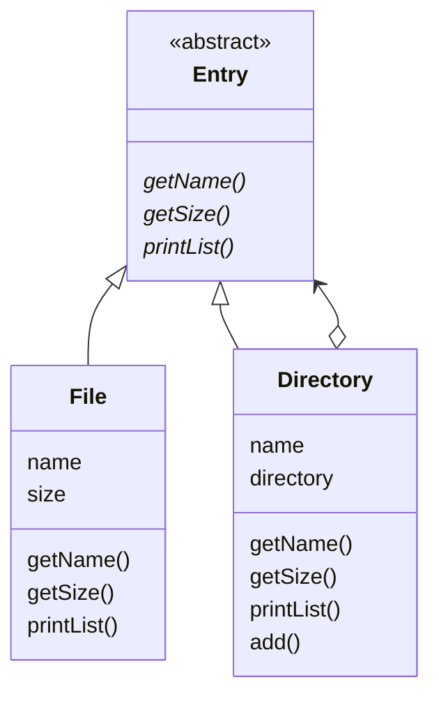
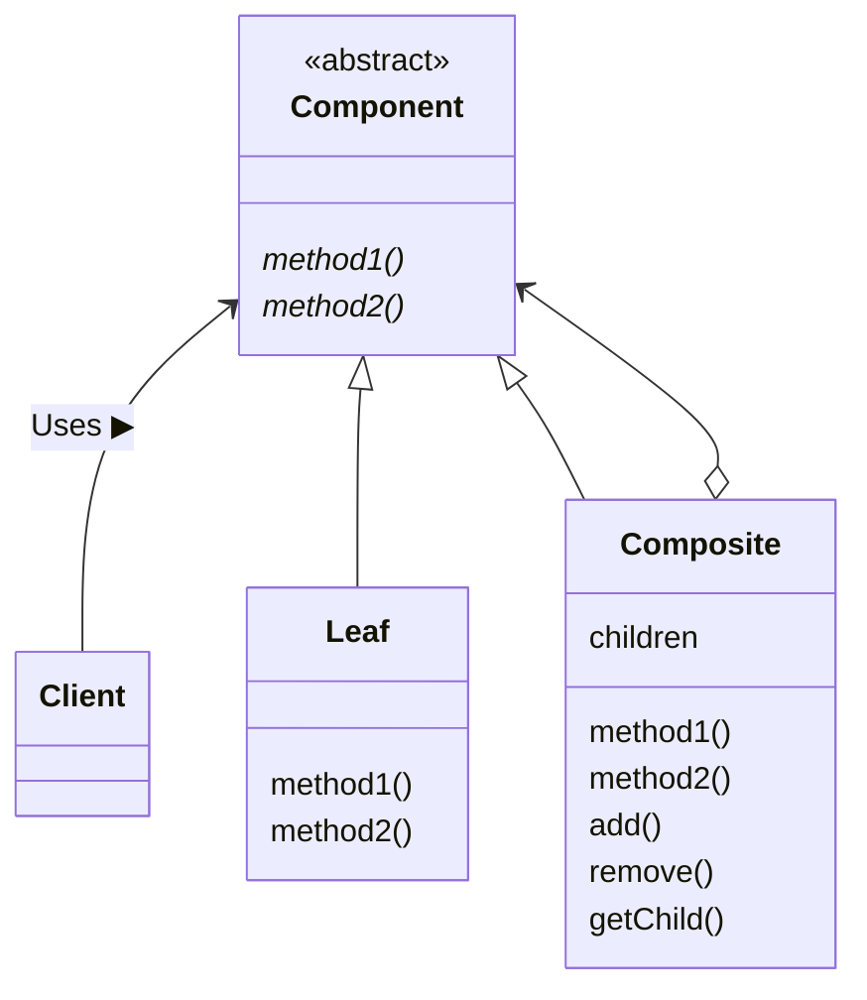

---

## Composite 패턴

### 한 줄 소개

&nbsp; `그릇과 내용물을 동일시한다.`


### 설명

&nbsp; 책의 예시를 통해 설명해보겠다. 컴퓨터의 파일 시스템에는 `디렉터리(혹은 폴더)`가 있다. 디렉터리 안에는 `파일`이나 다른 디렉터리(이를 `하위 디렉터리`라고 함)가 들어가기도 한다. 이렇게 디렉터리는 '중첩'된 구조, 재귀적인 구조를 만들어낸다.<br>
&nbsp; 이렇게 컴퓨터의 파일 시스템에는 크게 `디렉터리`와 `파일`로 구분할 수 있는데, 디렉터리와 파일은 서로 다른 요소지만 둘 다 **'디렉터리 안에 넣을 수 있다'**라는 특징이 있고, 이를 `디렉터리 엔트리`라는 이름으로 묶어서 `디렉터리`와 `파일`을 같은 종류로 간주할 수 있다.<br>
&nbsp; 디렉터리 안에 무엇이 있는 지 조사한다고 했을 때, 해당 디렉터리 내에 있는 것이 하위 디렉터리일 수도 있고, 파일일 수도 있다. 이를 **디렉터리 엔트리를 차례대로 조사**한다고 한다.<br>
&nbsp; 이와 같이, 그릇(디렉터리)과 내용물(파일)을 같은 종류로 취급하면 설명하기 편리한 구조가 있을 것이다. 그릇 안에는 내용물을 여러 개 넣을 수도 있고, 더 작은 그릇을 넣을 수도 있다. 그리고 그 작은 그릇 안에 더 작은 그릇을 넣는 식으로 `중첩된 구조`, `재귀적인 구조`를 만들 수 있다.<br>
&nbsp; `Composite 패턴`은 이러한 구조를 만들기 위한 패턴이다. **그릇과 내용물을 동일시하여 재귀적인 구조를 만드는 디자인 패턴**이다. composite란 **혼합물**, **복합물**이라는 뜻이다.

### 예제

#### 예제 설명

&nbsp; Composite 패턴을 통해 파일과 디렉터리를 도식적으로 표현한 프로그램을 작성해보았다.

#### 클래스 목록

|이름|설명|
|---|---|
|**Entry**|File과 Directory 클래스를 동일시하기 위한 추상 클래스|
|**File**|파일을 나타내는 클래스|
|**Directory**|디렉터리를 나타내는 클래스|
|**Main**|동작을 테스트하기 위한 메인 클래스|

#### 소스 코드

- **Entry.java**

    ```java
    // Fire과 Directory를 동일시하기 위한 추상 클래스
    public abstract class Entry {
      // 이름을 얻기 위한 메서드
      public abstract String getName();

      // 크기를 얻기 위한 메서드
      public abstract int getSize();

      // 목록을 표시하기 위한 메서드
      public void printList() {
        printList("");
      }

      // prefix를 앞에 붙여서 목록을 표시하기 위한 메서드
      protected abstract void printList(String prefix);

      // 문자열을 표시하기 위한 메서드
      // Template Method 패턴 활용: 추상 메서드인 getName과 getSize를 사용함으로써 하위 클래스의 구현을 기대함
      @Override
      public String toString() {
        return getName() + " (" + getSize() + ")";
      }
    }
    ```

- **File.java**

    ```java
    // 파일을 표현하는 클래스(Entry 클래스의 하위 클래스)
    public class File extends Entry {
      private String name;    // 파일명
      private int size;       // 파일 크기

      // 생성자 - ex) new File("readme.txt", 1000);
      public File(String name, int size) {
        this.name = name;
        this.size = size;
      }

      @Override
      public String getName() {
        return name;
      }

      @Override
      public int getSize() {
        return size;
      }

      // entry 클래스에서 정의한 printList 메서드를 구현
      @Override
      protected void printList(String prefix) {
        System.out.println(prefix + "/" + this);
      }
    }
    ```

- **Directory.java**

    ```java
    import java.util.ArrayList;
    import java.util.List;

    // 디렉터리를 표현하는 클래스(Entry 클래스의 하위 클래스)
    public class Directory extends Entry {
      private String name;    // 디렉터리명
      private List<Entry> directory = new ArrayList<>();    // 디렉터리 엔트리를 보관하기 위한 필드(디렉터리 크기를 동적 계산)

      public Directory(String name) {
        this.name = name;
      }

      @Override
      public String getName() {
        return name;
      }

      // 디렉터리 엔트리의 크기를 동적으로 얻기 위한 메서드
      // Composite 패턴의 특징: Directory던 File이던 getSize 메서드를 호출하면 크기를 얻을 수 있음 => '그릇과 내용물을 동일시한다'
      @Override
      public int getSize() {
        int size = 0;
        // directory 필드에 보관된 디렉터리 엔트리 요소를 하나씩 꺼내, 크기를 더해 반환
        for (Entry entry : directory) {
          size += entry.getSize();
        }
        return size;
      }

      @Override
      protected void printList(String prefix) {
        System.out.println(prefix + "/" + this);
        for (Entry entry : directory) {
          entry.printList(prefix + "/" + name);
        }
      }

      // 디렉터리 엔트리를 디렉터리에 추가
      public Entry add(Entry entry) {
        directory.add(entry);
        return this;
      }
    }
    ```

- **Main.java**

    ```java
    // 동작 테스트용 클래스, 디렉터리 계층을 생성
    // root
    //  ├── bin
    //  │    ├── vi
    //  │  └── latex
    //  │
    //  ├── tmp
    //  └── usr
    //       ├── youngjin
    //       │    ├── diary.html
    //       │    └── Composite.java
    //       ├── gildong
    //       │    └── memo.tex
    //       └── dojun
    //            ├── game.doc
    //            └── junk.mail
    public class Main {
      public static void main(String[] args) {
        System.out.println("Making root entries...");

        // root 디렉터리 생성
        Directory rootDir = new Directory("root");
        Directory binDir = new Directory("bin");
        Directory tmpDir = new Directory("tmp");
        Directory usrDir = new Directory("usr");

        // 디렉터리 내에 디렉터리 추가
        rootDir.add(binDir);
        rootDir.add(tmpDir);
        rootDir.add(usrDir);
        binDir.add(new File("vi", 10000));
        binDir.add(new File("latex", 20000));
        rootDir.printList();
        System.out.println();

        // user 디렉터리 생성
        System.out.println("Making user entries...");
        Directory youngjin = new Directory("youngjin");
        Directory gildong = new Directory("gildong");
        Directory dojun = new Directory("dojun");
        usrDir.add(youngjin);
        usrDir.add(gildong);
        usrDir.add(dojun);

        // user 디렉터리 내에 디렉터리 및 파일 추가
        youngjin.add(new File("diary.html", 100));
        youngjin.add(new File("Composite.java", 200));
        gildong.add(new File("memo.tex", 300));
        dojun.add(new File("game.doc", 400));
        dojun.add(new File("junk.mail", 500));
        rootDir.printList();
      }
    }
    ```

- **실행 결과**
    

#### 클래스 다이어그램



&nbsp; 서브 클래스인 `File` 클래스와 `Directory` 클래스는 `Entry`라는 슈퍼 클래스(추상 클래스)를 `Generalization(일반화)`한 것이고, `Directory` 클래스의 멤버 변수인 `directory`를 통해 `Entry` 클래스를 참조함으로써 `Aggregation(집합)` 관계를 가진다.

### 클래스 다이어그램



#### Client

&nbsp; Composite 패턴의 사용자이다. 예제에서 Main 클래스와 매칭된다.

#### Component

&nbsp; `Leaf`와 `Composite`를 동일시하기 위해 `Leaf` 클래스와 `Composite` 클래스의 공통되는 상위 클래스로 구현된다. 예제에서 Entry 클래스와 매칭된다.

#### Leaf

&nbsp; '내용물'을 나타내고, `Leaf` 안에는 다른 것을 넣을 수 없다. 예제에서 File 클래스와 매칭된다.

#### Composite

&nbsp; '그릇'을 나타내고, `Composite` 안에 `Leaf` 혹은 `Composite`을 넣을 수 있다. 예제에서 Directory 클래스와 매칭된다.

### 요약

&nbsp; `Composite 패턴`은 객체들을 트리 구조로 구성하여 부분-전체 관계를 나타내는 패턴이다. 이 패턴은 개별 객체(책에서 `Leaf`)와 복합 객체(책에서 `Composite`)를 동일한 방식으로 다룰 수 있게 해주며, 객체들 간의 계층 구조를 표현할 때 유용하게 활용할 수 있다.<br>
&nbsp; `Composite 패턴의 핵심 특징`은 다음과 같다.

1. **부분-전체 관계 표현**: Composite 패턴은 객체들 간의 부분-전체 관계를 모델링한다. Leaf 객체와 Composite 객체를 동일한 방식으로 다룰 수 있게 하여, 클라이언트 코드가 객체의 계층 구조를 알 필요 없이 객체들을 사용할 수 있도록 한다.
2. **Component와 Leaf 노드**: 패턴에서 Leaf 객체와 Composite 객체는 동일한 인터페이스(책에서 `Component`)를 구현한다.
3. **Composite 객체**: Cmposite 객체는 하나 이상의 Component를 가질 수 있다. 이를 통해 객체들의 중첩 구조를 형성할 수 있고, Composite 객체는 Leaf 노드 혹은 다른 Composite 객체를 가질 수 있다.
4. **일관된 접근**: Composite 패턴은 Leaf 객체와 Composite 객체를 일관된 방식으로 다룰 수 있도록 한다. 클라이언트 코드는 객체의 타입에 관계 없이 동일한 메서드를 사용하여 객체를 조작할 수 있다.

---

## Reference

- 유키 히로시, 2022, JAVA 언어로 배우는 디자인 패턴 입문: 쉽게 배우는 GoF의 23가지 디자인 패턴
