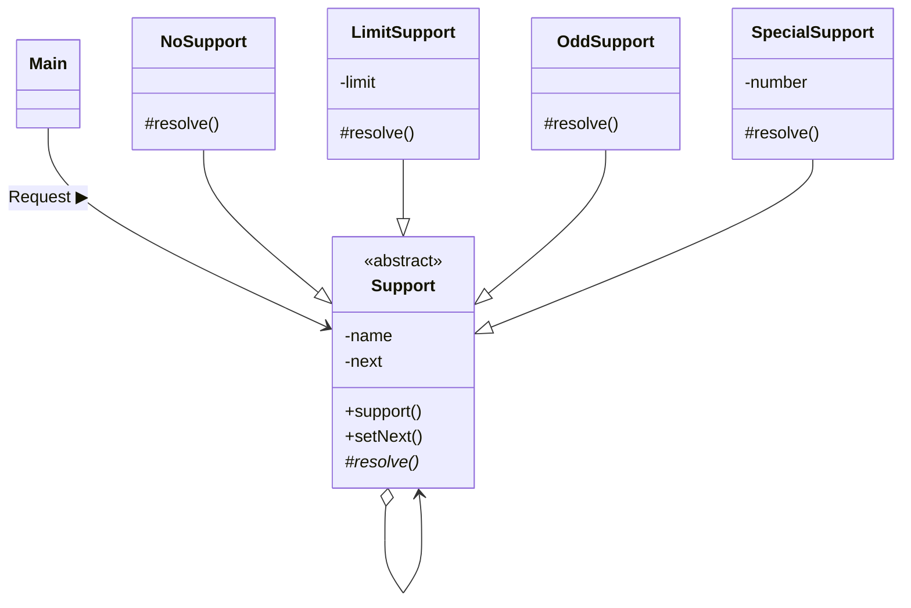
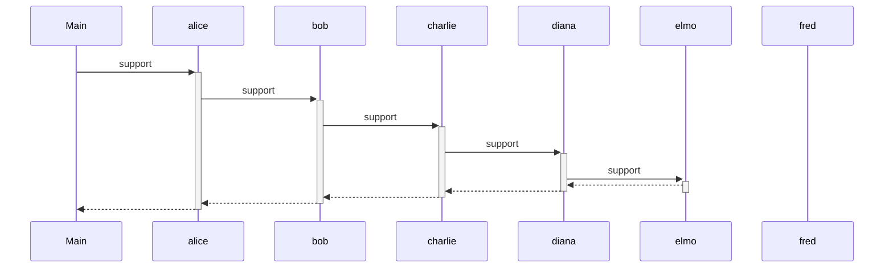
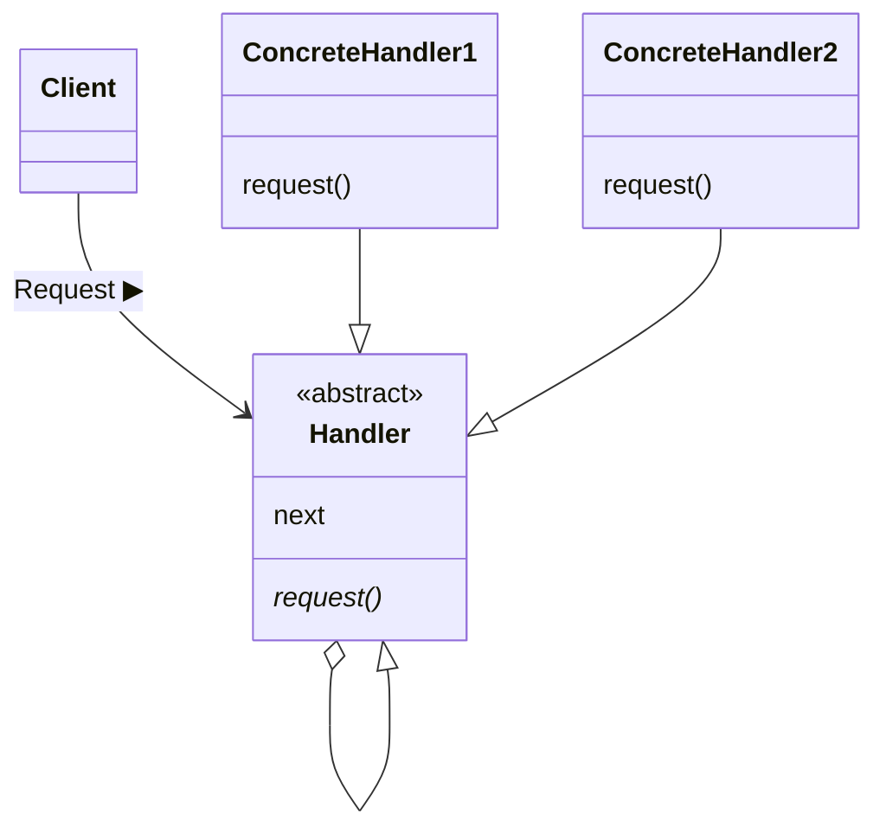

---

## Chain of Responsibility

### 한 줄 소개

&nbsp; `책임을 떠넘긴다.`


### 설명

&nbsp; 책의 예시를 통해 설명해보겠다. 어떤 서류를 받으러 회사에 갔다고 가정해보자. 회사 안내 창구에 물어보니 '영업부'로 가라고 한다. 그래서 영업부로 가니, 그 서류는 '고객관리부'에서 취급한다고 한다. 다시 고객관리부로 갔더니, 그 서류는 '문서 지원 센터'에서 받을 수 있다고 한다. 여기까지 오면 짜증이 나겠지만, 다시 '문서 지원 센터'로 갈 것이다. 이런 식으로 적합한 사람을 만날 때까지 계속해서 다음 사람, 다음 사람에게 자신의 요청을 넘기는 것이 `떠넘기기`이다.<br>
&nbsp; 떠넘긴다는 말이 부정적인 의미가 강하지만, 정말 `떠넘기기`로 표현하고 싶어지는 처리가 필요할 때가 있다. 어떤 요청이 있을 때, 그 요청을 처리할 객체(오브젝트)를 고정적으로 결정할 수 없는 경우이다. 이럴 때 **여러 객체를 사슬(chain)처럼 연쇄적으로 묶고, 객체 사슬을 차례대로 돌면서 원하는 객체를 결정하는 방법**을 생각할 수 있다.<br><br>
&nbsp; 이러한 패턴을 `Chain of Responsibility 패턴`이라고 한다. responsibility란 책임을 뜻하므로, 우리말로 하면 '책임 사슬'로 직역할 수 있을 것이다. **책임을 '떠넘기는' 구조라고 생각하면 기억하기 쉬울 것이다.** 이 패턴을 통해, `요청하는 쪽`과 `처리하는 쪽`의 결합을 약하게 할 수 있어, 각각 부품으로 독립시킬 수 있다. 또 상황에 따라 요청을 처리할 객체가 변하는 프로그램에도 대응할 수 있다.<br><br>
&nbsp; 어떤 사람에게 요청이 들어왔을 때, `그 사람`이 요청을 처리할 수 있으면 처리하고, 처리할 수 없을 때는 그 요청을 `다음 사람`에게 넘기는 것을 반복하는 형식이 바로 `Chain of Responsibility(책임 사슬)` 패턴이다.

### 예제

#### 예제 설명

&nbsp; 트러블이 발생했을 때 누군가가 해결해야 하는 상황을 생각해보자.

#### 클래스 목록

|이름|설명|
|---|---|
|**Trouble**|발생한 트러블을 나타내는 클래스, 트러블 번호(number)를 가짐|
|**Support**|트러블을 해결하는 추상 클래스|
|**NoSupport**|트러블을 해결하는 구상 클래스(항상 '처리하지 않음')|
|**LimitSupport**|트러블을 해결하는 구상 클래스(지정한 번호 미만의 트러블 해결)|
|**OddSupport**|발생한 트러블을 나타내는 클래스, 트러블 번호(number)를 가짐|
|**SpecialSupport**|발생한 트러블을 나타내는 클래스, 트러블 번호(number)를 가짐|
|**Main**|Support의 연쇄를 만들어 트러블을 일으키는 동작을 테스트하기 위한 메인 클래스|

#### 소스 코드

- **Trouble.java**

  ```java
  // 발생한 트러블을 나타내는 클래스, 트러블 번호(number)를 가짐
  public class Trouble {
    private int number; // 트러블 번호

    // 트러블 생성
    public Trouble(int number) {
      this.number = number;
    }

    // 트러블 번호를 얻음
    public int getNumber() {
      return number;
    }

    @Override
    public String toString() {
      return "[Trouble " + number + "]";
    }
  }
  ```

- **Support.java**

  ```java
  // 트러블을 해결하는 추상 클래스
  public abstract class Support {
  private String name; // 트러블 해결자의 이름
  private Support next; // 떠넘기는 곳

  // 트러블 해결자의 생성
  public Support(String name) {
    this.name = name;
  }

  // 떠넘기는 곳을 설정
  public Support setNext(Support next) {
    this.next = next;
    return next;
  }

  // 트러블 해결의 수순
  public final void support(Trouble trouble) {
    if (resolve(trouble)) {
    done(trouble);
    } else if (next != null) {
    next.support(trouble);
    } else {
    fail(trouble);
    }
  }

  // 트러블 해결자의 문자열 표현
  @Override
  public String toString() {
    return "[" + name + "]";
  }

  // 해결용 메소드
  protected abstract boolean resolve(Trouble trouble);

  // 해결했음
  protected void done(Trouble trouble) {
    System.out.println(trouble + " is resolved by " + this + ".");
  }

  // 해결되지 않았음
  protected void fail(Trouble trouble) {
    System.out.println(trouble + " cannot be resolved.");
  }
  }
  ```

- **NoSupport.java**

  ```java
  // 트러블을 해결하는 구현 클래스(항상 '처리하지 않음')
  public class NoSupport extends Support {
  public NoSupport(String name) {
    super(name);
  }

  @Override
  protected boolean resolve(Trouble trouble) {
    return false; // 항상 '처리하지 않음'
  }
  }
  ```

  - **LimitSupport.java**

  ```java
  // 트러블을 해결하는 구현 클래스(특정 번호 미만의 트러블만 처리)
  public class LimitSupport extends Support {
  private int limit; // 이 번호 미만이면 해결할 수 있음

  public LimitSupport(String name, int limit) {
    super(name);
    this.limit = limit;
  }

  @Override
  protected boolean resolve(Trouble trouble) {
    if (trouble.getNumber() < limit) {
    return true;
    } else {
    return false;
    }
  }
  }
  ```

- **OddSupport.java**

  ```java
  // 트러블을 해결하는 구현 클래스('홀수' 번호의 트러블만 처리)
  public class OddSupport extends Support {
  public OddSupport(String name) {
    super(name);
  }

  @Override
  protected boolean resolve(Trouble trouble) {
    if (trouble.getNumber() % 2 == 1) {
    return true;
    } else {
    return false;
    }
  }
  }
  ```

- **SpecialSupport.java**

  ```java
  // 트러블을 해결하는 구현 클래스(특정 번호 트러블만 처리)
  public class SpecialSupport extends Support {
    private int number; // 이 번호만 해결할 수 있음

    public SpecialSupport(String name, int number) {
      super(name);
      this.number = number;
    }

    @Override
    protected boolean resolve(Trouble trouble) {
      if (trouble.getNumber() == number) {
      return true;
      } else {
      return false;
      }
    }
  }
  ```

- **Main.java**

  ```java
  // Support의 연쇄를 만들어 트러블을 일으키는 동작 테스트용 클래스
  public class Main {
  public static void main(String[] args) {
    Support alice = new NoSupport("Alice"); // 아무도 처리하지 않음
    Support bob = new LimitSupport("Bob", 100); // 100 미만만 처리
    Support charlie = new SpecialSupport("Charlie", 429); // 429만 처리
    Support diana = new LimitSupport("Diana", 200); // 200 미만만 처리
    Support elmo = new OddSupport("Elmo"); // 홀수만 처리
    Support fred = new LimitSupport("Fred", 300); // 300 미만만 처리

    // 사슬의 형성
    alice.setNext(bob).setNext(charlie).setNext(diana).setNext(elmo).setNext(fred);

    // 다양한 트러블 발생
    for (int i = 0; i < 500; i += 33) {
    alice.support(new Trouble(i));
    }
  }
  }
  ```

- **실행 결과**

  

#### 클래스 다이어그램



#### 시퀀스 다이어그램



### 클래스 다이어그램



#### Handler

&nbsp; `처리자`. **요구를 처리하는 인터페이스를 (API)**정의한다. 처리할 '다음 사람'(마찬가지로 Handler)을 준비해 두고 스스로 처리할 수 없는 요구가 나오면 그 사람에게 넘겨 준다. 예제에서는 Support 클래스와 매칭된다.

#### ConcreteHandler

&nbsp; `구체적인 처리자`. **요구를 구체적으로 처리한다.** 예제 프로그램에서는 NoSupport, LimitSupport, OddSupport, SpecialSupport 클래스와 매칭된다.

#### Client

&nbsp; `요구자`. **첫 번째 ConcreteHandler에 요구한다.** 예제에서는 Main 클래스와 매칭된다.

### 특징

#### 동적으로 사슬 형태 변경

&nbsp; 예제에서 ConcreteHandler의 순서는 고정되어 있었지만, 요구를 처리하는 ConcreteHandler의 관계가 동적으로 변화하는 상황도 구현할 수 있다. 위임을 통해 처리를 떠넘기면 상황 변화에 따라서 ConcreteHandler 역을 재편할 수 있다.<br>
&nbsp; 만약 Chain of Responsibility 패턴을 사용하지 않고 프로그램 안에 요구에 대한 처리자를 지정하는 방식으로 대응 관계를 고정할 경우, 프로그램 실행 중에 처리자를 변경하기 어려워질 것이다.<br>
&nbsp; GUI 앱에서 사용자가 앱 화면 상에 컴포넌트를 자유롭게 추가할 수 있는 경우에 Chain of Responsibility 패턴이 효과적이다.

#### 자기 일에 집중

&nbsp; `떠넘기기`라고 이야기한다면 부정적인 뉘앙스를 풍기게 되지만, 각 객체가 `자기 일에 집중할 수 있다`라는 의미도 된다. 각 ConcreteHandler는 자신이 할 수 있는 일에 집중하고, 할 수 없는 일이라면 다음 ConcreteHandler에게 넘기게 되므로 각 **ConcreteHandler로 작성해야하는 처리가 해당 클래스의 고유한 내용으로 좁혀지게 된다.**<br>
&nbsp; 만약 이 패턴을 사용하지 않는다면, '관리자가 누가 요구를 처리할 지 모두 결정'하는 방법을 취하거나, '자신이 처리하지 못하면 다른 사람에게 맡기고, 그래도 안되면 이 사람, 시스템 상황이 이렇다면 저 사람' 등으로 '일의 할당'까지 각각의 ConcreteHandler 클래스에 정의해야 할 것이다.

#### 떠넘기기로 인한 처리 지연

&nbsp; Chain of Responsibility 패턴을 사용하면 떠넘기면서 적절한 처리를 할 ConcreteHandler를 찾는 방식이므로 유연성은 높다. 하지만 담당자를 한 번에 선택해놓고, 바로 처리할 때와 비교하게 되면 처리가 지연되게 된다.<br>
&nbsp; 이 점은 유연성을 높게 가져갈 지, 처리 속도를 빠르게 가져갈 지에 대한 `trade-off`이다. 만약 요구와 처리자의 관계가 고정적이고 처리 속도가 매우 중요하다면 Chain of Responsibility 패턴을 사용하지 않는 편이 효과적일 수도 있다.

### 요약

&nbsp; Chain of Responsibility 패턴의 `포인트`는 Client와 ConcreteHandler를 느슨하게 연결하는 데 있다. Client는 첫 번째 ConcreteHandler에게 요구만하면 그 요구가 사슬 안을 흘러가다가 적절한 처리자에 의해 처리되는 것이다.<br>
&nbsp; 만약 이 패턴을 사용하지 않고 구현한다면, `이 요구는 A라는 사람이 처리해야 한다`라는 정보를 누군가가 중앙집권적으로 가지고 있어야 한다. 이러한 정보를 Client가 가지고 있는 것은 적절하지 못하다(민원인이 담당 공무원이 누군지 정확하게 알고 있다고 생각하면 될 듯). 요구하는 사람이 처리자들의 세부적인 역할 분담까지 알아야 한다면, 부품으로서의 독립성이 훼손되기 때문이다.<br><br>
&nbsp; Chain of Responsibility 패턴은 GUI 앱에 많이 사용된다고 한다.

---

## Reference

- 유키 히로시, 2022, JAVA 언어로 배우는 디자인 패턴 입문: 쉽게 배우는 GoF의 23가지 디자인 패턴
