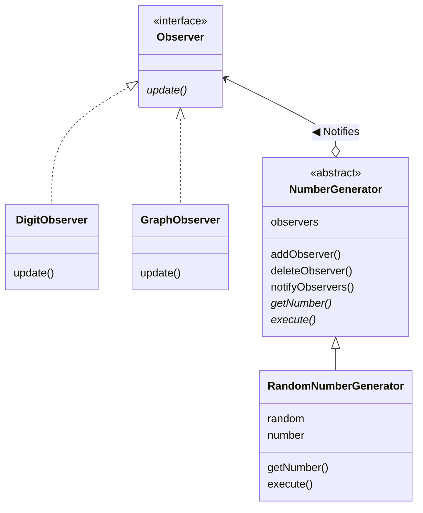
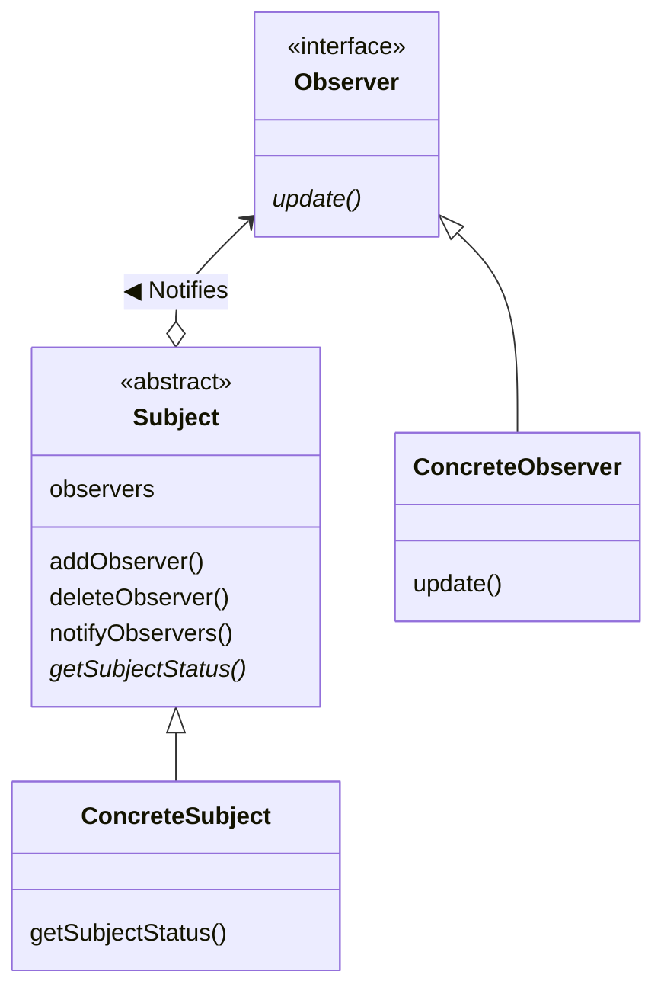

---

## Observer Pattern


&nbsp; **상태 변화를 알려준다.**

### 설명

&nbsp; `observer`란 관찰(observe)하는 사람, 즉 '관찰자'라는 의미이다. Observer 패턴에서는 관찰 대상의 상태가 변화하면 관찰자에게 알리는데, 상태 변화에 따른 처리를 기술할 때 효과적으로 사용할 수 있다.<br>
&nbsp; Observer 패턴은 `Publish-Subscribe` 패턴으로 불리기도 한다.

### 예제

&nbsp; 예제에서는 수를 생성하는 객체를 관찰자가 관찰하고 그 값을 표시하는 프로그램이다.

#### 클래스 & 인터페이스 목록

|이름|설명|
|---|---|
|Observer|관찰자를 나타내기 위한 인터페이스|
|NumberGenerator|수를 생성하는 객체를 나타내는 추상 클래스|
|RandomNumberGenerator|난수를 생성하는 클래스|
|DigitObserver|숫자로 수를 표시하는 클래스|
|GraphObserver|간이 그래프로 수를 표시하는 그래프|
|Main|동작 테스트용 클래스|

#### 소스 코드

- **Observer**

```java
package observer_pattern;

// 관찰자를 나타내기 위한 인터페이스
public interface Observer {
 public abstract void update(NumberGenerator generator);
}
```

- **NumberGenerator**

```java
package observer_pattern;

import java.util.ArrayList;
import java.util.List;

// 수를 생성하는 객체를 나타내기 위한 추상 클래스
public abstract class NumberGenerator {
 // Observer들을 저장
 private List<Observer> observers = new ArrayList<>();

 // Observer를 추가
 public void addObserver(Observer observer) {
  observers.add(observer);
 }

 // Observer를 삭제
 public void deleteObserver(Observer observer) {
  observers.remove(observer);
 }

 /**
  * Observer들에게 통지
  */
 public void notifyObservers() {
  for (Observer o : observers) {
   o.update(this);
  }
 }

 // 수를 얻음
 public abstract int getNumber();

 // 수를 생성
 public abstract void execute();
}
```

- **RandomNumberGenerator**

```java
package observer_pattern;

import java.util.Random;

// 난수를 생성하는 클래스(NumberGenerator를 상속)
public class RandomNumberGenerator extends NumberGenerator {
 private Random random = new Random();   // 난수생성기
 private int number;                     // 현재의 난수

 /**
  * 생성한 난수를 취득하는 메서드
  * @return
  */
 @Override
 public int getNumber() {
  return number;
 }

 /**
  * 난수를 생성하고 Observer들에게 통지하는 메서드
  */
 @Override
 public void execute() {
  for (int i = 0; i < 20; i++) {
   number = random.nextInt(50);
   notifyObservers();
  }
 }
}
```

- **DigitObserver**

```java
package observer_pattern;

// 숫자로 수를 표시하는 클래스(Observer 인터페이스 구현)
public class DigitObserver implements Observer {
 @Override
 public void update(NumberGenerator generator) {
  System.out.println("DigitObserver: " + generator.getNumber());
  try {
   Thread.sleep(100);
  } catch (InterruptedException e) {
   e.printStackTrace();
  }
 }
}
```

- **GraphObserver**

```java
package observer_pattern;

// 간이 그래프로 수를 표시하는 클래스(Observer 인터페이스 구현)
public class GraphObserver implements Observer {
 @Override
 public void update(NumberGenerator generator) {
  System.out.print("GraphObserver: ");
  int count = generator.getNumber();
  for (int i = 0; i < count; i++) {
   System.out.print("*");
  }
  System.out.println("");
  try {
   Thread.sleep(100);
  } catch (InterruptedException e) {
   e.printStackTrace();
  }
 }
}
```

- **Main**

```java
package observer_pattern;

// 옵저버 패턴을 테스트하기 위한 동작 테스트용 클래스
public class Main {
 public static void main(String[] args) {
  NumberGenerator generator = new RandomNumberGenerator();
  Observer observer1 = new DigitObserver();
  Observer observer2 = new GraphObserver();
  generator.addObserver(observer1);
  generator.addObserver(observer2);
  generator.execute();
 }
}
```

#### 클래스 다이어그램


<!-- <details>
<summary>mermaid</summary>



</details> -->

### 클래스 다이어그램


<!-- <details>
<summary>mermaid</summary>



</details> -->

- **Subject**

    &nbsp; `관찰되는 대상`을 의미한다.<br>
    &nbsp; Observer를 등록하는 메서드(`addObserver`)와 삭제(`deleteObserver`)하는 메서드, Observer에게 현재 상태를 알리는(`notifyObservers`) 메서드, 현재 상태를 가져오는 메서드(`getSubjectStatus`)를 가진다. 예제의 NumberGenerator 추상 클래스와 매칭된다.

- **ConcreteSubject**

    &nbsp; 구체적인 `관찰되는 대상`을 표현한다. 상태가 변경되면 등록된 Observer에게 알린다. 예제의 RandomNumberGenerator 클래스와 매칭된다.

- **Observer**

    &nbsp; Subject로부터 `상태가 변화되었음을 전달받는다`.<br>
    &nbsp; `update` 메서드를 통해 전달받으며, 예제에서는 `Observer` 인터페이스와 매칭된다.

- **ConcreteObserver**

    &nbsp; 구체적인 Observer를 구현한 클래스이다.<br>
    &nbsp; `update` 메서드가 호출되면 그 메서드 안에서 Subject의 현재 상태를 취득한다. 예제에서는 DigitObserver 클래스, GraphObserver 클래스와 매칭된다.

### 핵심

#### 구상 클래스 교환 가능성을 위해 추상 클래스와 인터페이스 활용하기

&nbsp; Observer 패턴에서는 상태를 가지는 `ConcreteSubject`와 상태의 변화를 통보받는 `ConcreteObserver`가 등장하고, 이 두 클래스를 연결하는 것이 바로 인터페이스(API)로인 `Subject`와 `Observer`이다.<br>
&nbsp; 예제에서 `RandomNumberGenerator` 클래스는 자신을 현재 관찰하는 것(통지할 상대)가 무엇인지 모르지만, observers 필드에 저장된 인스턴스가 `Observer` 인터페이스를 구현하고 있다는 것은 알고 있고, `update` 메서드를 호출 할 수 있다.<br>
&nbsp; 반면에 `DigitObserver` 클래스는 자신이 관찰하는 대상이 무엇인지 모르지만, `NumberGenerator`의 하위 클래스의 인스턴스인 것을 알고 있고, `getNumber` 메서드를 가지고 있다는 것을 알고 있다.<br>
&nbsp; 이를 통해 궁극적으로 깨달아야 할 점은 다음과 같다.

- 추상 클래스나 인터페이스를 사용하여 구상 클래스로부터 추상 클래스를 분리한다.
- 인수로 인스턴스를 전달할 때나 필드로 인스턴스를 저장할 때는 구상 클래스형으로 하지 않고 추상 클래스나 인터페이스형으로 해 둔다.

#### Observer의 독립성 유지

&nbsp; 예제에서는 `notifiyObservers` 메서드를 통해 observers에 저장된 순서대로`Observer`의 `update` 메서드가 순차적으로 호출된다.<br>
&nbsp; 예제에서와 같이 `ConcreteObserver`를 설계할 때는 `update` 메서드가 호출되는 순서가 바뀌어도 문제가 되지 않도록 해야한다. 예를 들면 예제와 다르게 `DigitObserver`의 `update` 메서드가 `GraphObserver`의 `update` 메서드보다 먼저 출력되어도 정상적으로 동작하는 것처럼 말이다.<br>
&nbsp; 이를 위해 각 클래스의 독립성을 제대로 유지함으로써 의존성의 혼란을 일으키지 않도록 주의하여야 한다.<br>
&nbsp; 가장 쉬운 예시로 `Subject`가 `update`를 호출하는 계기가 해당 `Observer`일 경우에 문제가 발생하기 쉽다.

1. Subject 상태 변화
2. Observer에게 통지
3. Observer가 Subject의 메서드 호출
4. 이에 따른 Subject의 상태 변화
5. Observer에게 통지
6. ...무한 반복...

&nbsp; 이를 위해서는 현재 통지 처리 중인지 아닌지를 Observer가 판단하거나, 통지하는 타이밍을 Subject가 고려하는 등의 로직이 필요할 것이다.

### 요약

&nbsp; observer라는 말은 '관찰자'라는 의미이지만, 실제로 동작하는 것을 살펴보면 능동적으로 '관찰'하기 보다는 Subject에서 '알려 주는 것'을 수동적으로 기다리는 것에 더 가깝다. 그래서 Observer 패턴은 `Publish(발행)-Subscribe(구독)` 패턴이라고 불리기도 한다.<br>
&nbsp; MVC(Model / View / Controller) 구조에서 `Model`과 `View`가 Observer 패턴의 `Subject`와 `Observer` 관계에 대응한다. Model은 '표시 형식에 의존하지 않는 내부 모델'을 조작하는 부분이고, View는 'Model을 어떻게 보여 줄지' 관리하는 부분으로, 일반적으로 하나의 Model에 다수의 View가 대응한다.

---

## Reference

- 유키 히로시, 2022, JAVA 언어로 배우는 디자인 패턴 입문: 쉽게 배우는 GoF의 23가지 디자인 패턴
