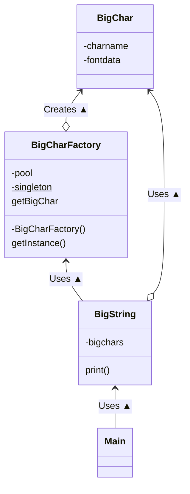

---

## Flyweight Pattern


&nbsp; 같은 것은 공유해서 낭비를 없앤다.

### 사전적 정의

| | |
|---|---|
|

&nbsp; `flyweight`란 복싱에서 가장 체급이 가벼운 '플라이급'을 의미한다. 이를 통해 알 수 있듯이 이 패턴은 객체를 **'가볍게'** 만들기 위한 패턴이다.

### 객체를 가볍게 만들기 위해?

&nbsp; 객체(object)는 컴퓨터 안에 가상으로 존재하는 것이므로 '무겁다' 혹은 '가볍다'라는 의미가 실제 무게를 나타내는 것은 당연히 아닐 것이다. 여기서 말하는 무게는 '메모리 사용량'으로, 메모리를 많이 사용하는 객체를 '무겁다'라고 표현할 수 있고 반대로 적게 사용하는 객체는 '가볍다'라고 표현할 수 있다.<br>

&nbsp; 자바에서는 인스턴스를 아래와 같이 만들 수 있다.

```java
new Something();
```

&nbsp; 이 때, 이 Something 클래스의 인스턴스를 유지하기 위해서 메모리가 확보될 것이고, 이 인스턴스가 많이 필요해서 `new` 키워드를 많이 사용하게 되면, 메모리 사용량도 커지게 될 것이다.<br><br>
&nbsp; Flyweight 패턴에서 사용하는 기법을 한 줄로 요약하면 **'인스턴스를 최대한 공유하고 쓸데없이 new하지 않는다'** 이다. 인스턴스가 필요할 때 항상 new를 하는 것이 아니라, 이미 만들어진 인스턴스를 이용할 수 있다면 그것을 공유해서 사용한다는 것이 Flywieght 패턴의 핵심이다.

## Example

&nbsp; 무거운 인스턴스를 만드는 클래스로 '큰 문자'를 표현하는 클래스를 생각해보자. '큰 문자'는 작은 문자를 모아서 만든다. 예제에서는 '0' ~ '9'까지의 숫자와 '-'를 표현한다.


### Class List

| Class Name | Description |
| --- | --- |
| BigChar | '큰 문자'를 나타내는 클래스 |
| BigCharFactory | Barchar의 인스턴스를 공유하면서 생성하는 클래스 |
| BigString | BigChar를 모아서 만든 '큰 문자열'을 나타내는 클래스 |
| Main | 동작 테스트용 클래스 |

#### Example's Class Diagram



### Source Code

#### BigChar.java

&nbsp; '큰 문자'를 나타내는 클래스이다. 생성자에서 인수로 주어진 문자의 '큰 문자' 버전을 생성하고, 이를 `fontData` 필드에 저장한다.<br>

```java
package flyweight_pattern;

import java.nio.file.Files;
import java.nio.file.Path;

/**
 * BigChar: '큰 문자'를 나타내는 클래스
 */
public class BigChar {
 // 문자의 이름
 private char charName;
 // 큰 문자를 표현하는 문자열 ('#' '.' '\n'으로 이루어진 열)
 private String fontData;

 // 생성자
 public BigChar(char charName) {
  this.charName = charName;
  try {
   // 파일로부터 큰 문자의 내용을 읽는다.
   String fileName = "src/flyweight_pattern/big/big" + charName + ".txt";
   StringBuilder sb = new StringBuilder();
   for (String line : Files.readAllLines(Path.of(fileName))) {
    // 파일에서 읽은 내용을 fontData에 저장한다.
    sb.append(line).append("\n");
   }
   this.fontData = sb.toString();
  } catch (Exception e) {
   this.fontData = charName + "?";
  }
 }

 // 큰 문자를 출력
 public void print() {
  System.out.print(fontData);
 }
}
```

#### BigCharFactory.java

&nbsp; BigChar 클래스의 인스턴스를 만드는 공장(Factory)이다. 이 클래스에서 공유 구조를 실현하고 있다.

```java
package flyweight_pattern;

import java.util.HashMap;
import java.util.Map;

/**
 * BigCharFactory: BigChar의 인스턴스를 공유해서 생성하는 클래스
 */
public class BigCharFactory {
 // 이미 만들어진 BigChar의 인스턴스를 관리
 private Map<String, BigChar> pool = new HashMap<>();

 // Singleton 패턴
 private static BigCharFactory singleton = new BigCharFactory();

 // 생성자
 private BigCharFactory() {
 }

 // 유일한 인스턴스를 얻는다.
 public static BigCharFactory getInstance() {
  return singleton;
 }

 // BigChar의 인스턴스 생성(공유)
 public synchronized BigChar getBigChar(char charName) {
  BigChar bc = pool.get(String.valueOf(charName));
  if (bc == null) {
   // 여기서 BigChar의 인스턴스를 생성
   bc = new BigChar(charName);
   pool.put(String.valueOf(charName), bc);
  }
  return bc;
 }
}
```

#### BigString.java

&nbsp; BigChar를 모은 '큰 문자열' 클래스이다. `bigChars` 필드를 통해 BigChar의 인스턴스들을 저장한다.

```java
package flyweight_pattern;

/**
 * BigString: BigChar의 배열을 나타내는 클래스
 */
public class BigString {
 // 큰 문자의 배열
 private BigChar[] bigChars;

 // 생성자
 public BigString(String string) {
  BigCharFactory factory = BigCharFactory.getInstance();
  bigChars = new BigChar[string.length()];
  for (int i = 0; i < bigChars.length; i++) {
   bigChars[i] = factory.getBigChar(string.charAt(i));
  }
 }

 // 표시
 public void print() {
  for (BigChar bc : bigChars) {
   bc.print();
  }
  System.out.println();
 }
}
```

#### Main.java

&nbsp; 인수로 주어진 문자열을 바탕으로 BigString 인스턴스를 만들고, 이를 출력한다.

```java
package flyweight_pattern;

/**
 * Main: 테스트용 클래스
 */
public class Main {
 public static void main(String[] args) {
  if (args.length == 0) {
   System.out.println("Usage: java Main digits");
   System.out.println("Example: java Main 1212123");
   System.exit(0);
  }

  BigString bs = new BigString(args[0]);
  bs.print();
 }
}
```

### Flyweight Patten's Class Diagram


#### Flyweight

&nbsp; 공유하기 위한 인스턴스를 나타내기 위한 클래스이다. 예제에서 `BigChar` 클래스와 매칭된다.

#### FlyweightFactory

&nbsp; Flyweight(공유하고자 하는 인스턴스의 클래스)를 만드는 공장이다. 이를 통해 Flyweight를 만들면 인스턴스가 공유된다. 예제에서 `BigCharFactory`와 매칭된다.

#### Client

&nbsp; FlyweightFactory를 통해 Flyweight를 만들고 이를 이용한다. 예제에서 `BigString` 클래스와 매칭된다.

### Point

#### 여러 장소에 영향을 미치기 때문에 이에 대한 설계가 중요하다

&nbsp; Flyweight 패턴은 인스턴스를 '공유'하는 것이 주제이다. 그렇기 때문에 **'공유하고 있는 것을 변경하면 여러 곳에 영향을 미친다'** 는 점을 숙지하고 있어야 한다. 하나의 인스턴스의 상태를 변경하는 것만으로도 해당 인스턴스를 사용하는 여러 곳에 동시에 변경 사항이 반영되기 때문이다. 예제에서도 BigChar 클래스에서 '3'의 fontData를 변경하였다면, BigString에서 사용되는 '3'의 글꼴은 모두 바뀐다. 이렇게 여러 곳에 영향을 미치는 것이 좋고 나쁘다는 의미보다는 이 영향에 대해 개발자 입장에서 인지를 하고 있어야 한다고 판단된다.<br>
&nbsp; 그렇기 때문에 Flyweight 역할을 하는 클래스가 가질 정보를 잘 설계하는 것이 중요하다. 즉, 여러 곳에서 공유해야 할 정보만을 갖게 하는 것이 좋다. 예를 들어, 예제에서 '**색이 있는** 큰 문자열'을 사용하고자 할 경우 '색' 정보를 BigChar가 가지게 될 경우 BigString에서 사용되는 동일한 BigChar 인스턴스는 반드시 같은 색상을 갖게 될 것이고, BigString에서 '색' 정보를 가지게 될 경우 '세 번째 글자는 빨간색'과 같은 색 정보를 BigString에서 관리할 수 있다. 이 경우에는 같은 BigChar 인스턴스라도 다른 색을 지정할 수 있을 것이다.

#### intrinsic & extrinsic

&nbsp; 공유하는 정보를 `instrinsic`한 정보라고 한다. 사전적 의미로는 '본래 갖춰진', '본질적인'이라는 의미를 가지는데, 즉, 그 인스턴스를 어디에 가지고 가도 어떤 상황에서도 변하지 않는 정보, 상태에 의존하지 않는 정보를 뜻한다. BigChar의 fontData는 BigString의 어디에 등장해도 변하지 않으므로, fontData는 intrinstic한 정보이다.
&nbsp; 반면 공유하지 않는 정보를 `extrinsic`한 정보라고 한다. 사전적 의미로 '외부에서 온', '비본질적인'이라는 의미를 가지는데, 인스턴스 배치 장소에 따라 변경되는 정보, 상황에 따라 변화하는 정보, 상태에 의존하는 정보를 뜻한다. 배치하는 장소에 따라 변하는 정보를 공유할 수는 없다. 'BigChar의 인스턴스가 BigString의 몇 번째 문자인가'에 대한 정보는 BigChar의 위치에 따라 달라지므로 BigChar가 가질 수 없을 것이다. 이러한 정보를 extrinsic한 정보라고 한다.

- **Intrinsic한 정보** : 장소나 상황에 의존하지 않으므로 공유 가능
- **Extrinsic한 정보** : 장소나 상황에 의존하므로 공유 불가능

#### Java - 가비지 컬렉션

&nbsp; Java 프로그램은 new 키워드를 통해 메모리를 확보한다. 메모리를 많이 사용하다 보면 도중에 메모리가 부족해질 수 있는데, 이 경우 JVM(Java Virtual Machine)에서는 `가비지 컬렉션`이라는 처리를 시작한다. `가비지 컬렉션`은 메모리 공간(heap 영역)을 조사하여 사용되지 않는 인스턴스를 해재함으로써 메모리의 빈 영역을 늘리는 처리이다.<br>
&nbsp; BigCharFactory에서는 java.util.HashMap을 이용해서 생성한 BigChar 인스턴스들을 관리한다. 이렇게 '인스턴스를 관리하는 기능'을 Java에서 구현했을 때, 반드시 **'관리되는 인스턴스는 가비지 컬렉션되지 않는다'** 라는 점을 인지하고 있어야 한다.<br>
&nbsp; 예제 프로그램을 살펴보면 pool이라는 필드로 BigChar 인스턴스를 관리하고 있다. 실제로 BigString 인스턴스에서 BigCHar 인스턴스를 참조하지 않더라도, pool 필드로 관리되고 있으므로 쓰레기로 간주되지 않는다. 결론적으로 한 번 만든 BigChar 인스턴스는 계속 메모리에 남는다는 의미이다. 만약 인스턴스를 삭제하고자 한다면, 인스턴스가 관리되지 않도록 하기 위해서 참조를 없애야 한다. 예를 들어 예제에서 HashMap에서 해당 인스턴스를 포함하는 엔트리를 삭제하게 된다면 인스턴스에 대한 참조를 없앨 수 있을 것이다.

#### 메모리 이외의 리소스

&nbsp; 예제를 통해 인스턴스를 공유하면 메모리 사용량을 줄일 수 있다는 것을 알게 되었다. 좀 더 구체적으로 이야기하면 인스턴스를 공유하면 인스턴스를 생성하는 데 필요한 `리소스`의 양을 줄일 수 있다. 여기서 말하는 리소스는 컴퓨터 상의 자원이고 메모리는 리소스의 일종이다.<br>
&nbsp; 시간도 리소스의 일종이다. 인스턴스를 new 키워드로 생성할 때 일정한 시간이 걸린다고 했을 때, 이 패턴을 통해 인스턴스를 공유함으로써 새로 만드는 횟수를 줄이고, 이는 결과적으로 프로그램 속도 향상에 도움을 줄 수 있을 것이다.<br>
&nbsp; 파일 핸들(파일 디스크립터)이나 윈도 핸들 등도 리소스의 일종이다. OS에 따라 동시에 사용할 수 있는 파일 핸들이나 윈도우 핸들의 수에 제약이 있을 수 있기 때문에, 인스턴스를 공유해두지 않는다면 이 제약에 걸려 프로그램이 동작하지 않을 수도 있다.

### Summary

&nbsp; `Flyweight` 패턴은 메모리 소비를 줄이고자 인스턴스를 공유(share)하는 패턴이다. 공유하는 인스턴스를 변경하면 여러 곳에 영향을 미치게 되기 때문에, 공유해야 할 intrinsic한 정보와, 공유하면 안되는 extrinsic한 정보를 잘 구별하고 이에 대해 유의하여 설계할 필요가 있다.

---

## Reference

- 유키 히로시, 2022, JAVA 언어로 배우는 디자인 패턴 입문: 쉽게 배우는 GoF의 23가지 디자인 패턴
- [체급](https://namu.wiki/w/%EC%B2%B4%EA%B8%89)
