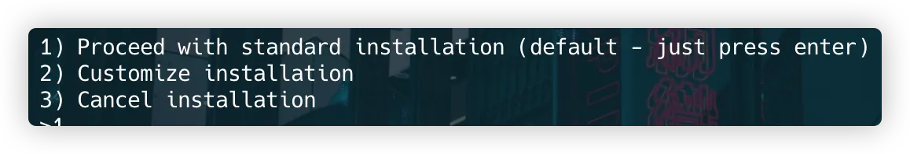

---

&nbsp; Rust는 성능과 안전성을 동시에 추구하는 시스템 프로그래밍 언어다. 오늘은 M2 Pro MacBook에서 Rust 개발 환경을 설정하는 방법을 알아보자.

## 1. Rust 설치

&nbsp; 터미널을 열고 다음 명령어를 실행한다.

```bash
curl --proto '=https' --tlsv1.2 -sSf <https://sh.rustup.rs> | sh
```

&nbsp; 이 명령어는 Rust의 공식 설치 스크립트를 다운로드하고 실행한다.

## 2. 설치 옵션 선택



&nbsp; 스크립트가 실행되면 설치 옵션을 선택하라는 메시지가 표시된다. 대부분의 경우 기본 설치(1)를 선택하면 된다.

## 3. 환경 변수 설정

&nbsp; 설치가 완료되면 다음 명령어를 실행하여 환경 변수를 설정한다.

```bash
source $HOME/.cargo/env

```

## 4. 설치 확인

&nbsp; Rust가 제대로 설치되었는지 확인하기 위해 다음 명령어를 실행한다.

```bash
rustc --version
cargo --version

```

&nbsp; 각 명령어는 Rust 컴파일러와 Cargo(Rust의 패키지 관리자)의 버전을 표시한다.

## 5. IDE Extension 설치

&nbsp; VS Code를 사용한다면 "rust-analyzer" 확장을 설치하는 것이 좋다. IntelliJ IDEA를 사용한다면 "Rust" 플러그인을 설치할 수 있다. 이러한 확장은 코드 자동 완성, 오류 검사 등 개발을 더욱 편리하게 만들어준다.

## 6. 프로젝트 생성

&nbsp; 새로운 Rust 프로젝트를 생성하려면 다음 명령어를 실행한다.

```bash
cargo new api-server
cd api-server

```

&nbsp; 이 명령은 `kubernetes-api-server`라는 이름의 새 프로젝트를 생성하고 해당 디렉토리로 이동한다.

## 7. 빌드 및 실행

&nbsp; 일반적으로 `cargo build`로 프로젝트를 빌드하고, `cargo run`으로 실행할 수 있다.

## 마치며

&nbsp; 이제 M2 Pro MacBook에서 Rust 개발을 시작할 준비가 완료되었다. Rust의 강력한 기능과 안전성을 활용하여 효율적인 시스템 프로그래밍을 즐기자!
