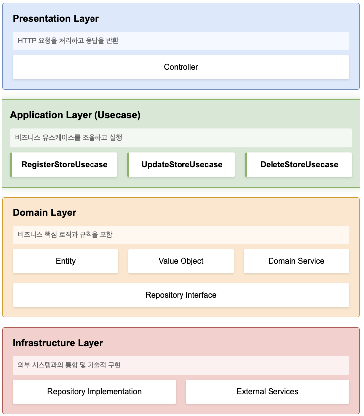

---

## 1. 서론

### 1.1. DDD란?

&nbsp; Domain-Driven Design(이하 DDD)은 도메인 전문가와 개발자가 동일한 언어로 소통하며, 비즈니스 도메인을 중심으로 소프트웨어를 설계하는 방법론이다. 필자는 DDD를 단순한 설계 패턴이 아니라, "도메인 전문가와 개발자 간의 소통 방식"이자 "프로젝트를 바라보는 관점"이라고 바라본다.<br>

&nbsp; DDD의 핵심은 복잡한 비즈니스 로직을 도메인 모델로 표현하고, 이를 코드로 구현하는 것이다. 이때 도메인 모델은 실제 비즈니스 규칙과 제약사항을 반영해야 하며, 이는 도메인 전문가와의 지속적인 대화를 통해 발전시켜 나가야 한다.<br>

### 1.2. DDD에서 Usecase가 필요한 이유



&nbsp; 전통적인 계층형 아키텍처에서는 Service 계층이 비즈니스 로직을 담당한다. 하지만 이는 몇 가지 고질적인 문제점을 가지고 있다.<br>

&nbsp; 첫째, Service 계층이 너무 비대해진다. 하나의 Service 클래스가 여러 비즈니스 로직을 담당하다 보니, 시간이 지날수록 코드의 복잡도가 증가하고 유지보수가 어려워진다.

```java
// 비대한 Service 클래스의 예
public class NeighborhoodService {
    public List<Store> getStores() { ... }
    public List<Business> analyzeBusinessTrend() { ... }
    public void updateNeighborhoodInfo() { ... }
    public Map<String, Object> getStatistics() { ... }
    // 계속해서 늘어나는 메서드들...
}
```

&nbsp; 둘째, 비즈니스 유즈케이스의 의도가 명확하지 않다. Service 클래스의 메서드만으로는 해당 기능이 어떤 비즈니스 요구사항을 구현한 것인지 파악하기 어렵다.<br>

&nbsp; 셋째, 도메인 로직과 애플리케이션 로직이 뒤섞인다. 순수한 도메인 로직과 트랜잭션 처리, 외부 서비스 호출 등의 기술적인 로직이 한 곳에 섞여 있어 코드의 응집도가 떨어진다.<br>

&nbsp; 이러한 문제를 해결하기 위해 DDD에서는 Usecase 패턴을 도입한다. Usecase는 하나의 비즈니스 유스케이스를 명확하게 표현하며, 해당 유스케이스의 처리 흐름을 오케스트레이션하는 역할을 담당한다.

```java
// Usecase를 사용한 예
@Usecase
public class AnalyzeNeighborhoodBusinessTrendUsecase {
    public List<RecommendedBusinessDto.Response> execute(Long neighborhoodId) {
        // 하나의 명확한 비즈니스 유스케이스만 처리
    }
}
```

&nbsp; 필자는 이러한 Usecase 패턴의 도입을 통해 코드의 의도를 더욱 명확하게, 그리고 비즈니스 로직의 관리를 더욱 용이하게 할 수 있다고 생각한다.<br>

## 2. DDD에서 Service의 구분

&nbsp; DDD 관점에서 Service는 크게 Application Service와 Domain Service로 구분된다. 필자는 이 둘의 구분이 DDD 설계에서 핵심 부분 중 하나라고 생각한다.<br>

### 2.1. Application Service (Usecase)

&nbsp; Application Service는 애플리케이션의 유스케이스를 구현하는 계층이다. 비즈니스 흐름을 제어하고 트랜잭션을 관리하며, 외부 시스템과의 통합을 담당한다.

```java
@Usecase
@Transactional
public class RegisterStoreUsecase {
    private final StoreRepository storeRepository;
    private final BusinessValidator businessValidator;    // Domain Service
    private final ExternalLocationAPI locationAPI;       // 외부 시스템

    public StoreDto.Response execute(StoreDto.Request request) {
        // 1. 외부 API를 통한 위치 정보 검증
        LocationInfo location = locationAPI.validate(request.getAddress());

        // 2. 비즈니스 정보 검증 (Domain Service 활용)
        businessValidator.validate(request.getBusinessType());

        // 3. 도메인 객체 생성
        Store store = Store.create(request, location);

        // 4. 저장 및 결과 반환
        Store savedStore = storeRepository.save(store);
        return StoreDto.Response.from(savedStore);
    }
}
```

&nbsp; Application Service의 특징은 다음과 같다.

- 하나의 유스케이스 당 하나의 클래스를 가진다.
- 도메인 객체의 생명 주기를 관리한다.
- 트랜잭션 경계를 정의한다.
- 기술적인 관심사를 처리한다.
- 도메인 객체나 Domain Service를 조합하여 사용한다.

### 2.2. Domain Service

&nbsp; Domain Service는 특정 Entity나 ValueObject에 속하지 않는 도메인 로직을 구현하는 계층이다. 순수하게 도메인 로직만을 포함하며, 상태를 가지지 않는다.

```java
@Component
public class BusinessValidator {
    private final RestrictedBusinessRepository restrictedBusinessRepository;

    public void validate(BusinessType businessType) {
        // 1. 제한 업종 검증
        if (isRestricted(businessType)) {
            throw new IllegalBusinessException("제한된 업종입니다.");
        }

        // 2. 업종별 특수 규칙 검증
        validateBusinessSpecificRules(businessType);
    }

    private boolean isRestricted(BusinessType businessType) {
        return restrictedBusinessRepository.findByType(businessType)
            .isPresent();
    }

    private void validateBusinessSpecificRules(BusinessType businessType) {
        // 업종별 세부 검증 규칙
        businessType.validate();
    }
}
```

&nbsp; DOmain Service의 특징은 다음과 같다.

- 상태를 가지지 않는다. (Stateless)
- 순수한 도메인 로직만 포함한다.
- Entity나 Value Object에 속하기 애매한 로직을 구현한다.
- 도메인 규칙을 표현한다.
- 기술적인 관심사를 포함하지 않는다.

&nbsp; 필자는 이러한 Service의 명확한 구분을 통해 코드의 책임을 명확하게 하고, 도메인 로직의 순수성을 유지하는 데 큰 도움이 된다고 생각한다. Application Service를 통해 유스케이스의 진행을 관리하고, Domain Service는 순수한 도메인 규칙을 구현함으로써, 각자의 역할에 충실한 설계가 가능해진다.<br>

&nbsp; 또한, 이러한 부분은 테스트의 용이성도 높여줄 수 있다. Domain Service는 외부 의존성 없이 순수한 도메인 로직 만을 테스트할 수 있고, Application Service는 시나리오 기반의 통합 테스트를 작성하기에 보다 적합하다.

## 3. Usecase 패턴 상세

### 3.1. Usecase의 정의와 역할

&nbsp; Usecase는 사용자의 목적을 달성하기 위한 시나리오를 구현한 것이다. 필자는 Usecase를 '사용자가 시스템을 통해 달성하고자 하는 목표를 위한 실행 흐름'이라고 이해하고자 한다.

```java
@Usecase
public class SearchNearbyStoresUsecase {
    private final LocationService locationService;
    private final StoreRepository storeRepository;

    // 하나의 명확한 목적: "근처 상점 검색"
    public List<StoreDto.Response> execute(
            double latitude,
            double longitude,
            int radiusInMeters
    ) {
        // 1. 검색 영역 계산
        SearchArea searchArea = locationService.calculateSearchArea(
            latitude,
            longitude,
            radiusInMeters
        );

        // 2. 상점 검색
        List<Store> stores = storeRepository.findInArea(searchArea);

        // 3. 결과 변환 및 반환
        return stores.stream()
            .map(StoreDto.Response::from)
            .collect(Collectors.toList());
    }
}
```

### 3.2. Application Service로서의 Usecase

&nbsp; Usecase는 Application Service의 구체적인 구현체다. 필자는 다음과 같은 규칙을 따르는 것을 추천한다.

#### 3.2.1. 명명 규칙

```java
// 동사 + 명사 + Usecase
public class RegisterMemberUsecase { }
public class UpdateStoreInfoUsecase { }
public class CalculateRevenueUsecase { }
```

#### 3.2.2. 단일 공개 메서드

```java
@Usecase
public class OrderProductUsecase {
    // 단 하나의 public 메서드만 제공
    public OrderDto.Response execute(OrderDto.Request request) {
        validateOrder(request);
        Order order = createOrder(request);
        return OrderDto.Response.from(saveOrder(order));
    }

    // 내부 구현은 private 메서드로 캡슐화
    private void validateOrder(OrderDto.Request request) { }
    private Order createOrder(OrderDto.Request request) { }
    private Order saveOrder(Order order) { }
}
```

#### 3.2.3. 명확한 입출력

```java
// DTO를 통한 명확한 입출력 정의
public class RegisterStoreDto {
    public record Request(
        String name,
        String address,
        BusinessType businessType
    ) { }

    public record Response(
        Long id,
        String name,
        String address,
        BusinessType businessType,
        LocalDateTime registeredAt
    ) { }
}
```

### 3.3. 이점과 특징

&nbsp; Usecase 패턴의 주요 이점은 다음과 같다.

#### 3.3.1. 비즈니스 의도의 명확한 표현

```java
// 비즈니스 의도가 명확히 드러나는 클래스명
@Usecase
public class AnalyzeNeighborhoodBusinessTrendUsecase { }

// vs

// 일반적인 Service 클래스
@Service
public class NeighborhoodService { }
```

#### 3.3.2. 단일 책임 원칙의 자연스러운 준수

```java
@Usecase
public class CalculateDeliveryFeeUsecase {
    // 배달비 계산이라는 단 하나의 책임만 가짐
    public Money execute(Order order) {
        return deliveryFeeCalculator.calculate(
            order.getDistance(),
            order.getTotalPrice(),
            order.getDateTime()
        );
    }
}
```

#### 3.3.3. 테스트 용이성

```java
@Test
void 배달비_계산_테스트() {
    // Given
    CalculateDeliveryFeeUsecase usecase = new CalculateDeliveryFeeUsecase(
        new DeliveryFeeCalculator()
    );
    OrderDto.Request request = new OrderDto.Request(/*...*/);

    // When
    Money deliveryFee = usecase.execute(request);

    // Then
    assertThat(deliveryFee).isEqualTo(Money.wons(3000));
}
```

#### 3.3.4. 변경 사항에 대한 영향도 최소화

&nbsp; 각 Usecase가 독립적이므로, 하나의 Usecase 변경이 다른 Usecase에 영향을 주지 않는다.<br>

&nbsp; 필자는 이러한 Usecase 패턴의 도입으로 코드의 가독성과 유지보수성이 크게 향상됨을 기대하고 있다. 특히 비즈니스 요구사항의 변경이 잦은 프로젝트에서 그 효과가 더욱 두드러질 것으로 판단된다.<br>

&nbsp; 또한, 새로운 팀원이 합류했을 때도 각 Usecase 클래스만 보면 해당 기능의 비즈니스 로직을 쉽게 파악할 수 있어, 온보딩 시간도 단축되는 효과가 있을 것으로 보인다.<br>

## 4. 계층 구조 및 구현 예시

### 4.1. 전체 아키텍처

&nbsp; 필자는 Usecase 패턴을 적용한 DDD 아키텍처를 다음과 같이 구성하였다.

```java
// 1. Presentation Layer (Controller)
@RestController
@RequiredArgsConstructor
public class StoreController {
    private final RegisterStoreUsecase registerStoreUsecase;
    private final UpdateStoreUsecase updateStoreUsecase;

    @PostMapping("/stores")
    public StoreDto.Response register(@RequestBody StoreDto.Request request) {
        return registerStoreUsecase.execute(request);
    }
}

// 2. Application Layer (Usecase)
@Usecase
@Transactional
public class RegisterStoreUsecase {
    private final StoreRepository storeRepository;
    private final BusinessValidator businessValidator;

    public StoreDto.Response execute(StoreDto.Request request) {
        businessValidator.validate(request.getBusinessType());
        Store store = Store.create(request);
        return StoreDto.Response.from(storeRepository.save(store));
    }
}

// 3. Domain Layer
@Entity
public class Store {
    @Id @GeneratedValue
    private Long id;
    private String name;
    private Address address;
    private BusinessType businessType;

    public static Store create(StoreDto.Request request) {
        validateName(request.getName());
        return new Store(request);
    }

    private static void validateName(String name) {
        if (name == null || name.isBlank()) {
            throw new IllegalArgumentException("상점 이름은 필수입니다.");
        }
    }
}

// 4. Infrastructure Layer
@Repository
public interface StoreRepository extends JpaRepository<Store, Long> {
    // ...
}
```

### 4.2. 계층 간 데이터 흐름

&nbsp; 데이터는 다음과 같은 흐름으로 이동한다.

```java
// 1. Controller → Usecase (Request DTO)
@PostMapping("/stores")
public StoreDto.Response register(@RequestBody StoreDto.Request request) {
    return registerStoreUsecase.execute(request);
}

// 2. Usecase → Domain
@Usecase
public class RegisterStoreUsecase {
    public StoreDto.Response execute(StoreDto.Request request) {
        // Request DTO → Domain Entity
        Store store = Store.create(request);

        // Domain Entity → Response DTO
        return StoreDto.Response.from(store);
    }
}

// 3. DTO 정의
public class StoreDto {
    public record Request(
        String name,
        String address,
        BusinessType businessType
    ) { }

    public record Response(
        Long id,
        String name,
        String address,
        BusinessType businessType,
        LocalDateTime createdAt
    ) {
        public static Response from(Store store) {
            return new Response(
                store.getId(),
                store.getName(),
                store.getAddress().toString(),
                store.getBusinessType(),
                store.getCreatedAt()
            );
        }
    }
}
```

### 4.3. 관심사 분리 예시

#### 4.3.1. 컨트롤러의 관심사

```java
@RestController
@RequiredArgsConstructor
public class OrderController {
    private final CreateOrderUsecase createOrderUsecase;

    @PostMapping("/orders")
    public ResponseEntity<OrderDto.Response> createOrder(
        @Valid @RequestBody OrderDto.Request request
    ) {
        // 1. 입력값 검증 (Bean Validation)
        // 2. 요청 처리 위임
        OrderDto.Response response = createOrderUsecase.execute(request);
        // 3. HTTP 응답 생성
        return ResponseEntity.created(
            URI.create("/orders/" + response.id())
        ).body(response);
    }
}
```

#### 4.3.2. Usecase의 관심사

```java
@Usecase
@Transactional
public class CreateOrderUsecase {
    private final OrderRepository orderRepository;
    private final PaymentService paymentService;
    private final NotificationService notificationService;

    public OrderDto.Response execute(OrderDto.Request request) {
        // 1. 도메인 객체 생성
        Order order = Order.create(request);

        // 2. 결제 처리
        paymentService.process(order);

        // 3. 주문 저장
        orderRepository.save(order);

        // 4. 알림 발송
        notificationService.sendOrderConfirmation(order);

        // 5. 응답 생성
        return OrderDto.Response.from(order);
    }
}
```

#### 4.3.3. 도메인 객체의 관심사

```java
@Entity
public class Order {
    // 비즈니스 규칙과 제약조건 관리
    public static Order create(OrderDto.Request request) {
        validateOrderAmount(request.amount());
        validateDeliveryInfo(request.deliveryInfo());

        return new Order(request);
    }

    // 도메인 규칙 검증
    private static void validateOrderAmount(Money amount) {
        if (amount.isLessThan(Money.ZERO)) {
            throw new IllegalArgumentException("주문 금액은 0원 이상이어야 합니다.");
        }
    }

    // 비즈니스 로직
    public void cancel() {
        if (!this.status.canCancel()) {
            throw new IllegalStateException("취소할 수 없는 주문 상태입니다.");
        }
        this.status = OrderStatus.CANCELLED;
    }
}
```

## 5. 커스텀 어노테이션 활용

### 5.1. `@Usecase` 어노테이션 구현

&nbsp; 필자는 Usecase 패턴을 더 명확하게 표현하고 일관성 있게 관리하기 위해 커스텀 어노테이션을 활용하고자 한다.

```java
// 1. @Usecase 어노테이션 정의
@Target(ElementType.TYPE)
@Retention(RetentionPolicy.RUNTIME)
@Documented
@Component
@Transactional
public @interface Usecase {
    String value() default "";
}

// 2. AOP를 활용한 로깅 기능 추가
@Aspect
@Component
@RequiredArgsConstructor
public class UsecaseLogAspect {
    private final Logger log = LoggerFactory.getLogger(UsecaseLogAspect.class);

    @Around("@within(com.example.annotation.Usecase)")
    public Object logUsecase(ProceedingJoinPoint joinPoint) throws Throwable {
        String usecaseName = joinPoint.getSignature().getDeclaringType().getSimpleName();

        log.info("Starting usecase: {}", usecaseName);
        StopWatch stopWatch = new StopWatch();
        stopWatch.start();

        try {
            Object result = joinPoint.proceed();
            stopWatch.stop();

            log.info("Completed usecase: {} ({}ms)",
                usecaseName,
                stopWatch.getTotalTimeMillis()
            );

            return result;
        } catch (Exception e) {
            log.error("Failed usecase: {} - {}",
                usecaseName,
                e.getMessage()
            );
            throw e;
        }
    }
}

// 3. 예외 처리를 위한 ExceptionTranslator
@Component
public class UsecaseExceptionTranslator {
    @ExceptionHandler(DomainException.class)
    public ResponseEntity<ErrorResponse> handleDomainException(
        DomainException e
    ) {
        return ResponseEntity
            .badRequest()
            .body(new ErrorResponse(e.getErrorCode(), e.getMessage()));
    }
}
```

### 5.2. 활용 방안

#### 5.2.1. 명시적인 Usecase 구분과 일관성 있는 트랜잭션 관리

```java
@Usecase  // @Component + @Transactional 자동 적용
public class RegisterMemberUsecase {
    private final MemberRepository memberRepository;
    private final PasswordEncoder passwordEncoder;

    public MemberDto.Response execute(MemberDto.Request request) {
        // 트랜잭션 내에서 실행됨
        String encodedPassword = passwordEncoder.encode(request.password());
        Member member = Member.create(request, encodedPassword);
        return MemberDto.Response.from(memberRepository.save(member));
    }
}
```

#### 5.2.2. 메트릭 수집과 모니터링

```java
@Aspect
@Component
public class UsecaseMetricsAspect {
    private final MeterRegistry meterRegistry;

    @Around("@within(com.example.annotation.Usecase)")
    public Object recordMetrics(ProceedingJoinPoint joinPoint) throws Throwable {
        String usecaseName = joinPoint.getSignature().getDeclaringType().getSimpleName();
        Timer timer = Timer.builder("usecase.execution")
            .tag("name", usecaseName)
            .register(meterRegistry);

        return timer.record(() -> {
            try {
                return joinPoint.proceed();
            } catch (Throwable e) {
                meterRegistry.counter("usecase.errors",
                    "name", usecaseName,
                    "exception", e.getClass().getSimpleName()
                ).increment();
                throw new RuntimeException(e);
            }
        });
    }
}
```

#### 5.2.3. 유효성 검증 자동화

```java
@Aspect
@Component
public class UsecaseValidationAspect {
    private final Validator validator;

    @Before("@within(com.example.annotation.Usecase) && args(request,..)")
    public void validateRequest(JoinPoint joinPoint, Object request) {
        Set<ConstraintViolation<Object>> violations = validator.validate(request);
        if (!violations.isEmpty()) {
            throw new ValidationException(
                violations.stream()
                    .map(ConstraintViolation::getMessage)
                    .collect(Collectors.joining(", "))
            );
        }
    }
}
```

#### 5.2.4. 보안 검사 자동화

```java
@Aspect
@Component
public class UsecaseSecurityAspect {
    private final SecurityService securityService;

    @Before("@within(com.example.annotation.Usecase) && " +
            "@within(secured)")
    public void checkSecurity(JoinPoint joinPoint, Secured secured) {
        String[] roles = secured.value();
        if (!securityService.hasAnyRole(roles)) {
            throw new AccessDeniedException(
                "접근 권한이 없습니다: " + String.join(", ", roles)
            );
        }
    }
}
```

### 5.3. 이점

&nbsp; 이러한 커스텀 어노테이션의 활용은 다음과 같은 이점을 제공한다.

#### 5.3.1. 코드의 일관성

```java
// 모든 Usecase가 동일한 패턴을 따름
@Usecase
public class OrderProductUsecase { }

@Usecase
public class CancelOrderUsecase { }

@Usecase
public class RefundOrderUsecase { }
```

#### 5.3.2. 횡단 관심사의 중앙화

```java
// 로깅, 보안, 트랜잭션 등의 공통 관심사를 한 곳에서 관리
@Usecase
public class ProcessPaymentUsecase {
    // 비즈니스 로직에만 집중
    public PaymentDto.Response execute(PaymentDto.Request request) {
        Payment payment = Payment.create(request);
        return PaymentDto.Response.from(
            paymentRepository.save(payment)
        );
    }
}
```

#### 5.3.3. 운영 효율성 향상

```java
// 메트릭 수집이 자동화됨
@Usecase
public class AnalyzeUserBehaviorUsecase {
    public AnalysisDto.Response execute(AnalysisDto.Request request) {
        // 실행 시간, 성공/실패 여부 등이 자동으로 수집됨
        return analyzeUserBehavior(request);
    }
}
```

&nbsp; 필자는 이러한 커스텀 어노테이션의 활용으로 개발 생산성과 코드 품질이 크게 향상됨을 기대한다. 특히 새로운 기능을 추가할 때 기존의 패턴을 쉽게 따를 수 있어, 팀 전체의 개발 효율성이 높아질 것으로 판단하고 있다.

## 6. 결론

### 6.1. 도입 효과

&nbsp; Usecase 패턴의 도입으로 필자가 경험한 주요 효과들은 다음과 같다.

#### 6.1.1. 코드 가독성과 유지보수성 향상

```java
// Before: 모호한 서비스 계층
@Service
public class OrderService {
    public void processOrder(OrderRequest request) { }
    public void cancelOrder(Long orderId) { }
    public void refundOrder(Long orderId) { }
    // 다수의 책임이 한 클래스에 혼재
}

// After: 명확한 책임 분리
@Usecase
public class ProcessOrderUsecase {
    public OrderDto.Response execute(OrderDto.Request request) {
        // 주문 처리 로직만 존재
    }
}

@Usecase
public class CancelOrderUsecase {
    public void execute(Long orderId) {
        // 주문 취소 로직만 존재
    }
}
```

#### 6.1.2. 비즈니스 로직의 추적성 향상

```java
// 로깅과 모니터링이 자동화됨
2024-03-15 10:15:23 INFO  Starting usecase: RegisterMemberUsecase
2024-03-15 10:15:23 INFO  Validating member information...
2024-03-15 10:15:24 INFO  Member registered successfully: memberId=123
2024-03-15 10:15:24 INFO  Completed usecase: RegisterMemberUsecase (1234ms)
```

#### 6.1.3. 테스트 용이성 증가

```java
@Test
void 상품_주문_테스트() {
    // Given
    ProcessOrderUsecase usecase = new ProcessOrderUsecase(
        orderRepository,
        paymentService,
        stockManager
    );

    OrderDto.Request request = new OrderDto.Request(/*...*/);

    // When
    OrderDto.Response response = usecase.execute(request);

    // Then
    assertThat(response.status()).isEqualTo(OrderStatus.COMPLETED);
    assertThat(response.totalAmount()).isEqualTo(Money.wons(10000));
    verify(stockManager).decrease(any());
}
```

#### 6.1.4. 코드 가독성 향상

```java
// 비즈니스 로직이 명확하게 구분되어 있어 이해하기 쉬움
@Usecase
public class CalculateShippingFeeUsecase {
    public Money execute(ShippingDto.Request request) {
        // 1. 기본 배송비 계산
        Money baseFee = calculateBaseFee(request.weight());

        // 2. 거리별 추가 요금
        Money distanceFee = calculateDistanceFee(request.distance());

        // 3. 특별 지역 추가 요금
        Money specialAreaFee = calculateSpecialAreaFee(request.address());

        return baseFee.plus(distanceFee).plus(specialAreaFee);
    }
}
```

### 6.2. 주의사항

&nbsp; Usecase 패턴 도입 시 다음 사항들을 주의하자.

#### 6.2.1. 과도한 분리 지양

```java
// BAD: 너무 작은 단위로 분리
@Usecase
public class ValidateEmailUsecase {
    public boolean execute(String email) {
        return email.contains("@");
    }
}

// GOOD: 의미 있는 비즈니스 단위로 구성
@Usecase
public class RegisterMemberUsecase {
    public MemberDto.Response execute(MemberDto.Request request) {
        validateMemberInfo(request);
        Member member = createMember(request);
        return MemberDto.Response.from(saveMember(member));
    }
}
```

#### 6.2.2. 트랜잭션 경계 설정

```java
// BAD: 트랜잭션이 중첩되는 경우
@Usecase
public class OrderProductUsecase {
    private final PaymentUsecase paymentUsecase;  // 다른 Usecase 직접 호출

    public OrderDto.Response execute(OrderDto.Request request) {
        // 트랜잭션 중첩 발생
        paymentUsecase.execute(request.getPayment());
        return processOrder(request);
    }
}

// GOOD: 명확한 트랜잭션 경계
@Usecase
public class OrderProductUsecase {
    private final PaymentService paymentService;  // 도메인 서비스 활용

    public OrderDto.Response execute(OrderDto.Request request) {
        paymentService.process(request.getPayment());
        return processOrder(request);
    }
}
```

#### 6.2.3. 도메인 로직 침범 주의

```java
// BAD: 도메인 로직이 Usecase에 구현됨
@Usecase
public class CalculatePointsUsecase {
    public int execute(Order order) {
        // 도메인 로직이 Usecase에 존재
        return order.getTotalAmount() * 0.01;
    }
}

// GOOD: 도메인 로직은 도메인 객체에 구현
@Entity
public class Order {
    public Points calculatePoints() {
        return Points.of(this.totalAmount.multiply(0.01));
    }
}

@Usecase
public class CalculatePointsUsecase {
    public Points execute(Order order) {
        return order.calculatePoints();
    }
}
```

#### 6.2.4. 순환 참조 방지

```java
// BAD: Usecase 간 순환 참조
@Usecase
public class ProcessOrderUsecase {
    private final PaymentUsecase paymentUsecase;
    // ...
}

@Usecase
public class PaymentUsecase {
    private final ProcessOrderUsecase orderUsecase;  // 순환 참조!
    // ...
}

// GOOD: 도메인 서비스를 통한 의존성 해결
@Usecase
public class ProcessOrderUsecase {
    private final PaymentService paymentService;
    // ...
}

@Service
public class PaymentService {
    private final PaymentRepository paymentRepository;
    // ...
}
```

&nbsp; 이러한 주의사항들을 고려하여 Usecase 패턴을 적용함으로써, 프로젝트의 소스 코드의 품질을 높이고 유지보수성을 개선하고자 한다. 특히 팀 구성원들과의 명확한 가이드라인 공유를 통해, 일관성 있는 코드베이스를 유지할 수 있도록 할 것이다.

---

## 7. 참고 자료

### 7.1. 도서

- Clean Architecture: 소프트웨어 구조와 설계의 원칙 (로버트 C. 마틴)
- 만들면서 배우는 클린 아키텍처 (톰 홈버그)

### 7.2. 블로그 & 아티클

- [The Clean Architecture - Robert C. Martin](https://blog.cleancoder.com/uncle-bob/2012/08/13/the-clean-architecture.html)
- [Hexagonal Architecture with Java and Spring](https://reflectoring.io/spring-hexagonal/)
- [마틴 파울러의 아키텍처 패턴](https://martinfowler.com/articles/injection.html)
- [Spring Boot와 함께하는 클린 아키텍처](https://www.baeldung.com/spring-boot-clean-architecture)
