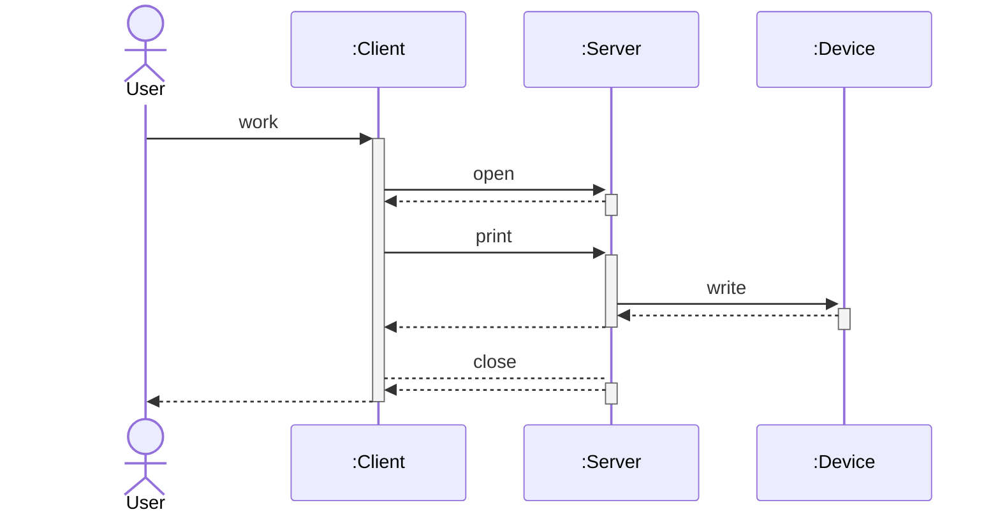

---

## 정의

&nbsp; UML의 **시퀀스 다이어그램(Sequence Diagram)** 프로그램이 작동할 때 어떤 메소드가 어떤 순서로 실행되는지, 어떤 사건이 어떤 순서로 실행되는지를 표현한다. 클래스 다이어글매은 '시간에 따라 변하지 않는 것(정적인 관계)'를 나타내는 반면에 시퀀스 다이어그램은 '시간에 따라 변하는 것(동적인 관계)'를 나타낸다.
 

## 예시

```java
class Client {
  Server server;
  void work() {
    server.open();
    server.print("Hello");
    server.close();
  }
  // ...
}

class Server {
  Device device;
  void open() {
    // ...
  }
  void print(String s) {
    device.write(s);
    // ...
  }
  void close() {
    // ...
  }

  class Device {
    void write(String s) {
      // ...
    }
  }
}
```



&nbsp; 위 시퀀스 다이어그램에는 세 개의 인스턴스가 등장하고, 각 인스턴스는 다이어그램 위쪽에 있는 세 개의 직사각형에 대응한다. 직사각형 안에는 `:Client`, `:Server`, `:Device`처럼 콜론(:) 뒤에 클래스 이름을 쓰고, 밑줄(하지만 필자의 블로그에서 사용하는 `mermaid-js`에서는 밑줄을 지원하지 않으므로 생략함)을 긋는다. 이것은 각각 Client 클래스의 인스턴스, Server 클래스의 인스턴스, Device 클래스의 인스턴스를 나타낸다. 인스턴스에 이름이 필요할 때는 `server:Server`처럼 콜론 앞에 이름을 적는다.<br>
&nbsp; 각 인스턴스에서 아래 방향으로 뻗은 선을 **라이프 라인(생명선)**이라고 한다. 여기서는 시간이 아래 방향으로 흐른다고 이해하면 된다. 위는 과거, 아래는 미래이다. 라이프 라인은 인스턴스가 생존하는 동안만 존재한다.<br>
&nbsp; 라이프 라인 중간에 있는 가늘고 긴 직사각형은 객체가 활동 중임을 나타낸다. 화살표는 가로 방향으로 나열되어 있다. open이라는 라벨이 붙은 화살표를 살펴보면, 실선으로 된 검은색 화살표는 **메소드 호출**을 나타낸다. 여기서는 client가 server의 open 메서드를 호출했음을 나타내고, open 메서드 호출을 통해 server 인스턴스가 활동하게 됐고, 긴 직사각형이 시작되었다.<br>
&nbsp; oepn 화살표에서 시작된 server의 긴 직사각형 하단에서 다시 client 쪽으로 파선 화살표가 뻗어있는데, 이 화살표는 open 메소드에서의 리턴(반환)을 나타낸다. 위 다이어그램에서는 모든 메소드의 리턴을 그렸지만, 생략하는 경우도 있다. 제어가 client로 되돌아왔으므로 server 인스턴스가 활동 중인 사각형은 일단 종료된다.<br>
&nbsp; 마찬가지로 print 메소드를 호출하고, print 메소드에서는 다시 device 인스턴스의 write 메소드를 호출하고 있다.<br>
&nbsp; 위처럼 관련된 여러 인스턴스 간의 행동을 도식화할 수 있고, **시퀀스 다이어그램은 라이프 라인을 따라 위에서부터 차례대로 읽어 나가고**, 화살표를 따라 인스턴스 간의 연관 동작을 확인할 수 있다.

---

## Reference

- 유키 히로시, 2022, JAVA 언어로 배우는 디자인 패턴 입문: 쉽게 배우는 GoF의 23가지 디자인 패턴