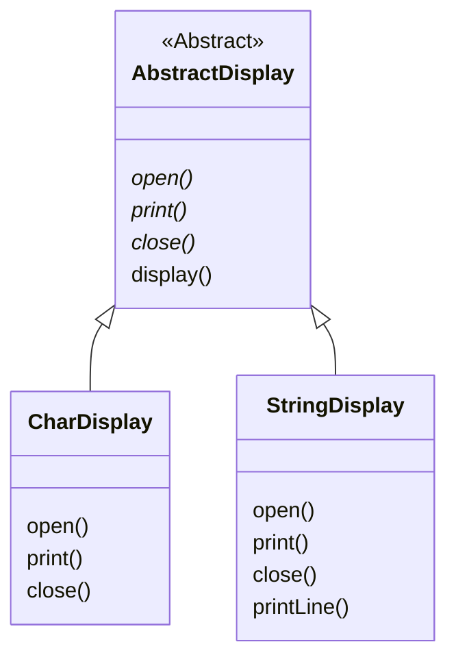
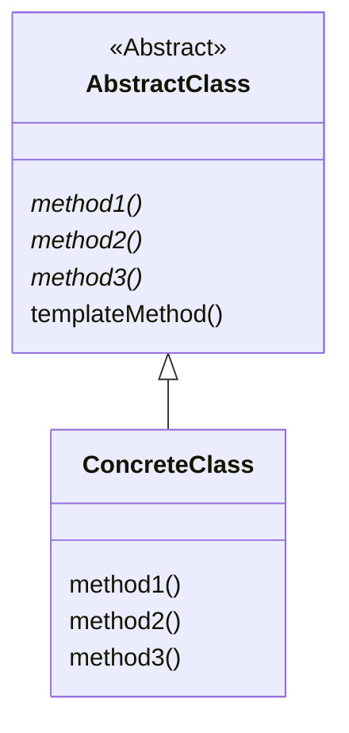

---

## Template?


&nbsp; **문자 모양대로 구멍이 난 얇은 플라스틱 판**이다. 펜으로 그 구멍을 따라 그리면 손으로도 반듯하게 글씨를 쓸 수 있듯이, 템플릿 구멍을 보면 어떤 형태의 문자인지 알 수 있다.
&nbsp; 하지만 실제로 어떻게 종이에 보여질 지는 필기 도구가 정해지기 전까진 알 수 없다. 싸인펜을 사용하면 싸인펜으로 쓴 문자가 되고, 연필을 사용하면 연필로 쓴 문자가 되며, 색연필을 사용하면 색깔이 있는 문자가 될 것이다. 그러나 **어떤 필기구를 사용하더라도 쓰여진 문자는 템플릿의 구멍 모양과 같다.**

# Template Method Pattern

## 정의

&nbsp; 말 그대로 템플릿 기능을 가진 패턴이다. **상위 클래스 쪽에 템플릿이 될 메서드가 정의**되어 있고, 그 **메서드 정의에 추상 메서드**가 사용된다. 따라서 상위 클래스의 코드만 봐서는 최종적으로 어떻게 처리되는지 알 수 없다. 상위 클래스로 알 수 있는 것은 추상 메서드를 호출하는 방법 뿐이다.
&nbsp; <span style="color: red; font-weight: bold;">추상 메서드를 실제로 구현하는 것은 하위 클래스</span>이다. 하위 클래스에서 메서드를 구현하면 구체적인 처리 방식이 정해지는 것이다. **같은 템플릿을 사용하더라도 하위 클래스에서 구현을 다르게 하면 처리도 다르게 이루어진다**. 하지만 하위 클래스에서 어떻게 구현하든 **처리의 큰 흐름은 상위 클래스에서 구성한 것과 동일**하다.
&nbsp; Template Method 패턴을 한 문장으로 정의하면 아래와 같다.

```
상위 클래스에서 처리의 뼈대를 결정하고 하위 클래스에서 그 구체적 내용을 결정하는 디자인 패턴
```

## Example : 문자 혹은 문자열을 5번 반복해서 표시하는 프로그램

### Class List

|이름|설명|
|---|---|
|**AbstractDisplay**| **메서드 open, print, close를 상속받도록 하기 위한 추상 클래스**<br>메서드 display는 구현되어 있음
|**CharDisplay**| **문자를 출력하기 위해 AbstractDisplay를 상속받는 클래스**<br>메서드 open, print, close를 구현함
|**StringDisplay**| **문자열을 출력하기 위해 AbstractDisplay를 상속받는 클래스**<br>메서드 open, print, close를 구현함
|**Main**| 동작 테스트용 클래스

### Class Diagram



### Source Code

- **`AbstractDisplay` 클래스**

  ```java
  public abstract class AbstractDisplay {
    // 하위 클래스에 구현을 맡기는 추상 메서드 : open, print, close
    public abstract void open();
    public abstract  void print();
    public abstract void close();

    // 추상 메서드 AbstractDisplay에서 구현하는 메서드 : display
    public final void display() {
      open();
      for(int i = 0; i < 5; i++) {
        print();
      }
      close();
    }
  }
  ```

- **`CharDisplay` 클래스**

  ```java
  public class CharDisplay extends AbstractDisplay {
    private char ch;        // 표시하기 위한 문자를 저장하는 필드

    // 생성자에서 인수로 전달된 문자 ch를 필드에 저장
    public CharDisplay(char ch) {
      this.ch = ch;
    }

    // open 메서드 : 시작 문자열 "<<"를 표시
    @Override
    public void open() {
      System.out.print("<<");
    }

    // print 메서드 : 필드에 저장해 둔 문자를 1회 표시
    @Override
    public void print() {
      System.out.print(ch);
    }

    // close 메서드 : 종료 문자열 ">>"를 표시
    @Override
    public void close() {
      System.out.println(">>");
    }
  }
  ```

- **`CharDisplay` 클래스**

  ```java
  public class StringDisplay extends AbstractDisplay {
    private String string;      // 표시하기 위한 문자열을 저장하는 필드
    private int width;          // 표시하기 위한 문자열의 길이

    // 생성자에서 인수로 전달된 문자열 string을 필드에 저장
    public StringDisplay(String string) {
      this.string = string;
      this.width = string.getBytes().length;
    }

    // open 메서드 : 시작 문자열 "<<"를 표시
    @Override
    public void open() {
      printLine();
    }

    // print 메서드 : 필드에 저장해 둔 문자를 1회 표시
    @Override
    public void print() {
      System.out.println("|" + string + "|");
    }

    // close 메서드 : 종료 문자열 ">>"를 표시
    @Override
    public void close() {
      printLine();
    }


    // open 메서드와 close 메서드에서 "+-----+" 문자열을 표시하기 위해 호출하는 메서드
    private void printLine() {
      System.out.print("+");
      for(int i = 0; i < width; i++) {
        System.out.print("-");
      }
      System.out.println("+");
    }
  }
  ```

- **`Main` 클래스**
  ```java
  public class Main {
    public static void main(String[] args) {
      // 'H'를 가진 CharDisplay 인스턴스를 1개 생성
      AbstractDisplay d1 = new CharDisplay('H');
      
      // "Hello, world."를 가진 StringDisplay 인스턴스를 1개 생성
      AbstractDisplay d2 = new StringDisplay("Hello, world.");
      
      // d1, d2 모두 AbstractDisplay의 하위 클래스의 인스턴스이므로 상속받은 display 메서드를 호출할 수 있음
      // 실제 동작은 CharDisplay나 StringDisplay에서 구현된 open, print, close 메서드에서 결정됨

      // d1.display() 실행
      System.out.println("[d1.display() 실행]");
      d1.display();
      
      // 구분자
      System.out.println();

      // d2.display() 실행
      System.out.println("[d2.display() 호출]");
      d2.display();
    }
  }
  ```

- **실행 결과**
  ```
  [d1.display() 호출]
  <<HHHHH>>

  [d2.display() 호출]
  +-------------+
  |Hello, world.|
  |Hello, world.|
  |Hello, world.|
  |Hello, world.|
  |Hello, world.|
  +-------------+
  ```

## 역할

### AbstractClass

&nbsp; **추상클래스**. 템플릿 메서드를 구현하고, 그 메서드에서 사용할 추상 메서드를 선언한다. 이 추상 메서드는 하위 클래스인 `ConcreateClass`에서 구현된다. 위의 예제에서는 AbstractDisplay 클래스가 AbstractClass이다.

### ConcreteClass

&nbsp; **구현 클래스**. `AbstractClass`에서 정의된 추상 메서드를 실제 구현한 메서드를 가지는 클래스이다. 구현된 메서드는 `AbstractClass`의 템플릿 메소드에서 호출된다. 위의 예제에서는 CharDisplay 클래스와 String Display 클래스가 ConcreteClass이다.

### Class Diagram



## Template Method Pattern을 사용하는 이유

### 로직 공통화

- 상위 클래스의 템플릿 메서드에 알고리즘이 기술되어 있으므로, 하위 클래스에 별도 알고리즘을 기술할 필요가 없음
  - ex) `AbstractDisplay` 클래스에 `display()` 메서드를 구현하였기 때문에 `CharDisplay` 클래스와 `StringDisplay` 클래스에 `display()` 메서드를 구현하지 않아도 됨
- 상위 클래스의 템플릿 메서드에 오류가 발견되더라도 템플릿 메서드만 수정하면 됨
  - ex) `CharDisplay` 클래스와 `StringDisplay` 클래스를 통해 생성한 인스턴스에서 `display()` 메서드를 통해 문자 및 문자열을 출력하는 로직이 오류가 발생할 경우 `AbstractDisplay` 클래스의 `display()` 메서드만 수정하면 됨

### 상위 클래스와 하위 클래스 간의 긴밀한 연계

- 상위 상위 클래스에서 선언된 추상 메서드를 실제로 하위 클래스에서 구현할 때는 그 메소드가 어떤 타이밍에 호출이 되는 지 이해를 해야함
  - ex) `CharDisplay` 클래스와 `StringDisplay` 클래스에서 `open()`, `close()`,  `print()` 메서드를 구현하고 있고, 이를 통해 생성한 인스턴스에서 `AbstractDisplay` 클래스에서 상속받은 `display()` 메서드에서 `open()`, `close()`,  `print()` 메서드가 실행되고 있기 때문에 `display()` 메서드의 동작 과정을 이해하고 있어야 `open()`, `close()`,  `print()` 메서드를 원하는대로 구현할 수 있음

### 하위 클래스를 상위 클래스와 동일시

- 상위 클래스형 변수가 있고 그 변수에 하위 클래스 인스턴스가 대입된다고 가정했을 때, instanceof 등으로 하위 클래스의 종류를 특정하지 않아도 프로그램이 동작하도록 만드는 것이 좋음
  - ex) `CharDisplay` 클래스와 `StringDisplay` 클래스로 생성한 인스턴스 모두 `AbstractDisplay` 타입의 변수에 대입하여 `display()` 메서드를 호출하고 있음
- 상위 클래스형 변수에 하위 클래스의 인스턴스 중 어느 것을 대입해도 제대로 동작할 수 있게 하는 원칙을 [**LSP(The Liskov Substitution Principle)**](https://jinu0137.github.io/development/2023-04-12-solid_lsp/)라고 함(단, 구현을 상속할 경우에는 LSP를 엄격하게 지키는 것은 불가능함)

# 생각 바꾸기

## 상위 클래스의 관점과 하위 클래스의 관점

&nbsp; 일반적으로 클래스 계층에 관해 학습을 할 때 하위 클래스 관점에서 생각하기 쉽다. 즉 아래와 같은 관점으로 생각하게 된다.

- 상위 클래스에서 정의된 메서드를 하위 클래스에서 이용할 수 있다.
- 하위 클래스에 약간의 메서드를 기술하는 것만으로 새로운 기능을 추가할 수 있다.
- 하위 클래스에서 메서드를 오버라이드하면 동작을 변경할 수 있다.

&nbsp; 반대로 상위 클래스의 관점에서 생각해보면, 상위 클래스에 추상 메서드가 선언되어 있으면 그 메서드는 당연히 '하위 클래스에서 구현'하게 된다. 바꿔 말하면, 추상 메서드의 선언은 프로그램을 사용해 다음과 같은 행위를 하도록 요구하는 것이다.

- 하위 클래스에서 그 메서드를 구현하기를 기대한다.
- 하위 클래스에 해당 메서드 구현을 요청한다.

&nbsp; 하위 클래스에는 상위 클래스에서 선언한 추상 메서드를 구현할 책임이 있다고 할 수 있다. 이것을 **subclass responsibility(하위 클래스의 책임)**이라고 한다.

<p style="background-color: #cccccc;">
&nbsp; Java에서 @Override 어노테이션은 해당 메서드가 상위 클래스나 인터페이스에서 선언된 메서드를 오버라이드했음을 나타낸다. 이 어노테이션을 발견하면, 어떤 책임을 맡은 메서드인지 주의하며 코드를 읽어보자.
</p>

## 추상 클래스

&nbsp; 추상 클래스는 인스턴스를 만들 수 없지만 메서드명을 정하고 그 메서드를 사용한 템플릿 메서드에 의해 처리를 기술할 수 있다. 실제 처리는 하위 클래스에서 구현해야하지만, **추상 클래스 단계에서 처리 흐름을 형성**하는 것은 중요하다.

## 상위 클래스와 하위 클래스의 협조

&nbsp; 상위 클래스와 하위 클래스는 서로 협조하면서 프로그램을 구축한다. 상위 클래스에서 많이 기술하면 하위 클래스를 작성하기 편해지지만, 하위 클래스의 자유가 줄어든다. 반대로 상위 클래스에서 적게 기술하게 되면 하위 클래스를 작성하기 힘들어지고, 각각의 하위 클래스에서 처리 기술이 중복되기 쉬워진다.<br>
&nbsp; Template Method Pattern은 처리 내용의 뼈대는 상위 클래스에 기술하고, 구체적인 내용은 하위 클래스에 기술하도록 하고 있다.

<p style="background-color: #cccccc;">
&nbsp; 어떤 수준에서 처리를 나눌지, 어떤 처리를 상위 클래스에 두고 어떤 처리를 하위 클래스에 둘지를 규정한 매뉴얼이 있지는 않다. 프로그램을 작성하기 전 주의 깊은 설계가 필요할 것이다.
</p>

## Template Method 활용 예시

### java.io.InputStream


&nbsp; `java.io.InputStream` 클래스는 Java에서 바이트 기반 입력 스트림을 위해 사용되는 클래스들의 상위 클래스(추상 클래스)이다. 이 클래스를 사용하면 파일, 네트워크 연결, 내부 배열 등 다양한 소스에서 데이터를 읽을 수 있다.
&nbsp; `java.io.InputStream` 클래스는 추상 클래스이고, Template Method Pattern을 사용한다. JDK API Reference를 살펴보면 추상 메서드를 확인해볼 수 있는데 `read()` 메서드는 추상 메서드로 선언되어 있다. 이를 통해 InputStream을 상속 받는 하위 클래스들은 각각 `read()` 메서드를 내부 동작을 직접 구현한다는 것을 알 수 있다.


## Template Method Pattern를 활용하는 Design Pattern

- **Factory Method Pattern** : Template Method Pattern을 인스턴스 생성에 응용함
- **Strategy Pattern** : Template Method Pattern에서는 '상속'을 이용하여 프로그램 동작을 규정하지만, Strategy Pattern은 '위임'을 이용하여 프로그램의 동작을 변경함, 프로그램 일부를 변경하기보다는 알고리즘 전체를 모두 전환함

---

## Reference

- 유키 히로시, 2022, JAVA 언어로 배우는 디자인 패턴 입문: 쉽게 배우는 GoF의 23가지 디자인 패턴

## Repository

- [https://github.com/jinu0137/design_pattern_study/tree/main/src/template_method_pattern](https://github.com/jinu0137/design_pattern_study/tree/main/src/template_method_pattern)