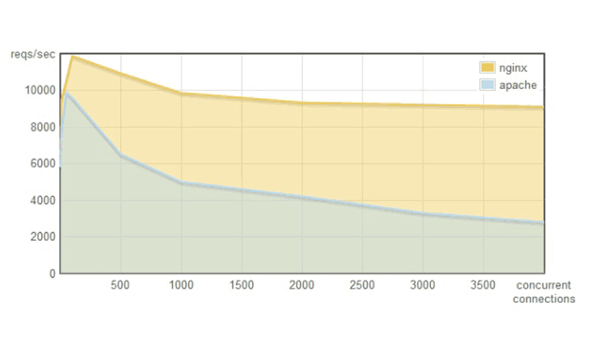

---

* this unordered seed list will be replaced by the toc
{:toc}

## 1. 서론

### 1.1. "1만명이 접속하는 서버 만들기" 도전

필자는 오늘 웹 서버 기술 발전의 중요한 전환점이 된 'C10K 문제'에 대해 이야기해보고자 한다. C10K 문제란 간단히 말해 "하나의 서버에서 동시에 1만 명의 클라이언트(Concurrent 10K) 연결을 처리할 수 있는가?"라는 도전과제이다.

1999년, 이 문제가 처음 업계에 제기되었을 때는 상당히 도전적인 과제였다고 한다. 당시 웹 서버는 수백 명의 동시 사용자를 처리하는 것도 어려웠으며(실제로 이런 케이스가 흔치 않았을지도 모른다), 천 명이 넘는 접속자를 처리하는 것은 엄청난 도전이었다고 한다.

### 1.2. Dan Kegel의 1999년 도전과 시대적 배경

C10K 문제는 1999년 Dan Kegel이라는 개발자가 웹사이트에 게시한 글에서 시작되었다. 그는 ["C10K Problem"](https://web.archive.org/web/19990508164301/http://www.kegel.com/c10k.html)이라는 제목의 문서에서 당시 서버 기술의 한계와 이를 극복하기 위한 방안을 논의했다.

당시 인터넷은 폭발적으로 성장하는 단계였다. 1990년대 후반은 닷컴 붐[^1]의 시대로, 인터넷 사용자가 급증하면서 웹사이트들은 점점 더 많은 동시 접속자를 처리해야 했다. 하지만 서버 기술은 아직 이러한 요구를 효과적으로 충족시키지 못했다.

1990년대 후반 서버 환경은 오늘날과 비교하면 매우 제한적이었다.

- CPU: 대부분 단일 코어, 클럭 속도는 수백 MHz 정도
- 메모리: 수백 MB 정도가 일반적
- 네트워크: 100Mbps가 고속으로 간주되던 시대
- 운영체제: 동시성 처리에 최적화되지 않은 커널

이러한 환경에서 1만 개의 동시 연결을 처리하는 것은 단순한 기술적 최적화가 아닌 근본적인 패러다임 전환을 필요로 하였다.

### 1.3. 왜 동시 연결 수가 웹 서버 설계에 중요한가?

동시 연결 수는 웹 서버 성능의 핵심 지표 중 하나다. 특히 아래와 같은 상황에서 중요하다.

1. 대규모 웹사이트: 수많은 사용자가 동시에 접속하는 인기 있는 웹사이트 (네이버, 구글 등)
2. 실시간 애플리케이션: 채팅, 게임, 스트리밍 등 지속적인 연결이 필요한 서비스 (카카오톡 등)
3. API 서버: 수많은 클라이언트와 연결을 유지해야 하는 백엔드 서비스

동시 연결 수의 한계는 서비스 확장성을 직접적으로 제약한다. 사용자 경험, 서버 비용, 시스템 안정성 모두 서버의 동시 연결 처리 능력에 의존한다.

C10K 문제의 해결은 단순히 기술적 호기심을 넘어, 현대 인터넷 서비스의 기반을 마련하는 중요한 과제였다.

## 2. 전통적인 서버 모델과 그 한계

### 2.1. 프로세스 기반 모델의 작동 방식

<div style="font-family: Arial, sans-serif; max-width: 800px; margin: 0 auto;">
  <div style="padding: 15px; background-color: #f8f9fa; border-radius: 10px; margin-bottom: 20px;">
    <h3 style="text-align: center; color: #3a6ea5;">프로세스 기반 모델의 작동 방식</h3>
    <!-- 클라이언트 요청 섹션 -->
    <div style="display: flex; justify-content: space-around; flex-wrap: wrap; margin-bottom: 20px;">
      <div style="border: 2px solid #d17b47; border-radius: 8px; padding: 8px; margin: 5px; background-color: #ffeee0; text-align: center; width: 100px;">클라이언트 1<br>요청</div>
      <div style="border: 2px solid #d17b47; border-radius: 8px; padding: 8px; margin: 5px; background-color: #ffeee0; text-align: center; width: 100px;">클라이언트 2<br>요청</div>
      <div style="border: 2px solid #d17b47; border-radius: 8px; padding: 8px; margin: 5px; background-color: #ffeee0; text-align: center; width: 100px;">클라이언트 3<br>요청</div>
      <div style="border: 2px solid #d17b47; border-radius: 8px; padding: 8px; margin: 5px; background-color: #ffeee0; text-align: center; width: 100px;">클라이언트 N<br>요청</div>
    </div>
    <!-- 서버 섹션 -->
    <div style="border: 3px solid #3a6ea5; border-radius: 10px; padding: 15px; background-color: #eef5fc;">
      <!-- 마스터 프로세스 -->
      <div style="display: flex; justify-content: center; margin-bottom: 15px;">
        <div style="border: 2px solid #aa4465; border-radius: 8px; padding: 10px; background-color: #ffe6ee; text-align: center; width: 180px;">
          마스터 프로세스<br>(요청 수신 및 할당)
        </div>
      </div>
      <!-- 작업자 프로세스들 -->
      <div style="display: flex; flex-wrap: wrap; justify-content: space-around;">
        <div style="border: 2px solid #6a8d73; border-radius: 8px; padding: 8px; margin: 5px; background-color: #e8f4ea; width: 110px; text-align: center;">
          작업자 프로세스 1
          <div style="font-size: 11px; margin-top: 5px;">메모리 사용</div>
          <div style="height: 8px; background-color: #e74c3c; width: 70%; border-radius: 3px;"></div>
          <div style="font-size: 11px; margin-top: 5px;">CPU 사용</div>
          <div style="height: 8px; background-color: #e74c3c; width: 60%; border-radius: 3px;"></div>
        </div>
        <div style="border: 2px solid #6a8d73; border-radius: 8px; padding: 8px; margin: 5px; background-color: #e8f4ea; width: 110px; text-align: center;">
          작업자 프로세스 2
          <div style="font-size: 11px; margin-top: 5px;">메모리 사용</div>
          <div style="height: 8px; background-color: #e74c3c; width: 80%; border-radius: 3px;"></div>
          <div style="font-size: 11px; margin-top: 5px;">CPU 사용</div>
          <div style="height: 8px; background-color: #e74c3c; width: 50%; border-radius: 3px;"></div>
        </div>
        <div style="border: 2px solid #6a8d73; border-radius: 8px; padding: 8px; margin: 5px; background-color: #e8f4ea; width: 110px; text-align: center;">
          작업자 프로세스 3
          <div style="font-size: 11px; margin-top: 5px;">메모리 사용</div>
          <div style="height: 8px; background-color: #e74c3c; width: 75%; border-radius: 3px;"></div>
          <div style="font-size: 11px; margin-top: 5px;">CPU 사용</div>
          <div style="height: 8px; background-color: #e74c3c; width: 65%; border-radius: 3px;"></div>
        </div>
        <div style="border: 2px solid #6a8d73; border-radius: 8px; padding: 8px; margin: 5px; background-color: #e8f4ea; width: 110px; text-align: center;">
          작업자 프로세스 N
          <div style="font-size: 11px; margin-top: 5px;">메모리 사용</div>
          <div style="height: 8px; background-color: #e74c3c; width: 90%; border-radius: 3px;"></div>
          <div style="font-size: 11px; margin-top: 5px;">CPU 사용</div>
          <div style="height: 8px; background-color: #e74c3c; width: 70%; border-radius: 3px;"></div>
        </div>
      </div>
      <!-- 문제점 표시 -->
      <div style="text-align: center; margin-top: 15px; font-style: italic; color: #e74c3c;">
        클라이언트 연결 수 증가 → 프로세스 수 증가 → 시스템 리소스 고갈
      </div>
    </div>
    <!-- 설명 섹션 -->
    <div style="margin-top: 20px;">
      <h4 style="color: #3a6ea5;">프로세스 기반 모델 작동 방식:</h4>
      <ul style="padding-left: 20px;">
        <li style="margin-bottom: 8px;"><strong>기본 원리:</strong> 클라이언트 연결마다 별도의 프로세스를 할당</li>
        <li style="margin-bottom: 8px;"><strong>마스터 프로세스:</strong> 연결 수신 및 작업자 프로세스에 분배</li>
        <li style="margin-bottom: 8px;"><strong>작업자 프로세스:</strong> 각 클라이언트 요청을 독립적으로 처리</li>
        <li style="margin-bottom: 8px;"><strong>C10K 문제:</strong> 10,000개 이상의 연결 시 시스템 리소스 고갈</li>
        <li style="margin-bottom: 8px;"><strong>한계:</strong> 프로세스별 메모리 사용량이 크고 컨텍스트 스위칭 비용 발생</li>
      </ul>
    </div>
  </div>
</div>

C10K 문제를 이해하려면 먼저 전통적인 서버 모델을 살펴봐야 한다. 초기 웹 서버는 주로 프로세스 기반 모델을 사용했다.

#### 2.1.1. fork()와 파일 핸들러 제한 (ulimit)

프로세스 기반 모델에서 서버는 다음과 같은 패턴으로 동작한다:

```plaintext
서버 시작
  -> socket() 생성
  -> bind()로 IP 주소와 포트 연결
  -> listen()으로 연결 대기
  -> 무한 루프:
       -> accept()로 새 연결 수락
       -> fork()로 새 프로세스 생성
       -> 자식 프로세스가 클라이언트 요청 처리
```

이 모델의 핵심은 새로운 클라이언트 연결이 들어올 때마다 fork()를 호출하여 새로운 프로세스를 생성하는 것이다. 즉, 각 프로세스는 하나의 클라이언트 연결을 전담하여 처리한다.

하지만 이 접근법에는 중요한 제약이 있다. Unix/Linux 시스템에서는 프로세스당 열 수 있는 파일 디스크립터(소켓 포함) 수에 재한이 있다. 이 제한은 `ulimit -n` 명령으로 확인할 수 있다.

```bash
$ ulimit -n
1024
```

1990년대에는 이 기본값이 1024 정도(필자의 현재 작업 환경인 Mac OS에서는 2560이다)였다고 한다. 즉, 동시에 1024개 이상의 연결을 처리할 수 없었다. 이 값을 늘릴 수는 있지만, 운영체제 수준의 설정 변경이 필요했다.

#### 2.1.2. 리소스 소비와 확장성 문제

프로세스 생성은 상당한 시스템 리소스를 소비한다.

1. **메모리 오버헤드**: 각 프로세스는 독립적인 메모리 공간을 가진다. 1만 개의 프로세스는 엄청난 메모리를 소비할 것이다.
2. **프로세스 생성 비용**: fork() 호출은 상대적으로 무거운 연산이다.
3. **컨텍스트 스위칭 오버헤드**: 많은 프로세스 간의 전환은 CPU에 부담을 준다.

1만 개의 동시 연결을 처리하려면 1만 개의 프로세스가 필요하다는 것이 이 모델의 근본적인 한계였다.

### 2.2. 스레드 기반 모델로의 발전

프로세스 기반 모델의 한계를 극복하기 위해 스레드 기반 모델이 도입되었다. 스레드는 프로세스보다 가벼워서 더 많은 동시성을 제공할 수 있었다.

#### 2.2.1. 메모리 부담 (1MB per 스레드)

스레드는 프로세스보다 메모리 효율적이지만, 여전히 상당한 리소스를 소비한다. 예를 들어, Java와 같은 환경에서는 각 스레드가 기본적으로 약 1MB의 스택 메모리를 할당받는다.

- 1만 개의 스레드를 생성한다면: 10,000 스레드 × 1MB = 약 10GB의 메모리가 필요

1999년 기준으로는 이정도 메모리를 갖춘 서버는 매우 고가였다고 한다.

#### 2.2.2. 컨텍스트 스위칭과 경합 조건

스레드 기반 모델의 또 다른 중요한 한계는 컨텍스트 스위칭(context switching) 오버헤드와 경합 조건(racing condition)이었다. 스레드 수가 증가할수록 CPU는 더 많은 시간을 스레드 간 전환에 소비하게 된다.

1만 개의 스레드가 있다면, 이들 중 대부분은 소켓에서 데이터를 읽거나 쓰기 위해 대기하는 상태에 있을 것이다. 그럼에도 불구하고, 이 모든 스레드는 CPU 시간을 얻기 위해 경쟁한다. 결과적으로, 실제 유용한 작업을 수행하는 시간은 점점 줄어들게 된다.

궁극적으로 스레드 기반 모델 역시 C10K 문제를 해결하기 위한 해결책이 되지 못하는 것이다.

### 2.3. 동시 접속자 증가에 따른 성능 하락 패턴

프로세스/스레드 기반 모델의 가장 큰 문제점은 동시 접속자 수가 증가함에 따라 성능이 급격히 하락한다는 것이다. 이는 RPS(Requests Per Second, 초당 요청 처리량)의 급격한 감소로 나타난다.

이러한 성능 하락은 아래와 같은 요인으로 발생한다.

1. 컨텍스트 스위칭 오버헤드 증가
2. 메모리 사용량 증가로 인한 시스템 부하
3. CPU 리소스 경쟁 심화
4. 캐시 효율성 저하

이런 문제들은 C10K 환경에서 전통적인 서버 모델(프로세스/스레드 기반 모델)의 근본적인 한계를 드러냈고, 새로운 접근 방식이 필요했다.

## 3. Apache HTTP Server: 전통적 접근법의 사례

### 3.1. Apache의 역사적 위치와 기본 아키텍처

Apache HTTP Server는 1995년에 처음 출시된 이후 오랫동안 가장 인기 있는 웹 서버로 자리매김했다. 특히 2000년대 초반에는 웹 서버 시장의 70% 이상을 차지했다.

Apache의 기본 아키텍처는 전통적인 프로세스/스레드 기반 모델을 따랐다. 이는 구현이 단순하고 이해하기 쉬웠지만, C10K와 같은 대규모 동시성 처리에는 한계가 있었다.

### 3.2. MPM 모델 분석

Apache는 다양한 처리 방식을 지원하기 위해 MPM(Multi-Processing Module) 시스템을 도입했다. 각 MPM은 서로 다른 방식으로 클라이언트 요청을 처리한다.

#### 3.2.1. prefork MPM: 프로세스 기반 방식

Prefork MPM은 Apache의 가장 전통적인 처리 모델이다.

- 미리 여러 개의 자식 프로세스를 생성하여 대기
- 각 프로세스는 한 번에 하나의 연결만 처리
- 모든 프로세스가 독립적으로 실행되어 안정성이 높음
- 프로세스 간 메모리 공유 없음

이 모델은 PHP와 같은 모듈과의 호환성이 좋아 널리 사용되었지만, 메모리 사용량이 많고 확장성에 제한이 있었다고 한다.

### 3.2.2. worker MPM: 하이브리드 접근법

Worker MPM은 프로세스와 스레드를 조합한 모델이다.

- 여러 자식 프로세스를 생성
- 각 프로세스 내에서 여러 스레드를 실행
- 각 스레드가 하나의 연결을 처리
- 프로세스 내에서 스레드 간 일부 메모리 공유

Worker MPM은 prefork보다 상대적으로 메모리 효율성이 높았지만, 여전히 대규모 동시 연결 처리에는 제한이 있을 것으로 보인다.

### 3.3. Apache vs Nginx 성능 비교: 동시 접속자 증가에 따른 차이



Apache와 Nginx의 성능 비교 그래프를 보면 전통적 모델과 이벤트 기반 모델의 차이를 명확히 이해할 수 있다. 동시 접속자 수가 증가함에 따라 두 서버의 성능 차이는 점점 벌어진다.

- 적은 동시 접속자 (100명 이하): 두 서버 모두 비슷한 성능
- 중간 규모 (100~1,000명): Nginx가 약간 우세
- 대규모 (1,000명 이상): Nginx가 크게 우세, Apache는 성능 급락

특히 동시 접속자가 수천 명 수준으로 증가하면, Apache의 RPS는 급격히 하락하는 반면 Nginx는 비교적 안정적인 성능을 유지한다.

### 3.4. C10K 환경에서 Apache의 한계점

C10K 문제의 관점에서 Apache의 주요 한계점은 아래와 같다.

1. 리소스 집약적: 프로세스/스레드 모델은 많은 시스템 리소스 소비
2. 확장성 제한: 동시 접속자 수 증가에 따른 성능 하락
3. 설정 복잡성: 대규모 동시 접속을 위한 튜닝이 어려움

Apache 2.4에서는 event MPM이 도입되어 일부 개선이 이루어졌지만, 근본적인 아키텍처 변화 없이는 C10K 문제를 완전히 해결하기 어려웠다.

Apache의 사례는 전통적인 서버 모델이 C10K 환경에서 직면하는 한계를 여실히 보여준다. 이러한 한계를 극복하기 위해 새로운 아키텍처적 접근이 필요했다.

## 4. 이벤트 기반 아키텍처의 부상

### 4.1. 비차단(Non-blocking) I/O의 기본 원리

C10K 문제를 해결하기 위한 핵심 기술 중 하나는 비차단(Non-blocking) I/O다. 전통적인 차단(Blocking) I/O와 비차단 I/O의 차이를 이해하는 것이 중요하다.

#### 차단 I/O 모델

- 프로세스/스레드가 I/O 작업을 요청
- 작업이 완료될 때까지 해당 프로세스/스레드는 차단(block)됨
- 완료 후에야 다음 작업을 진행할 수 있음

#### 비차단 I/O 모델

- 프로세스/스레드가 I/O 작업을 요청
- 작업이 즉시 완료될 수 없더라도 바로 반환됨 (보통 "아직 데이터 없음" 상태 반환)
- 프로세스/스레드는 다른 작업을 수행하다가 나중에 다시 확인 가능

비차단 I/O의 핵심 장점은 하나의 프로세스나 스레드가 여러 연결을 동시에 처리할 수 있다는 것이다. 이는 C10K 문제 해결의 기반이 되었다.

### 4.2. 이벤트 루프의 핵심 개념

이벤트 기반 아키텍처의 중심에는 '이벤트 루프'라는 개념이 있다. 이벤트 루프는 아래와 같은 단계로 작동한다.

1. 이벤트 소스(소켓, 타이머 등) 등록
2. 이벤트가 발생할 때까지 대기
3. 이벤트 발생 시 해당 콜백 함수 실행
4. 콜백 실행 완료 후 다시 2단계로 돌아감

```javascript
// 이벤트 루프의 의사 코드
while(true) {
  events = getEvents(); // 발생한 이벤트 수집
  for(e in events) {
    // 각 이벤트에 등록된 콜백 실행
    processEvent(e);
  }
}
```

#### 4.2.1. 단일 스레드로 다중 연결 처리하기

이벤트 루프 모델의 가장 놀라운 특징은 단일 스레드로 수만 개의 연결을 처리할 수 있다는 점이다. 이것이 가능한 이유는 다음과 같다.

- 비차단 I/O를 사용하므로 데이터를 기다리는 동안 차단되지 않음
- 이벤트 기반 처리: 실제로 작업이 필요한 연결만 처리
- 효율적인 I/O 멀티플렉싱 기술 활용

이 접근법의 장점은 다음과 같다:

- 스레드 생성/관리 오버헤드 없음
- 컨텍스트 스위칭 최소화
- 스레드 간 동기화 문제 없음
- 메모리 효율성 증가

#### 4.2.2. 이벤트 통지 메커니즘의 중요성

이벤트 루프가 효율적으로 작동하려면 OS 수준에서 보다 효율적인 이벤트 통지 메커니즘이 필요하다. 이 메커니즘은 "어떤 소켓이 읽기/쓰기 준비가 되었는지" 알려주는 역할을 한다.

초기에는 select()와 poll() 함수가 사용되었으나, 이들은 많은 소켓을 처리할 때 효율성이 떨어졌다. 이후 더 효율적인 메커니즘들이 개발되었다.

### 4.3. OS 수준의 핵심 기술

OS별로 다양한 이벤트 통지 메커니즘이 개발되었으며, 이들은 C10K 문제 해결에 중요한 역할을 했다.

#### 4.3.1. epoll (Linux): 효율적인 이벤트 관리

```c
// epoll 사용 예시
int epfd = epoll_create(1);
struct epoll_event ev;
ev.events = EPOLLIN;
ev.data.fd = sockfd;
epoll_ctl(epfd, EPOLL_CTL_ADD, sockfd, &ev);
epoll_wait(epfd, events, MAX_EVENTS, -1);
```

- 관심 있는 파일 디스크립터를 한 번만 등록 (epoll_ctl)
- 변경된 파일 디스크립터만 반환 (O(1) 복잡도)
- 파일 디스크립터 수에 제한 없음
- 수십만 개의 연결도 효율적으로 처리 가능

epoll은 Linux에서 C10K 문제를 해결하는 핵심 기술이 되었다.

#### 4.3.2. kqueue (BSD)와 IOCP (Windows)

다른 운영체제들도 유사한 고성능 이벤트 통지 메커니즘을 제공한다.

##### kqueue (BSD/macOS)

```c
int kq = kqueue();
struct kevent ev;
EV_SET(&ev, sockfd, EVFILT_READ, EV_ADD, 0, 0, NULL);
kevent(kq, &ev, 1, NULL, 0, NULL);
kevent(kq, NULL, 0, events, MAX_EVENTS, NULL);
```

##### IOCP (Windows)

```c
HANDLE iocp = CreateIoCompletionPort(INVALID_HANDLE_VALUE, NULL, 0, 0);
CreateIoCompletionPort(socket, iocp, (ULONG_PTR)&clientContext, 0);
GetQueuedCompletionStatus(iocp, &bytesTransferred, &completionKey, &overlapped, INFINITE);
```

이러한 기술들은 각 OS에서 C10K 문제를 해결하는 데 중요한 역할을 했으며, 현대적 서버의 기반이 되었다.

## 5. 현대적 서버 솔루션과 비동기 프로그래밍 모델

### 5.1. 고성능 서버 아키텍처의 핵심 요소

#### 5.1.1. Nginx: 이벤트 기반 설계와 작업자 프로세스 모델

Nginx는 2004년 Igor Sysoev에 의해 처음 출시되었으며, C10K 문제를 염두에 두고 설계되었다. Nginx의 주요 아키텍처적 특징은 다음과 같다:

##### 마스터 프로세스와 워커 프로세스 구조

- 마스터 프로세스: 설정 파일 읽기, 워커 프로세스 관리
- 워커 프로세스: 실제 요청 처리

##### 이벤트 기반 처리

- 각 워커 프로세스는 이벤트 루프 실행
- 비차단 I/O와 OS별 최적화된 이벤트 통지 메커니즘 사용
- 하나의 워커가 수천 개의 연결 처리 가능

##### 성능 최적화

- 정적 콘텐츠 처리에 매우 효율적
- 메모리 사용량 최소화
- 연결 풀링 및 최적화된 버퍼 관리

Nginx는 Apache와 달리 처음부터 C10K를 넘어선 확장성을 목표로 설계되었으며, 이로 인해 고부하 환경에서 특히 뛰어난 성능을 보여준다.

#### 5.1.2. Node.js: 단일 스레드 이벤트 루프와 libuv

Node.js는 2009년에 Ryan Dahl이 개발한 서버 측 JavaScript 런타임이다. Node.js는 이벤트 기반 비동기 I/O 모델을 채택하여 C10K 문제에 대응하고자 하였다.

- V8 JavaScript 엔진: Google Chrome의 고성능 JS 엔진 사용
- libuv: 크로스 플랫폼 비동기 I/O 라이브러리
  - 다양한 OS의 이벤트 메커니즘 추상화 (epoll, kqueue, IOCP 등)
  - 이벤트 루프, 스레드 풀, 비동기 파일 I/O 제공

Node.js의 코드는 비동기적으로 자연스럽게 작성된다.

```javascript
const http = require('http');

const server = http.createServer((req, res) => {
  res.writeHead(200, { 'Content-Type': 'text/plain' });
  res.end('Hello World\n');
});

server.listen(8000, () => {
  console.log('Server running at http://localhost:8000/');
});
```

이 간단한 코드만으로도 수천 개의 동시 연결을 처리할 수 있다. Node.js는 JavaScript를 통해 비동기 프로그래밍 모델을 대중화했다는 점에서 큰 의미가 있다.

### 5.2. 현대 언어와 프레임워크의 비동기 패턴

#### 5.2.1. Java NIO와 Netty

필자가 주로 사용하는 Java 언어에서는 JDK 1.4(2002년)에서 NIO(New I/O)를 도입하여 비동기 I/O를 지원하기 시작했다.

```java
// Java NIO 예제
ServerSocketChannel serverChannel = ServerSocketChannel.open();
serverChannel.configureBlocking(false);
serverChannel.socket().bind(new InetSocketAddress(8000));

Selector selector = Selector.open();
serverChannel.register(selector, SelectionKey.OP_ACCEPT);

while (true) {
    selector.select();
    // 이벤트 처리
}
```

Netty는 Java NIO를 기반으로 한 고성능 네트워크 프레임워크로, 보다 사용하기 쉬운 API를 제공한다.

```java
// Netty 예제 (간략화)
EventLoopGroup bossGroup = new NioEventLoopGroup();
EventLoopGroup workerGroup = new NioEventLoopGroup();

ServerBootstrap b = new ServerBootstrap();
b.group(bossGroup, workerGroup)
 .channel(NioServerSocketChannel.class)
 .childHandler(new ChannelInitializer<SocketChannel>() {
     @Override
     protected void initChannel(SocketChannel ch) {
         ch.pipeline().addLast(new EchoServerHandler());
     }
 });

b.bind(8000).sync();
```

Netty는 Kafka, Elasticsearch, Cassandra 등 많은 대규모 분산 시스템의 기반이 되었다.

#### 5.2.2. Go의 goroutine과 채널

Go 언어의 경우에는 동시성 처리를 위해 `goroutine`이라는 혁신적 접근 방식을 도입했다.

```go
// Go 언어 서버 예제
func handler(w http.ResponseWriter, r *http.Request) {
    fmt.Fprintf(w, "Hello, World!")
}

func main() {
    http.HandleFunc("/", handler)
    http.ListenAndServe(":8000", nil)
}
```

Go의 핵심 강점은 아래와 같다.

- **고루틴**: 경량 스레드 (약 2KB 메모리로 시작)
- **채널**: 고루틴 간 통신 메커니즘
- **내장 스케줄러**: OS 스레드에 고루틴을 효율적으로 매핑

Go는 시스템 수준의 이벤트 통지 메커니즘을 추상화하여, 개발자가 동시성을 쉽게 다룰 수 있도록 제공하였다.

이외에도 Python의 `asyncio`와 Rust의 `Tokio` 등, 다양한 언어와 프레임워크들은 각자의 방식으로 C10K 문제에 접근했지만, 모두 기본적으로 이벤트 기반 비동기 아키텍처를 채택했다.

### 5.3. 비동기 프로그래밍 모델의 발전


#### 5.3.1. 콜백에서 Promise, async/await로

비동기 프로그래밍 패턴은 시간이 지남에 따라 더 개선되었다.

##### 콜백 패턴 (초기)

```js
// Promise 기반 비동기 코드
fs.promises.readFile('file.txt')
  .then(data => console.log(data))
  .catch(err => console.error(err));
```

##### Promise 패턴 (개선)

```js
// Promise 기반 비동기 코드
fs.promises.readFile('file.txt')
  .then(data => console.log(data))
  .catch(err => console.error(err));
```

##### async/await 패턴 (현대)

```js
// async/await 기반 비동기 코드
async function readFile() {
  try {
    const data = await fs.promises.readFile('file.txt');
    console.log(data);
  } catch (err) {
    console.error(err);
  }
}
```

이러한 발전은 비동기 코드를 보다 읽기 쉽고 유지 관리하기 쉽게 만들었다.

#### 5.3.2. 반응형 프로그래밍(Reactive Programming)

반응형 프로그래밍[^2]은 비동기 데이터 스트림을 처리하는 현대적 접근 방식이다.

```java
// RxJava 예제
Observable.create(emitter -> {
    // 비동기 이벤트 소스 연결
    Server server = new Server();
    server.onRequest(request -> {
        emitter.onNext(request);
    });
})
.filter(request -> request.isValid())
.map(request -> processRequest(request))
.subscribe(response -> sendResponse(response));
```

반응형 프로그래밍은 복잡한 비동기 데이터 흐름을 선언적으로 처리할 수 있게 해준다. 이는 특히 실시간 스트리밍, 이벤트 처리 등의 응용 프로그램에 유용하다.

## 6. C10M 문제: 다음 단계의 도전

### 6.1. 천만 동시 연결의 새로운 도전

C10K 문제가 해결되면서, 다음 목표는 C10M(천만 동시 연결) 문제가 되었다. C10M은 단순히
규모의 차이가 아닌, 시스템의 근본적인 제약을 극복해야 하는 도전이다.

C10M 문제에 도달한다면 다음과 같은 새로운 병목 지점에 직면하게 된다.

1. 운영체제 커널 오버헤드: 패킷 처리, 인터럽트 처리, 시스템 콜 등
2. 하드웨어 제약: NIC(네트워크 인터페이스 카드) 처리 능력, CPU 코어 수, 메모리 대역폭
3. 소프트웨어 알고리즘: 메모리 할당, 동기화, 데이터 구조의 효율성

### 6.2. 핵심 접근 기술

#### 6.2.1. 커널 우회와 제로 카피(Zero-Copy)

운영체제 커널을 우회하는 접근법[^3]은 C10M 문제를 해결하는 핵심 기술 중 하나다.

##### DPDK (Data Plane Development Kit)

- 네트워크 패킷 처리를 사용자 공간으로 이동
- 인터럽트 기반이 아닌 폴링 방식 처리
- 대규모 페이지 활용 및 NUMA 최적화
- 제로 카피 기술 적용

##### XDP (eXpress Data Path)

- Linux 커널 내에서 실행되는 고성능 패킷 처리 프레임워크
- 네트워크 스택 초기 단계에서 프로그래밍 가능
- eBPF(extended Berkeley Packet Filter) 프로그램 활용

##### 제로 카피 기술

- 데이터가 여러 버퍼 사이를 불필요하게 복사되는 것을 방지
- DMA(Direct Memory Access)를 활용한 직접 전송
- 예: sendfile(), splice() 시스템 콜

이러한 커널 우회 기술은 네트워크 패킷이 애플리케이션에 도달하기까지의 경로를 극적으로 단축시킨다.

#### 6.2.2. 하드웨어 가속과 최적화

하드웨어 수준의 최적화도 C10M 솔루션의 중요한 부분이다.

##### SR-IOV (Single Root I/O Virtualization)

- 하나의 물리적 NIC를 여러 가상 NIC로 나누어 직접 접근
- 가상화 환경에서 네트워크 성능 향상

##### 스마트 NIC

- 프로그래밍 가능한 네트워크 인터페이스 카드
- 패킷 필터링, 암호화 등을 하드웨어 수준에서 처리
- CPU 부담 감소

##### TCP 오프로딩

- TCP 처리의 일부를 NIC에서 수행
- 세그멘테이션, 체크섬 계산 등을 하드웨어가 처리

이러한 하드웨어 최적화 기술은 서버의 주 CPU를 데이터 복사와 네트워크 프로토콜 처리에서 해방시켜, 애플리케이션 로직에 더 많은 리소스를 할당할 수 있게 한다.

### 6.3. 미래 인터넷 환경에서의 확장성 과제

인터넷과 기술의 발전에 따라 지속적으로 새로운 확장성 과제가 등장하고 있다.

1. **IoT 기기 폭발적 증가**: 수십억 개의 IoT 장치가 인터넷에 연결됨에 따라 서버는 더 많은 동시 연결을 처리해야 함
2. **5G와 낮은 지연 시간 요구**: 5G 네트워크는 초저지연 통신을 가능하게 하며, 이를 지원하기 위한 서버 인프라 필요
3. **실시간 데이터 처리 증가**: 스트리밍, 게임, AR/VR 등 실시간 애플리케이션의 증가
4. **엣지 컴퓨팅**[^4]: 클라우드에서 엣지로 처리가 이동함에 따라, 제한된 리소스에서의 효율적인 연결 처리 필요

이러한 과제들은 미래 서버 설계에 있어 새로운 접근 방식을 요구할 것이다.

## 7. 결론: 역사에서 배우는 서버 기술의 진화

### 7.1. Rome was not built in a day

C10K 문제에서 C10M 문제로, 그리고 앞으로의 발전 과정은 기술이 어떻게 점진적으로 진화하는지를 보여주는 좋은 사례다. 필자는 이 과정에서 몇 가지 중요한 교훈을 발견했다.

1. 근본적인 한계를 인식하고 도전하는 자세
  Dan Kegel이 1999년에 C10K 문제를 제기했을 때, 대부분의 개발자들은 그런 규모의 동시 연결을 처리하는 것이 불가능하다고 생각했을 것(필자 역시도 그 시대에 살았다면 그랬을 지 모른다)이다. 그러나 그는 당시 서버 아키텍처의 근본적인 한계를 인식하고 새로운 접근 방식을 모색했다.
2. 여러 계층에 걸친 혁신의 필요성
  C10K와 C10M 문제의 해결은 하드웨어, 운영체제, 네트워크 스택, 애플리케이션 프레임워크 등 모든 수준에서의 혁신이 필요했다. 어느 한 계층의 최적화만으로는 충분하지 않았다.
3. 패러다임 전환의 중요성
  프로세스/스레드 기반 모델에서 이벤트 기반 모델로의 전환은 단순한 최적화가 아닌 패러다임의 전환이었다. 이러한 근본적인 사고방식의 변화가 중요한 도약을 가능하게 했다.

### 7.2. C10K에서 배우는 소프트웨어 아키텍처의 중요성

C10K 문제는 단순히 해결되고 잊혀진 과거의 도전이 아니라, 현대 웹 기술의 기반을 형성했다.

1. 비동기 프로그래밍의 주류화
  Node.js, Python asyncio, Java NIO 등은 모두 C10K 문제를 해결하기 위한 노력에서 발전했으며, 이제는 현대 웹 개발의 표준으로 자리잡았다.
2. 서버 아키텍처의 변화
  Nginx, lighttpd와 같은 이벤트 기반 웹 서버는 C10K 문제에 대응하기 위해 개발되었으며, 현재는 웹 인프라의 핵심 구성 요소가 되었다.
3. 운영체제 수준의 발전
  epoll, kqueue, IOCP 등의 시스템 호출은 C10K 문제를 해결하기 위해 도입되었으며, 현대 운영체제의 필수 기능이 되었다.

### 7.3. 미래 확장성 문제에 대한 접근법

웹과 인터넷의 지속적인 성장에 따라 새로운 확장성 도전과제가 계속해서 등장하고 있다.

1. 추상화 수준의 발전
  코드는 더 높은 수준의 추상화를 통해 비동기 패턴을 더 쉽게 사용할 수 있게 되었다. 콜백에서 Promise, async/await로의 발전은 비동기 코드를 더 읽기 쉽고 관리하기 쉽게 만들었다.
2. 하드웨어와 소프트웨어의 공진화
  하드웨어와 소프트웨어는 서로 영향을 주며 발전해왔다. 다중 코어 CPU, 특수 하드웨어 가속기, 그리고 이를 활용하는 소프트웨어 패턴은 함께 진화하고 있다.
3. 전체적인 시스템 사고의 중요성
  개별 구성 요소의 최적화만으로는 시스템 성능을 최대화할 수 없다. 전체 시스템을 고려한 설계와 최적화가 필요하다.

C10K 문제에서 시작된 여정은 아마도 끝나지 않을 것이다. 인터넷과 컴퓨팅 기술이 발전함에 따라 우리(개발자)는 계속해서 새로운 확장성 도전과제에 직면할 것이며, 이에 대응하기 위한 새로운 해결책을 모색해 나갈 것이다.

기술 발전은 "로마는 하루아침에 이루어지지 않았다"는 영어 속담처럼, 점진적이고 지속적인 과정이다. C10K 문제와 그 해결 과정은 이러한 기술 발전의 본질을 완벽하게 보여주는 사례라고 할 수 있다.

### (추가) 7.4. 프로세스/스레드 기반 모델이 이벤트 루프 기반 모델보다 나은 점은 없는가?

개발자라면 항상 기술의 트레이드오프를 고려하여 선택해야 한다고 생각한다. 본문에서 이벤트 루프 기반 모델이 C10K 문제를 효과적으로 해결했음을 살펴보았지만, 전통적인 프로세스/스레드 기반 모델이 가진 고유한 장점도 분명히 존재한다.

1. **코드 가독성과 유지보수성**: 스레드 기반 모델은 순차적이고 직관적인 코드 작성이 가능하여 이해하기 쉽고 디버깅이 간단하다. 반면 이벤트 루프 모델은 콜백, Promise 체인, 비동기 패턴으로 인해 코드 복잡성이 증가할 수 있다.
2. **CPU 집약적 작업 처리 효율성**: 계산 집약적인 작업에서는 스레드 모델이 더 효율적이다. 이벤트 루프 모델에서 CPU 집약적 작업은 전체 이벤트 루프를 차단하여 다른 모든 연결의 처리가 지연될 수 있다.
3. **다중 코어 활용 용이성**: 스레드 모델은 멀티코어 CPU를 자연스럽게 활용할 수 있다. 반면 기본적인 이벤트 루프는 단일 스레드로 동작하여 추가 작업 없이는 여러 코어를 효율적으로 활용하기 어렵다.
4. **프로세스 간 격리와 안정성**: 각 프로세스는 완전히 격리된 메모리 공간에서 실행되므로, 하나의 프로세스가 충돌해도 다른 프로세스는 영향을 받지 않고 계속 작동할 수 있다. 이는 시스템 안정성 측면에서 큰 장점이다.
5. **기존 라이브러리와의 호환성**: 많은 기존 라이브러리들은 차단형 I/O를 기반으로 설계되었으므로, 스레드 모델에서 더 쉽게 통합하고 활용할 수 있다.

이러한 이유로 특정 워크로드나 상황에서는 여전히 프로세스/스레드 기반 모델이 더 적합할 수 있다. 실제로 현대의 많은 고성능 서버 시스템은 두 모델의 장점을 결합한 하이브리드 접근 방식을 채택하고 있다. 예를 들어, 이벤트 루프로 I/O를 효율적으로 처리하면서도 CPU 집약적인 작업은 별도의 스레드 풀에 위임하는 방식으로 구현되는 경우가 많다.

결국 최적의 서버 아키텍처는 특정 애플리케이션의 요구사항, 워크로드 특성에 따라 달라질 수 있다는 점을 인식하는 것이 중요하다.

---

[^1]: 1990년대 후반에 인터넷과 관련 기업들이 급격하게 성장하면서 투자 열풍이 불었던 현상, 웹사이트 주소가 ".com"으로 끝나는 회사를 중심으로 수많은 스타트업과 IT 기업들이 등장하였음
[^2]: 비동기적 데이터 스트림과 그 변화에 반응하는 선언적 프로그래밍 패러다임으로, 데이터 흐름과 상태 변화를 자동으로 전파하여 복잡한 이벤트 기반 애플리케이션을 효율적으로 구현할 수 있도록 함
[^3]: 애플리케이션이 운영체제 커널을 통과하지 않고 직접 하드웨어(특히 네트워크 장치)와 통신하도록 하는 방법, DPDK나 XDP 같은 기술을 통해 네트워크 패킷 처리 경로를 단축시켜 지연 시간을 줄이고 처리량을 극대화하는 네트워킹 접근법
[^4]: 데이터가 생성되는 네트워크 가장자리(엣지)에서 컴퓨팅을 수행하여 중앙 데이터센터로의 전송 지연을 줄이고, 실시간 처리와 대역폭 효율성을 높이는 분산 컴퓨팅 패러다임

---

## 참고문헌 및 추가 자료

- [Dan Kegel의 원문 C10K 문제 문서](http://www.kegel.com/c10k.html)
- [Nginx 공식 문서](https://nginx.org/en/docs/)
- [Node.js 공식 문서](https://nodejs.org/en/docs/)
- [The Go Programming Language 공식 문서](https://golang.org/doc/)
- [Java NIO 문서](https://docs.oracle.com/javase/8/docs/api/java/nio/package-summary.html)
- [DPDK 공식 문서](https://doc.dpdk.org/)
- [올리브영 기술 블로그 - 고전 돌아보기, C10K 문제 (C10K Problem)](https://oliveyoung.tech/2023-10-02/c10-problem/)