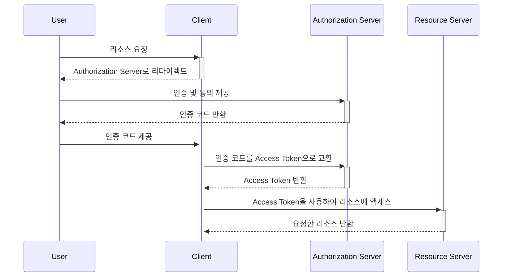

---

## OAuth

&nbsp; OAuth(Open Authorization)는 인터넷 사용자들이 비밀번호를 공유하지 않고, 다른 웹사이트나 애플리케이션에서 자신의 계정 정보를 안전하게 사용하도록 허용하는 개방형 표준이다. 이는 `제3자 액세스`를 가능하게 하는데, 사용자가 서비스 제공자에게 직접적으로 자신의 자격 증명을 제공하지 않아도 되도록 해준다. 
&nbsp; 예를 들면, 사용자가 웹사이트에 가입할 때 `Facebook`, `Google`을 통해 로그인하는 것이 OAuth를 사용한 사례이다. 이 경우, 사용자는 웹사이트에 자신의 Facebook 혹은 Google 비밀번호를 제공하지 않아도 되며, 대신 Facebook이나 Google은 사용자를 인증하고 해당 웹사이트에 ㅅ용자의 기본 정보(이름, 이메일 등)를 제공한다. 
&nbsp; 사용자는 다양한 서비스를 이용하면서도 자신의 게정 정보를 안전하게 보호할 수 있다. 또한 서비스 제공자는 복잡한 인증 시스템을 구현하지 않고도 안전한 사용자 인증을 할 수 있게 된다. 
&nbsp; 웹, 모바일, 데스크톱 애플리케이션 등에서 사용되며, 현재는 OAuth 2.0이 가장 널리 사용되는 버전이다. Access Token을 사용하여 클라이언트가 리소스 소유자(사용자) 대신 리소스 서버에 접근할 수 있도록 해준다.

## 동작 과정

&nbsp; 위 다이어그램은 OAuth 2.0의 `Authorization Code` 그랜트 타입을 사용한 시나리오로 웹 애플리케이션에서 사용되는 가장 일반적인 OAuth 2.0 시나리오이다.

### 역할 설명

1. `User`: 리소스의 소유자
2. `Client`: 사용자의 데이터에 액세스하려는 애플리케이션
3. `Authorization Server`: 사용자의 자격 증명을 확인하고, 클라이언트에게 Access Token을 제공하는 서버
4. `Resource Server`: 사용자의 데이터를 보유하고 있는 서버