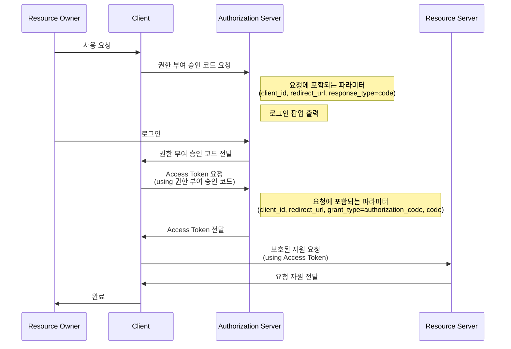
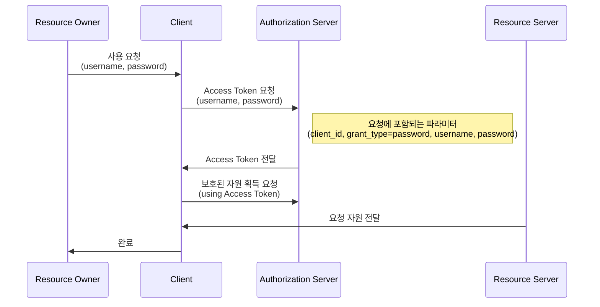
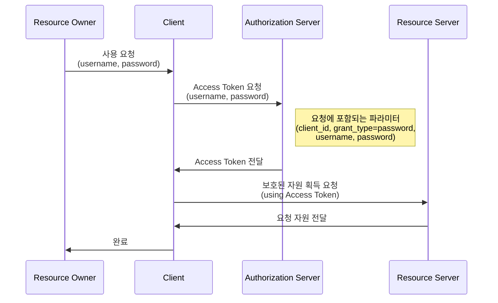
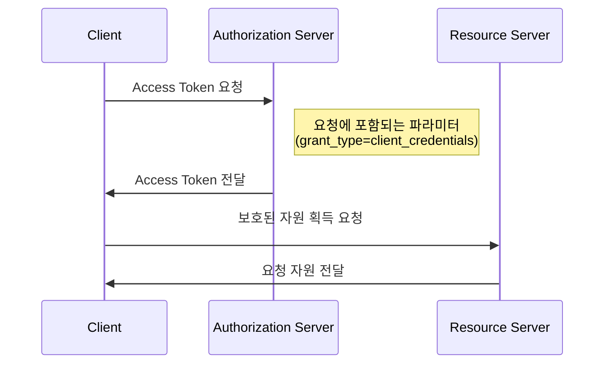

---

## OAuth 2.0

&nbsp; OAuth 2.0(Open Authorization 2.0, OAuth 2)은 웹 및 앱 개발에서 사용되는 인증 및 권한 부여를 위한 개방형 표준 프로토콜이다. Third-Party 프로그램을 통해 리소스 소유자를 대신하여 리소스 서버에서 제공한느 자원에 대한 접근 권한을 위임하는 방식을 제공한다. 
&nbsp; OAuth 2.0은 데이터 보안 및 사용자 개인 정보 보호 강화를 위해 SSL/TLS(HTTP)를 사용하도록 권장하며, 클라이언트 및 서버 간에 인증 및 권한 부여를 안전하게 처리하는 중요한 역할을 한다. 
&nbsp; 다양한 프로그래밍 언어와 플랫폼에서 지원되며, 각 플랫폼에 맞게 라이브러리 및 도구를 활용하여 구현할 수 있다. 이를 통해 사용자 데이터 보호와 보안 강화를 도모하면서도 서비스 간 상호 운용성을 제공할 수 있다.

### 시나리오

#### 소셜 미디어 로그인

&nbsp; 네이버, 구글, 카카오 등에서 제공하는 소셜 미디어 로그인 기능도 OAuth2 프로토콜 기반의 사용자 인증 기능을 제공한다. 사용자는 자신의 소셜 미디어 계정을 통해 앱 또는 웹 서비스에 로그인할 수 있고, 개발자는 이러한 계정을 통해 사용자에게 권한을 요청할 수 있다.

#### API 액세스

&nbsp; 개발자가 사용자의 데이터 혹은 서비스에 접근할 수 있는 권한을 얻을 수 있다. 예를 들어, 사용자의 이메일 주소에 액세스하거나, 사용자의 계정에 글을 게시하거나, 사용자의 사진을 읽을 수 있다.

### 핵심 개념

#### Resource Owner

&nbsp; 사용자를 의미한다. 데이터 또는 서비스에 대한 권한을 가지고 있으며, 이를 제3자인 서비스(웹 혹은 앱)에 부여할 수 있다. 
&nbsp; 개념적으로는 Resource Owner가 자격을 부여하는 것이 맞지만, 일반적으로 Authorization Server가 Resource Owner와 Client 사이에서 중개자 역할을 수행한다.

#### Client

&nbsp; OAuth 2.0을 사용하여 권한을 얻으려는 서비스를 의미한다.

#### Authorization Server

&nbsp; 사용자가 권한을 부여할지 여부를 결정하고, 클라이언트에게 액세스 토큰을 발급하는 서버이다.

#### Resource Server

&nbsp; 보호된 리소스, 즉 사용자 데이터나 API를 호스팅하는 서버이다. 이 서버는 액세스 토큰을 사용하여 요청을 승인 혹은 거부한다.

### 주요 용어

#### Authentication

&nbsp; `인증`. 접근 자격이 있는 지 검증하는 단계를 의미한다.

#### Authorization

&nbsp; `인가`. 자원에 접근할 권한을 부여하는 것을 의미한다. 인가가 완료되면 리소스 권한이 담긴 Access Token이 클라이언트에게 부여된다.

#### Access Token

&nbsp; 리소스 서버에게서 리소스 소유자의 보호된 자원을 획득할 때 사용되는 만료 기간이 있는 Token이다.

#### Refresh Token

&nbsp; Acess Token 만료 시 이를 갱신하기 위한 용도로 사용하는 Token이다. 일반적으로 Access Token보다 만료 기간을 길게 설정한다.

### 방식에 따른 차이

&nbsp; OAuth2 프로토콜에서는 다양한 클라이언트 환경에 적합하도록 권한 부여 방식에 따른 프로토콜을 4가지 종류로 구분하여 제공하고 있다. 각각의 플로우는 다른 시나리오와 보안 요구 사항을 충족하기 위한 차이가 있다.

#### 1. Authorization Code Grant

&nbsp; `권한 부여 승인 코드 방식`. 권한 부여 승인을 위해 자체 생성한 Authorization Code를 전달하는 방식으로, <u>가장 많이 쓰이고 기본이 되는 방식</u>이다. 간편 로그인 기능에서 사용되는 방식으로 클라이언트가 사용자를 대신하여 특정 자원에 접근을 요청할 때 사용되는 방식이다. 보통 타사의 클라이언트에게 보호된 자원을 제공하기 위한 인증에 사용된다. 
&nbsp; Refresh Token의 사용이 가능한 방식이다.

&nbsp; 권한 부여 승인 요청 시 response_type을 code로 지정하여 요청한다. 이후 클라이언트는 권한 서버에서 제공하는 로그인 페이지를 브라우저를 띄워 출력한다. 이 페이지를 통해 사용자가 로그인을 하면 권한 서버는 권한 부여 승인 코드 요청 시 전달받은 redirect_url로 Autorization Code를 전달한다. Authorization Code는 권한 서버에서 제공하는 API를 통해 Access Token으로 교환된다.

#### 2. Implict Grant

&nbsp; `암묵적 승인 방식`. **자격 증명을 안전하게 저장하기 힘든 클라이언트(ex: JavaScript 등의 스크립트 언어를 사용하는 브라우저)에게 최적화된 방식**이다. 
&nbsp; 이 방식에서는 권한 부여 승인 코드 없이 바로 Access Token이 발급되므로, 만료 기간을 짧게 설정하여 누출의 위험을 줄일 필요가 있다. 
&nbsp; Refresh Token 사용이 불가능한 방식이며, 이 방식에서 권한 서버는 client_secret을 사용해 클라이언트를 인증하지 않는다. Token을 획득하기 위한 절차가 간소화되기에 응답성과 효율성은 높지만, Aceess Token이 URL로 전달된다는 단점이 있다.

&nbsp; 권한 부여 승인 요청 시 response_type을 token으로 설정하여 요청하고, 클라이언트는 권한 서버에서 제공하는 로그인 페이지를 브라우저를 띄워 출력하게 되며 로그인이 완료되면 권한 서버는 Authorization Code가 아닌 Access Token을 redirect_url로 바로 전달한다.

#### 3. Resource Owner Password Credentials Grant

&nbsp; `자원 소유자 자격증명 승인 방식`. 간단하게 **username, password로 Access Token을 받는 방식**이다. 
&nbsp; 클라이언트가 타사의 외부 프로그램일 경우에는 이 방식을 적용하면 안되며, 자신의 서비스에서 제공하는 어플리케이션일 경우에만 사용되는 인증방식이다. Refresh Token의 사용도 가능하다.

&nbsp; 이 플로우는 간단하다. 제공하는 API를 통해 username, password를 전달하여 Access Token을 전달받는 것이다. 중요한 점은 이 방식은 권한 서버, 리소스, 클라이언트가 모두 같은 시스템에 속해 있을 때 사용되어야 하는 방식이라는 점이다.

#### 4. Client Credentials Grant

&nbsp; `클라이언트 자격 증명 승인 방식`. 말그대로 **클라이언트의 자격 증명만으로 Access Token을 획득하는 방식**이다. OAuth2의 권한 부여 방식 중 가장 간단한 방식으로 클라이언트 자신이 관리하는 리소스 혹은 권한 서버에 해당 클라이언트를 위한 제한된 리소스 접근 권한이 설정되어 있는 경우 사용된다.

&nbsp; 이 방식은 자격 증명을 안전하게 보관할 수 있는 클라이언트에서만 사용되어야 하며, Refresh Token은 사용할 수 없다.

---

### 배운 점

&nbsp; 현재 프로젝트에서는 총 4개의 Third-Party 플랫폼(네이버, 카카오, 구글, 애플)을 통해 소셜 로그인을 구현하고 있다. 방식이 조금 씩 달라서, '플랫폼별로 각기 차이가 있구나'라고 생각하고 있었는데 크게 4가지의 방식이 있다는 사실을 덕분에 알 수 있었다.

---

## Reference

- [OAuth 2.0 동작 방식의 이해](https://blog.naver.com/mds_datasecurity/222182943542)
