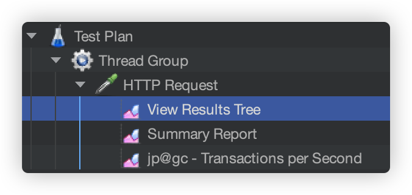
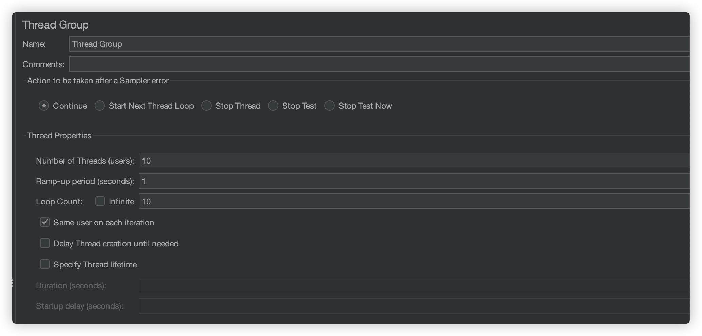
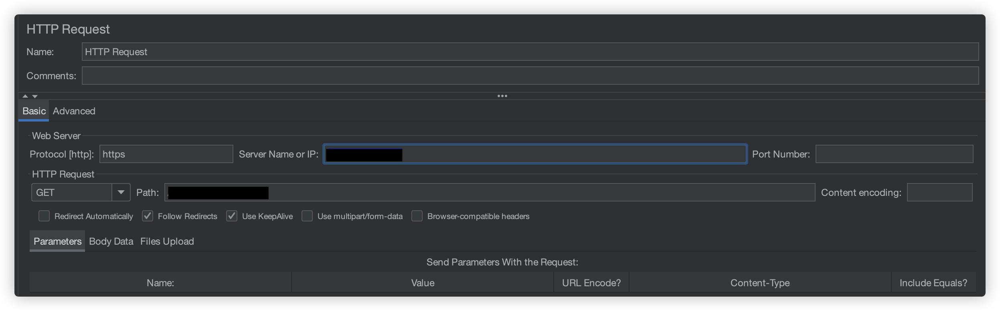

---

## 작성 배경

&nbsp; 어느 덧 SW마에스트로 활동도 마무리되었다. 비록 100% 만족할 만한 결과는 아니였지만, 실제 사용자도 받아볼 수 있었고, 나의 가치관에도 영향을 주었던 매우 뜻깊은 시간이였던 것 같다. 각설하고, 멘토님들의 마지막 멘토링에서 '실제 사용자를 받는 서비스를 운영하면서, 백엔드 개발자가 해보아야 할 것이 무엇인가?'라는 주제로 멘토님들께 여쭤봤었는데, 다들 스트레스 테스트를 해보라고 강력히 권고하셨다. 
&nbsp; 곰곰히 생각해보면 백엔드 개발자 입장에서 스트레스 테스트를 해보는 것은 당연한 것인 것 같다. 스트레스 테스트를 해보아야 내가 만든 API가 서버에 얼마나 무리를 주는지 알고, 이에 따른 후속 조치가 필요하다는 것을 파악할 수 있을테니까.

## 이전 포스팅

&nbsp; [이전 포스팅](https://jinlee.kr/web/2023-12-03-jmeter1/)에서는 Apache JMeter를 설치하는 방법에 대해서 다루었다.

## 사용을 위한 사전 준비

&nbsp; 처음 실행을 하면 좌측 메뉴에서 `Test Plan`이라는 항목만 존재할 것이다. 위 그림의 항목들을 추가해주어야 한다. 추가 방법은 다음과 같다.

1. Test Plan (우클릭) > Add > Threads (Users) > `Thread Group`
2. Thread Group (우클릭) > Add > Sampler > `Http Request`
3. Thread Group (우클릭) > Add > Listener > `View Resultsz Tree`
4. Thread Group (우클릭) > Add > Listener > `Summary Report`
5. Thread Group (우클릭) > Add > Listener > `jp@gc - Transactions per Second`

## Thread Group

&nbsp; Thread Group은 부하 테스트를 진행하기 위한 쓰레드를 설정하는 메뉴이다.

### Number of Thread (users)

- 가상의 사용자를 몇 명으로 설정할 건지에 대한 값 (몇 개의 쓰레드를 생성할 것인가?)
- N명의 사용자가 동시에 호출
- 사용자가 많아질 수록 서버의 부하는 증가함

### Ramp-up period (seconds)

- 전체 쓰레드가 전부 실행되는데 까지 걸리는 시간
- ex) Number of Thread가 5이고, Ramp-up period가 15일 경우: 첫번째 쓰레드가 실행된 후 다음 쓰레드가 실행될 때까지 3초간 대기함

### Loop Count

- 각 쓰레드가 몇 번 반복하는가?
- infinite를 체크하면 무한 반복

## HTTP Request

&nbsp; 어떤 URL에 부하를 줄 건지 설정하기 위한 메뉴이다.

### Protocol

- 어떤 프로토콜을 통해 테스트를 진행할 것인지 입력할 수 있다.
- ex) <https://www.naver.com>에 테스트를 진행할 때 -> `http` 입력

### Server Name or IP

- 어떤 IP 주소에 URL을 줄 지 입력할 수 있다.
- ex) <https://www.naver.com>에 테스트를 진행할 때 -> `www.naver.com` 입력

### HTTP Request

- 드롭다운: 어떤 HTTP Method(GET, POST 등)로 테스트를 진행할 지 선택할 수 있다.
- Path: IP의 하위 경로를 작성하여 테스트를 진행할 수 있다.
- ex) <https://www.naver.com/test>에 테스트를 진행할 때 -> `/test` 입력

---

## References

- [https://velog.io/@ehdrms2034/%EC%84%B1%EB%8A%A5-%ED%85%8C%EC%8A%A4%ED%8A%B8-%EB%8F%84%EA%B5%AC-Apache-Jmeter-%EC%84%A4%EC%B9%98%EB%B6%80%ED%84%B0-%EA%B0%84%EB%8B%A8%ED%95%9C-%EC%82%AC%EC%9A%A9%EA%B9%8C%EC%A7%80](https://velog.io/@ehdrms2034/%EC%84%B1%EB%8A%A5-%ED%85%8C%EC%8A%A4%ED%8A%B8-%EB%8F%84%EA%B5%AC-Apache-Jmeter-%EC%84%A4%EC%B9%98%EB%B6%80%ED%84%B0-%EA%B0%84%EB%8B%A8%ED%95%9C-%EC%82%AC%EC%9A%A9%EA%B9%8C%EC%A7%80)
- [https://jnylove.tistory.com/316](https://jnylove.tistory.com/316)
