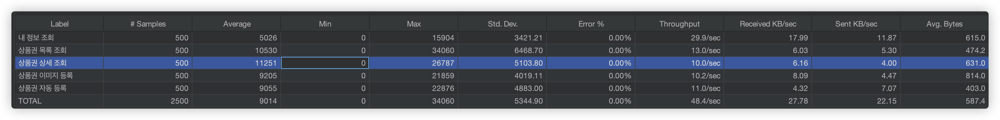

---

## 작성 배경

&nbsp; 어느 덧 SW마에스트로 활동도 마무리되었다. 비록 100% 만족할 만한 결과는 아니였지만, 실제 사용자도 받아볼 수 있었고, 나의 가치관에도 영향을 주었던 매우 뜻깊은 시간이였던 것 같다. 각설하고, 멘토님들의 마지막 멘토링에서 '실제 사용자를 받는 서비스를 운영하면서, 백엔드 개발자가 해보아야 할 것이 무엇인가?'라는 주제로 멘토님들께 여쭤봤었는데, 다들 스트레스 테스트를 해보라고 강력히 권고하셨다. 
&nbsp; 곰곰히 생각해보면 백엔드 개발자 입장에서 스트레스 테스트를 해보는 것은 당연한 것인 것 같다. 스트레스 테스트를 해보아야 내가 만든 API가 서버에 얼마나 무리를 주는지 알고, 이에 따른 후속 조치가 필요하다는 것을 파악할 수 있을테니까.

## 이전 포스팅

&nbsp; [이전 포스팅](https://jinlee.kr/web/2023-12-30-jmeter2/)에서는 Apache JMeter를 통해 서버 부하 테스트를 하기 위한 사전 준비에 대해서 다루었다.

## 테스트 환경

- AWS EC2 t2.micro
- Ubuntu 20.04 64bit
- Number of Threads (users): 500
- Ramp-up period (seconds) : 1
- Loop Count: 1

## 테스트 항목

### 1. 사용자 정보 조회 API

&nbsp; JWT만 있으면 테스트해볼 수 있는 가장 기본이 되는 API 이기 때문에 테스트 해보기로 하였다.

### 2. 모바일 상품권 목록 조회 API

&nbsp; 어플리케이션을 실행하면 보여지는 메인 화면에서 호출되는 API이기 때문에 가장 많이 사용될 것으로 판단하였다.

### 3. 모바일 상품권 상세 조회 API

&nbsp; 1과 마찬가지로 사용자 입장에서 자주 사용되는 API라고 판단하였다

### 4. 모바일 상품권 이미지 등록 API

&nbsp; 모바일 상품권의 원본 이미지를 S3에 저장하기 위해 Presigned-Url을 발급해주는 API이다. 이전 S3에 직접 저장하는 것에 비해 서버의 부담이 많이 감소하였을 것이기 때문에, 실제로 서버에 얼마나 부하를 주는 지 테스트해보기로 하였다.

### 5. 모바일 상품권 자동 등록 API

&nbsp; 팀원이 비동기 방식으로 모바일 상품권 등록 기능을 구현한 API이다. 과연 실제로 서버에 가해지는 부담이 감소하였는지 확인하기 위해서 테스트해보기로 하였다.

## 테스트 결과

