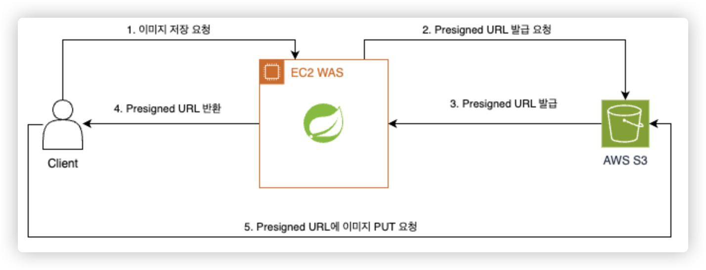
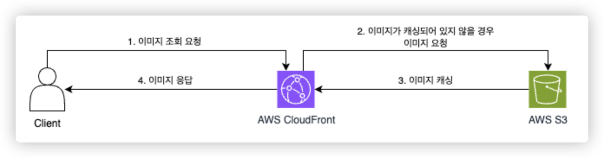

---

## 배경

&nbsp; 현재 졸업 작품 팀에서 S3에 정적 파일을 저장하고 있다. 정적 파일을 조회 및 저장하는 부분은 이미 구현을 하였으나, 저장하는 과정에 대한 별도의 제약이 없기 때문에 우리 서비스를 사용하는 사용자가 무분별하게 큰 파일을 지속적으로 저장 시도할 경우 S3에 대한 지나친 과금이 발생할 수도 있는 상황이다. 이러한 상황을 대비하기 위한 해결책 중 하나로 `S3의 최대 파일 크기를 25MB로 제한하자`라는 의견이 나오게 되었고, 이를 구현하기 위한 방법을 찾아야 하게 되었다. 현재 조회 및 저장에 대한 프로세스는 아래에 기술하도록 하겠다.

### 현재 정적 파일 저장 및 조회 프로세스

#### 정적 파일 저장 (Presigned URL 적용)



1. Client to WAS : 정적 파일 저장 요청
2. WAS to S3 : Presigned URL 발급 요청
3. S3 to WAS : Presigned URL 발급
4. WAS to Client : S3에서 발급한 Presigned URL 응답(전달)
5. Client to S3 : Presigned URL을 통해 정적 파일 PUT 요청 및 응답

#### 정적 파일 조회 (CloudFront 적용)



1. Client to CloudFront : 정적 파일 조회 요청
2. (이미지가 캐싱되어 있지 않을 경우) CloudFront to S3 : 정적 파일 요청
3. (이미지가 캐싱되어 있지 않을 경우) S3 to CloudFront : 정적 파일 캐싱
4. 정적 파일 응답

---

## 고안해낸 방법

### 1. 프록시 서버 구축하기

&nbsp; 별도의 프록시 서버(EC2 Instance)를 추가로 구축하고, 모든 파일 업로드 요청을 프록시 서버를 경유하여 S3로 PUT 이벤트를 발생하도록 한다. 프록시 서버에서는 파일 크기를 검사하여, 제한된 크기를 초과할 경우 S3로 PUT 이벤트를 발생하지 않도록 하는 방식이다.<br>

#### 장점

&nbsp; 추후에 이미지 크기 검증 로직이 아닌 다른 검증 로직을 추가할 수 있다는 점에서 비교적 유연하게 설정할 수 있을 것으로 보인다.

#### 단점

&nbsp; 별도의 프록시 서버 인스턴스가 추가될 것이다. 이에 따라 추가적인 인프라 비용(EC2 Instance 비용)이 발생하게 될 것이고, 단계가 추가됨에 있어 요청 및 응답 시간 증가와 같은 성능 저하의 가능성이 있다.

#### 결론

&nbsp; **채택하지 않았다.** 실제 상용 서비스에서 이 방법을 통해 제한하는 경우도 있었다. 하지만 우리 프로젝트는 교내의 지원금을 받아서 사용하고 있고, 이에 따른 금전적 제약이 따를 수 있기 때문에 최대한 비용을 절감하는 방식을 채택하기로 하였다. 이에 따라 해당 방법은 고려하지 않기로 하였다.

### 2. AWS Lambda 사용하기

&nbsp; AWS Lambda를 사용하여 S3로 파일이 업로드된 후 트리거가 발생하도록 설정한다. Lambda 함수 내에서 파일 크기를 확인하여 제한 크기를 초과하는 파일을 삭제하도록 처리하는 방식이다.

#### 장점

&nbsp; 서버리스 서비스이기 때문에 별도로 관리해야할 부담이 적고, 업로드 될 때마다 비용이 발생할 것이기 때문에 EC2 인스턴스보다 상대적으로 비용이 적을 수도 있다.

#### 단점

&nbsp; 이미 Presigned URL을 통한 요청으로 파일이 업로드된 후에 조건을 검증하여 삭제하는 과정을 거쳐야 한다. 즉 PUT 요청에 따른 비용은 발생하게 될 것이다.

#### 결론

&nbsp; **채택하지 않았다.** `프록시 서버 구축` 방법과 동일한 이유이다. 우리 서비스의 경우에는 사용자가 정적 파일을 등록하는 데에 있어 별도의 횟수 등의 제약이 없기 때문에 무분별한 요청을 하게 될 경우 오히려 EÇ2 인스턴스보다 더 비용이 많이 발생할 수도 있다. 이에 따라 해당 방법은 고려하지 않기로 하였다.

### 3. S3 Bucket Policy를 통해 제한하기

&nbsp; AWS S3의 Bucket Policy(정책)을 통해 제한하는 방법을 찾아보았다. 하지만 POST Policy의 `condition`을 통해 Object Size를 검증하는 방법을 찾을 수 없었기 때문에 장단점을 기술하지 않도록 하겠다.

### 4. Content Header 추가

&nbsp; API를 통해 사전에 클라이언트로부터 `Content-Length`, `Content-Type` 값을 입력받고, Presigned URL을 만들 때 헤더에 이들에 대한 정보를 추가하도록 하는 방식이다. 헤더를 추가함으로써 일치하지 않는 파일을 업로드할 때 이를 제한하도록 한다.

#### 장점

&nbsp; 가장 큰 장점은 파일 업로드 시 즉시 크기와 타입을 확인할 수 있다. 그리고 아래에서 언급할 방법보다는 비교적으로 쉽게 설정할 수 있다.

#### 단점

&nbsp; 클라이언트에서 헤더를 조작하여 Request를 함으로써 이를 우회할 수 있다.

#### 결론

&nbsp; 우선 **채택하지 않았다.** 단점에서 서술한 조작이 가능하다는 점과 더불어, 기존에 관례로 사용하는 `Content-Length`와 `Content-Type`의 사용법에 관점을 두었다. 일반적인 Request와 Response의 경우에는 `Content-Length`의 경우에는 메시지 본문의 크기를 바이트 단위로 나타내고, `Content-Type`은 메시지 본문의 미디어 타입을 나타내는 헤더이다. 하지만 이 방법을 채택할 경우, 기존 관례를 어기게 된다는 점에서 필자는 우선적으로 보류하기로 하였따.

### 5. S3 POST Policy를 통해 제한하기

&nbsp; `POST Policy`란 AWS S3에서 Presigned URL을 사용해 파일을 업로드할 때, 특정 클라이언트가 특정 조건을 만족해야만 업로드를 허용할 수 있도록 설정하는 방법이다.

#### 장점

&nbsp; 마찬가지로 가장 큰 장점은 파일 업로드 시 즉시 크기와 타입을 확인할 수 있다. 서버에서 관리할 필요 없이 정책 설정만으로도 제한할 수 있기 때문이다.

#### 단점

&nbsp; `Content Header 추가` 방식보다 비교적 설정이 복잡하다. 또한 마찬가지로 클라이언트 측 검증이기 때문에 클라이언트 조작에서 아주 자유롭지는 못하다. 마지막으로 정책 문서의 크기가 20KB로 제한되어 있기 때문에, 매우 복잡한 정책을 작성할 때 제한이 있을 수 있다.

#### 결론

&nbsp; 우선 **채택하기로 하였다.** 비록 적용하는 방법이 어렵지만 `HMAC을 이용하여 서명`하는 과정을 거쳐야하기 때문에 비교적으로 클라이언트 측 조작이 힘들 것으로 판단되었고, 관례 상 문제가 전혀 없는 방식이라는 점에서 필자의 마음을 끌었다.

---

## 적용 방법

### 프로세스

1. 원하는 조건으로 정책을 작성한다.
2. 정책을 Base64로 인코딩한다.
3. 정책에서 HMAC을 이용하여 요청 서명을 생성한다.

### 소스 코드

#### 1. 정책 생성

```java
(작성 중)...
```

- x-amz-credential
- x-amz-algorithm
- x-amz-date
- bucket
- key
- x-amz-security-token

#### 2. (작성 중)...

---

## References

- [https://velog.io/@invidam/S3-Presigned-Url-%EB%8F%84%EC%9E%85%ED%95%98%EA%B8%B0#post-policy%EB%A5%BC-%EC%9D%B4%EC%9A%A9](https://velog.io/@invidam/S3-Presigned-Url-%EB%8F%84%EC%9E%85%ED%95%98%EA%B8%B0#post-policy%EB%A5%BC-%EC%9D%B4%EC%9A%A9)
- [https://noamlevy-40779.medium.com/how-to-limit-file-size-on-upload-to-s3-using-java-94faf7d3c51](https://noamlevy-40779.medium.com/how-to-limit-file-size-on-upload-to-s3-using-java-94faf7d3c51)
