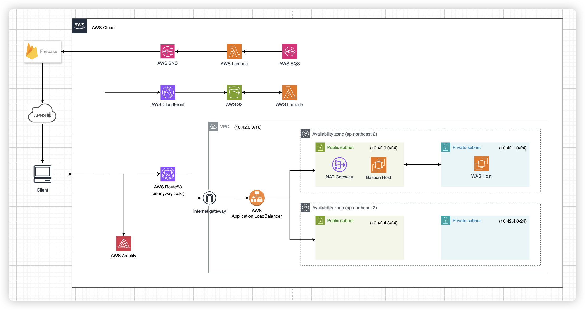

---

## 배경

&nbsp; 우리 서비스에서는 전화번호 인증과 같이 '요청마다 과금이 발생하는 API'가 존재한다. 이러한 API를 무분별하게 사용하도록 방치할 경우 우리 서비스의 과금 비용은 개발자가 감당할 수 없을 정도로 커질 수 있다. 이러한 이슈를 사전에 예방하고자 "특정 API의 경우 요청 횟수를 제한하자"라는 의견이 나오게 되었고, 이러한 방법을 적용하기 위한 과정을 기술하고자 한다.

## Infrastructure



&nbsp; 우리 서비스는 현재 AWS를 사용하며 Bastion Host를 단일 접근 지점으로 하여, WAS에 HTTP 요청을 하도록 구현하였다. 따라서 아래에 서술할 방법도 모두 Bastion Host에서 적용한 방법이라는 점을 유의하도록 하자.

---

## /etc/nginx/lua/rate_limit.lua

```lua
local redis = require "resty.redis"
local red = redis:new()

red:set_timeout(1000) -- 1 sec

-- Connect to Redis
local ok, err = red:connect("redis", 6379) -- "redis"는 Docker Compose에서 정의한 서비스 이름입니다.
if not ok then
    ngx.log(ngx.ERR, "failed to connect to Redis: ", err)
    return ngx.exit(500)
end

-- Key for the rate limit
local key = "rate_limit:" .. ngx.var.binary_remote_addr

-- Increment the count
local count, err = red:incr(key)
if not count then
    ngx.log(ngx.ERR, "failed to incr key: ", err)
    return ngx.exit(500)
end

-- Set expiration time to 24 hours if this is the first request
if count == 1 then
    red:expire(key, 86400)
end

-- Check the count
if count > 5 then
    ngx.log(ngx.ERR, "rate limit exceeded for ", ngx.var.binary_remote_addr)
    return ngx.exit(429)
end
```

&nbsp; `Lua`는 스크립트 언어의 일종으로 비교적 메모리 사용량이 적기 때문에 주로 임베디드 시스템과 애플리케이션에서 확장성 있는 스크립팅 기능을 제공하기 위해 사용된다.<br>
&nbsp; 위 스크립트의 경우에는 Redis를 사용하여 각 클라이언트별 API의 요청 횟수를 추적하고, 시간 내에 요청 횟수를 초과하는 요청이 들어오면 이를 차단하도록 구현하였다.<br>
&nbsp; 초과하는 요청의 경우에는 `429` Code를 반환한다.

## nginx.conf

```nginx
events {
    worker_connections 1024;
}

http {
    include       mime.types;
    default_type  application/octet-stream;

    log_format  main  '$remote_addr - $remote_user [$time_local] "$request" '
                      '$status $body_bytes_sent "$http_referer" '
                      '"$http_user_agent" "$http_x_forwarded_for"';

    access_log  /usr/local/openresty/nginx/logs/access.log  main;
    error_log   /usr/local/openresty/nginx/logs/error.log   warn;

    sendfile        on;
    keepalive_timeout  65;

    resolver 127.0.0.11 valid=30s;  # Docker의 내부 DNS 서버

    server {
        listen       80;
        server_name  <your_api_server_name>;  # 예: api.dev.example.com

        location / {
            proxy_pass http://<your_backend_server>:<port>;  # 예: http://10.42.1.42:8080
            proxy_set_header Host $host;
            proxy_set_header X-Real-IP $remote_addr;
            proxy_set_header X-Forwarded-For $proxy_add_x_forwarded_for;
            proxy_set_header X-Forwarded-Proto $scheme;
        }

        location /v1/phone {
            access_by_lua_file /etc/nginx/lua/rate_limit.lua;

            proxy_pass http://<your_backend_server>:<port>;  # 예: http://10.42.1.42:8080
            proxy_set_header Host $host;
            proxy_set_header X-Real-IP $remote_addr;
            proxy_set_header X-Forwarded-For $proxy_add_x_forwarded_for;
            proxy_set_header X-Forwarded-Proto $scheme;
        }
    }
}

```

&nbsp; 위 설정 파일 예제에서 NGINX는 클라이언트의 요청을 받아 백엔드 서버로 전달하는 리버스 프록시 역할을 하고 있다. 이는 로드 밸런싱 및 보안을 강화하고 백엔드 서버의 부하를 줄일 수 있다. 아래는 개발 환경별 달라질 수 있는 값에 대한 설명이다.

- `<your_api_server_name>`: API 서버의 도메인 이름 (예: api.dev.example.com).
- `<your_backend_server>`: 백엔드 서버의 IP 주소 또는 호스트 이름 (예: 10.42.1.42).
- `<port>`: 백엔드 서버의 포트 번호 (예: 8080).
- `<api_path>`: 요청을 제한할 API 경로

## docker-compose.yml

```yaml
version: "3"
services:
  nginx:
    image: openresty/openresty:latest
    volumes:
      - /home/ubuntu/nginx.conf:/usr/local/openresty/nginx/conf/nginx.conf
      - /etc/nginx/lua:/etc/nginx/lua
    ports:
      - "80:80"
    depends_on:
      - redis
  redis:
    image: redis:latest
    ports:
      - "6379:6379"
```

&nbsp; Docker Compose를 사용하여 NGINX와 Redis 서비스를 설정하였다. 여기서 유의할 점이 기본 NGINX 이미지가 아닌 `OpenResty` 이미지를 사용하는데, 기본 NGINX 이미지는 Lua 스크립팅을 지원하지 않기 때문이다. OpenResty는 NGINX를 확장하여 LuaJIT과 통합된 고성능 Lua 스크립팅 기능을 제공함으로써, NGINX 설정 파일에서 Lua 스크립트를 사용하여 동적 웹 애플리케이션을 쉽게 구축할 수 있도록 한다.
