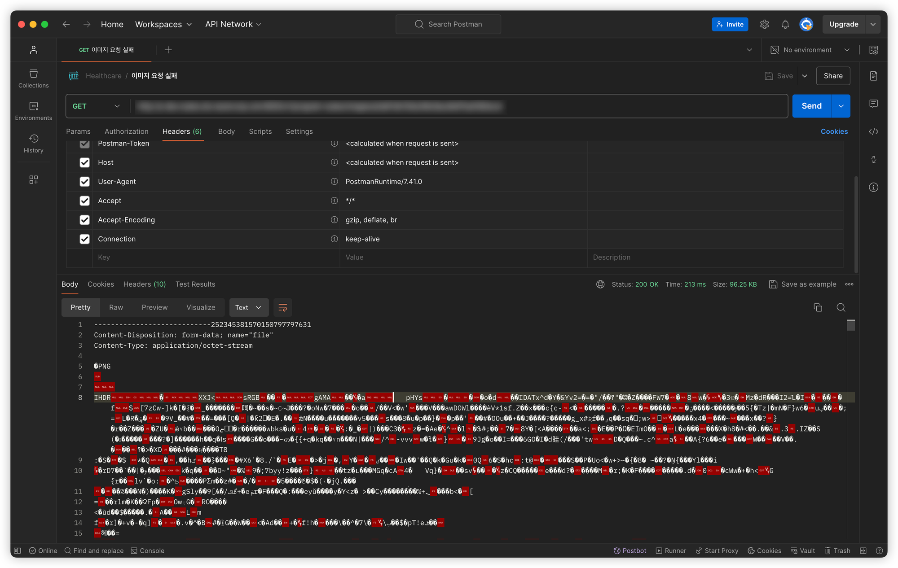

---

## Background

&nbsp; 필자는 최근 Node.js를 사용한 이미지 업로드 기능을 구현하는 과정에서 예상치 못한 문제에 직면했다. 클라이언트로부터 전송된 멀티파티 폼 데이터에서 이미지를 추출하고 처리하는 과정이 생각보다 복잡했기 때문이다.<br>

&nbsp; 특히 form-data의 헤더 부분을 제거하고 실제 이미지 데이터만을 추출하는 과정에서 어려움을 겪었다. 멀티파트 폼 데이터의 구조를 정확히 이해하지 못한 채 구현을 시도했던 것이 문제였다. 이 과정에서 멀티파트 폼 데이터의 구조, 바운더리의 개념, 그리고 각 파트의 헤더와 본문 구조에 대해 깊이 있게 학습하게 되었다.<br>

&nbsp; 또한, 추출한 이미지 데이터의 MIME 타입을 정확히 식별하는 것도 중요한 과제였다. 이를 해결하기 위해 이미지 파일의 구조, 특히 파일 시그니처(매직 넘버)에 대해 연구하게 되었고, 이를 통해 다양한 이미지 포맷의 헤더 구조를 이해하게 되었다.<br>

&nbsp; 이렇게 얻은 지식과 경험을 다른 개발자들과 공유하기 위해 포스팅하게 되었다. 필자가 겪은 문제와 해결 과정, 그리고 그 과정에서 얻은 인사이트가 비슷한 상황에 직면한 다른 개발자들에게 도움이 되길 바란다.<br>

&nbsp; 또한, 이번 경험을 통해 단순히 코드를 작성하고 활용하는 것이 아닌, 그 기저에 있는 원리와 구조를 이해하는 것의 중요성을 다시 한번 깨닫게 되었다. 멀티파트 폼 데이터와 이미지 파일 구조에 대한 이해는 단순히 이미지 업로드 기능 구현을 넘어, 웹 개발에서의 파일 처리에 대한 전반적인 이해도를 높이는 데에 도움이 되었다.<br>

&nbsp; 필자의 포스팅을 본 독자들에게도 비슷한 깨달음을 주고, 실제 프로젝트에서 마주할 수 있는 문제들을 해결하는 데 도움이 되기를 희망한다.

---

## 멀티파트 폼 데이터와 이미지 파일의 이해

&nbsp; `multipart/form-data`는 HTTP 요청에서 여러 부분으로 나뉜 데이터를 전송할 때 사용하는 인코딩 타입이다. 주로 파일 업로드에 사용된다.

### 멀티파트 폼 데이터의 구조

#### Content-Type 헤더

&nbsp; 요청의 Content-Type은 `multipart/form-data`로 설정되며, 바운더리(boundary) 문자열이 지정된다. 아래는 이에 대한 예시이다.

```
Content-Type: multipart/form-data; boundary=---------------------------1234567890
```

#### Boundary

&nbsp; 각 파트를 구분하는 구분자 역할을 한다. 바운더리는 고유해야 하며, 데이터 내용과 충돌하지 않아야 한다.

#### 각 파트의 구조

- 바운더리로 시작
- 헤더 (Content-Disposition, Content-Type 등)
- 빈 줄 (헤더와 본문 구분)
- 파트의 실제 내용

#### 마지막 바운더리

&nbsp; 데이터의 끝을 나타내며, 일반 바운더리에 '--'가 추가된다. 아래는 이에 대한 예시이디ㅏ.

```
예시:
---------------------------1234567890
Content-Disposition: form-data; name="field1"

value1
---------------------------1234567890
Content-Disposition: form-data; name="file1"; filename="example.jpg"
Content-Type: image/jpeg

(바이너리 데이터)
---------------------------1234567890--
```

### 이미지 파일의 구조와 시그니처

&nbsp; 이미지 파일은 고유한 구조와 시그니처(매직 넘버)를 가지고 있어, 이를 통해 파일 형식을 식별할 수 있다.

- 파일 시그니처(매직 넘버): 파일의 시작 부분에 위치한 고유한 바이트 시퀀스로, 파일 형식을 의미한다.
- 주요 이미지 형식의 시그니처
  - JPEG: FF D8 FF
  - PNG: 89 50 4E 47 0D 0A 1A 0A
  - GIF: 47 49 46 38 (GIF8)
  - BMP: 42 4D (BM)
- 헤더 구조
  - 시그니처 다음에 오는 부분으로, 이미지의 크기, 색상 정보 등 메타데이터를 포함한다.
- 이미지 데이터
  - 실제 픽셀 정보를 담고 있는 부분이다.

## Trouble Shooting

### 문제 상황 설명



&nbsp; 응답 본문을 자세히 보면, multipart/form-data의 헤더가 함께 들어가 있는 것을 확인할 수 있다. `multipart/form-data`는 일반적으로 파일 업로드에 사용되는 인코딩 타입이다. 필자는 이 상황이 실제로는 파일을 서버로 전송하는 과정에서 발생한 것이라고 추측하였다.<br>

&nbsp; 이런 상황에서는 다음과 같은 점들을 고려해야 한다.

- 클라이언트에서 서버로 파일을 전송하고 있는지 확인한다.
- 요청 헤더에 `Content-Type: multipart/form-data`가 제대로 설정되어 있는지 점검한다.
- 서버 측에서 multipart/form-data를 올바르게 처리하고 있는지 검토한다.

### 문제 해결 과정

#### multipart/form-data 전송

```tsx
private async uploadFileToServer(fileData: Buffer, fileType: string): Promise<string> {
  const serverUrl = process.env.FILE_SERVER_URL;
  if (!serverUrl) {
    throw new Error('FILE_SERVER_URL이 설정되지 않았습니다.');
  }

  const newFileId = generateUniqueId();
  const uploadUrl = `${serverUrl}/files/${newFileId}`;

  const formData = new FormData();
  formData.append('file', fileData, {
    filename: 'file.dat',
    contentType: fileType,
  });

  const response = await lastValueFrom(
    this.httpClient.post<AxiosResponse>(uploadUrl, formData, {
      headers: { ...formData.getHeaders() },
      params: { replace: true },
    }),
  );

  if (response.status !== 200) {
    throw new Error(`파일 업로드 실패: status ${response.status}`);
  }

  return newFileId;
}
```

&nbsp; form-data 방식은 파일 업로드에 흔히 사용되는 방법이다. 이 방식의 주요 특징은 다음과 같다.

- 여러 필드와 파일을 하나의 요청으로 전송할 수 있다.
- 'multipart/form-data' 형식을 사용하여 데이터를 구조화한다.
- 파일 이름, 컨텐츠 타입 등의 메타데이터를 쉽게 포함할 수 있다.
- 대부분의 서버 프레임워크에서 기본적으로 지원한다.

&nbsp; 이 방법은 추가 데이터를 함께 전송해야 하거나, 서버가 multipart 형식을 요구할 때 유용하다. 단, 약간의 오버헤드가 발생할 수 있으며, 요청 구조가 복잡해질 수 있다.

#### raw-data 전송

&nbsp; 개발을 하다 보면 때로는 단순함이 최고의 해결책이 될 때가 있다. raw-data 전송 방식은 바로 그런 경우다. 개발자로서 우리는 종종 문제를 복잡하게 만들곤 하지만, 때로는 단순함이 가장 강력한 무기가 된다. raw-data 전송은 그 단순함으로 인해 디버깅도 쉽고, 다른 시스템과의 호환성도 높다. 마치 모두가 이해할 수 있는 공용어를 사용하는 것과 같은 효과를 준다.<br>

&nbsp; 이러한 사유로 필자는 `raw-data` 전송을 통해 해결하는 방식을 선택하였다.

```tsx
private async uploadFileToServer(fileData: Buffer, fileType: string): Promise<string> {
  const serverUrl = process.env.FILE_SERVER_URL;
  if (!serverUrl) {
    throw new Error('FILE_SERVER_URL이 설정되지 않았습니다.');
  }

  const newFileId = generateUniqueId();
  const uploadUrl = `${serverUrl}/files/${newFileId}`;

  const response = await lastValueFrom(
    this.httpClient.post<AxiosResponse>(uploadUrl, fileData, {
      headers: { 'Content-Type': fileType },
      params: { replace: true },
    }),
  );

  if (response.status !== 200) {
    throw new Error(`파일 업로드 실패: status ${response.status}`);
  }

  return newFileId;
}
```

&nbsp; raw-data 방식은 파일 데이터를 직접 전송하는 방법이다. 이 방식의 주요 특징은 다음과 같다:

- 파일 데이터를 있는 그대로 전송한다.
- 요청 구조가 단순하다.
- 추가적인 메타데이터 전송이 제한적이다.
- 대용량 파일 전송 시 효율적일 수 있다.

&nbsp; 이 방법은 단순히 파일 데이터만 전송하면 되는 경우나, 서버가 raw 바이너리 데이터를 직접 처리할 수 있을 때 적합하다. 추가 정보가 필요한 경우 쿼리 파라미터나 헤더를 통해 전달해야 한다.

---

## Summary

&nbsp; 이번 포스트에서는 Node.js 환경에서 멀티파트 폼 데이터를 다루는 과정에서 겪은 문제와 그 해결 과정을 살펴보았다. 주요 내용은 다음과 같다.

- 멀티파트 폼 데이터의 구조와 특징을 상세히 설명했다. 특히 Content-Type 헤더, 바운더리, 각 파트의 구조에 대해 자세히 다루었다.
- 이미지 파일의 구조와 시그니처(매직 넘버)에 대해 설명하며, 주요 이미지 형식별 시그니처를 소개했다.
- 실제 직면했던 문제 상황을 설명하고, 이를 해결하기 위한 두 가지 접근 방식을 비교했다.
  - multipart/form-data 전송 방식
  - raw-data 전송 방식
- 최종적으로 raw-data 전송 방식을 선택한 이유와 그 장점에 대해 설명했다. 단순성, 효율성, 디버깅의 용이성 등이 주요 선택 요인이었다.
