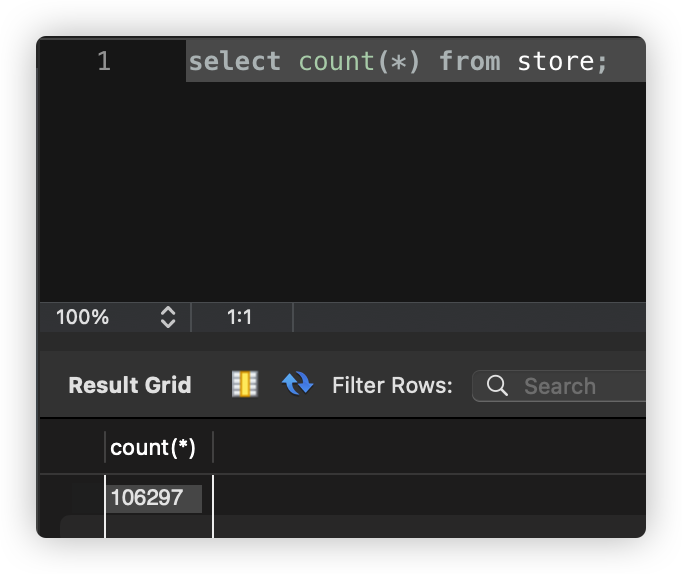
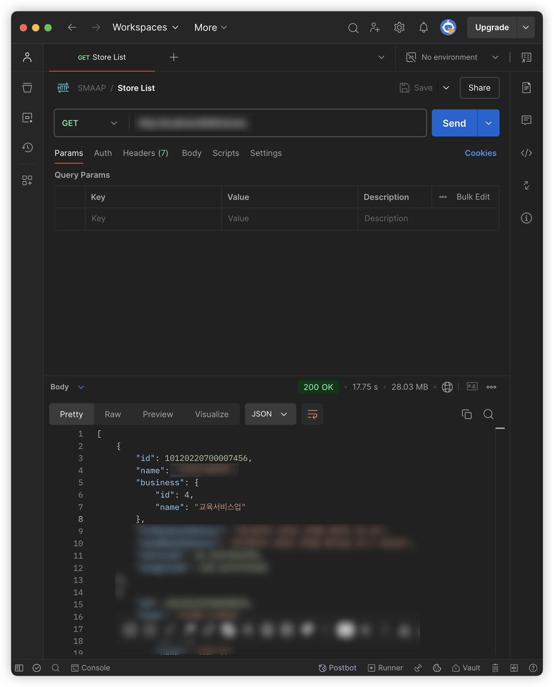

---

## 1. 개요

&nbsp; 대규모 서비스를 운영하다보면 대용량 데이터 처리 시 성능 이슈가 발생할 수 있다. 수만 건 이상의 데이터를 다루는 API에서는 응답 시간 지연이나 메모리 부족 같은 문제들이 발생한다. 이러한 문제는 사용자 경험을 떨어트리므로, 서비스 측면에서도 개선이 필요한 사항이다. 이러한 문제들을 해결하기 위해 다양한 최적화 전략들이 필요하다.

### 1.1. 직면한 상황

| SELECT 쿼리로 살펴본 데이터 개수                                          | Postman으로 살펴본 API 응답 시간 (17.75초)                                 |
| ------------------------------------------------------------------------- | -------------------------------------------------------------------------- |
|  |  |

&nbsp; 필자의 경우에는 상점 목록을 반환하는 REST API를 Spring Boot를 통해 구현하였는데, 별도 옵션을 지정하지 않을 경우(업종 종류, 좌표 등) 전체 상점 목록이 반환되도록 구현하였다. 하지만 이 경우 현재 데이터베이스에 저장되어 있는 상점의 개수는 `100,000개`를 훌쩍 넘어간다. 이를 Postman을 통해 API 요청-응답까지 걸리는 시간이 `약 18초`인 것을 확인할 수 있었다. 만약 사용자가 상점 목록이 필요한 기능을 실행했다고 생각해보자. 이에 대한 결과가 화면에 나타나기까지 18초가 걸린다고 생각해보면 얼마나 심각한 지 실감할 수 있다. 필자라면 '서비스에 문제가 있나?', '내 네트워크 환경이 문제인가?'라는 생각을 하고 여러 시도를 하다가 서비스를 종료할 것이다.<br>

&nbsp; 심지어 이마저도 현재 프로젝트 기획 상 **대구광역시의 상점**에 대해서만 관리하고 있으므로, 추후에 서비스 규모를 확장하게 된다면 반드시 개선이 필요한 문제였다.<br>

&nbsp; 필자는 서비스 기능을 토대로 '전체 상점 조회를 할 이유가 없음', '사용자 UI에 존재하는 삼정 정보만 반환하면 됨'이라는 결론을 도출하였고, 이를 해결하기 위한 가장 간단한 방법으로 `최대 개수를 제한하는 방식`으로 구현하였다. 하지만 이 방식 역시 완전한 해결 방법이 아니다. 사용자 UI에 상점이 N개 이상 나타나야 할 경우가 있을 경우에는 이 방식이 문제가 된다. 이러한 문제점을 해결하기 위해 대용량 데이터 API 성능 최적화 전략들을 알아보고, 다음에 직면할 상황을 해결하기 위한 방법 대해 미리 예습하고자 한다.

- [관련 GitHub Pull-Request](https://github.com/Two-Year-Gap/smaap-was/pull/24)

### 1.2. 주요 문제점

&nbsp; 대용량 데이터를 단순히 일괄적으로 받아오게 될 경우 발생하는 문제점은 다음과 같다.

1. 대량 데이터 조회 시 응답 시간이 증가할 수 있다.
2. 메모리를 과도하게 사용할 수 있다.
3. DB 서버에 지나친 부하가 발생할 수 있다.
4. 네트워크 대역폭을 과도하게 사용할 수 있다.

---

## 2. 페이징 처리 전략

&nbsp; 페이징(Pagination)은 대량의 데이터를 일정 크기로 나누어 제공하는 방식이다. 모바일 앱 혹은 웹에서 `더 보기` 혹은 `페이지 번호` 버튼을 볼 수 있을 것이다. 이러한 버튼을 클릭하면 추가 데이터를 불러오는 기능이 대표적인 예시이다.

### 2.1. 오프셋 기반 페이징

&nbsp; 오프셋 페이징은 건너뛸 데이터 수(offset)와 데이터 수(limit)를 지정하여 데이터를 조회하는 방식이다. SQL문으로 살펴보면 아래와 같다.

```sql
SELECT *
FROM item
ORDER BY id
OFFSET 100    -- 건너뛸 레코드 수
LIMIT 20;     -- 가져올 레코드 수
```

&nbsp; Spring Data JPA에서는 다음과 같이 구현할 수 있다.

```java
@GetMapping("/items")
public Page<ItemDTO> getItems(
    @RequestParam(defaultValue = "0") int page,
    @RequestParam(defaultValue = "20") int size) {

    Pageable pageable = PageRequest.of(page, size);
    return itemService.findAll(pageable);
}
```

#### 2.1.1. 장점

- 구현이 직관적이며 단순하다.
- 전체 페이지 수를 계산할 수 있다.
- 특정 페이지로 즉시 이동이 가능하다.

#### 2.1.2. 단점

- 페이지 번호가 커질수록 성능이 저하된다.
- 데이터가 중간에 추가/삭제되면 결과가 중복되거나 누락될 수 있다.
- OFFSET 쿼리는 건너뛰는 레코드도 모두 읽어야 한다.

### 2.2. 커서 기반 페이징

&nbsp; 커서 페이징은 이전에 조회한 데이터의 특정 기준값(일명 커서)을 기준으로 그 다음 데이터를 조회하는 방식이다. SNS의 피드 목록이나 실시간 채팅 메시지, 무한 스크롤 형태의 상품 목록을 조회할 때 주로 사용된다. SQL문으로 살펴보면 아래와 같다.

```sql
SELECT *
FROM items
WHERE id > :lastSeenId    -- 마지막으로 본 ID 이후의 데이터만 조회
ORDER BY id
LIMIT 20;
```

&nbsp; Spring Data JPA에서는 다음과 같이 구현할 수 있다.

```java
@GetMapping("/items")
public List<ItemDTO> getItems(
    @RequestParam(required = false) Long lastId,
    @RequestParam(defaultValue = "20") int size) {

    // 첫 페이지 요청시 lastId는 null
    if (lastId == null) {
        return itemRepository.findFirst20ByOrderById();
    }

    // 그 외의 경우 lastId 이후의 데이터를 조회
    return itemRepository.findByIdGreaterThanOrderByIdLimit(lastId, size);
}
```

#### 2.2.1. 장점

- 일관된 성능을 보장한다.
- 데이터 중복이나 누락이 발생하지 않는다.
- 데이터베이스 부하가 적다.

#### 2.2.2. 단점

- 특정 페이지로 즉시 이동이 불가능하다.
- 전체 데이터 수를 알기 어렵다.
- 정렬 기준이 변경되면 구현이 복잡해진다.

## 3. 캐싱 전략

&nbsp; 캐싱은 자주 요청되는 데이터를 메모리에 저장해두고 재사용하는 기술이다. 데이터베이스 접근을 줄여 성능을 향상시킨다. 캐싱을 사용하여 얻을 수 있는 이점은 아래와 같다.

1. 데이터베이스 부하 감소
2. 응답 시간 단축
3. 서버 자원 효율적 사용
4. 안정적인 서비스 제공

### 3.1. Redis를 활용한 캐싱

&nbsp; Redis는 인메모리 데이터 저장소로, 고성능 캐싱에 널리 사용된다.

- [필자가 작성한 Reids 캐싱 관련 게시글](https://jinlee.kr/web/2022-12-05-redis-caching/)

&nbsp; 아래는 Spring에서 Redis 캐시를 구성하기 위한 예시이다.

```java
@Configuration
@EnableCaching
public class RedisConfig {
    @Bean
    public RedisConnectionFactory redisConnectionFactory() {
        RedisStandaloneConfiguration config = new RedisStandaloneConfiguration();
        config.setHostName("localhost");
        config.setPort(6379);
        return new LettuceConnectionFactory(config);
    }

    @Bean
    public RedisCacheManager cacheManager(RedisConnectionFactory connectionFactory) {
        RedisCacheConfiguration config = RedisCacheConfiguration.defaultCacheConfig()
            .entryTtl(Duration.ofMinutes(30))
            .serializeKeysWith(
                RedisSerializationContext.SerializationPair.fromSerializer(new StringRedisSerializer())
            )
            .serializeValuesWith(
                RedisSerializationContext.SerializationPair.fromSerializer(new GenericJackson2JsonRedisSerializer())
            );

        return RedisCacheManager.builder(connectionFactory)
            .cacheDefaults(config)
            .build();
    }
}
```

&nbsp; 이제 서비스 레벨에서 캐시를 적용해보자.

```java
@Service
@Slf4j
public class ItemService {
    private final ItemRepository itemRepository;

    @Cacheable(value = "items", key = "#id", unless = "#result == null")
    public ItemDTO findById(Long id) {
        log.info("캐시 미스 - DB에서 데이터 조회: {}", id);
        return itemRepository.findById(id)
            .map(ItemDTO::new)
            .orElse(null);
    }

    @CacheEvict(value = "items", key = "#id")
    public void updateItem(Long id, ItemUpdateDTO dto) {
        log.info("캐시 삭제: {}", id);
        Item item = itemRepository.findById(id)
            .orElseThrow(() -> new NotFoundException("상품을 찾을 수 없다"));
        item.update(dto);
    }

    @CachePut(value = "items", key = "#result.id")
    public ItemDTO createItem(ItemCreateDTO dto) {
        Item item = dto.toEntity();
        item = itemRepository.save(item);
        return new ItemDTO(item);
    }
}
```

## 4. 쿼리 최적화 전략

&nbsp; 쿼리 최적화 전략은 데이터베이스 작업의 성능을 향상시키는 기술이다.

### 4.1. 인덱스 활용

&nbsp; 인덱스(Index)는 데이터베이스 검색 속도를 향상시키는 기술이다. 아래와 같이 SQL문을 통해 데이터베이스의 인덱스를 설정할 수 있다.

```sql
-- 단일 컬럼 인덱스
CREATE INDEX idx_item_name ON items (name);

-- 복합 인덱스 (검색 조건 순서 중요)
CREATE INDEX idx_category_status_price ON items (category, status, price);

-- 부분 인덱스 (조건부 인덱스)
CREATE INDEX idx_item_status ON items (status)
WHERE status IN ('ACTIVE', 'PENDING');

-- 인덱스 포함 컬럼
CREATE INDEX idx_item_search
ON items (category, brand)
INCLUDE (name, price, stock);
```

&nbsp; Spring JPA에서 Entity 레벨에서 인덱스를 정의해보자.

```java
@Entity
@Table(name = "item", indexes = {
    @Index(name = "idx_item_category", columnList = "category"),
    @Index(name = "idx_item_status_price", columnList = "status, price"),
    @Index(name = "idx_item_name_category", columnList = "name, category", unique = true)
})
public class Item {
    @Id
    @GeneratedValue(strategy = GenerationType.IDENTITY)
    private Long id;

    private String name;

    @Column(length = 50)
    private String category;

    @Enumerated(EnumType.STRING)
    private ItemStatus status;

    private BigDecimal price;
}
```

&nbsp; 인덱스를 고려한 쿼리 메소드를 작성해보자.

```java
@Repository
public interface ItemRepository extends JpaRepository<Item, Long> {
    // 인덱스 활용 가능한 메소드 정의
    List<Item> findByCategoryOrderByPriceDesc(String category);

    // 복합 인덱스 활용 (category, status, price 순서 중요)
    List<Item> findByCategoryAndStatusAndPriceBetween(
        String category,
        ItemStatus status,
        BigDecimal minPrice,
        BigDecimal maxPrice
    );

    // JPQL with 인덱스 힌트
    @Query(value = "SELECT i FROM Item i USE INDEX (idx_item_category) " +
           "WHERE i.category = :category AND i.price > :price")
    List<Item> findItemsWithIndex(String category, BigDecimal price);
}
```

&nbsp; 동적 쿼리를 통해 보다 세밀한 인덱스 활용도 할 수 있다.

```java
@Repository
public class ItemCustomRepositoryImpl implements ItemCustomRepository {
    private final JPAQueryFactory queryFactory;

    public List<Item> searchItems(ItemSearchCondition condition) {
        return queryFactory
            .selectFrom(item)
            .where(
                categoryEq(condition.getCategory()),    // 인덱스 활용
                statusEq(condition.getStatus()),        // 인덱스 활용
                priceGoe(condition.getMinPrice()),     // 인덱스 활용
                priceLoe(condition.getMaxPrice())      // 인덱스 활용
            )
            .orderBy(item.price.desc())
            .fetch();
    }

    // Null 체크를 통한 동적 쿼리 생성
    private BooleanExpression categoryEq(String category) {
        return StringUtils.hasText(category) ? item.category.eq(category) : null;
    }

    private BooleanExpression statusEq(ItemStatus status) {
        return status != null ? item.status.eq(status) : null;
    }
}
```

#### 4.1.1. 주의사항

- 인덱스가 항상 성능 향상을 보장하지는 않는다.
- WHERE 절의 조건 순서가 인덱스 컬럼 순서와 일치해야 최적의 성능을 보장한다.
- 지나치게 많은 인덱스는 오히려 성능 저하를 초래한다.
- INSERT, UPDATE, DELETE 작업 시 인덱스 업데이트 비용을 고려하자.
- 주기적인 인덱스 통계 업데이트가 필요할 수 있다.

### 4.2. 배치 처리

&nbsp; 대량의 데이터를 처리할 때는 메모리 사용량을 고려해 배치 단위로 처리한다.

#### 4.2.1. JPA 배치 처리

```java
@Service
@Transactional
public class ItemBatchService {
    private static final int BATCH_SIZE = 1000;
    private final EntityManager em;

    public void processLargeData() {
        int page = 0;
        List<Item> items;

        do {
            // 배치 단위로 데이터 조회
            items = em.createQuery("SELECT i FROM Item i", Item.class)
                .setFirstResult(page * BATCH_SIZE)
                .setMaxResults(BATCH_SIZE)
                .getResultList();

            for (Item item : items) {
                processItem(item);

                // 일정 주기로 영속성 컨텍스트 초기화
                if (page % 100 == 0) {
                    em.flush();
                    em.clear();
                }
            }

            page++;
        } while (!items.isEmpty());
    }
}
```

#### 4.2.2. Spring Batch 활용

```java
@Configuration
@EnableBatchProcessing
public class ItemBatchConfig {
    @Bean
    public Job itemProcessingJob(JobBuilderFactory jobBuilderFactory,
                                Step itemProcessingStep) {
        return jobBuilderFactory.get("itemProcessingJob")
            .start(itemProcessingStep)
            .build();
    }

    @Bean
    public Step itemProcessingStep(StepBuilderFactory stepBuilderFactory,
                                 ItemReader<Item> reader,
                                 ItemProcessor<Item, Item> processor,
                                 ItemWriter<Item> writer) {
        return stepBuilderFactory.get("itemProcessingStep")
            .<Item, Item>chunk(1000)
            .reader(reader)
            .processor(processor)
            .writer(writer)
            .build();
    }
}
```

### 4.3. N+1 문제 해결

&nbsp; N+1 문제는 ORM을 사용할 때 발생하는 대표적인 성능 이슈이다. 연관 관계에 있는 엔티티를 조회할 때 발생하는 추가적인 쿼리 문제를 의미한다.

```java
@Entity
public class Order {
    @Id
    @GeneratedValue
    private Long id;

    @OneToMany(mappedBy = "order")
    private List<OrderItem> orderItems;
}

@Entity
public class OrderItem {
    @ManyToOne(fetch = FetchType.LAZY)
    private Order order;

    @ManyToOne(fetch = FetchType.LAZY)
    private Item item;
}
```

#### 4.3.1. 발생 예시

```java
List<Order> orders = orderRepository.findAll(); // 1번 쿼리
for (Order order : orders) {
    List<OrderItem> orderItems = order.getOrderItems(); // N번의 추가 쿼리
    // ...
}
```

#### 4.3.2. 해결 방법

1. **fetch join 사용**

   ```java
   @Query("SELECT o FROM Order o JOIN FETCH o.orderItems")
   List<Order> findAllWithOrderItems();
   ```

2. **EntityGraph 활용**

   ```java
   @EntityGraph(attributePaths = {"orderItems"})
   List<Order> findAll();
   ```

3. **batch size 설정**

   ```properties
   spring.jpa.properties.hibernate.default_batch_fetch_size=100
   ```

4. **DTO 직접 조회**

   ```java
   @Query("SELECT new com.example.OrderDTO(o.id, oi.item.name) " +
       "FROM Order o JOIN o.orderItems oi")
   List<OrderDTO> findAllOrderDTOs();
   ```

#### 4.3.3. 주의사항

- fetch join 사용 시 페이징에 제한이 있을 수 있다.
- 다중 fetch join 사용 시 카테시안 곱 발생 가능하다.
- batch size는 메모리 사용량을 고려하여 설정해야 한다.
- 상황에 따라 적절한 전략을 선택하는 것이 중요하다.

---

## 5. 성능 모니터링

&nbsp; 시스템 장애나 성능 저하를 사전에 감지하고 대응하기 위해서는 체계적인 모니터링이 필수적이다. 필자의 경우에도 이전에 푸시 알림 Batch 작업을 통해 구현할 때 푸시알림 처리량에 대한 로그를 필수적으로 출력하도록 하였다. 푸시 알림 처리와 같은 대용량 배치 작업에서는 처리량, 실패율, 소요 시간 등의 지표를 모니터링하는 것이 매우 중요하다. 이를 통해 비정상적인 상황을 즉시 감지하고, 장애 발생 시 신속한 대응이 가능하다.

### 5.1. 매트릭 수집

- Spring Boot Actuator와 Micrometer 활용
- 주요 수집 지표: 응답시간, 처리량, 에러율, 메모리 사용량
- Prometheus + Grafana로 시각화 및 알림 구성

### 5.2. 로깅 전략

- 적절한 로그 레벨 설정 (ERROR, WARN, INFO, DEBUG)
- 성능에 영향을 주는 쿼리와 주요 비즈니스 로직 위주로 로깅
- ELK 스택 활용한 로그 수집 및 분석

&nbsp; 대용량 데이터를 처리하는 시스템에서는 특히 '비정상적인 트래픽 증가 감지', '메모리 누수 발견', '느린 쿼리 식별', '캐시 히트율 모니터링'이 성능에 있어서 중요한 요소들이므로 이에 대한 모니터링과 알림 체계를 구축하는 것이 중요하다. 이를 통해 시스템의 이상 징후를 조기에 발견하고 대응할 수 있다.

## 6. 에러 처리

&nbsp; 대용량 데이터 처리 시에는 네트워크 타임아웃, 메모리 부족, DB 커넥션 풀 고갈 등 다양한 예외 상황이 발생할 수 있다. 필자의 경우 푸시 알림 처리 중 발생하는 오류들을 체계적으로 분류하고 재처리할 수 있는 구조를 구현하여 데이터 유실을 방지하였다.

### 6.1. 예외 처리

- `@RestControllerAdvice`(Spring)로 전역 예외 처리
- 비즈니스 예외와 시스템 예외 구분
- 일관된 에러 응답 포맷 제공

&nbsp; 이를 통해 '시스템 안정성 향상', '장애 발생 시 빠른 원인 파악', '사용자에게 명확한 에러 메시지 고지'라는 이점을 얻을 수 있다.

---

## 7. 결론

markdown

복사

## 결론

&nbsp; 대용량 데이터 처리는 단순히 기능을 구현하는 것으로 끝나지 않는다. 많은 개발자들이 기능 구현에만 집중하다가 운영 단계에서 예상치 못한 성능 이슈나 장애를 마주하게 된다. 실제로 필자도 초기에는 이러한 실수를 겪었다.<br>

&nbsp; 결국 안정적인 대용량 데이터 처리를 위해서는 아래와 같은 전략들이 필요하다.

1. `적절한 페이징 처리`로 메모리 관리
2. `캐싱`으로 DB 부하 감소
3. `인덱스`와 `쿼리 최적화`
4. 지속적인 `성능 모니터링`
5. 안정적인 `예외 처리`

&nbsp; 특히 배치 작업이나 실시간 데이터 처리 시스템에서는 이러한 전략들의 중요성이 더욱 부각된다. 단순히 동작하는 코드를 작성하는 것을 넘어서, 운영 환경에서 발생할 수 있는 다양한 상황들을 고려해야 한다.<br>

&nbsp; 이러한 전략들을 적절히 조합하여 적용한다면, 대용량 데이터 처리 시스템을 더욱 안정적으로 운영할 수 있을 것이다. 실제로 필자의 경험상, 이러한 전략들을 미리 고려하고 적용했을 때와 그렇지 않았을 때의 운영 안정성은 큰 차이를 보였다.

---

## 8. 참고자료

- [Spring Batch 가이드 문서](https://docs.spring.io/spring-batch/docs/current/reference/html/)
- [JPA N+1 문제와 해결방안](https://vladmihalcea.com/n-plus-1-query-problem/)
- [대용량 데이터 처리를 위한 Spring Batch 최적화](https://techblog.woowahan.com/2662/)
