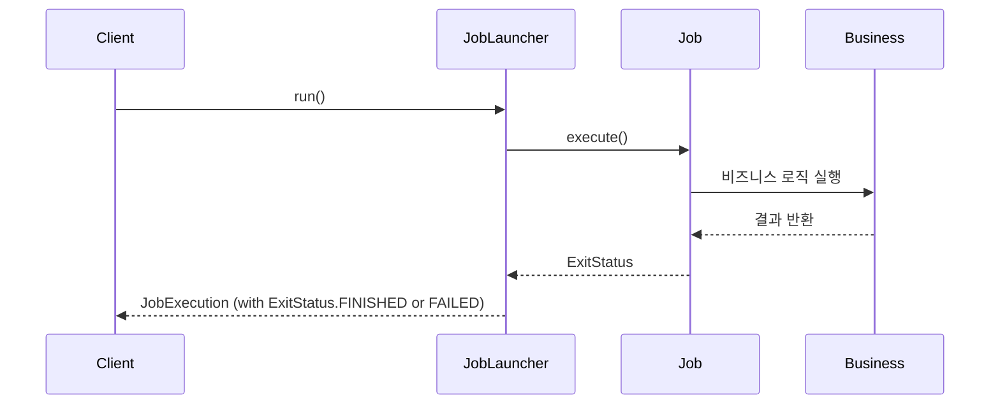
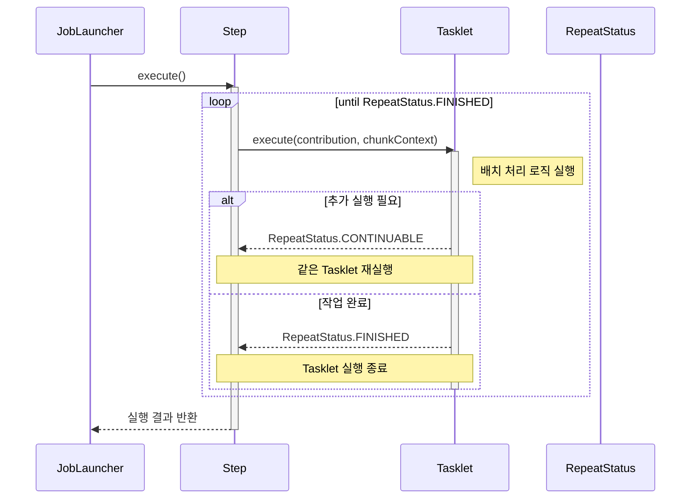
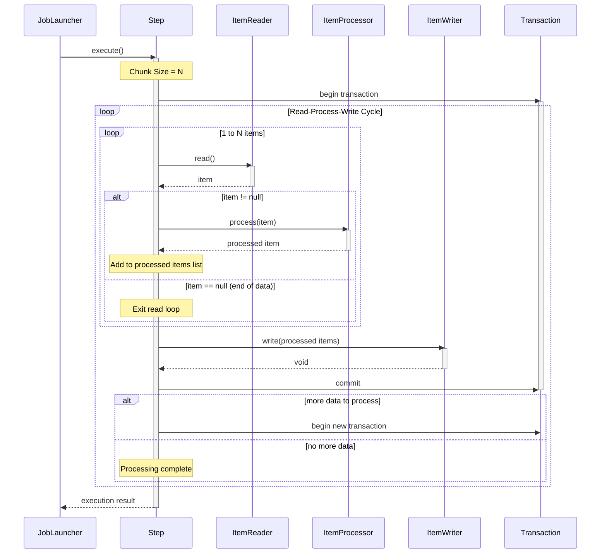

---

* this unordered seed list will be replaced by the toc
{:toc}

## 1. 서론

Spring Batch에서 Step은 실제 배치 처리 로직이 실행되는 단위인데, 이 Step을 구현하는 방식으로 Tasklet과 Chunk 두 가지가 있다. 언뜻 보면 단순한 구현 방식의 차이로 보일 수 있지만, 실제로는 데이터 처리 패턴, 성능 특성, 사용 사례 등에서 중요한 차이점을 가지고 있다.

적절한 처리 방식을 선택하는 것은 애플리케이션의 성능 뿐만 아니라, 유지보수성, 확장성에 영향을 미칠 수 있기 때문에 매우 중요하다. 필자가 실무에서 겪은 경험을 토대로 두 방식의 특징과 적합한 상황을 자세히 설명하고자 한다.

## 2. Tasklet 방식 이해하기

### 2.1. Tasklet 인터페이스 소개 및 기본 구조

#### Tasklet 실행 프로세스



#### Tasklet 인터페이스 구조

Tasklet은 Spring Batch에서 가장 단순한 형태의 Step 구현 방식이다. 단일 메소드(execute)를 가진 인터페이스로, 해당 메소드는 배치 처리의 모든 로직을 포함한다.

```java
public interface Tasklet {
    RepeatStatus execute(StepContribution contribution, ChunkContext chunkContext) throws Exception;
}
```

execute 메소드는 아래 두 개의 파라미터를 받는다.

- `StepContribution`: 현재 실행 중인 Step에 대한 정보와 업데이트를 위한 객체
- `ChunkContext`: Step 실행 관련 데이터를 포함하는 컨텍스트 정보

이 메소드는 `RepeatStatus`를 반환하는데, 주로 `RepeatStatus.FINISHED`(작업 완료) 또는 `RepeatStatus.CONTINUABLE`(재실행 필요)을 반환한다.

### 2.2. Tasklet 구현 예시

#### 2.2.1. 단순 Tasklet 구현

아래의 예제 코드(가장 기본적인 형태)의 Tasklet 구현을 살펴보자.

```java
@Component
public class SimpleTasklet implements Tasklet {
    
    private static final Logger logger = LoggerFactory.getLogger(SimpleTasklet.class);
    
    @Override
    public RepeatStatus execute(StepContribution contribution, ChunkContext chunkContext) throws Exception {
        logger.info("SimpleTasklet 실행");
        
        // 여기에 실제 배치 처리 로직 구현
        // 예: 파일 복사, 알림 전송, DB 프로시저 호출 등
        
        return RepeatStatus.FINISHED; // 작업 완료 표시
    }
}
```

#### 2.2.2. 반복 실행 Tasklet 구현



아래와 같이 RepeatStatus.CONTINUABLE을 사용하여 반복 실행을 하는 Tasklet을 구현할 수 있다.

```java
@Component
public class RepeatableTasklet implements Tasklet {
    
    private static final Logger logger = LoggerFactory.getLogger(RepeatableTasklet.class);
    private int maxAttempts = 5;
    private int currentAttempt = 0;
    
    @Override
    public RepeatStatus execute(StepContribution contribution, ChunkContext chunkContext) throws Exception {
        currentAttempt++;
        logger.info("RepeatableTasklet 실행 - 시도 {}/{}", currentAttempt, maxAttempts);
        
        // 배치 처리 로직
        
        if (currentAttempt < maxAttempts) {
            return RepeatStatus.CONTINUABLE; // 재실행 필요
        } else {
            return RepeatStatus.FINISHED; // 작업 완료
        }
    }
}
```

#### 2.2.3. 스프링 빈을 활용한 Tasklet 구현

실제 프로젝트에서는 다른 서비스나 컴포넌트를 주입받아 사용하는 경우가 많다.

```java
@Component
public class FileProcessingTasklet implements Tasklet {
    
    private final FileService fileService;
    private final NotificationService notificationService;
    
    @Autowired
    public FileProcessingTasklet(FileService fileService, NotificationService notificationService) {
        this.fileService = fileService;
        this.notificationService = notificationService;
    }
    
    @Override
    public RepeatStatus execute(StepContribution contribution, ChunkContext chunkContext) throws Exception {
        // ExecutionContext에서 Job 파라미터 접근
        Map<String, Object> jobParameters = chunkContext.getStepContext()
                                                       .getJobParameters();
        String filePath = (String) jobParameters.get("filePath");
        
        // 파일 처리
        int processedCount = fileService.processFile(filePath);
        
        // 처리 결과 저장
        contribution.incrementWriteCount(processedCount);
        
        // 처리 완료 알림
        notificationService.sendNotification("파일 처리 완료: " + processedCount + "건");
        
        return RepeatStatus.FINISHED;
    }
}
```

### 2.3. Tasklet 사용이 적합한 시나리오

위의 '구현 예시'에서 확인할 수 있듯, Tasklet은 구현이 상대적으로 쉽고 간단하다. 이러한 특성을 기반으로 하여 Tasklet 방식은 다음과 같은 경우에 특히 적합하다.

1. 단순 작업: 파일 삭제/이동, DB 프로시저 호출, 알림 전송 등 단순한 작업
2. 스크립트 실행: 외부 시스템 명령 또는 스크립트 실행이 필요한 경우
3. 전처리/후처리 작업: 주요 배치 처리 전후의 환경 설정이나 정리 작업
4. 트랜잭션이 단일 단위로 처리되어야 하는 경우: 모든 작업이 하나의 트랜잭션으로 처리되어야 할 때
5. 데이터 처리량이 적은 경우: 처리해야 할 데이터가 소량일 때

## 3. Chunk 방식 이해하기

### 3.1. Chunk 처리의 기본 개념



Chunk 방식은 대용량 데이터를 처리할 때 사용하는 방식으로, 일정 단위(Chunk)로 데이터를 나누어 처리한다. 기본적으로 세 단계로 진행된다:

1. 읽기(Read): ItemReader를 통해 데이터를 하나씩 읽는다.
2. 처리(Process): ItemProcessor를 통해 읽은 데이터를 가공한다. (선택적)
3. 쓰기(Write): ItemWriter를 통해 가공된 데이터를 일정 개수만큼(chunk size) 모아서 한 번에 저장한다.

위 과정을 모든 데이터가 처리될 때까지 반복한다.

### 3.2. Chunk 방식 구현의 핵심 컴포넌트

#### 3.2.1. ItemReader

ItemReader는 데이터 소스(DB, 파일, 메시지 큐 등)에서 데이터를 읽어오는 역할을 한다.

```java
public interface ItemReader<T> {
    T read() throws Exception;
}
```

Spring Batch는 다양한 ItemReader 구현체를 제공하고 있다.

- JdbcCursorItemReader: JDBC 커서를 사용하여 데이터베이스에서 데이터를 읽는다.
- JpaCursorItemReader: JPA를 사용하여 데이터를 읽는다.
- FlatFileItemReader: CSV나 고정 길이 파일과 같은 플랫 파일에서 데이터를 읽는다.
- JsonItemReader: JSON 파일에서 데이터를 읽는다.
- StaxEventItemReader: XML 파일에서 데이터를 읽는다.

##### JdbcCursorItemReader 예시

```java
@Bean
public JdbcCursorItemReader<Customer> customerItemReader(DataSource dataSource) {
    return new JdbcCursorItemReaderBuilder<Customer>()
            .name("customerReader")
            .dataSource(dataSource)
            .sql("SELECT id, first_name, last_name, email FROM customers WHERE active = true")
            .rowMapper(new BeanPropertyRowMapper<>(Customer.class))
            .build();
}
```

#### 3.2.2. ItemProcessor

ItemProcessor는 ItemReader에서 읽은 데이터를 가공하는 역할을 한다. 필수 컴포넌트는 아니며, 데이터 변환이나 필터링이 필요 없는 경우 생략할 수 있다.

```java
public interface ItemProcessor<I, O> {
    O process(I item) throws Exception;
}
```

##### ItemProcessor 구현 예시

```java
@Component
public class CustomerProcessor implements ItemProcessor<Customer, EnrichedCustomer> {
    
    private final CustomerEnrichmentService enrichmentService;
    
    @Autowired
    public CustomerProcessor(CustomerEnrichmentService enrichmentService) {
        this.enrichmentService = enrichmentService;
    }
    
    @Override
    public EnrichedCustomer process(Customer customer) throws Exception {
        // null을 반환하면 해당 아이템은 필터링됨 (Writer로 전달되지 않음)
        if (!isValidCustomer(customer)) {
            return null;
        }
        
        // 고객 데이터 보강
        return enrichmentService.enrich(customer);
    }
    
    private boolean isValidCustomer(Customer customer) {
        return customer.getEmail() != null && customer.getEmail().contains("@");
    }
}
```

#### 3.2.3. ItemWriter

ItemWriter는 처리된 데이터를 최종 목적지(DB, 파일, 외부 API 등)에 저장하는 역할을 한다.

```java
public interface ItemWriter<T> {
    void write(List<? extends T> items) throws Exception;
}
```

##### ItemWriter 구현 예시

```java
@Bean
public JdbcBatchItemWriter<EnrichedCustomer> customerItemWriter(DataSource dataSource) {
    return new JdbcBatchItemWriterBuilder<EnrichedCustomer>()
            .dataSource(dataSource)
            .sql("INSERT INTO enriched_customers (id, first_name, last_name, email, category, score) " +
                 "VALUES (:id, :firstName, :lastName, :email, :category, :score)")
            .beanMapped()  // BeanPropertyItemSqlParameterSourceProvider 사용
            .build();
}
```

### 3.3. 트랜잭션 경계와 Chunk Size의 의미

Chunk 처리 방식에서 가장 중요한 개념 중 하나는 chunk size이다. 이는 한 번의 트랜잭션에서 처리할 아이템의 수를 의미한다.

```java
@Bean
public Step chunkBasedStep(JobRepository jobRepository, PlatformTransactionManager transactionManager) {
    return new StepBuilder("chunkBasedStep", jobRepository)
            .<Customer, EnrichedCustomer>chunk(100, transactionManager)  // chunk size: 100
            .reader(customerItemReader())
            .processor(customerProcessor())
            .writer(customerItemWriter())
            .build();
}
```

이 예시에서 chunk size는 100으로 설정되어 있는데, 아래와 같은 의미를 내포한다.

- ItemReader가 100개의 아이템을 읽는다. (하나씩 순차적으로)
- 각 아이템은 ItemProcessor에 의해 처리된다. (선택적)
- 처리된 100개의 아이템이 ItemWriter에 한 번에 전달된다.
- 위 과정이 하나의 트랜잭션으로 수행된다.
- 트랜잭션이 성공적으로 완료되면 커밋되고, 실패하면 롤백된다.

또한, Chunk size는 성능과 메모리 사용량에 직접적인 영향을 미친다.

- 너무 작은 chunk size: 트랜잭션 오버헤드가 증가하여 전체 처리 시간이 늘어날 수 있다.
- 너무 큰 chunk size: 메모리 사용량이 증가하고, 롤백 시 더 많은 작업이 무효화된다.

개발 시에는 데이터 특성, 시스템 리소스, 트랜잭션 요구사항 등을 고려하여 적절한 chunk size를 결정해야 한다.

### 3.4. 페이징 vs 커서 기반 처리 방식

데이터베이스에서 대용량 데이터를 읽을 때 크게 두 가지 방식을 사용할 수 있다.

#### 3.4.1. 커서 기반 처리 방식

커서 기반 방식은 데이터베이스 커서를 열고 한 번에 하나씩 레코드를 가져온다. `java.sql.ResultSet`이 대표적인 커서 기반 처리 방식을 구현한 클래스이다.

```java
@Bean
public JdbcCursorItemReader<Customer> cursorItemReader(DataSource dataSource) {
    return new JdbcCursorItemReaderBuilder<Customer>()
            .name("cursorReader")
            .dataSource(dataSource)
            .sql("SELECT * FROM customers ORDER BY id")
            .rowMapper(new BeanPropertyRowMapper<>(Customer.class))
            .build();
}
```

##### 커서 기반 처리 방식의 장점

- 메모리 효율적: 한 번에 한 레코드만 메모리에 로드
- 구현이 간단함

##### 커서 기반 처리 방식의 단점

- 긴 시간 동안 데이터베이스 연결 유지
- 데이터가 변경될 수 있는 실시간 환경에서 문제 발생 가능
- 일부 데이터베이스는 커서를 지원하지 않음

#### 3.4.2. 페이징 기반 처리 방식

페이징 방식은 데이터를 일정 크기의 페이지로 나누어 가져온다.

```java
@Bean
public JdbcPagingItemReader<Customer> pagingItemReader(DataSource dataSource) {
    Map<String, Order> sortKeys = new HashMap<>();
    sortKeys.put("id", Order.ASCENDING);
    
    return new JdbcPagingItemReaderBuilder<Customer>()
            .name("pagingReader")
            .dataSource(dataSource)
            .selectClause("SELECT *")
            .fromClause("FROM customers")
            .sortKeys(sortKeys)
            .pageSize(500)  // 페이지 크기 설정
            .rowMapper(new BeanPropertyRowMapper<>(Customer.class))
            .build();
}
```

##### 페이징 기반 처리 방식의 장점

- 짧은 데이터베이스 연결 시간
- 실시간 환경에 더 적합
- 대부분의 데이터베이스에서 지원됨

##### 페이징 기반 처리 방식의 단점

- 페이지 크기만큼 메모리 사용
- ORDER BY 절이 필요하여 성능에 영향을 줄 수 있음
- 데이터가 변경되면 중복 또는 누락 발생 가능

## 4. Tasklet vs Chunk: 상세 비교 분석

이제 Tasklet과 Chunk 방식의 주요 차이점을 다양한 측면에서 비교해보자.

### 4.1. 구현 복잡도

- Tasklet:
  - 단순한 인터페이스(메소드 하나)로 구현이 간단
  - 모든 로직을 하나의 메소드에 구현하므로 작은 작업에 적합
  - 커스텀 로직에 대한 유연성이 높음
- Chunk:
  - Reader, Processor, Writer 세 가지 컴포넌트를 각각 구현해야 함
  - 각 컴포넌트의 책임이 명확하게 분리되어 있어 유지보수성이 높음
  - Spring Batch가 제공하는 다양한 구현체를 활용할 수 있어 개발 시간 단축 가능

### 4.2. 성능 특성

- Tasklet:
  - 단일 작업 단위로 실행되므로 모든 처리가 메모리에 로드됨
  - 대용량 데이터 처리 시 메모리 부족 문제 발생 가능
  - 처리 성능은 구현 로직에 크게 의존
- Chunk:
  - 데이터를 청크 단위로 처리하여 메모리 효율적
  - 청크 크기 조정을 통한 성능 최적화 가능
  - 대용량 데이터 처리에 최적화된 구조

### 4.3. 트랜잭션 관리

- Tasklet:
  - 전체 작업이 하나의 트랜잭션으로 처리됨
  - 부분 완료 상태를 지원하지 않음 (실패 시 전체 롤백)
  - 모두 성공하거나 모두 실패하는 작업에 적합
- Chunk:
  - 청크 단위로 트랜잭션 관리
  - 실패 시 해당 청크만 롤백되고 이전 청크는 커밋됨
  - 재시작 시 마지막으로 성공한 청크부터 처리 가능

### 4.4. 오류 처리 및 재시도

- Tasklet:
  - 오류 처리와 재시도 로직을 직접 구현해야 함
  - 세밀한 오류 처리가 필요한 경우 더 많은 코드 작성 필요
- Chunk:
  - Spring Batch가 제공하는 retry, skip 정책을 활용할 수 있음
  - 아이템 단위로 오류 처리 가능
  - 선언적인 방식으로 오류 처리 정책 설정 가능

```java
@Bean
public Step chunkStepWithRetry(JobRepository jobRepository, PlatformTransactionManager transactionManager) {
    return new StepBuilder("chunkStepWithRetry", jobRepository)
            .<Customer, EnrichedCustomer>chunk(100, transactionManager)
            .reader(customerItemReader())
            .processor(customerProcessor())
            .writer(customerItemWriter())
            .faultTolerant()
            .retry(DataAccessException.class)  // 재시도할 예외 지정
            .retryLimit(3)  // 최대 재시도 횟수
            .skip(ValidationException.class)  // 건너뛸 예외 지정
            .skipLimit(10)  // 최대 건너뛰기 횟수
            .build();
}
```

### 4.5. 확장성

- Tasklet:
  - 하나의 클래스에 모든 로직이 집중되어 확장성 제한
  - 복잡한 로직 추가 시 코드 복잡도 급증
  - 코드 재사용성이 낮음
- Chunk:
  - 각 컴포넌트(Reader, Processor, Writer)를 독립적으로 확장 가능
  - 여러 프로세서를 조합하여 복잡한 처리 흐름 구성 가능
  - 다양한 구현체를 조합하여 유연한 처리 파이프라인 구성 가능

## 5. 주관적인 처리 방식 선택 기준

필자의 학습 내용 및 경험을 기반으로 특정 상황에서 어떤 처리 방식을 선택해야 하는지에 대한 기준을 제시하고자 한다.

### 5.1. 데이터 볼륨에 따른 선택

| 데이터 볼륨 | 권장 방식 | 이유 |
|------------|---------|------|
| 소량 (수백 건 이하) | Tasklet | 간단한 구현, 트랜잭션 관리 단순 |
| 중량 (수천~수만 건) | Chunk | 메모리 효율, 재시작 기능 |
| 대량 (수십만 건 이상) | Chunk | 메모리 효율, 트랜잭션 관리, 청크 단위 처리 |

### 5.2. 작업 특성에 따른 선택


| 작업 특성 | 권장 방식 | 예시 |
|----------|----------|------|
| 단순 작업 | Tasklet | 파일 삭제, 디렉토리 생성, 알림 전송 |
| 데이터 변환 | Chunk | 고객 데이터 정제, 상품 정보 업데이트 |
| 집계 작업 | Chunk/Tasklet | 일별 매출 집계, 사용자 활동 통계 |
| 데이터 마이그레이션 | Chunk | 레거시 시스템에서 데이터 이전 |
| 외부 API 호출 | 상황에 따라 다름* | 외부 서비스와 통합 |

- *외부 API 호출:
  - API 호출이 적은 경우: Tasklet
  - 대량의 API 호출이 필요하고 재시도 관리가 중요한 경우: Chunk

### 5.3. 트랜잭션 요구사항에 따른 선택

| 트랜잭션 요구사항 | 권장 방식 | 이유 |
|----------------|----------|------|
| 모두 또는 전무(All or Nothing) | Tasklet | 전체 작업이 하나의 트랜잭션으로 처리 |
| 부분 완료 허용 | Chunk | 청크 단위로 커밋되어 일부 실패해도 이전 작업 보존 |
| 세밀한 트랜잭션 관리 필요 | Chunk | 청크 크기 조정을 통한 트랜잭션 경계 제어 |

## 6. 결론

Spring Batch의 두 가지 처리 방식인 Tasklet과 Chunk를 상세히 비교 분석해보았다. 각 방식은 고유한 특성과 장단점을 가지고 있으며, 다음과 같은 핵심 차이점을 기억해야 한다.

1. **Tasklet**은 *단순한 작업에 적합*하며, 모든 로직이 하나의 메소드에 구현된다. 전체 작업이 하나의 트랜잭션으로 처리되며, 구현이 간단하고 유연하다.
2. **Chunk**는 *대용량 데이터 처리에 최적화*되어 있으며, 데이터를 일정 단위(chunk)로 나누어 처리한다. Reader, Processor, Writer의 분리된 컴포넌트로 구성되어 책임이 명확하게 분리되고, 재사용성과 유지보수성이 높다.

적절한 처리 방식 선택은 아래의 요소를 고려하도록 하자

- 데이터 볼륨
- 작업의 복잡도
- 트랜잭션 요구사항
- 오류 처리 전략
- 성능 및 메모리 요구사항

실제 프로젝트에서는 두 방식을 함께 사용하는 하이브리드 접근법도 사용하는 케이스가 있다고 하며, Spring Batch가 제공하는 다양한 기능과 확장 포인트를 활용하여 복잡한 배치 처리 요구사항을 효율적으로 구현할 수 있다.

다음 글에서는 "고성능 Spring Batch 구현: 멀티스레드 적용 실전 사례"를 통해 대용량 데이터를 더욱 빠르게 처리하는 방법을 실제 코드와 적용 사례 중심으로 살펴볼 예정이다.

---

## *Spring Batch 시리즈*

- [Spring Batch 입문: 배치 작업과 스케줄러 연동하기](https://jinlee.kr/web/2025-03-17-spring-batch-1/)
- Spring Batch 처리 방식 비교: Tasklet vs Chunk 상세 분석 (현재 글)
- [고성능 Spring Batch 구현: 멀티스레드 적용 실전 사례](https://jinlee.kr/web/2025-03-18-spring-batch-3/)
