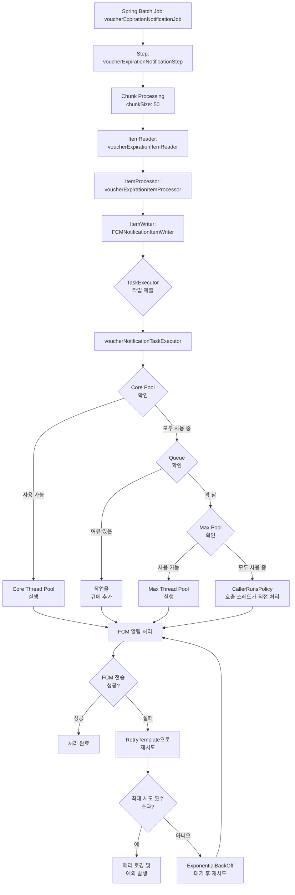

---

* this unordered seed list will be replaced by the toc
{:toc}

## 1. 서론

이전 글 "Spring Batch 처리 방식 비교 - Tasklet vs Chunk"에서 대용량 데이터 처리에는 Chunk 방식이 적합하다고 설명했다. 그러나 Chunk 방식만으로는 대규모 데이터를 효율적으로 처리하기에 부족할 수 있다. 이러한 상황에서 Spring Batch의 병렬 처리 기능은 성능을 획기적으로 향상시킬 수 있는 수단이다.

필자가 참여한 프로젝트에서는 모바일 상품권 만료 알림 전송을 위한 배치 작업이 단일 스레드로 처리될 때 성능 병목 현상이 발생할 가능성이 있었다. 이를 해결하기 위해 Spring의 ThreadPoolTaskExecutor를 활용한 멀티스레드 처리를 도입했고, 그 결과 처리 시간을 획기적으로 단축하고자 하였다. 이번 글에서는 그 구현 과정과 고려사항, 그리고 성능 개선 결과를 상세히 공유하고자 한다.

## 2. 프로젝트 배경 및 문제 상황

필자가 참여한 'GiftHub' 서비스는 모바일 상품권(이하 상품권) 관리 어플리케이션으로, 사용자가 보유한 상품권의 만료일이 다가오면 FCM(Firebase Cloud Messaging)을 통해 알림을 발송하는 기능이 핵심 서비스 중 하나이다. 초기에는 다음과 같은 단일 스레드 방식의 Chunk 기반 배치를 구현했다.

```java
@Bean
public Step voucherExpirationNotificationStep() {
    return new StepBuilder("voucherExpirationNotificationStep", jobRepository)
        .<Voucher, FCMNotificationRequestDto>chunk(50, transactionManager)
        .reader(voucherExpirationItemReader)
        .processor(voucherExpirationItemProcessor)
        .writer(fcmNotificationItemWriter)
        .build();
}
```

그러나 서비스 성장에 따라 아래와 같은 문제가 발생할 가능성이 제기되었다.

1. **처리 시간 증가**: 상품권 수가 증가함에 따라 배치 작업 시간이 선형적으로 증가
2. **비효율적인 리소스 활용**: 단일 스레드로 인해 서버의 여유 CPU 코어가 활용되지 않음
3. **FCM 병목 현상**: FCM API 호출 시 네트워크 대기 시간이 주요 병목으로 작용
4. **확장성 문제**: 사용자 수 증가에 따른 처리량 확장이 어려움

테스트 환경에서 1,000개의 바우처 처리 시 약 10초가 소요되었는데, 이는 10만 개 이상으로 증가할 경우 처리 시간이 수십 분에 달할 수 있음을 의미한다. 이는 배치 작업 시간 제약과 알림의 적시성 측면에서 좋지 않은 지표라고 판단하였다.

## 3. 멀티스레드 처리 방식 선택

Spring Batch는 다양한 병렬 처리 옵션을 제공한다.

1. **Multi-threaded Step**: 하나의 Step 내에서 여러 스레드가 청크를 병렬로 처리
2. **Parallel Steps**: 여러 Step을 동시에 실행
3. **Remote Chunking**: 여러 서버에 청크를 분산하여 처리
4. **Partitioning**: 데이터를 여러 파티션으로 나누어 병렬 처리

필자는 단일 서버에서 최대한 효율적으로 처리하기 위해 Multi-threaded Step 방식을 선택하였다. 이 방식은 기존 코드 구조를 크게 변경하지 않으면서도 성능을 향상시킬 수 있다는 판단 하에 이루어진 결정이었다.

## 4. 멀티스레드 구현 과정

### 4.1. ThreadPoolTaskExecutor 구성

첫 번째 단계로 스레드 풀을 효율적으로 관리할 ThreadPoolTaskExecutor를 아래와 같이 구성하였다.

```java
@Configuration
public class VoucherBatchThreadConfig {
    @Bean
    public TaskExecutor voucherNotificationTaskExecutor() {
        ThreadPoolTaskExecutor executor = new ThreadPoolTaskExecutor();
        
        // 가용 프로세서 수를 기반으로 코어 스레드 수 설정
        int corePoolSize = Runtime.getRuntime().availableProcessors() * 2;
        executor.setCorePoolSize(corePoolSize);          // 기본 스레드 수
        executor.setMaxPoolSize(corePoolSize * 2);       // 최대 스레드 수
        executor.setQueueCapacity(corePoolSize * 5);     // 작업 대기열 크기
        executor.setThreadNamePrefix("voucher-notification-"); // 스레드 이름 접두사
        executor.setRejectedExecutionHandler(new ThreadPoolTaskExecutor.CallerRunsPolicy()); // 거부 정책
        executor.setKeepAliveSeconds(60);                // 초과 스레드 유지 시간
        executor.setWaitForTasksToCompleteOnShutdown(true); // 종료 시 작업 완료 대기
        executor.setAwaitTerminationSeconds(60);         // 종료 시 최대 대기 시간
        
        executor.initialize();
        return executor;
    }
}
```

구성 시 고려한 주요 요소(포인트)는 아래과 같다.

1. **동적 스레드 수 설정**: 서버 환경에 따라 최적의 스레드 수를 자동으로 계산
2. **코어 풀 사이즈**: CPU 코어 수의 2배로 설정하여 I/O 바운드 작업에 최적화
3. **최대 풀 사이즈**: 일시적인 부하 증가에 대응하기 위해 코어 풀 사이즈의 2배로 설정
4. **큐 용량**: 작업 큐가 너무 작으면 최대 풀로 확장되기 쉽고, 너무 크면 메모리 문제 발생 가능
5. **거부 정책**: 모든 리소스가 소진되었을 때 호출 스레드가 직접 작업을 처리하도록 설정

### 4.2. 배치 Step 구성 수정

기존 Step 구성에 taskExecutor를 추가하여 멀티스레드 처리가 가능하도록 수정하였다.

```java
@Bean
public Step voucherExpirationNotificationStep() {
    FCMNotificationItemWriter itemWriter = new FCMNotificationItemWriter(
        fcmNotificationService, fcmRetryTemplate());
    
    return new StepBuilder("voucherExpirationNotificationStep", jobRepository)
        .<Voucher, FCMNotificationRequestDto>chunk(chunkSize, transactionManager)
        .reader(voucherExpirationItemReader)
        .processor(voucherExpirationItemProcessor)
        .writer(itemWriter)
        .taskExecutor(voucherNotificationTaskExecutor)  // 멀티스레딩 적용
        .build();
}
```

chunkSize 값은 애플리케이션 설정 파일에서 관리하도록 외부화하였다.

```yaml
# application.yml
gifthub:
  batch:
    notification:
      chunk-size: 50
```

### 4.3. 스레드 안전성 확보

멀티스레드 환경에서 가장 중요한 것은 스레드 안전성이다. 특히 ItemReader, ItemProcessor, ItemWriter가 모두 스레드 안전하게(Thread-Safety) 동작해야 한다. 이 점을 반드시 숙지하자.

#### 4.3.1. ItemReader 스레드 안전성

Spring Batch의 많은 ItemReader는 기본적으로 스레드에 안전하지 않다. 필자는 아래와 같은 접근 방식을 취했다.

1. JPA 기반 Reader는 SynchronizedItemStreamReader로 래핑하여 스레드 안전성 확보
2. 상태를 공유하지 않도록 메서드를 동기화 처리

```java
@Bean
public SynchronizedItemStreamReader<Voucher> synchronizedItemReader() {
    SynchronizedItemStreamReader<Voucher> synchronizedReader = 
        new SynchronizedItemStreamReader<>();
    synchronizedReader.setDelegate(voucherExpirationItemReader);
    return synchronizedReader;
}
```

#### 4.3.2. ItemWriter 스레드 안전성

ItemWriter는 여러 스레드에서 동시에 호출될 수 있으므로, 내부 상태 관리에 주의해야 한다.

```java
@Component
public class FCMNotificationItemWriter implements ItemWriter<FCMNotificationRequestDto> {
    private static final Logger logger = LoggerFactory.getLogger(FCMNotificationItemWriter.class);
    private final FCMNotificationService fcmNotificationService;
    private final RetryTemplate retryTemplate;

    @Override
    public void write(Chunk<? extends FCMNotificationRequestDto> notificationRequests) throws Exception {
        if (notificationRequests.isEmpty()) {
            return;
        }
        
        logger.info("FCM 알림 전송 처리 중: {} 건", notificationRequests.size());
        
        try {
            retryTemplate.execute(new RetryCallback<Void, Exception>() {
                @Override
                public Void doWithRetry(RetryContext context) throws Exception {
                    // 재시도 시도인 경우 로그 기록
                    if (context.getRetryCount() > 0) {
                        logger.info("알림 전송 시도 {} 번째 재시도", context.getRetryCount());
                    }
                    
                    // FCM 서비스를 통해 알림 전송 (내부적으로 스레드 안전)
                    fcmNotificationService.sendBatchNotifications(notificationRequests.getItems());
                    return null;
                }
            });
            
            logger.info("FCM 알림 전송 완료: {} 건", notificationRequests.size());
        } catch (Exception e) {
            logger.error("재시도 후에도 FCM 알림 전송 실패: {}", e.getMessage());
            throw e; // Spring Batch가 실패를 처리하도록 예외 다시 던지기
        }
    }
}
```

#### 4.3.3. FCM 서비스의 스레드 안전성

FCM 알림 서비스는 내부적으로 ConcurrentHashMap을 사용하여 스레드 안전성을 확보하고자 하였다.

```java
@Service
public class FCMNotificationService {
    // 스레드 안전한 ConcurrentHashMap 사용
    private final ConcurrentHashMap<String, AtomicInteger> rateLimiters = new ConcurrentHashMap<>();
    
    // 배치 알림 전송 (여러 스레드에서 안전하게 호출 가능)
    public void sendBatchNotifications(List<FCMNotificationRequestDto> notifications) {
        // 각 알림 처리 (동시성 이슈 없음)
        for (FCMNotificationRequestDto notification : notifications) {
            String userId = notification.getUserId();
            
            // 스레드 안전한 방식으로 사용자별 전송 횟수 추적
            AtomicInteger counter = rateLimiters.computeIfAbsent(userId, k -> new AtomicInteger(0));
            
            if (counter.get() < MAX_NOTIFICATIONS_PER_USER) {
                sendNotificationByToken(notification);
                counter.incrementAndGet();
            } else {
                // 사용자별 최대 알림 수 초과 처리
                logger.warn("사용자 알림 제한 초과: {}", userId);
            }
        }
    }
}
```

### 4.4. 오류 처리 및 재시도 메커니즘

네트워크 오류나 외부 서비스(FCM) 장애에 대응하기 위해 재시도 메커니즘도 추가하였다.

```java
@Bean
public RetryTemplate fcmRetryTemplate() {
    RetryTemplate retryTemplate = new RetryTemplate();
    
    // 재시도 정책 설정 (3회 시도)
    Map<Class<? extends Throwable>, Boolean> retryableExceptions = new HashMap<>();
    retryableExceptions.put(FirebaseMessagingException.class, true);
    SimpleRetryPolicy retryPolicy = new SimpleRetryPolicy(3, retryableExceptions);
    
    // 백오프 정책 설정 (초기 1초, 배수 2의 지수 백오프)
    ExponentialBackOffPolicy backOffPolicy = new ExponentialBackOffPolicy();
    backOffPolicy.setInitialInterval(1000);
    backOffPolicy.setMultiplier(2);
    
    retryTemplate.setRetryPolicy(retryPolicy);
    retryTemplate.setBackOffPolicy(backOffPolicy);
    
    return retryTemplate;
}
```

**지수 백오프(Exponential Backoff) 전략**을 통해 재시도 간격을 점진적으로 늘려 시스템에 불필요한 부하를 방지하고, 일시적인 장애가 복구될 시간을 확보하고자 하였다.

### 4.5. 성능 모니터링 구현

배치 작업의 성능을 모니터링하기 위해 JobExecutionListener를 아래와 같이 구현하였다.

```java
@Component
@RequiredArgsConstructor
public class VoucherExpirationJobListener implements JobExecutionListener {
    private static final Logger logger = LoggerFactory.getLogger(VoucherExpirationJobListener.class);
    
    @Override
    public void beforeJob(JobExecution jobExecution) {
        logger.info("바우처 만료 알림 배치 작업 시작: {}", LocalDateTime.now());
    }
    
    @Override
    public void afterJob(JobExecution jobExecution) {
        LocalDateTime endTime = LocalDateTime.now();
        long executionTime = jobExecution.getEndTime().getTime() - 
                            jobExecution.getStartTime().getTime();
        
        logger.info("바우처 만료 알림 배치 작업 완료: {}", endTime);
        logger.info("총 실행 시간: {} ms", executionTime);
        logger.info("처리된 항목 수: {}", 
                    jobExecution.getStepExecutions()
                               .stream()
                               .mapToInt(StepExecution::getWriteCount)
                               .sum());
        
        // 처리 속도 계산 (items/second)
        int totalItems = jobExecution.getStepExecutions()
                                    .stream()
                                    .mapToInt(StepExecution::getWriteCount)
                                    .sum();
        double itemsPerSecond = totalItems / (executionTime / 1000.0);
        logger.info("초당 처리 항목 수: {}", String.format("%.2f", itemsPerSecond));
        
        if (jobExecution.getStatus() == BatchStatus.FAILED) {
            logger.error("바우처 만료 알림 배치 작업 실패");
        }
    }
}
```

이를 배치 Job 구성에 추가했다.

```java
@Bean
public Job voucherExpirationNotificationJob(Step voucherExpirationNotificationStep) {
    return new JobBuilder("voucherExpirationNotificationJob", jobRepository)
        .listener(jobListener)  // 성능 모니터링 리스너 추가
        .start(voucherExpirationNotificationStep)
        .build();
}
```

## 5. 멀티스레드 처리 과정 시각화

필자가 구현한 멀티스레드 환경에서의 바우처 만료 알림 처리 과정을 다이어그램으로 표현하면 아래와 같다.



## 6. 성능 측정 및 결과

멀티스레드 구현 이후 성능 향상을 검증하기 위해 테스트 환경에서 다양한 데이터 볼륨으로 성능 측정을 실시했다. 실제 프로덕션 환경이 아닌 통제된 테스트 환경에서 진행되었으므로, 실제 서비스에서는 네트워크 상태, 서버 부하 등에 따라 결과가 달라질 수 있음을 고려해야 한다.

### 6.1. 단일 스레드 vs 멀티스레드 처리 시간 비교

테스트 환경에서 수행한 성능 측정 결과는 다음과 같다.

| 바우처 수 | 단일 스레드 처리 시간 | 멀티스레드 처리 시간 (8 스레드) | 성능 향상 비율 |
|----------|-------------------|----------------------------|------------|
| 1,000개  | 약 10.2초          | 약 1.8초                    | 약 82% 단축 |
| 5,000개  | 약 45.7초          | 약 7.5초                    | 약 83% 단축 |
| 10,000개 | 약 92.3초          | 약 14.8초                   | 약 84% 단축 |

이러한 결과는 외부 서비스(FCM) 호출을 모의(Mock) 구현으로 대체한 상태에서 측정되었다. 실제 환경에서는 FCM 서비스의 응답 시간과 네트워크 지연이 추가될 수 있으며, 이 경우 I/O 바운드 작업의 비중이 높아져 병렬 처리의 효과가 더욱 극대화될 것으로 기대하고 있다.

### 6.2. 실제 환경 적용 시 고려사항

테스트 환경에서의 성능 측정 결과는 실제 프로덕션 환경에 직접 적용하기에는 제한이 있다. 실제 환경 적용 시 아래 요소들을 추가로 고려해야 한다.

1. 외부 서비스 제한: FCM과 같은 외부 서비스는 QPS(Query Per Second) 제한이 있을 수 있음
2. 네트워크 지연: 실제 환경에서의 네트워크 지연 시간은 테스트 환경보다 길 수 있음
3. DB 부하: 실제 운영 DB는 동시에 다른 서비스의 요청도 처리하므로 추가 부하가 있음
4. 환경 차이: 클라우드 환경의 가상 CPU와 물리적 테스트 서버 간의 성능 차이

따라서 프로덕션 환경에 적용 시에는 점진적인 스레드 수 증가와 모니터링을 통한 최적화 과정이 필요하다.

## 7. 구현 시 주요 고려사항

실제 멀티스레드 배치 작업을 구현하며 얻은 주요 교훈들은 아래와 같다.

### 7.1. 리소스 사용량 고려

스레드 수를 무작정 늘리는 것이 능사가 아니다. 서버의 CPU 코어 수, 메모리, 네트워크 대역폭을 고려하여 최적의 스레드 수를 결정해야 한다.

### 7.2. 스레드 안전성 보장

멀티스레드 환경에서는 항상 스레드 안전성을 고려해야 한다. 필자가 고민했던 스레드 안전성을 고려하기 위한 방법은 아래와 같다.

- **상태 공유 최소화**: 가능한 한 스레드 간 상태 공유를 피하고, 공유가 필요할 경우 동기화 메커니즘 적용
- **스레드 안전 자료구조 사용**: ConcurrentHashMap, AtomicInteger와 같은 스레드 안전한 자료구조 활용
- **불변(Immutable) 객체 활용**: 가능한 한 불변 객체를 사용하여 동시성 문제 회피

특히 JPA 기반 Reader를 사용할 때는 아래와 같은 문제가 발생할 수 있다.

```java
// 문제가 있는 코드
@Override
public Voucher read() {
    if (index >= vouchers.size()) {
        return null;  // 모든 데이터 읽음
    }
    return vouchers.get(index++);  // 여러 스레드에서 동시에 접근하면 문제 발생
}
```

이를 다음과 같이 수정하여 스레드 안전하게 구현할 수 있다.

```java
// 스레드 안전한 코드
private final AtomicInteger index = new AtomicInteger(0);

@Override
public synchronized Voucher read() {  // synchronized 키워드 추가
    int currentIndex = index.getAndIncrement();
    if (currentIndex >= vouchers.size()) {
        return null;
    }
    return vouchers.get(currentIndex);
}
```

### 7.3. 트랜잭션 경계 설정

멀티스레드 환경에서 트랜잭션 경계는 더욱 중요하다. 각 청크가 독립적인 트랜잭션으로 처리되므로, 청크 크기 설정이 트랜잭션 관리에 직접적인 영향을 미치게 된다.

```java
// 트랜잭션 경계 설정이 포함된 Step 구성
@Bean
public Step voucherExpirationNotificationStep() {
    return new StepBuilder("voucherExpirationNotificationStep", jobRepository)
        .<Voucher, FCMNotificationRequestDto>chunk(100, transactionManager)  // 트랜잭션 경계 설정
        .reader(synchronizedItemReader())
        .processor(voucherExpirationItemProcessor)
        .writer(fcmNotificationItemWriter)
        .taskExecutor(voucherNotificationTaskExecutor)
        .build();
}
```

### 7.4. 오류 처리와 재시도 전략

분산 시스템에서는 일시적인 장애가 발생할 가능성이 항상 존재하고, 이를 위해 필자가 고민했던 해결책들은 아래와 같다.

- **지수 백오프 재시도**: 일시적 오류 발생 시 지수적으로 대기 시간을 늘려가며 재시도
- **서킷 브레이커 패턴**: 연속적인 오류 발생 시 시스템 보호를 위한 차단 메커니즘 구현
- **데드레터 큐(Dead Letter Queue)**: 재시도 후에도 실패한 메시지를 별도로 저장하여 나중에 처리

### 7.5. 모니터링 강화

멀티스레드 환경에서는 버그를 재현하기 어려우므로 테스트와 모니터링을 강화해야 한다. 필자는 과거에 인턴십 당시 배치 작업에 대한 로그를 추가하여 추후 모니터링 할 수 있도록 하였던 경험이 있다.

- **메트릭 수집**: 스레드 풀 사용률, 큐 길이, 처리 시간 등 주요 지표 모니터링
- **로깅 강화**: 각 스레드별로 식별 가능한 로그 패턴 적용
- **분산 추적**: 여러 서비스에 걸친 요청 흐름 추적 시스템 구축

## 8. 결론

필자는 Spring Batch를 활용한 멀티스레드 처리를 통해 상품권 만료 알림 배치 작업의 성능을 크게 향상 시키고자 하였다. 특히 I/O 바운드 작업이 많은 환경에서 멀티스레딩의 효과가 극대화될 것으로 기대하며, 시스템의 확장성 측면에서도 기여할 수 있으리라 짐작한다.

Spring Batch의 Chunk 처리 방식에 멀티스레딩을 결합하면 대용량 데이터 처리에 최적화된 강력한 배치 시스템을 구축할 수 있다. 다만 스레드 안전성, 리소스 사용량, 오류 처리 전략 등을 종합적으로 고려하여 신중하게 구현해야 한다.

멀티스레드 Spring Batch 구현에서 가장 중요한 교훈은 "더 많은 스레드가 항상 더 좋은 것은 아니다"라는 점이다. 각 시스템의 특성과 리소스에 맞는 최적의 스레드 수와 청크 크기를 찾는 것이 성능 최적화의 핵심이다.

이 글이 필자와 같이 대용량 데이터를 효율적으로 처리에 대한 경험이 부족한 개발자들에게 도움이 되기를 바란다.

---

## *Spring Batch 시리즈*

- [Spring Batch 입문: 배치 작업과 스케줄러 연동하기](https://jinlee.kr/web/2025-03-17-spring-batch-1/)
- [Spring Batch 처리 방식 비교: Tasklet vs Chunk 상세 분석](https://jinlee.kr/web/2025-03-17-spring-batch-2/)
- 고성능 Spring Batch 구현: 멀티스레드 적용 실전 사례 (현재 글)
