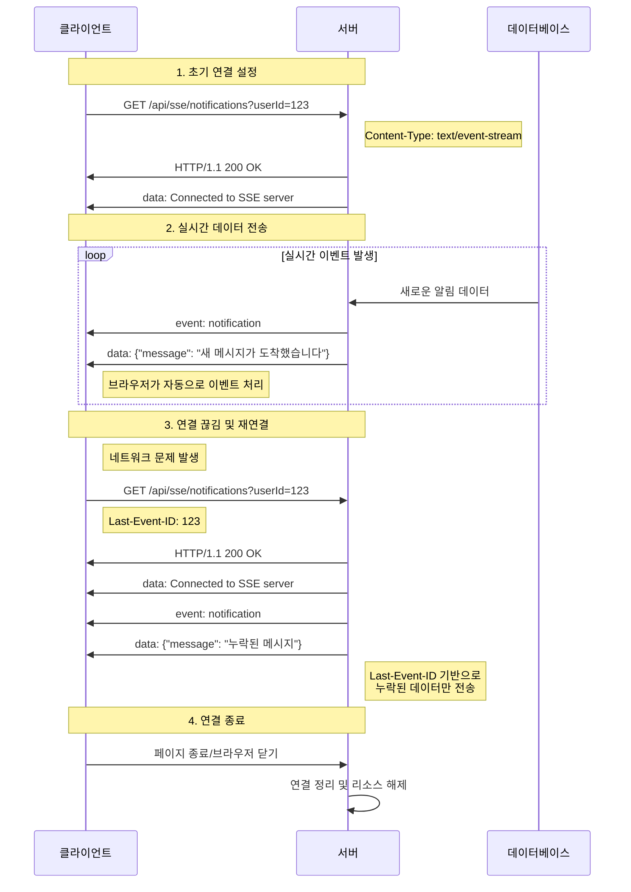
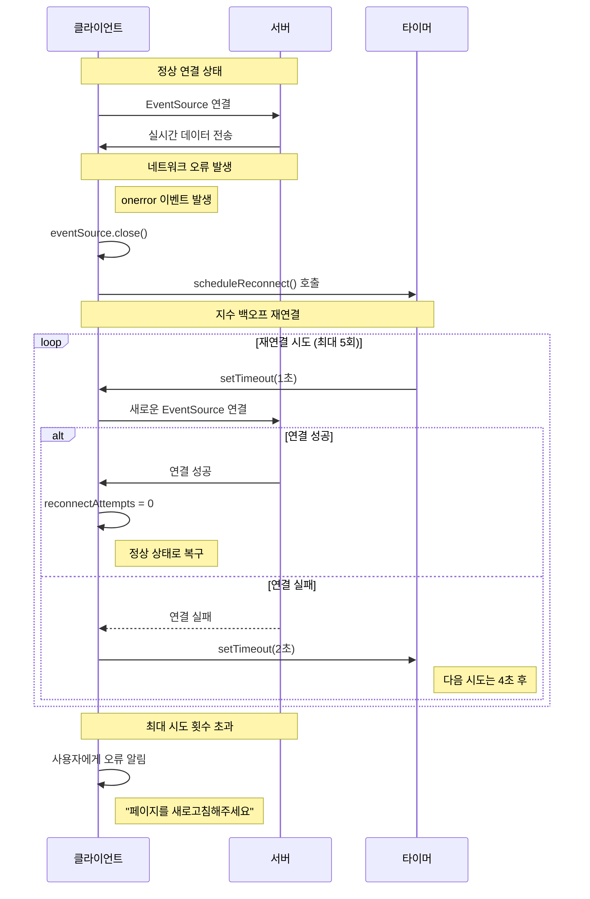
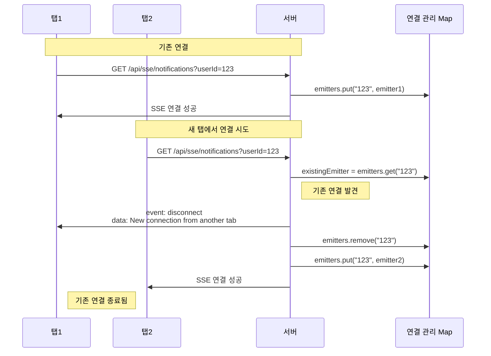

---

* this unordered seed list will be replaced by the toc
{:toc}

## 1. Server-Sent Events(SSE)란?

Server-Sent Events(SSE)는 웹 표준 기술로, 서버에서 클라이언트로 실시간 데이터를 단방향으로 전송할 수 있게 해주는 프로토콜이다. HTTP 연결을 통해 서버가 클라이언트에게 이벤트 스트림을 지속적으로 전송하며, 클라이언트는 이를 실시간으로 수신하여 처리할 수 있다.

### 1.1. SSE의 동작 원리

SSE는 HTTP/1.1 프로토콜을 기반으로 동작한다. 클라이언트가 서버에 일반적인 GET 요청을 보내면, 서버는 `Content-Type: text/event-stream` 헤더와 함께 응답을 스트리밍 방식으로 지속적으로 전송한다.

**이벤트 스트림 포맷:**
```
data: 첫 번째 메시지

data: 두 번째 메시지

event: customEvent
data: 커스텀 이벤트 데이터

id: 123
data: 메시지 내용
```

- `data:`: 실제 데이터 (여러 줄 가능)
- `event:`: 이벤트 타입 (생략 시 기본 'message')
- `id:`: 이벤트 ID (재연결 시 활용)
- 각 이벤트는 빈 줄로 구분

**자동 재연결 메커니즘:**
- 네트워크 문제로 연결이 끊기면 브라우저가 자동으로 재연결 시도
- `Last-Event-ID` 헤더를 통해 마지막 이벤트 ID 전달
- 서버는 중복 없이 이어서 데이터 전송 가능

### 1.1.1. SSE 동작 시퀀스 다이어그램

SSE의 전체적인 동작 흐름을 시퀀스 다이어그램으로 살펴보자.



**다이어그램 설명:**
- **초기 연결**: 클라이언트가 SSE 엔드포인트로 GET 요청을 보내고, 서버는 스트리밍 응답을 시작
- **실시간 전송**: 서버에서 이벤트가 발생할 때마다 클라이언트로 즉시 전송
- **재연결 처리**: 연결이 끊어지면 브라우저가 자동으로 재연결하고, `Last-Event-ID`를 통해 누락된 데이터 복구
- **리소스 정리**: 클라이언트가 페이지를 떠날 때 서버에서 연결을 정리

#### 1.1.2. 재연결 처리 시퀀스 다이어그램

클라이언트 측에서 구현하는 재연결 로직의 흐름을 살펴보자.



**다이어그램 설명:**
- **정상 상태**: EventSource가 서버와 연결되어 실시간 데이터 수신
- **오류 감지**: 네트워크 문제로 `onerror` 이벤트 발생
- **재연결 시도**: 지수 백오프 전략으로 1초, 2초, 4초, 8초, 16초 간격으로 재연결
- **성공/실패 처리**: 연결 성공 시 정상 상태로 복구, 실패 시 다음 시도 준비
- **최종 실패**: 최대 시도 횟수 초과 시 사용자에게 안내 메시지 표시

### 1.2. SSE vs WebSocket vs Polling

실시간 통신을 구현할 때 사용할 수 있는 주요 방식들을 비교해보자.

| 방식 | 통신 방향 | 연결 방식 | 사용 사례 | 복잡도 |
|------|-----------|-----------|-----------|--------|
| **Polling** | 클라이언트 → 서버 | 주기적 요청 | 간단한 상태 확인 | 낮음 |
| **SSE** | 서버 → 클라이언트 | HTTP 스트림 | 실시간 알림, 뉴스 피드 | 보통 |
| **WebSocket** | 양방향 | 지속적 연결 | 채팅, 게임 | 높음 |

### 1.3. SSE의 특징과 장단점

**주요 특징:**
- **단방향 통신**: 서버에서 클라이언트로만 데이터 전송
- **HTTP 기반**: 기존 HTTP 인프라 활용 가능
- **자동 재연결**: 브라우저가 연결 끊김을 감지하면 자동으로 재연결
- **이벤트 기반**: 특정 이벤트 타입에 따른 데이터 전송
- **텍스트 기반**: UTF-8 인코딩의 텍스트 데이터만 전송 가능

**장점:**
- HTTP 기반이므로 프록시, 로드밸런서, 인증 등 기존 인프라와 호환
- 서버에서 클라이언트로 실시간 데이터 전송이 간단
- 자동 재연결, 이벤트 ID 관리 등 편의 기능 내장
- WebSocket보다 구현이 간단하고 가벼움

**단점:**
- 단방향 통신만 지원 (양방향이 필요하면 WebSocket이 더 적합)
- 브라우저별 연결 수 제한 (일반적으로 6개)
- 대용량 트래픽/연결이 많을 때 서버 리소스 관리 필요
- IE는 공식적으로 지원하지 않음

### 1.4. SSE 활용 사례

- **실시간 알림**: 채팅 메시지, 시스템 알림, 이메일 도착 알림
- **데이터 스트리밍**: 주식/코인 시세, 실시간 대시보드, 모니터링 데이터
- **뉴스/이벤트 피드**: 실시간 뉴스 업데이트, 소셜 미디어 피드
- **게임 상태**: 턴제 게임의 턴 변경, 실시간 점수 업데이트

## 2. Spring Boot에서 SSE 구현하기

### 2.1. 서버 측 구현

Spring Boot에서 SSE를 구현할 때는 `SseEmitter`를 사용한다. 이는 Spring에서 제공하는 SSE 전용 클래스로, HTTP 응답을 스트리밍 방식으로 처리할 수 있게 해준다.

**주요 포인트:**
- `produces = MediaType.TEXT_EVENT_STREAM_VALUE`: SSE 응답임을 명시하는 헤더 설정
- `@RequestParam String userId`: 사용자별로 개별 연결을 관리하기 위한 식별자
- `SseEmitter` 반환: Spring이 자동으로 HTTP 스트림 응답으로 변환

```java
@RestController
@RequestMapping("/api/sse")
public class SseController {
    
    private final SseEmitterService sseEmitterService;
    
    public SseController(SseEmitterService sseEmitterService) {
        this.sseEmitterService = sseEmitterService;
    }
    
    // SSE 연결을 위한 엔드포인트
    // produces 속성으로 text/event-stream Content-Type 설정
    @GetMapping(value = "/notifications", produces = MediaType.TEXT_EVENT_STREAM_VALUE)
    public SseEmitter subscribeToNotifications(@RequestParam String userId) {
        return sseEmitterService.createEmitter(userId);
    }
    
    // 알림 전송을 위한 엔드포인트
    @PostMapping("/send")
    public ResponseEntity<String> sendNotification(@RequestBody NotificationRequest request) {
        sseEmitterService.sendNotification(request.getUserId(), request.getMessage());
        return ResponseEntity.ok("Notification sent");
    }
}
```

### 2.2. SSE Emitter 서비스 구현

SSE 연결의 핵심 로직을 담당하는 서비스 클래스다. 사용자별로 `SseEmitter` 인스턴스를 관리하고, 연결 생명주기와 메시지 전송을 처리한다.

**핵심 개념:**
- **ConcurrentHashMap**: 스레드 안전한 사용자별 연결 관리
- **생명주기 콜백**: 연결 완료, 타임아웃, 에러 상황 처리
- **이벤트 전송**: `SseEmitter.event()`를 통한 구조화된 메시지 전송

```java
@Service
@Slf4j
public class SseEmitterService {
    
    // 사용자 ID를 키로 하는 SSE 연결 관리
    // ConcurrentHashMap으로 스레드 안전성 보장
    private final Map<String, SseEmitter> emitters = new ConcurrentHashMap<>();
    
    /**
     * 새로운 SSE 연결을 생성하고 관리
     * @param userId 사용자 식별자
     * @return SseEmitter 인스턴스
     */
    public SseEmitter createEmitter(String userId) {
        // 무제한 타임아웃으로 설정 (Long.MAX_VALUE)
        SseEmitter emitter = new SseEmitter(Long.MAX_VALUE);
        
        // 연결 완료 시 처리 - 정상적인 연결 종료
        emitter.onCompletion(() -> {
            log.info("SSE connection completed for user: {}", userId);
            emitters.remove(userId); // 메모리 누수 방지
        });
        
        // 타임아웃 시 처리 - 네트워크 문제나 클라이언트 비정상 종료
        emitter.onTimeout(() -> {
            log.warn("SSE connection timeout for user: {}", userId);
            emitters.remove(userId);
        });
        
        // 에러 시 처리 - 예외 발생 시
        emitter.onError((ex) -> {
            log.error("SSE connection error for user: {}", userId, ex);
            emitters.remove(userId);
        });
        
        // 사용자별 연결 저장
        emitters.put(userId, emitter);
        
        // 초기 연결 확인 메시지 전송
        try {
            emitter.send(SseEmitter.event()
                .name("connect")  // 이벤트 타입 지정
                .data("Connected to SSE server")); // 실제 데이터
        } catch (IOException e) {
            log.error("Failed to send initial message", e);
            emitters.remove(userId);
        }
        
        return emitter;
    }
    
    /**
     * 특정 사용자에게 알림 메시지 전송
     * @param userId 대상 사용자 ID
     * @param message 전송할 메시지
     */
    public void sendNotification(String userId, String message) {
        SseEmitter emitter = emitters.get(userId);
        if (emitter != null) {
            try {
                // 구조화된 이벤트로 메시지 전송
                emitter.send(SseEmitter.event()
                    .name("notification")  // 이벤트 타입
                    .data(message));       // 메시지 내용
            } catch (IOException e) {
                log.error("Failed to send notification to user: {}", userId, e);
                emitters.remove(userId); // 연결이 끊어진 경우 제거
            }
        }
    }
    
    /**
     * 현재 활성 연결 수 반환 (모니터링용)
     * @return 활성 연결 수
     */
    public int getActiveConnectionCount() {
        return emitters.size();
    }
}
```

### 2.3. 클라이언트 측 구현

브라우저에서 SSE 연결을 관리하는 클라이언트 클래스다. `EventSource` API를 사용하여 서버와의 연결을 유지하고, 재연결 로직과 에러 처리를 포함한다.

**핵심 기능:**
- **EventSource**: 브라우저 내장 SSE 클라이언트 API
- **자동 재연결**: 지수 백오프(exponential backoff) 전략
- **이벤트 리스너**: 서버에서 전송하는 다양한 이벤트 타입 처리
- **브라우저 알림**: Web Notifications API 활용

```javascript
/**
 * SSE 클라이언트 클래스
 * 서버와의 SSE 연결을 관리하고 재연결 로직을 포함
 */
class SSEClient {
    constructor(userId) {
        this.userId = userId;
        this.eventSource = null;
        this.reconnectAttempts = 0;
        this.maxReconnectAttempts = 5;  // 최대 재연결 시도 횟수
        this.reconnectDelay = 1000;     // 초기 재연결 지연 시간 (ms)
    }
    
    /**
     * SSE 서버에 연결
     * EventSource를 생성하고 이벤트 리스너를 설정
     */
    connect() {
        try {
            // EventSource 생성 - 자동으로 GET 요청을 보내고 스트림 연결
            this.eventSource = new EventSource(`/api/sse/notifications?userId=${this.userId}`);
            
            // 연결 성공 시 호출
            this.eventSource.onopen = (event) => {
                console.log('SSE connection opened');
                this.reconnectAttempts = 0; // 연결 성공 시 재연결 카운터 리셋
            };
            
            // 기본 메시지 이벤트 처리 (event 타입이 지정되지 않은 경우)
            this.eventSource.onmessage = (event) => {
                console.log('Received message:', event.data);
                this.handleMessage(event.data);
            };
            
            // 커스텀 이벤트 리스너 - 'notification' 이벤트 처리
            this.eventSource.addEventListener('notification', (event) => {
                console.log('Received notification:', event.data);
                this.showNotification(event.data);
            });
            
            // 커스텀 이벤트 리스너 - 'connect' 이벤트 처리
            this.eventSource.addEventListener('connect', (event) => {
                console.log('Connected to SSE server');
            });
            
            // 에러 발생 시 호출
            this.eventSource.onerror = (event) => {
                console.error('SSE connection error:', event);
                this.handleError();
            };
            
        } catch (error) {
            console.error('Failed to create EventSource:', error);
            this.scheduleReconnect(); // 에러 발생 시 재연결 시도
        }
    }
    
    /**
     * 수신된 메시지 처리
     * @param {string} data 서버에서 전송된 데이터
     */
    handleMessage(data) {
        try {
            // JSON 형태의 데이터를 파싱 (필요한 경우)
            const notification = JSON.parse(data);
            this.showNotification(notification);
        } catch (e) {
            // JSON 파싱 실패 시 원본 데이터 그대로 사용
            this.showNotification(data);
        }
    }
    
    /**
     * 알림 표시
     * @param {string} message 표시할 메시지
     */
    showNotification(message) {
        // 브라우저 알림 권한이 있는 경우 시스템 알림 표시
        if ('Notification' in window && Notification.permission === 'granted') {
            new Notification('새 알림', { body: message });
        }
        
        // DOM 업데이트 (알림 UI 갱신)
        this.updateNotificationUI(message);
    }
    
    /**
     * 에러 처리 및 재연결 로직
     */
    handleError() {
        // 기존 연결 정리
        if (this.eventSource) {
            this.eventSource.close();
            this.eventSource = null;
        }
        
        // 최대 재연결 시도 횟수 내에서 재연결 시도
        if (this.reconnectAttempts < this.maxReconnectAttempts) {
            this.scheduleReconnect();
        } else {
            console.error('Max reconnection attempts reached');
            // 최대 시도 횟수 초과 시 사용자에게 알림
            this.showNotification('서버 연결이 끊어졌습니다. 페이지를 새로고침해주세요.');
        }
    }
    
    /**
     * 지수 백오프 전략을 사용한 재연결 스케줄링
     * 재연결 시도마다 대기 시간을 2배씩 증가시켜 서버 부하 방지
     */
    scheduleReconnect() {
        this.reconnectAttempts++;
        // 지수 백오프: 1초, 2초, 4초, 8초, 16초...
        const delay = this.reconnectDelay * Math.pow(2, this.reconnectAttempts - 1);
        
        console.log(`Scheduling reconnect in ${delay}ms (attempt ${this.reconnectAttempts}/${this.maxReconnectAttempts})`);
        
        setTimeout(() => {
            console.log(`Attempting to reconnect (${this.reconnectAttempts}/${this.maxReconnectAttempts})`);
            this.connect();
        }, delay);
    }
    
    /**
     * 연결 종료
     * 페이지를 떠날 때 호출하여 리소스 정리
     */
    disconnect() {
        if (this.eventSource) {
            this.eventSource.close();
            this.eventSource = null;
        }
    }
}

// 사용 예시
const sseClient = new SSEClient('user123');
sseClient.connect();

// 페이지를 떠날 때 연결 정리
window.addEventListener('beforeunload', () => {
    sseClient.disconnect();
});
```

## 3. 실무에서 마주할 수 있는 문제들과 해결 방법

### 3.1. 문제 1: 연결 관리와 메모리 누수

**문제 상황**: 클라이언트가 페이지를 떠나거나 브라우저를 닫을 때 SSE 연결이 제대로 정리되지 않아 서버 측에서 메모리 누수가 발생할 수 있다.

**해결 방법**: 클라이언트 측에서 `beforeunload` 이벤트를 활용하여 연결을 정리하고, 서버 측에서도 주기적으로 연결 상태를 확인하는 로직을 추가한다.

**클라이언트 측 해결책:**
페이지를 떠날 때 자동으로 SSE 연결을 정리하여 서버 리소스 낭비를 방지한다.

```javascript
// 페이지를 떠날 때 SSE 연결 정리
// beforeunload 이벤트는 페이지 새로고침, 브라우저 닫기, 다른 페이지 이동 시 발생
window.addEventListener('beforeunload', () => {
    if (sseClient) {
        sseClient.disconnect(); // EventSource 연결 종료
    }
});
```

**서버 측 해결책:**
주기적으로 모든 SSE 연결의 상태를 확인하고, 끊어진 연결을 자동으로 정리한다.

```java
/**
 * 주기적으로 죽은 SSE 연결을 정리하는 스케줄러
 * 30초마다 실행되어 메모리 누수를 방지
 */
@Scheduled(fixedRate = 30000) // 30초마다 실행
public void cleanupDeadConnections() {
    // 모든 연결을 순회하면서 상태 확인
    emitters.entrySet().removeIf(entry -> {
        SseEmitter emitter = entry.getValue();
        try {
            // 핑 메시지 전송으로 연결 상태 확인
            // 성공하면 연결이 살아있는 것이므로 false 반환 (제거하지 않음)
            emitter.send(SseEmitter.event()
                .name("ping")
                .data("ping"));
            return false;
        } catch (IOException e) {
            // 핑 전송 실패 시 연결이 끊어진 것으로 판단
            log.info("Removing dead connection for user: {}", entry.getKey());
            return true; // true 반환하여 Map에서 제거
        }
    });
}
```

### 3.2. 문제 2: 브라우저 연결 제한

**문제 상황**: 브라우저별로 동시 SSE 연결 수에 제한이 있어, 여러 탭에서 동일한 사용자로 접속할 때 일부 연결이 실패할 수 있다.

**해결 방법**: 사용자별로 하나의 연결만 허용하도록 하고, 새로운 연결 요청 시 기존 연결을 종료하는 로직을 구현한다.

#### 3.2.1. 연결 제한 문제 시퀀스 다이어그램



**다이어그램 설명:**
- **기존 연결**: 첫 번째 탭에서 SSE 연결이 성공적으로 설정됨
- **새 연결 요청**: 두 번째 탭에서 같은 사용자로 연결 시도
- **연결 교체**: 서버가 기존 연결에 종료 메시지를 보내고 새로운 연결로 교체
- **리소스 정리**: 기존 연결이 정리되고 새로운 연결만 유지

**핵심 아이디어:**
- 사용자 ID를 키로 하여 하나의 연결만 유지
- 새로운 연결 요청 시 기존 연결에 종료 메시지 전송 후 정리
- 클라이언트에서 여러 탭을 열어도 서버에는 하나의 연결만 존재

```java
/**
 * 사용자별 SSE 연결 생성
 * 기존 연결이 있다면 정리 후 새로운 연결 생성
 * @param userId 사용자 식별자
 * @return 새로운 SseEmitter 인스턴스
 */
public SseEmitter createEmitter(String userId) {
    // 기존 연결이 있는지 확인
    SseEmitter existingEmitter = emitters.get(userId);
    if (existingEmitter != null) {
        try {
            // 기존 연결에 종료 메시지 전송
            // 클라이언트가 정상적으로 연결 종료를 인지할 수 있도록 함
            existingEmitter.send(SseEmitter.event()
                .name("disconnect")
                .data("New connection from another tab"));
            
            // 연결 완료 처리 (onCompletion 콜백 호출)
            existingEmitter.complete();
            
            log.info("Replaced existing connection for user: {}", userId);
        } catch (IOException e) {
            // 이미 끊어진 연결인 경우 무시
            log.warn("Failed to send disconnect message to existing connection", e);
        }
    }
    
    // 새로운 연결 생성 (기존 로직과 동일)
    SseEmitter emitter = new SseEmitter(Long.MAX_VALUE);
    
    // 생명주기 콜백 설정
    emitter.onCompletion(() -> {
        log.info("SSE connection completed for user: {}", userId);
        emitters.remove(userId);
    });
    
    emitter.onTimeout(() -> {
        log.warn("SSE connection timeout for user: {}", userId);
        emitters.remove(userId);
    });
    
    emitter.onError((ex) -> {
        log.error("SSE connection error for user: {}", userId, ex);
        emitters.remove(userId);
    });
    
    // 새로운 연결 저장
    emitters.put(userId, emitter);
    
    return emitter;
}
```

### 3.3. 문제 3: 프록시/로드밸런서 환경에서의 연결 끊김

**문제 상황**: Nginx나 AWS ALB 같은 프록시 환경에서 SSE 연결이 일정 시간 후 끊어질 수 있다.

**해결 방법**: 프록시 설정을 조정하여 SSE 연결을 지원하도록 한다.

**핵심 설정:**
- **버퍼링 비활성화**: 프록시가 응답을 버퍼링하지 않도록 설정
- **타임아웃 연장**: SSE 연결이 오랫동안 유지될 수 있도록 타임아웃 설정
- **HTTP 버전**: HTTP/1.1을 사용하여 keep-alive 연결 지원

**Nginx 설정:**
```nginx
# SSE 엔드포인트에 대한 프록시 설정
location /api/sse/ {
    # 백엔드 서버로 요청 전달
    proxy_pass http://backend;
    
    # HTTP/1.1 사용 (keep-alive 지원)
    proxy_http_version 1.1;
    
    # Connection 헤더 제거 (keep-alive 연결 유지)
    proxy_set_header Connection "";
    
    # 클라이언트 정보 전달
    proxy_set_header X-Real-IP $remote_addr;
    proxy_set_header X-Forwarded-For $proxy_add_x_forwarded_for;
    proxy_set_header Host $http_host;
    
    # SSE 연결 유지를 위한 핵심 설정
    proxy_buffering off;        # 응답 버퍼링 비활성화 (실시간 전송)
    proxy_cache off;            # 캐싱 비활성화 (항상 최신 데이터)
    proxy_read_timeout 86400s;  # 읽기 타임아웃 24시간
    proxy_send_timeout 86400s;  # 쓰기 타임아웃 24시간
}
```

**Spring Boot 설정:**
```yaml
# application.yml
server:
  tomcat:
    threads:
      max: 200  # 동시 처리 가능한 스레드 수 증가
    connection-timeout: 86400000  # 연결 타임아웃 24시간 (밀리초)
  
  # 추가적인 SSE 관련 설정
  servlet:
    async:
      request-timeout: 86400000  # 비동기 요청 타임아웃
```

**AWS ALB 설정 (예시):**
```json
{
  "TargetGroupAttributes": [
    {
      "Key": "deregistration_delay.timeout_seconds",
      "Value": "0"
    },
    {
      "Key": "stickiness.enabled",
      "Value": "true"
    },
    {
      "Key": "stickiness.lb_cookie.duration_seconds",
      "Value": "86400"
    }
  ]
}
```

### 3.4. 문제 4: 이벤트 순서 보장

**문제 상황**: 여러 이벤트가 동시에 발생할 때 클라이언트에서 수신 순서가 보장되지 않을 수 있다.

**해결 방법**: 서버 측에서 이벤트 큐를 구현하여 순차적으로 전송하도록 한다.

```java
@Service
public class SseEventQueue {
    
    private final Map<String, BlockingQueue<SseEvent>> eventQueues = new ConcurrentHashMap<>();
    private final ExecutorService executorService = Executors.newCachedThreadPool();
    
    public void enqueueEvent(String userId, SseEvent event) {
        BlockingQueue<SseEvent> queue = eventQueues.computeIfAbsent(userId, 
            k -> new LinkedBlockingQueue<>());
        
        queue.offer(event);
        executorService.submit(() -> processEvents(userId));
    }
    
    private void processEvents(String userId) {
        BlockingQueue<SseEvent> queue = eventQueues.get(userId);
        SseEmitter emitter = sseEmitterService.getEmitter(userId);
        
        if (emitter == null) {
            eventQueues.remove(userId);
            return;
        }
        
        try {
            SseEvent event = queue.poll();
            if (event != null) {
                emitter.send(SseEmitter.event()
                    .name(event.getType())
                    .data(event.getData()));
            }
        } catch (IOException e) {
            log.error("Failed to send queued event", e);
            eventQueues.remove(userId);
        }
    }
}
```

### 3.5. 문제 5: 브라우저 호환성

**문제 상황**: IE와 같은 구형 브라우저에서는 SSE를 지원하지 않아 기능이 동작하지 않을 수 있다.

**해결 방법**: 폴백 메커니즘을 구현하여 SSE를 지원하지 않는 환경에서는 폴링 방식으로 대체한다.

```javascript
class NotificationService {
    constructor(userId) {
        this.userId = userId;
        this.sseClient = null;
        this.pollingInterval = null;
    }
    
    start() {
        if (typeof EventSource !== 'undefined') {
            // SSE 지원하는 경우
            this.sseClient = new SSEClient(this.userId);
            this.sseClient.connect();
        } else {
            // SSE 지원하지 않는 경우 폴링 사용
            this.startPolling();
        }
    }
    
    startPolling() {
        this.pollingInterval = setInterval(() => {
            this.fetchNotifications();
        }, 5000); // 5초마다 폴링
    }
    
    async fetchNotifications() {
        try {
            const response = await fetch(`/api/notifications?userId=${this.userId}`);
            const notifications = await response.json();
            notifications.forEach(notification => {
                this.showNotification(notification);
            });
        } catch (error) {
            console.error('Failed to fetch notifications:', error);
        }
    }
    
    stop() {
        if (this.sseClient) {
            this.sseClient.disconnect();
        }
        if (this.pollingInterval) {
            clearInterval(this.pollingInterval);
        }
    }
}
```

## 4. 성능 최적화와 모니터링

### 4.1. 연결 수 모니터링

```java
@Component
@Slf4j
public class SseMetrics {
    
    private final MeterRegistry meterRegistry;
    private final SseEmitterService sseEmitterService;
    
    public SseMetrics(MeterRegistry meterRegistry, SseEmitterService sseEmitterService) {
        this.meterRegistry = meterRegistry;
        this.sseEmitterService = sseEmitterService;
    }
    
    @Scheduled(fixedRate = 10000) // 10초마다 실행
    public void recordMetrics() {
        int activeConnections = sseEmitterService.getActiveConnectionCount();
        meterRegistry.gauge("sse.active.connections", activeConnections);
        
        log.info("Active SSE connections: {}", activeConnections);
    }
}
```

### 4.2. 메시지 전송 성능 측정

```java
@Aspect
@Component
public class SsePerformanceAspect {
    
    private final MeterRegistry meterRegistry;
    
    public SsePerformanceAspect(MeterRegistry meterRegistry) {
        this.meterRegistry = meterRegistry;
    }
    
    @Around("execution(* com.example.service.SseEmitterService.sendNotification(..))")
    public Object measureSendTime(ProceedingJoinPoint joinPoint) throws Throwable {
        Timer.Sample sample = Timer.start(meterRegistry);
        
        try {
            return joinPoint.proceed();
        } finally {
            sample.stop(Timer.builder("sse.send.duration")
                .tag("method", "sendNotification")
                .register(meterRegistry));
        }
    }
}
```

### 4.3. 연결 풀 관리

```java
@Service
public class SseConnectionPool {
    
    private final Map<String, SseEmitter> emitters = new ConcurrentHashMap<>();
    private final int maxConnections;
    private final AtomicInteger currentConnections = new AtomicInteger(0);
    
    public SseConnectionPool(@Value("${sse.max-connections:1000}") int maxConnections) {
        this.maxConnections = maxConnections;
    }
    
    public SseEmitter createEmitter(String userId) {
        if (currentConnections.get() >= maxConnections) {
            throw new RuntimeException("Maximum SSE connections reached");
        }
        
        SseEmitter emitter = new SseEmitter(Long.MAX_VALUE);
        currentConnections.incrementAndGet();
        
        emitter.onCompletion(() -> {
            emitters.remove(userId);
            currentConnections.decrementAndGet();
        });
        
        emitter.onTimeout(() -> {
            emitters.remove(userId);
            currentConnections.decrementAndGet();
        });
        
        emitter.onError((ex) -> {
            emitters.remove(userId);
            currentConnections.decrementAndGet();
        });
        
        emitters.put(userId, emitter);
        return emitter;
    }
}
```

## 5. 보안 고려사항

### 5.1. 인증 및 권한 확인

```java
@RestController
@RequestMapping("/api/sse")
public class SecureSseController {
    
    @GetMapping(value = "/notifications", produces = MediaType.TEXT_EVENT_STREAM_VALUE)
    public SseEmitter subscribeToNotifications(
            @RequestParam String userId,
            @AuthenticationPrincipal UserDetails userDetails) {
        
        // 사용자 권한 확인
        if (!userDetails.getUsername().equals(userId)) {
            throw new AccessDeniedException("Access denied");
        }
        
        return sseEmitterService.createEmitter(userId);
    }
}
```

### 5.2. CORS 설정

```java
@Configuration
public class WebConfig implements WebMvcConfigurer {
    
    @Override
    public void addCorsMappings(CorsRegistry registry) {
        registry.addMapping("/api/sse/**")
            .allowedOrigins("https://yourdomain.com")
            .allowedMethods("GET")
            .allowCredentials(true);
    }
}
```

## 6. 결론

### 6.1. 회고

SSE를 활용한 실시간 알림 시스템을 구현하면서, 단순한 기술 도입을 넘어서 **실무에서 발생할 수 있는 다양한 문제들과 해결 방법**을 경험할 수 있었다.

특히 연결 관리, 브라우저 호환성, 프록시 환경에서의 설정 등은 문서나 튜토리얼에서 쉽게 접할 수 없는 실무적인 문제들이었다. 이러한 문제들을 해결하는 과정에서 SSE의 동작 원리와 HTTP 스트리밍에 대한 이해를 더욱 깊이 할 수 있었다.

### 6.2. 정리

- **SSE는 단방향 실시간 통신에 적합한 기술**이며, WebSocket보다 구현이 간단하다
- **연결 관리와 재연결 로직**이 SSE 구현의 핵심이다
- **프록시 환경에서의 설정**이 중요하며, 각 환경에 맞는 조정이 필요하다
- **모니터링과 메트릭 수집**을 통해 시스템의 안정성을 확보할 수 있다
- **브라우저 호환성과 제한사항**을 고려한 설계가 필요하다
- **보안과 인증**을 적절히 구현하여 안전한 서비스를 제공해야 한다

### 6.3. 추가 고려사항

- **스케일링**: Redis Pub/Sub 등을 활용한 다중 서버 환경에서의 메시지 전파
- **데이터 형식**: JSON을 활용한 구조화된 메시지 전송으로 확장성 확보
- **에러 처리**: 네트워크 오류, 서버 오류 등 다양한 예외 상황에 대한 처리
- **성능 튜닝**: 연결 수 제한, 메시지 큐 크기 등 시스템 리소스 관리 