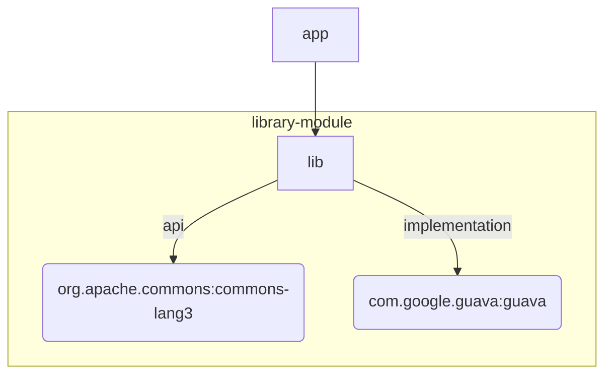

---

* this unordered seed list will be replaced by the toc
{:toc}

## 📌 의존성 스코프가 중요한 이유

- 모듈 간 결합도를 최소화하고 ABI(공개 API)와 구현 세부 사항을 분리할 수 있다.
- Gradle은 **Classpath 별 의존성 집합(Configuration)**을 구분해 빌드/테스트/배포 성능을 최적화한다.

## 📌 `api`와 `implementation`의 정의

| 스코프              | 의미                          | 소비자(다른 모듈)에게 노출 여부  |
| ---------------- | --------------------------- | ------------------- |
| `api`            | 라이브러리의 **공개 API**를 구성하는 의존성 | **노출** (transitive) |
| `implementation` | 내부 구현체에서만 사용하는 의존성          | **비노출**             |

Gradle 5.0 이후 `compile` 스코프는 제거되고 둘로 분리되었다. 

## 📌 컴파일·런타임 classpath 노출 차이

아래 mermaid 다이어그램은 의존성 전파를 시각화한다.



- `app` 모듈은 `commons-lang3`를 직접 **classpath**에 얻는다.
- `guava`는 `lib` 내부 구현에만 포함되고 `app`에는 전달되지 않는다.

## 📌 예제로 살펴보는 모듈 경계

```gradle
// lib/build.gradle
plugins { `java-library` }

dependencies {
    api("org.apache.commons:commons-lang3:3.14.0")
    implementation("com.google.guava:guava:33.0-jre")
}
```

```gradle
// app/build.gradle
dependencies {
    implementation(project(":lib"))
}
```

- `app`에서 `StringUtils(commons-lang3)`는 문제없이 사용 가능하다.
- `Guava` 클래스를 사용하면 컴파일 에러가 발생한다 — 구현 세부 사항이 유출되지 않는다.

## 📌 빌드 성능과 캡슐화 효과

1. 불필요한 재컴파일 감소
    - `lib`가 `implementation` 의존성을 변경해도 ABI가 변하지 않으면 app은 재컴파일하지 않는다.
2. ABI 안정성 확보
    - 공개 API만 classpath에 노출돼 **바이너리 호환성**을 명시적으로 관리한다.
3. 모듈 경계 명확화
    - 내부 구현 세부 사항이 의도치 않게 퍼지는 현상을 방지한다.

이러한 이점으로 대규모 멀티모듈 프로젝트에서 빌드 시간 단축 사례를 흔하게 찾아볼 수 있었다. 

## 📌 선택 가이드라인

| 질문                                | 예 / 아니오 | 선택               |
| --------------------------------- | ------- | ---------------- |
| 다른 모듈이 직접 해당 라이브러리 API를 호출해야 하는가? | 예       | `api`            |
| 오직 현재 모듈 내부 구현에서만 사용하는가?          | 예       | `implementation` |
| 컴파일 타임 전용(애너테이션 프로세서 등)인가?        | 예       | `compileOnly`    |
| 런타임 전용(JDBC Driver 등)인가?          | 예       | `runtimeOnly`    |

- Tip : 헷갈릴 때는 기본을 implementation으로 두고, 컴파일 에러가 발생하거나 모듈 설계상 공개해야 할 이유가 명확할 때만 api로 승격한다.

## 📌 마이그레이션 전략

1. gradle help --scan 실행 후 Deprecations View에서 compile 사용처 확인
2. 다음 기준으로 일괄 치환한다.
    - 외부 API 노출 → api
    - 그 외 → implementation
3. CI에서 하위 모듈 빌드를 병렬 실행해 재컴파일 타임 감소를 확인한다.
4. 인크리멘털 빌드·캐시 효과를 비교해 변경 전·후 성능 지표를 기록한다.

## 📌 결론

- `implementation`을 기본값으로 두고, 필요한 경우에만 `api`를 최소화해 사용한다.
- 의존성 노출 범위를 명시하면 컴파일 속도와 모듈 캡슐화를 동시에 확보할 수 있다.
- 현대 Gradle에서는 `compile` 스코프가 사라졌으므로 레거시 스크립트는 반드시 정리해 두길 권장한다.

필자는 위 원칙을 적용해 다중 서브프로젝트 구조의 Spring Boot / Kotlin 프로젝트에서 빌드 시간을 개선하고자 한다. 이 글을 읽는 분들도 잘 참고하여, 프로젝트에 적용해 성능과 유지보수성을 동시에 잡기 바란다.

---

## 📌 References

- [https://tomgregory.com/gradle/how-to-use-gradle-api-vs-implementation-dependencies-with-the-java-library-plugin/](https://tomgregory.com/gradle/how-to-use-gradle-api-vs-implementation-dependencies-with-the-java-library-plugin/)
- [https://medium.com/%40avocadi/the-difference-between-implementation-and-api-in-gradle-5c246623a382](https://medium.com/%40avocadi/the-difference-between-implementation-and-api-in-gradle-5c246623a382)