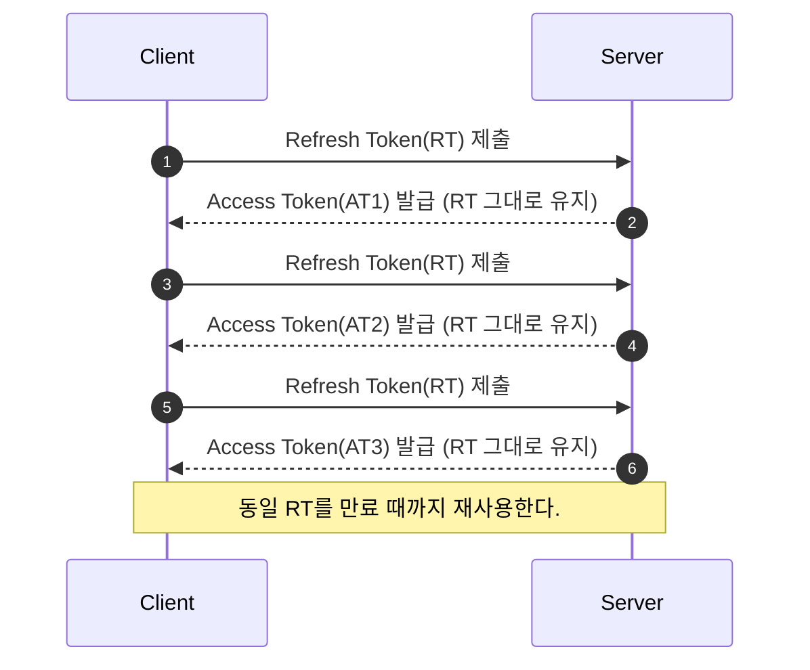
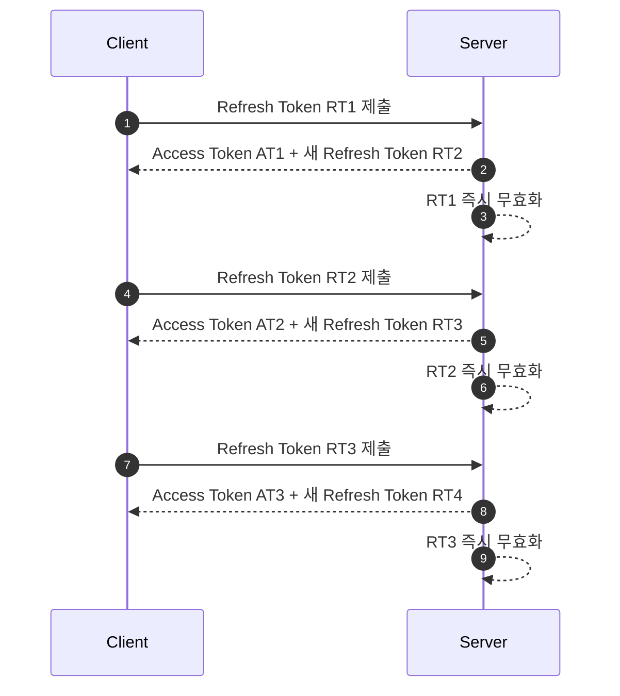
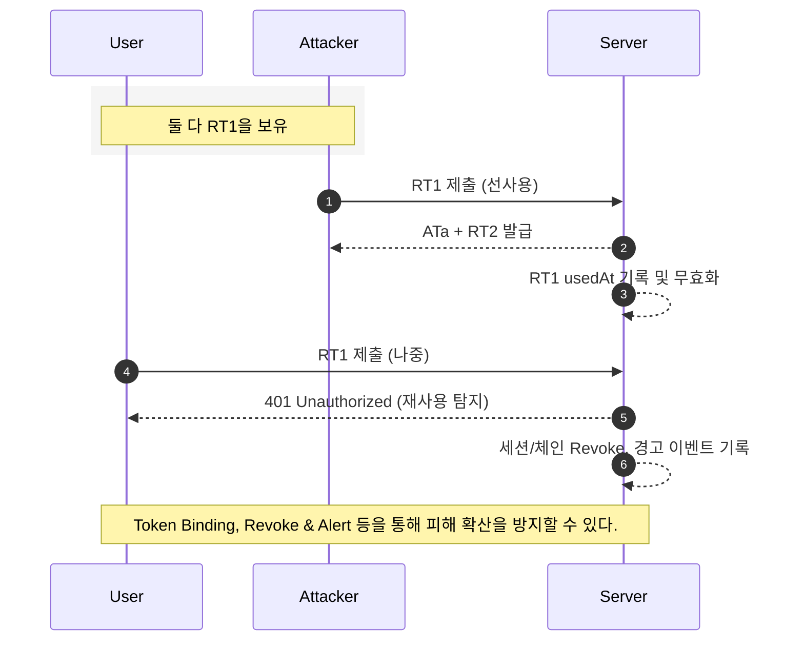

---

* this unordered seed list will be replaced by the toc
{:toc}

## 0. 배경 지식: **OAuth2와 OIDC**

현대의 웹/모바일 서비스는 대부분 OAuth2와 OIDC를 기반으로 인증과 인가를 처리한다.

- **OAuth2**
  - 제3자 애플리케이션이 사용자의 자원에 접근할 수 있도록 권한을 위임하는 표준 프로토콜이다.
  - 예를 들어, 어떤 앱이 사용자의 구글 드라이브 파일에 접근할 때 비밀번호 대신 Access Token을 사용하는 방식이다.
- **OIDC(OpenID Connect)**
  - OAuth2 위에 사용자 인증(Authentication)을 얹은 확장 규격
  - 이때 ID Token(JWT 기반)이 발급되어 "이 사용자가 누구인지"를 확인할 수 있다.

필자는 이 글에서 Refresh Token 관리 전략이 왜 중요한지, 그리고 RTR(Rotate Refresh Token) 방식이 어떻게 보안을 강화하는지 설명하려 한다.

## 1. 문제 제기: Refresh Token의 위험성

사이드 프로젝트를 진행하며 백오피스를 개발하게 되었고, 그 과정에서 관리자 로그인 페이지 구현을 맡게 되었다. 인증 방식으로 JWT 기반 접근 방식을 선택하였고, Access Token의 탈취를 방지하기 위해 짧은 TTL을 설정하였다. 그러나 구현 도중 "만약 Refresh Token이 탈취된다면 어떻게 대응해야 할까?"라는 의문이 생겼고, 이를 해결할 수 있는 방안을 탐색하게 되었다.

Access Token은 짧은 만료 기간을 가지므로 탈취되더라도 위험이 제한적이다. 하지만 Refresh Token은 어떨까? Refresh Token은 며칠에서 몇 주 동안 유효하도록 발급되는 경우가 많아, 한 번 탈취되면 공격자가 장기간 새로운 Access Token을 발급받을 수 있다. 기존 방식으로는 이 위험을 완전히 차단하기 어렵다. 아래에서 자세히 살펴보자.

## 2. Static Refresh Token 방식의 한계

기존 구조에서는 하나의 Refresh Token을 만료 시점까지 계속 사용하는 방식이다.



이 방식의 문제점은 다음과 같다.

- Refresh Token이 유출되면 공격자가 만료 시점까지 Access Token을 무제한 발급할 수 있다.
- 서버는 정상 사용자와 공격자를 구분하기 어렵다.
- Refresh Token 만료 기간을 짧게 줄이면 UX가 크게 악화된다.

## 3. RTR(Rotate Refresh Token) 방식

2에서 언급한 한계를 개선하기 위한 방법으로 RTR 방식을 흔히 사용한다. RTR 방식은 Refresh Token을 사용할 때마다 새로운 Refresh Token으로 교체하는 전략이다.



즉, 이전 Refresh Token은 즉시 무효화되며, 같은 Refresh Token이 두 번 사용되면 재사용 공격으로 간주하고 세션을 무효화한다.

### 📌 공격자가 먼저 Refresh Token을 사용한 경우



RTR의 중요한 특징은 "누가 먼저 쓰느냐에 따라" 세션의 운명이 달라진다는 점이다.

- 공격자가 RT1을 먼저 사용하면 서버는 이를 정상 요청으로 처리하고 RT2를 발급한다.
- 이후 정상 사용자가 RT1을 제출하면 이미 사용된 토큰이므로 재사용 공격으로 판단되어 세션이 무효화된다.

즉, 정상 사용자가 피해를 보는 결과가 발생할 수 있다.

이러한 문제는 아래와 같은 방법으로 방지할 수 있다.

1. **Token Binding**: Refresh Token을 디바이스 지문, IP, User-Agent와 묶어두면 공격자의 사용을 차단할 수 있다.
2. **Revoke & Alert**: 재사용 탐지 시 전체 세션을 무효화하고 사용자에게 알림을 제공함으로써 피해 확산을 방지할 수 있다.
3. **Grace Period 정책**: 네트워크 문제를 고려해 아주 짧은 시간 동안 이전 토큰을 허용하도록 하여 사용자 경험 저하를 줄일 수 있다. 다만, 이 경우 보안과 편의성 사이의 절충이 필요하다.

## 4. RTR 방식의 장점

RTR의 장점은 아래와 같다.

- 동일 Refresh Token 재사용 시 도난을 탐지할 수 있다.
- 탈취된 Refresh Token은 곧바로 무효화되어 무용지물이 된다.
- 긴 로그인 세션을 유지하면서도 보안성을 확보할 수 있다.

## 5. RTR의 트레이드오프

모든 방식과 기술이 그러하듯, RTR은 강력하지만 운영 상 고려해야 할 단점도 존재한다.

- 매 요청마다 Refresh Token을 교체하기 때문에 저장소(DB, Redis)에 부하가 증가한다.
- 네트워크 장애로 인해 클라이언트가 새 Refresh Token을 받지 못하면 동기화 문제가 발생한다.
- 단순한 정적 Refresh Token 관리보다 상태 관리가 복잡하다.

## 6. 대안 및 보완책

RTR만으로는 완벽하지 않으므로, 다른 기법과 함께 사용하는 것이 바람직하다.

- **Sliding Session**: Refresh Token 사용 시 만료 시간을 연장하는 방식
- **Token Binding**: Refresh Token을 특정 디바이스·IP·User-Agent와 묶어서만 사용하도록 제한
- **HttpOnly Secure Cookie**: Refresh Token을 로컬스토리지 대신 안전한 쿠키에 저장하여 XSS 위험 완화
- **Revoke Endpoint**: 로그아웃이나 이상 활동 시 Refresh Token을 강제로 무효화

## 7. 예시: Spring Boot + JWT + Redis 기반 RTR 구현

필자는 아래와 같은 예시 코드를 통해 RTR을 구현하였다.

1. Refresh Token은 Redis에 저장하며 `usedAt` 필드를 활용해 최초 1회만 사용되도록 보장한다.
2. 클라이언트는 Refresh Token을 HttpOnly 쿠키로 전달하며, 서버는 Access Token과 함께 새 Refresh Token을 재발급한다.
3. 이미 사용된 Refresh Token이 다시 요청되면, 이를 재사용 공격으로 판단하고 세션을 강제 종료한다.

핵심 코드는 다음과 같다.

```java
public interface RefreshTokenStore {
    void save(NewRefreshToken token);
    Optional<RefreshToken> find(String tokenId);
    boolean markUsed(String tokenId, Instant now); // 최초 1회만 true
    void revoke(String tokenId);
}
```

```java
public boolean markUsed(String tokenId, Instant now) {
    String key = "refresh:" + tokenId;
    Boolean alreadySet = redis.opsForHash().putIfAbsent(key, "usedAt", now.toString());
    return Boolean.TRUE.equals(alreadySet); // 최초 사용만 성공
}
```

```java
boolean firstUse = store.markUsed(decoded.id(), Instant.now());
if (!firstUse) {
    store.revoke(decoded.id());
    throw new Unauthorized("refresh reuse detected");
}
```

## 8. 마무리

필자는 RTR이 Refresh Token 탈취를 방지하기 위한 현실적인 전략이라고 본다.

RTR은 "탈취되더라도 재사용 시 즉시 탐지하고 차단한다"는 점에서 탈취를 100% 탐지할 수 있다는 점에서 특히 유용하다.

그러나 운영 복잡성과 부하가 증가하므로, 서비스 성격에 따라 Sliding Session, 안전한 저장소, Token Binding과 같은 보완책을 함께 적용함으로써 보안과 사용자 경험 사이의 균형을 잡는 것이 중요하다.

## 9. Pull-Request

필자의 사이드 프로젝트의 PR을 함께 첨부하여 상세한 예제를 제공하고자 한다.

- [PR 1: 관리자 로그인 API 구현을 위한 사전 작업](https://github.com/TEAM-JJINS/cs-algo/pull/179)
- [PR 2: 관리자 로그인 API 구현](https://github.com/TEAM-JJINS/cs-algo/pull/180)
