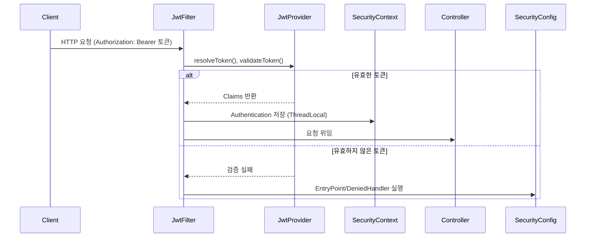
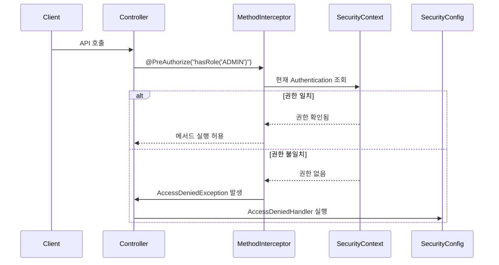
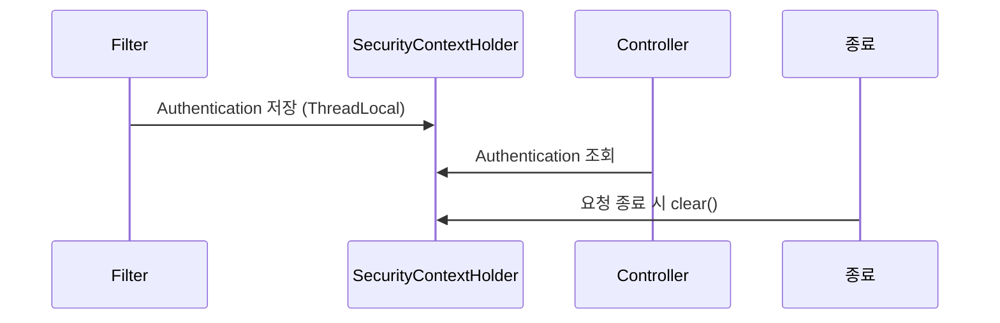

---

* this unordered seed list will be replaced by the toc
{:toc}

## 1. Spring Security 기본 개념

Spring Security의 핵심은 **SecurityContext**와 **Authentication**이다.

- **Authentication**은 현재 사용자의 인증 정보(주체, 권한 등)를 담는다.
- **SecurityContext**는 Authentication을 보관하며, `SecurityContextHolder`를 통해 쓰레드 로컬(ThreadLocal)에 저장된다.

Stateful 환경에서는 세션(HttpSession)에 보관하여 요청 간 인증 정보를 유지한다. 반면 JWT 기반의 Stateless 환경에서는 매 요청마다 토큰을 검증하고 SecurityContext에 저장한 뒤, 요청이 끝나면 제거한다.

## 2. JwtAuthenticationFilter 동작

필자는 `JwtAuthenticationFilter`를 구현하여 JWT 기반 인증을 처리하였다.

이 필터는 요청 헤더에서 토큰을 추출하고, 유효하다면 Authentication 객체를 만들어 `SecurityContextHolder`에 저장한다.

```java
@RequiredArgsConstructor
public class JwtAuthenticationFilter extends OncePerRequestFilter {
    private final JwtProvider jwtProvider;

    @Override
    protected void doFilterInternal(HttpServletRequest request,
                                    HttpServletResponse response,
                                    FilterChain filterChain) throws ServletException, IOException {
        String token = jwtProvider.resolveToken(request);

        if (token != null && jwtProvider.validateToken(token)) {
            Authentication auth = jwtProvider.getAuthentication(token);
            SecurityContextHolder.getContext().setAuthentication(auth);
        }

        filterChain.doFilter(request, response);
    }
}
```

**필터 동작 과정은 아래와 같다.**



## 3. JwtProvider 구현

토큰의 생성과 검증은 `JwtProvider`에서 담당한다.

```java
@Component
public class JwtProvider {
    private final SecretKey key;

    public JwtProvider(@Value("${jwt.secret}") String secret) {
        this.key = Keys.hmacShaKeyFor(secret.getBytes());
    }

    public String resolveToken(HttpServletRequest request) {
        String bearer = request.getHeader("Authorization");
        return (bearer != null && bearer.startsWith("Bearer ")) ? bearer.substring(7) : null;
    }

    public boolean validateToken(String token) {
        try {
            Jwts.parser().verifyWith(key).build().parseSignedClaims(token);
            return true;
        } catch (Exception e) {
            return false;
        }
    }

    public Authentication getAuthentication(String token) {
        Claims claims = Jwts.parser().verifyWith(key).build().parseSignedClaims(token).getPayload();
        String email = claims.getSubject();
        String role = claims.get("role", String.class);

        return new UsernamePasswordAuthenticationToken(
            email,
            "",
            Collections.singleton(new SimpleGrantedAuthority("ROLE_" + role))
        );
    }
}
```

## 4. SecurityConfig 설정

필자는 SecurityConfig에서 JWT 필터를 추가하고, 특정 경로는 허용하며 나머지는 인증이 필요하도록 구성하였다.

또한 `AuthenticationEntryPoint`와 `AccessDeniedHandler`를 등록하여 인증/인가 실패 시 JSON 응답을 내려주도록 하였다.

```java
@Configuration
@EnableWebSecurity
@RequiredArgsConstructor
public class SecurityConfig {
    private final JwtProvider jwtProvider;
    private final CustomAuthenticationEntryPoint authenticationEntryPoint;
    private final CustomAccessDeniedHandler accessDeniedHandler;

    @Bean
    public SecurityFilterChain filterChain(HttpSecurity http) throws Exception {
        return http
            .csrf(AbstractHttpConfigurer::disable)
            .authorizeHttpRequests(auth -> auth
                .requestMatchers("/swagger-ui/**", "/v3/api-docs/**").permitAll()
                .requestMatchers("/api/auth/**").permitAll()
                .anyRequest().authenticated()
            )
            .exceptionHandling(ex -> ex
                .authenticationEntryPoint(authenticationEntryPoint)
                .accessDeniedHandler(accessDeniedHandler)
            )
            .addFilterBefore(new JwtAuthenticationFilter(jwtProvider), UsernamePasswordAuthenticationFilter.class)
            .build();
    }
}
```

## 5. @PreAuthorize를 통한 권한 제어

Spring Security는 API 단위뿐만 아니라 메소드 단위에서도 권한 검증을 할 수 있다.

예시는 아래와 같다.

```java
@RestController
@RequestMapping("/admin")
public class AdminController {
    @GetMapping("/dashboard")
    @PreAuthorize("hasRole('ADMIN')")
    public String getDashboard() {
        return "Admin Dashboard";
    }
}
```

**@PreAuthorize 동작 과정은 아래와 같다.**



## 6. 예외 처리와 JSON 응답

기본적으로 인증 실패나 권한 부족 시 HTML 에러 페이지가 반환된다.

필자는 `CustomAuthenticationEntryPoint`와 `CustomAccessDeniedHandler`를 구현하여 JSON `ErrorResponse`를 내려주도록 하였다.

또한 `ErrorResponse` DTO에 `LocalDateTime`을 포함하면서 Jackson 직렬화 문제가 발생하였다. 기본 설정에서는 LocalDateTime이 배열 형태로 반환되었으나, `ObjectMapper`에 `JavaTimeModule`을 등록하고 `WRITE_DATES_AS_TIMESTAMPS` 옵션을 비활성화하여 해결하였다.

```java
@Bean
public ObjectMapper objectMapper() {
    return new ObjectMapper()
        .registerModule(new JavaTimeModule())
        .disable(SerializationFeature.WRITE_DATES_AS_TIMESTAMPS);
}
```

## 7. 테스트 전략

보안 로직이 적용되면 테스트에서도 인증/인가를 고려해야 한다.

필자는 다음 두 가지 방식을 사용하였다.

1. **단순화**: `spring-security-test` 모듈의 `@WithMockUser`를 이용해 가짜 사용자 인증을 주입한다.
2. **실제 시뮬레이션**: `JwtProvider`로 토큰을 발급받아 Authorization 헤더에 세팅 후 API 호출을 검증한다.

```java
@Test
@WithMockUser(username = "admin@example.com", roles = {"ADMIN"})
void givenAdmin_whenCallAdminApi_thenOk() throws Exception {
    mockMvc.perform(get("/admin/dashboard"))
           .andExpect(status().isOk());
}
```

## 8. SecurityContext 저장 방식

- `SecurityContext`는 기본적으로 **ThreadLocal**에 저장되어 요청 처리 중 어디서든 접근할 수 있다.
- Stateful 모드에서는 세션(HttpSession)에도 저장된다.
- JWT 기반의 Stateless 모드에서는 매 요청마다 토큰을 검증하고 ThreadLocal에 저장한 뒤, 요청 종료 시 초기화한다.



## 9. 마치며

Spring Security의 흐름은 아래와 같다.

- 요청 진입 → JwtAuthenticationFilter → 토큰 검증 및 SecurityContextHolder에 Authentication 저장
- Controller 호출 → @PreAuthorize로 권한 검증
- 실패 시 EntryPoint/DeniedHandler를 통해 JSON ErrorResponse 반환

필자는 이번 경험을 통해 Spring Security의 동작 원리를 더 깊이 이해하게 되었다.

보안은 단순히 인증/인가를 넘어서, **일관된 응답 포맷, 테스트 전략, 직렬화 이슈 처리**까지 고려해야 한다는 점이 인상적이었다.

## 10. Pull-Request

필자의 사이드 프로젝트의 PR을 함께 첨부하여 상세한 예제를 제공하고자 한다.

- [PR: Jwt 인증 필터 구현을 통한 ROLE 기반 접근 제어 및 @PreAuthorize 적용](https://github.com/TEAM-JJINS/cs-algo/pull/182)
