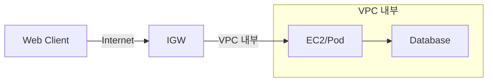
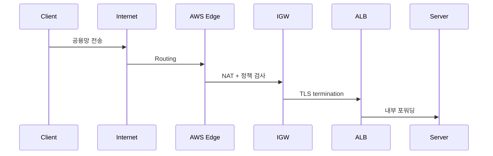
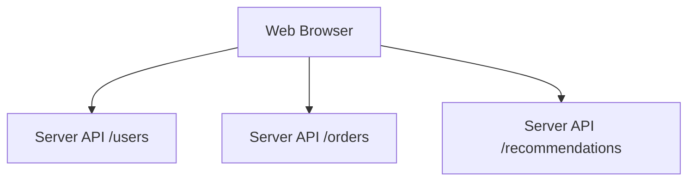
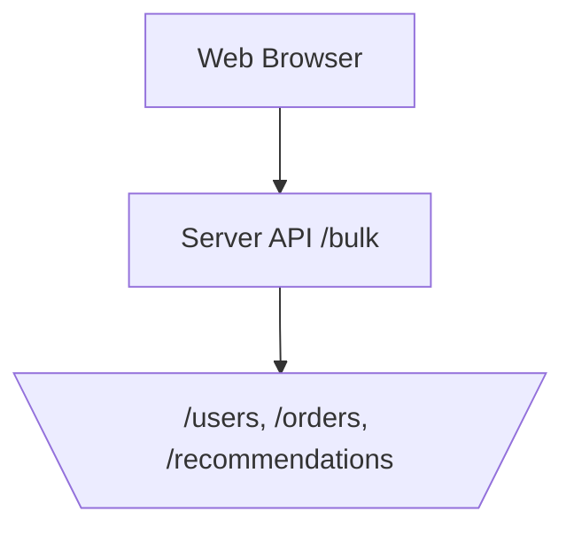

---

* this unordered seed list will be replaced by the toc
{:toc}

---

## 1. 서론: 요청 수를 줄이는 이유를 다시 생각해본다

필자는 최근 클라이언트에서 서버로 동일한 API를 여러 번 호출하던 구조를 한 개의 Bulk API 요청으로 통합하는 작업을 맡았다.
처음에는 아래와 같이 생각했다.

> 어차피 "N번 요청하든 한 번에 N개의 데이터를 받든, 전송되는 데이터(Response)의 양은 비슷하지 않은가?"

하지만 작업을 진행하며 알아보니, 단순히 데이터 크기의 문제가 아니었다.
요청을 여러번 보낼수록 VPC에 진입하는 횟수, 즉 Internet Gateway(IGW)를 통과하는 횟수 자체가 늘어난다는 사실을 알게 되었다.

## 2. AWS 네트워크 구조: 어디서 비용이 발생하는가?

대다수의 웹 서비스는 AWS와 같은 클라우드 환경 위에서 동작한다.
따라서 ‘요청 수를 줄인다’는 문제를 논의할 때도 결국 그 기반이 되는 클라우드 네트워크 구조를 이해하는 것이 출발점이 된다.

AWS 네트워크는 아래와 같이 물리적으로 세 구간으로 나뉜다.

```
[Public Internet] → [Internet Gateway(IGW)] → [VPC 내부(Private Subnet)]
```

이 중 **Internet Gateway(IGW)** 는 외부 요청이 VPC로 들어오는 유일한 관문이다.
모든 클라이언트 요청은 이 지점을 통과해야 하며, 이 구간에서 가장 큰 오버헤드가 발생한다.

### 2.1 IGW(Internet Gateway)의 역할

| 기능         | 설명                            |
| ---------- | ----------------------------- |
| **라우팅**    | 공용 IP ↔ 사설 IP 주소 변환           |
| **보안 검증**  | Security Group, NACL 규칙 확인    |
| **트래픽 전달** | ALB, NAT, API Gateway로 전송     |
| **TLS 처리** | ALB 단에서 연결 종료(Termination) 수행 |

이 모든 과정은 요청 단위로 수행된다.
따라서 요청이 많을수록 IGW 구간의 고정 오버헤드가 누적된다.

### 2.2 내부 통신(VPC → VPC)은 왜 저렴한가

VPC 내부 통신은 AWS Backbone Network 위에서 이루어진다.
이는 AWS 리전 내 전용망으로, AWS 리전 내 데이터센터(Availability Zone) 간을 직접 연결하는 물리적 전용 광섬유망으로 구성되어 있다.
이로 인해 트래픽이 인터넷의 라우팅 경로를 통과하지 않고, 오직 AWS 내부 스위치·라우터만 거치기 때문에, hop 수가 적고 전송이 빠르다.

| 구간                  | 설명            | 지연 수준          |
| ------------------- | ------------- | -------------- |
| Pod ↔ Pod (동일 Node) | veth 인터페이스 통신 | sub-ms         |
| EC2 ↔ EC2 (동일 AZ)   | ENI 기반 통신     | sub-ms         |
| AZ 간 통신             | 리전 내 전송       | 수 ms           |
| **Internet ↔ IGW**  | 공용망 → 사설망 전환  | **수 ms~수십 ms** |

즉, IGW는 논리적·물리적 hop이 가장 많은 계층이다.

그림 ① — 외부 요청 vs 내부 통신 경로



## 3. IGW가 가장 비싼 이유

### 3.1 경로가 길고 hop이 많다

외부에서 들어오는 요청은 다음 단계를 거친다.



이 중 IGW~ALB 구간은 관리형 계층이 여러 겹 존재하며 각 hop마다 수 ms 단위의 오버헤드가 누적된다.

## 3.2 매 요청마다 세션 초기화가 반복된다

HTTP 요청은 HTTPS 기반으로, 매번 **TCP 3-way handshake + TLS handshake**를 수행한다.
IGW~ALB 구간에서 이 연결 초기화가 반복되며 요청이 많을수록 지연이 누적된다.

## 3.3 관리형 Gateway 계층의 per-request 오버헤드

| 계층               | 역할              | 비용 단위                     |
| ---------------- | --------------- | ------------------------- |
| Internet Gateway | 외부 진입           | free (단, NAT/라우팅 포함)      |
| NAT Gateway      | outbound 트래픽    | $0.045/GB                 |
| ALB              | 요청 라우팅 및 TLS 처리 | $0.008/LCU + latency 수 ms |
| API Gateway      | 고수준 API 관리      | 요청당 $3.50/백만건             |

즉, IGW 자체보다도 IGW를 통과하며 활성화되는 다층 관리형 서비스(NAT Gateway, ALB, API Gateway)의 조합이 비싼 것이다.

## 4. Bulk API로 경계 횟수를 줄이기

### 4.1 Before: N번의 IGW 진입



각 요청마다 IGW, ALB, TLS handshake를 반복하며, 결과적으로 동일한 데이터를 가져오기 위해 N배의 경계 비용을 지불하게 된다.

### 4.2 After: 한 번의 IGW 진입으로 묶기



Bulk API를 사용하면 클라이언트는 IGW를 한 번만 통과하고, 서버 내부에서 필요한 요청들을 병렬 처리한 뒤 결과를 합쳐 응답한다.

이 방식은 요청 수를 줄이는 것이 아니라, 가장 비싼 경계(IGW) 통과 횟수를 줄이는 것에 초점이 있다.

## 5. 결론: 요청 수가 아니라 ‘경계 횟수’가 비용을 결정한다

요청 수를 줄이는 이유는 단순한 코드 최적화나 서버 부하 감소가 아니다.
그 핵심은 가장 비싼 네트워크 경계, **Internet Gateway(IGW)**를  가능한 한 적게 통과하게 만드는 데 있다.

요청이 많을수록 IGW를 여러 번 지나며 라우팅, 보안 검증, TLS handshake가 반복된다.
따라서 Bulk API로 요청을 묶는 것은 단순한 리팩토링이 아니라, IGW 진입 횟수를 줄여 고정 오버헤드를 제거하는 아키텍처적 설계다.
이 원리는 AWS뿐 아니라, 모든 클라우드 환경의 네트워크 경계 설계에도 동일하게 적용된다고 생각한다.

## 참고자료

- [AWS Networking Fundamentals – 공식 문서](https://docs.aws.amazon.com/vpc/latest/userguide/how-it-works.html)
- [AWS Data Transfer Pricing](https://aws.amazon.com/ec2/pricing/on-demand/#Data_Transfer)
- [AWS re:Invent 2023 - Advanced VPC designs and new capabilities (NET306)](https://www.youtube.com/watch?v=cRdDCkbE4es)
- [How Netflix Scales Its API with GraphQL Federation](https://www.infoq.com/presentations/netflix-api-graphql-federation)
