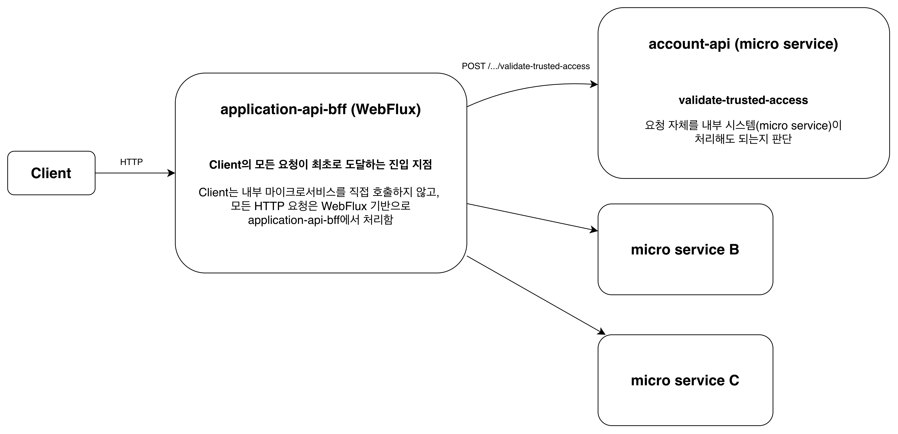

---

* this unordered seed list will be replaced by the toc
{:toc}

---

## 1. 배경

 필자는 이번 분기에 팀의 백엔드 서비스의 런타임 업그레이드(JDK 25 포함)를 담당하고 있다. 그 과정에서 `application-api-bff`의 Spring Boot/WebFlux 스택의 버전도 함께 올라갔다.
 서비스는 Kubernetes 기반 MSA 구조를 채택하고 있고, 요청 흐름은 크게 **BFF → downstream API**로 이어진다.

## 2. 시스템 구조



- `validateTrustedAccess`는 “모든 tenant 기반 API가 공유하는 관문”이다.
- 따라서 여기서 실패하면 도메인이 달라도 연쇄적으로 500이 난다.

## 3. 장애 현상: BFF의 모든 요청이 `validateTrustedAccess`에서 에러 발생함

 내용을 요약하면 아래와 같다.

- `application-api-bff`의 대부분 요청이 `AccountApi.validateTrustedAccess()` 단계에서 실패
- downstream인 `account-api`가 `validate-trusted-access`에서 500을 반환
- BFF는 이를 InternalServiceException으로 감싸 전파

 즉, BFF 서비스의 버전 업데이트를 하였으나, “BFF 자체 도메인 로직”이 아니라 “공통 관문이 downstream에 막힌 문제”였다.

## 4. 로그 이해

개발계에서 확인한 account-api 로그는 아래 형태였다.

```json
{"dd":{"env":"development","service":"account-api"},"level":"error","message":"TypeError: Cannot read properties of null (reading 'userId') ..."}
{"dd":{"env":"development","service":"account-api"},"level":"error","message":"[POST] /tenants/{tenantid}/security/v1/queries/validate-trusted-access >> StatusCode:: 500, Message:: Cannot read properties of null (reading 'userId')"}
```

 이 로그 자체는 account-api의 null-check 결함(원래는 404가 맞는 케이스가 500으로 증폭되는 문제)을 드러내지만, “왜 갑자기 이 요청이 저 경로로 들어갔는가”를 추적해보면, 더 근본적인 트리거가 있었다.

 validateTrustedAccess 호출에 필요한 헤더(x-account-id 등)가 누락되고 있는 상황이었다.

## 5. 왜 업그레이드 후에만 문제가 터졌을까?

 핵심은 “우연히 전파되던 부수효과”에 기대고 있었던 구조였다.

- 필터에서 요청 헤더를 mutate
- 다음 필터/로직에서도 그 변경이 유지될 것이라 기대
- 구버전에서는 내부 구현/캐싱/참조 공유 등의 이유로 “되는 것처럼” 보였던 것

 Spring Framework 6.2+ 계열로 넘어오며, ServerRequest/Exchange의 불변성 계약이 더 엄격해지면서
이런 “암묵적 전파”가 깨졌고, 결과적으로 헤더 누락이 명확히 드러났다.

 관련 [이슈](https://github.com/spring-projects/spring-framework/issues/34067) 링크를 첨부한다.

## 6. 해결: “헤더 mutate” 대신 “명시적으로 보장되는 컨텍스트”로 전환

 결론부터 말하면, 해결 방식은 다음 원칙으로 정리된다.

- 요청 객체를 “바꿨으니 downstream에도 전파되겠지”라는 기대를 버리고
- 필터 체인에서 필요한 값들을 컨텍스트(공유 저장소) 에 명시적으로 보관하여
- outbound(WebClient) 요청을 만들 때, 원본 요청 헤더 + 컨텍스트 값을 합성해 항상 동일한 규칙으로 헤더를 구성한다.

 이렇게 바꾸면 Spring 내부 구현이 바뀌어도 outbound 요청은 동일한 규칙으로 만들어져서, Spring Framework 버전에 의존하는 불안정성이 사라진다.

### 6.1 컨텍스트에 값을 저장하는 쪽(필터)

```kotlin
private val injectTenantId =
    { req: ServerRequest, next: (ServerRequest) -> Mono<ServerResponse> ->
        req.exchange().attributes["x-tenant-id"] = req.pathVariable("tenantId")
        next(req)
    }

private val injectUserAndAccount =
    { req: ServerRequest, next: (ServerRequest) -> Mono<ServerResponse> ->
        extractUserId(/* authorization */)
            .flatMap { userId ->
                // userId는 필터 단계에서 확정 가능
                req.exchange().attributes["x-user-id"] = userId

                // accountId는 downstream 호출 결과로 얻는다
                accountApi.getUserAccount(/* tenantId */, userId, /* authorization */)
                    .flatMap { res ->
                        req.exchange().attributes["x-account-id"] = res.data.id
                        next(req)
                    }
            }
    }
```

6.2 outbound(WebClient)에서 “원본 헤더 + 컨텍스트”를 합성하는 쪽

```kotlin
private fun ServerRequest.headersConsumer(): java.util.function.Consumer<org.springframework.http.HttpHeaders> =
    java.util.function.Consumer { headers ->
        // 1) 원본 요청 헤더 복사
        headers.addAll(this.headers().asHttpHeaders())

        // 2) 컨텍스트(exchange attributes)에 저장한 값을 헤더로 승격
        this.exchange().attributes.forEach { (key, value) ->
            if (key is String) {
                headers.add(key, value.toString())
            }
        }
    }

// WebClient 호출 예시
webClient
    .post()
    .uri(/* ... */)
    .headers(request.headersConsumer())
    .retrieve()
```

핵심은 아래와 같다.

- 필터 단계에서 값을 “만들어 두고”
- outbound 단계에서 그 값을 “반드시 포함”시키는 규칙을 고정

 이제 validateTrustedAccess는 다시 “관문” 역할을 정상적으로 수행하고, Spring Framework 버전과 무관하게 동일한 동작을 수행한다.

## 7. 참고자료

### Spring Framework Issues

* [spring-framework#34067](https://github.com/spring-projects/spring-framework/issues/34067)
* [spring-framework#33666](https://github.com/spring-projects/spring-framework/issues/33666)
* [spring-framework#33789](https://github.com/spring-projects/spring-framework/issues/33789)
* [spring-framework#33869](https://github.com/spring-projects/spring-framework/issues/33869)

### Commits

* [spring-framework commit 85bdb2b](https://github.com/spring-projects/spring-framework/commit/85bdb2b)
* [spring-framework commit ef77b40](https://github.com/spring-projects/spring-framework/commit/ef77b40)

### Release Notes

* [Spring Framework 6.2 Release Notes](https://github.com/spring-projects/spring-framework/wiki/Spring-Framework-6.2-Release-Notes)

### 버전 매핑

* Spring Boot 3.1.1 → Spring Framework 6.0.11
* Spring Boot 3.5.7 → Spring Framework 6.2.x
